```python
# This Python 3 environment comes with many helpful analytics libraries installed
# It is defined by the kaggle/python Docker image: https://github.com/kaggle/docker-python
!pip install NRCLex
```

    Looking in indexes: https://pypi.org/simple, https://us-python.pkg.dev/colab-wheels/public/simple/
    Collecting NRCLex
      Downloading NRCLex-4.0-py3-none-any.whl (4.4 kB)
    Requirement already satisfied: textblob in /usr/local/lib/python3.10/dist-packages (from NRCLex) (0.17.1)
    INFO: pip is looking at multiple versions of nrclex to determine which version is compatible with other requirements. This could take a while.
      Downloading NRCLex-3.0.0.tar.gz (396 kB)
         ━━━━━━━━━━━━━━━━━━━━━━━━━━━━━━━━━━━━━━ 396.4/396.4 kB 12.7 MB/s eta 0:00:00
    [?25h  Preparing metadata (setup.py) ... [?25l[?25hdone
    Requirement already satisfied: nltk>=3.1 in /usr/local/lib/python3.10/dist-packages (from textblob->NRCLex) (3.8.1)
    Requirement already satisfied: click in /usr/local/lib/python3.10/dist-packages (from nltk>=3.1->textblob->NRCLex) (8.1.3)
    Requirement already satisfied: joblib in /usr/local/lib/python3.10/dist-packages (from nltk>=3.1->textblob->NRCLex) (1.2.0)
    Requirement already satisfied: regex>=2021.8.3 in /usr/local/lib/python3.10/dist-packages (from nltk>=3.1->textblob->NRCLex) (2022.10.31)
    Requirement already satisfied: tqdm in /usr/local/lib/python3.10/dist-packages (from nltk>=3.1->textblob->NRCLex) (4.65.0)
    Building wheels for collected packages: NRCLex
      Building wheel for NRCLex (setup.py) ... [?25l[?25hdone
      Created wheel for NRCLex: filename=NRCLex-3.0.0-py3-none-any.whl size=43308 sha256=1b60ce5214523181e9f9085b2004af1a11e96c15d32e368d6c179e091f268dac
      Stored in directory: /root/.cache/pip/wheels/d2/10/44/6abfb1234298806a145fd6bcaec8cbc712e88dd1cd6cb242fa
    Successfully built NRCLex
    Installing collected packages: NRCLex
    Successfully installed NRCLex-3.0.0


```python
#load all required packages
#general data handling and processing
import pandas as pd
import numpy as np
#text data processing and sentiment analysis tools
import nltk
nltk.download('vader_lexicon')
nltk.download('punkt')
from nltk.sentiment.vader import SentimentIntensityAnalyzer
sia = SentimentIntensityAnalyzer()
from nrclex import NRCLex

#visualization
import matplotlib.pyplot as plt

from google.colab import files
```

    [nltk_data] Downloading package vader_lexicon to /root/nltk_data...
    [nltk_data] Downloading package punkt to /root/nltk_data...
    [nltk_data]   Unzipping tokenizers/punkt.zip.


```python
from google.colab import drive
drive.mount('/content/drive')
```

    Mounted at /content/drive


```python
#import data
abc = pd.read_csv('drive/MyDrive/data.csv')
```


```python
#take a look at the structure and basic information of this dataset
abc.info()
#identify missing values from the dataset
abc.isnull().sum()
```

    <class 'pandas.core.frame.DataFrame'>
    RangeIndex: 1244184 entries, 0 to 1244183
    Data columns (total 2 columns):
     #   Column         Non-Null Count    Dtype 
    ---  ------         --------------    ----- 
     0   publish_date   1244184 non-null  int64 
     1   headline_text  1244184 non-null  object
    dtypes: int64(1), object(1)
    memory usage: 19.0+ MB


    publish_date     0
    headline_text    0
    dtype: int64


```python
#change publish_date column to datetime as it is currently integer
abc['publish_date'] = pd.to_datetime(abc['publish_date'], format='%Y%m%d')
```

### NLTK VADER

Firstly, I'using NLTK VADER package to perform a sentiment analysis and plot it to see the change over the years.
According to [Schumacher (2019)](https://opendatagroup.github.io/data%20science/2019/03/21/preprocessing-text.html#:~:text=The%20general%20rule%20for%20whether,improve%20performance%2C%20do%20not%20lemmatize.&text=For%20example%2C%20a%20popular%20sentiment,not%20be%20stemmed%20or%20lemmatized), "VADER, has different ratings depending on the form of the word and therefore the input should not be stemmed or lemmatized." I decided not to stem or lemmatize the words for this sentiment analysis.

I will be using thresholds values of -0.05 and 0.05, based on "About the Scoring" section on [this github page](https://github.com/cjhutto/vaderSentiment). If compound score is larger than 0.05, the headline will be classified as positive; if compound score is smaller than -0.05 it will be negative.


```python
#create polarity scores
abc['senti_score'] = abc['headline_text'].apply(lambda headline: sia.polarity_scores(headline))

#extract compound scores to a new column
abc['compound']  = abc['senti_score'].apply(lambda score_dict: score_dict['compound'])

#create a new column for sentiment labels
abc['senti_label'] = abc['compound'].apply(lambda c: 'positive' if c >=0.05 else 'neutral' if c>-0.05 else 'negative')

#counts of sentiment labels
abc['senti_label'].value_counts()
```


    neutral     564887
    negative    426479
    positive    252818
    Name: senti_label, dtype: int64


The above result shows that nearly half of the news headlines are neutral. While in the other half, there are more negative headlines identified than positive ones.

#### Visualizations of sentiments over the years


```python
#calculate the average compound scores per month and per year respectively
yearly_averages = abc.resample('A',on='publish_date').mean()
monthly_averages = abc.resample('M',on='publish_date').mean()
```

    <ipython-input-8-4176f8c4a919>:2: FutureWarning: The default value of numeric_only in DataFrameGroupBy.mean is deprecated. In a future version, numeric_only will default to False. Either specify numeric_only or select only columns which should be valid for the function.
      yearly_averages = abc.resample('A',on='publish_date').mean()
    <ipython-input-8-4176f8c4a919>:3: FutureWarning: The default value of numeric_only in DataFrameGroupBy.mean is deprecated. In a future version, numeric_only will default to False. Either specify numeric_only or select only columns which should be valid for the function.
      monthly_averages = abc.resample('M',on='publish_date').mean()


```python
monthly_averages.head(5)
```


  <div id="df-e0dc4002-8998-4e22-bcc2-e2ed3abc5a29">
    <div class="colab-df-container">
      <div>
<style scoped>
    .dataframe tbody tr th:only-of-type {
        vertical-align: middle;
    }

    .dataframe tbody tr th {
        vertical-align: top;
    }

    .dataframe thead th {
        text-align: right;
    }
</style>
<table border="1" class="dataframe">
  <thead>
    <tr style="text-align: right;">
      <th></th>
      <th>compound</th>
    </tr>
    <tr>
      <th>publish_date</th>
      <th></th>
    </tr>
  </thead>
  <tbody>
    <tr>
      <th>2003-02-28</th>
      <td>-0.081339</td>
    </tr>
    <tr>
      <th>2003-03-31</th>
      <td>-0.093607</td>
    </tr>
    <tr>
      <th>2003-04-30</th>
      <td>-0.064970</td>
    </tr>
    <tr>
      <th>2003-05-31</th>
      <td>-0.062888</td>
    </tr>
    <tr>
      <th>2003-06-30</th>
      <td>-0.054663</td>
    </tr>
  </tbody>
</table>
</div>
      <button class="colab-df-convert" onclick="convertToInteractive('df-e0dc4002-8998-4e22-bcc2-e2ed3abc5a29')"
              title="Convert this dataframe to an interactive table."
              style="display:none;">

  <svg xmlns="http://www.w3.org/2000/svg" height="24px"viewBox="0 0 24 24"
       width="24px">
    <path d="M0 0h24v24H0V0z" fill="none"/>
    <path d="M18.56 5.44l.94 2.06.94-2.06 2.06-.94-2.06-.94-.94-2.06-.94 2.06-2.06.94zm-11 1L8.5 8.5l.94-2.06 2.06-.94-2.06-.94L8.5 2.5l-.94 2.06-2.06.94zm10 10l.94 2.06.94-2.06 2.06-.94-2.06-.94-.94-2.06-.94 2.06-2.06.94z"/><path d="M17.41 7.96l-1.37-1.37c-.4-.4-.92-.59-1.43-.59-.52 0-1.04.2-1.43.59L10.3 9.45l-7.72 7.72c-.78.78-.78 2.05 0 2.83L4 21.41c.39.39.9.59 1.41.59.51 0 1.02-.2 1.41-.59l7.78-7.78 2.81-2.81c.8-.78.8-2.07 0-2.86zM5.41 20L4 18.59l7.72-7.72 1.47 1.35L5.41 20z"/>
  </svg>
      </button>

  <style>
    .colab-df-container {
      display:flex;
      flex-wrap:wrap;
      gap: 12px;
    }

    .colab-df-convert {
      background-color: #E8F0FE;
      border: none;
      border-radius: 50%;
      cursor: pointer;
      display: none;
      fill: #1967D2;
      height: 32px;
      padding: 0 0 0 0;
      width: 32px;
    }

    .colab-df-convert:hover {
      background-color: #E2EBFA;
      box-shadow: 0px 1px 2px rgba(60, 64, 67, 0.3), 0px 1px 3px 1px rgba(60, 64, 67, 0.15);
      fill: #174EA6;
    }

    [theme=dark] .colab-df-convert {
      background-color: #3B4455;
      fill: #D2E3FC;
    }

    [theme=dark] .colab-df-convert:hover {
      background-color: #434B5C;
      box-shadow: 0px 1px 3px 1px rgba(0, 0, 0, 0.15);
      filter: drop-shadow(0px 1px 2px rgba(0, 0, 0, 0.3));
      fill: #FFFFFF;
    }
  </style>

      <script>
        const buttonEl =
          document.querySelector('#df-e0dc4002-8998-4e22-bcc2-e2ed3abc5a29 button.colab-df-convert');
        buttonEl.style.display =
          google.colab.kernel.accessAllowed ? 'block' : 'none';

        async function convertToInteractive(key) {
          const element = document.querySelector('#df-e0dc4002-8998-4e22-bcc2-e2ed3abc5a29');
          const dataTable =
            await google.colab.kernel.invokeFunction('convertToInteractive',
                                                     [key], {});
          if (!dataTable) return;

          const docLinkHtml = 'Like what you see? Visit the ' +
            '<a target="_blank" href=https://colab.research.google.com/notebooks/data_table.ipynb>data table notebook</a>'
            + ' to learn more about interactive tables.';
          element.innerHTML = '';
          dataTable['output_type'] = 'display_data';
          await google.colab.output.renderOutput(dataTable, element);
          const docLink = document.createElement('div');
          docLink.innerHTML = docLinkHtml;
          element.appendChild(docLink);
        }
      </script>
    </div>
  </div>


```python
#visualization of vader sentiment scores
plt.figure(figsize=(20,10))
plt.plot(yearly_averages.index,yearly_averages['compound'],  color='olive', linewidth=2, linestyle='dashed', label='Yearly mean compound scores')
plt.plot(monthly_averages.index, monthly_averages['compound'], color = 'blue', linewidth=2, label='Monthly mean compound scores')
plt.legend()
plt.show()
```


    
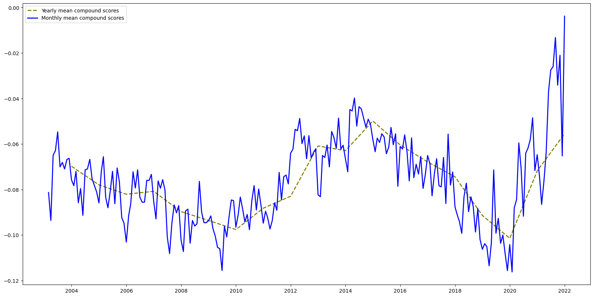
    


This graph indicates that there might be a cycle in the sentiment of news headlines as there are two peaks-around 2003 and 2015, and two troughs - in 2010 and end of 2019.
It's worth looking into the topics in those years to understand the peaks and troughs in sentiment.There could be major events happening around those times which had made the media change their sentiment.


### [NRC Emotion Lexicon](https://saifmohammad.com/WebPages/NRC-Emotion-Lexicon.htm#:~:text=The%20NRC%20Emotion%20Lexicon%20is,sentiments%20(negative%20and%20positive).)

Next, I will be using [NRCLex package](https://pypi.org/project/NRCLex/) to further detect emotions in news headlines.


```python
#function to retrieve nrc affect frequencies
def emotion_freq(headline):
    res1 = {'anger': 0.0, 'fear': 0.0, 'negative': 0.0, 'positive': 0.0, 'sadness': 0.0, 'trust': 0.0, 'anticipation': 0.0, 'joy': 0.0, 'disgust': 0.0, 'surprise': 0.0}
    headline = NRCLex(headline)
    freq = headline.affect_frequencies
    for k, fq in freq.items():
      res1[k] = res1.get(k, 0.0) + fq
    return res1

#function to calculate word count in each headline
def word_count(row):
    row = nltk.word_tokenize(row)
    cnt = len(row)
    return cnt
```


```python
#create a new dataset without vader analysis
abc_nrc = abc.iloc[:,0:2].copy()
```


```python
#retrieve affect frequencies in each headline
abc_nrc['emo_freq']=abc_nrc['headline_text'].apply(emotion_freq)
```


```python
#take a look at our new column with affected frequencies
abc_nrc.head()
```


  <div id="df-acb925f0-3177-45a3-a8e6-d53a1f033355">
    <div class="colab-df-container">
      <div>
<style scoped>
    .dataframe tbody tr th:only-of-type {
        vertical-align: middle;
    }

    .dataframe tbody tr th {
        vertical-align: top;
    }

    .dataframe thead th {
        text-align: right;
    }
</style>
<table border="1" class="dataframe">
  <thead>
    <tr style="text-align: right;">
      <th></th>
      <th>publish_date</th>
      <th>headline_text</th>
      <th>emo_freq</th>
    </tr>
  </thead>
  <tbody>
    <tr>
      <th>0</th>
      <td>2003-02-19</td>
      <td>aba decides against community broadcasting lic...</td>
      <td>{'anger': 0.0, 'fear': 0.0, 'negative': 0.0, '...</td>
    </tr>
    <tr>
      <th>1</th>
      <td>2003-02-19</td>
      <td>act fire witnesses must be aware of defamation</td>
      <td>{'anger': 0.0, 'fear': 0.5, 'negative': 0.25, ...</td>
    </tr>
    <tr>
      <th>2</th>
      <td>2003-02-19</td>
      <td>a g calls for infrastructure protection summit</td>
      <td>{'anger': 0.0, 'fear': 0.0, 'negative': 0.3333...</td>
    </tr>
    <tr>
      <th>3</th>
      <td>2003-02-19</td>
      <td>air nz staff in aust strike for pay rise</td>
      <td>{'anger': 0.16666666666666666, 'fear': 0.0, 'n...</td>
    </tr>
    <tr>
      <th>4</th>
      <td>2003-02-19</td>
      <td>air nz strike to affect australian travellers</td>
      <td>{'anger': 0.5, 'fear': 0.0, 'negative': 0.5, '...</td>
    </tr>
  </tbody>
</table>
</div>
      <button class="colab-df-convert" onclick="convertToInteractive('df-acb925f0-3177-45a3-a8e6-d53a1f033355')"
              title="Convert this dataframe to an interactive table."
              style="display:none;">

  <svg xmlns="http://www.w3.org/2000/svg" height="24px"viewBox="0 0 24 24"
       width="24px">
    <path d="M0 0h24v24H0V0z" fill="none"/>
    <path d="M18.56 5.44l.94 2.06.94-2.06 2.06-.94-2.06-.94-.94-2.06-.94 2.06-2.06.94zm-11 1L8.5 8.5l.94-2.06 2.06-.94-2.06-.94L8.5 2.5l-.94 2.06-2.06.94zm10 10l.94 2.06.94-2.06 2.06-.94-2.06-.94-.94-2.06-.94 2.06-2.06.94z"/><path d="M17.41 7.96l-1.37-1.37c-.4-.4-.92-.59-1.43-.59-.52 0-1.04.2-1.43.59L10.3 9.45l-7.72 7.72c-.78.78-.78 2.05 0 2.83L4 21.41c.39.39.9.59 1.41.59.51 0 1.02-.2 1.41-.59l7.78-7.78 2.81-2.81c.8-.78.8-2.07 0-2.86zM5.41 20L4 18.59l7.72-7.72 1.47 1.35L5.41 20z"/>
  </svg>
      </button>

  <style>
    .colab-df-container {
      display:flex;
      flex-wrap:wrap;
      gap: 12px;
    }

    .colab-df-convert {
      background-color: #E8F0FE;
      border: none;
      border-radius: 50%;
      cursor: pointer;
      display: none;
      fill: #1967D2;
      height: 32px;
      padding: 0 0 0 0;
      width: 32px;
    }

    .colab-df-convert:hover {
      background-color: #E2EBFA;
      box-shadow: 0px 1px 2px rgba(60, 64, 67, 0.3), 0px 1px 3px 1px rgba(60, 64, 67, 0.15);
      fill: #174EA6;
    }

    [theme=dark] .colab-df-convert {
      background-color: #3B4455;
      fill: #D2E3FC;
    }

    [theme=dark] .colab-df-convert:hover {
      background-color: #434B5C;
      box-shadow: 0px 1px 3px 1px rgba(0, 0, 0, 0.15);
      filter: drop-shadow(0px 1px 2px rgba(0, 0, 0, 0.3));
      fill: #FFFFFF;
    }
  </style>

      <script>
        const buttonEl =
          document.querySelector('#df-acb925f0-3177-45a3-a8e6-d53a1f033355 button.colab-df-convert');
        buttonEl.style.display =
          google.colab.kernel.accessAllowed ? 'block' : 'none';

        async function convertToInteractive(key) {
          const element = document.querySelector('#df-acb925f0-3177-45a3-a8e6-d53a1f033355');
          const dataTable =
            await google.colab.kernel.invokeFunction('convertToInteractive',
                                                     [key], {});
          if (!dataTable) return;

          const docLinkHtml = 'Like what you see? Visit the ' +
            '<a target="_blank" href=https://colab.research.google.com/notebooks/data_table.ipynb>data table notebook</a>'
            + ' to learn more about interactive tables.';
          element.innerHTML = '';
          dataTable['output_type'] = 'display_data';
          await google.colab.output.renderOutput(dataTable, element);
          const docLink = document.createElement('div');
          docLink.innerHTML = docLinkHtml;
          element.appendChild(docLink);
        }
      </script>
    </div>
  </div>


```python
#extract out the emotions to new columns for further analysis
abc_nrc = pd.concat((abc_nrc.drop(['emo_freq'],axis=1), abc_nrc['emo_freq'].apply(pd.Series)), axis=1)
```


```python
#calculate word count in each headline
abc_nrc['word_count']=abc_nrc['headline_text'].apply(word_count)
```


```python
abc_nrc.head()
```


  <div id="df-12412ce9-c64f-4283-9b9f-720a862da9a5">
    <div class="colab-df-container">
      <div>
<style scoped>
    .dataframe tbody tr th:only-of-type {
        vertical-align: middle;
    }

    .dataframe tbody tr th {
        vertical-align: top;
    }

    .dataframe thead th {
        text-align: right;
    }
</style>
<table border="1" class="dataframe">
  <thead>
    <tr style="text-align: right;">
      <th></th>
      <th>publish_date</th>
      <th>headline_text</th>
      <th>anger</th>
      <th>fear</th>
      <th>negative</th>
      <th>positive</th>
      <th>sadness</th>
      <th>trust</th>
      <th>anticipation</th>
      <th>joy</th>
      <th>disgust</th>
      <th>surprise</th>
      <th>anticip</th>
      <th>word_count</th>
    </tr>
  </thead>
  <tbody>
    <tr>
      <th>0</th>
      <td>2003-02-19</td>
      <td>aba decides against community broadcasting lic...</td>
      <td>0.000000</td>
      <td>0.0</td>
      <td>0.000000</td>
      <td>1.000000</td>
      <td>0.0</td>
      <td>0.000000</td>
      <td>0.000000</td>
      <td>0.000000</td>
      <td>0.00</td>
      <td>0.0</td>
      <td>0.0</td>
      <td>6</td>
    </tr>
    <tr>
      <th>1</th>
      <td>2003-02-19</td>
      <td>act fire witnesses must be aware of defamation</td>
      <td>0.000000</td>
      <td>0.5</td>
      <td>0.250000</td>
      <td>0.000000</td>
      <td>0.0</td>
      <td>0.000000</td>
      <td>0.000000</td>
      <td>0.000000</td>
      <td>0.25</td>
      <td>0.0</td>
      <td>0.0</td>
      <td>8</td>
    </tr>
    <tr>
      <th>2</th>
      <td>2003-02-19</td>
      <td>a g calls for infrastructure protection summit</td>
      <td>0.000000</td>
      <td>0.0</td>
      <td>0.333333</td>
      <td>0.000000</td>
      <td>0.0</td>
      <td>0.333333</td>
      <td>0.333333</td>
      <td>0.000000</td>
      <td>0.00</td>
      <td>0.0</td>
      <td>0.0</td>
      <td>7</td>
    </tr>
    <tr>
      <th>3</th>
      <td>2003-02-19</td>
      <td>air nz staff in aust strike for pay rise</td>
      <td>0.166667</td>
      <td>0.0</td>
      <td>0.166667</td>
      <td>0.166667</td>
      <td>0.0</td>
      <td>0.166667</td>
      <td>0.166667</td>
      <td>0.166667</td>
      <td>0.00</td>
      <td>0.0</td>
      <td>0.0</td>
      <td>9</td>
    </tr>
    <tr>
      <th>4</th>
      <td>2003-02-19</td>
      <td>air nz strike to affect australian travellers</td>
      <td>0.500000</td>
      <td>0.0</td>
      <td>0.500000</td>
      <td>0.000000</td>
      <td>0.0</td>
      <td>0.000000</td>
      <td>0.000000</td>
      <td>0.000000</td>
      <td>0.00</td>
      <td>0.0</td>
      <td>0.0</td>
      <td>7</td>
    </tr>
  </tbody>
</table>
</div>
      <button class="colab-df-convert" onclick="convertToInteractive('df-12412ce9-c64f-4283-9b9f-720a862da9a5')"
              title="Convert this dataframe to an interactive table."
              style="display:none;">

  <svg xmlns="http://www.w3.org/2000/svg" height="24px"viewBox="0 0 24 24"
       width="24px">
    <path d="M0 0h24v24H0V0z" fill="none"/>
    <path d="M18.56 5.44l.94 2.06.94-2.06 2.06-.94-2.06-.94-.94-2.06-.94 2.06-2.06.94zm-11 1L8.5 8.5l.94-2.06 2.06-.94-2.06-.94L8.5 2.5l-.94 2.06-2.06.94zm10 10l.94 2.06.94-2.06 2.06-.94-2.06-.94-.94-2.06-.94 2.06-2.06.94z"/><path d="M17.41 7.96l-1.37-1.37c-.4-.4-.92-.59-1.43-.59-.52 0-1.04.2-1.43.59L10.3 9.45l-7.72 7.72c-.78.78-.78 2.05 0 2.83L4 21.41c.39.39.9.59 1.41.59.51 0 1.02-.2 1.41-.59l7.78-7.78 2.81-2.81c.8-.78.8-2.07 0-2.86zM5.41 20L4 18.59l7.72-7.72 1.47 1.35L5.41 20z"/>
  </svg>
      </button>

  <style>
    .colab-df-container {
      display:flex;
      flex-wrap:wrap;
      gap: 12px;
    }

    .colab-df-convert {
      background-color: #E8F0FE;
      border: none;
      border-radius: 50%;
      cursor: pointer;
      display: none;
      fill: #1967D2;
      height: 32px;
      padding: 0 0 0 0;
      width: 32px;
    }

    .colab-df-convert:hover {
      background-color: #E2EBFA;
      box-shadow: 0px 1px 2px rgba(60, 64, 67, 0.3), 0px 1px 3px 1px rgba(60, 64, 67, 0.15);
      fill: #174EA6;
    }

    [theme=dark] .colab-df-convert {
      background-color: #3B4455;
      fill: #D2E3FC;
    }

    [theme=dark] .colab-df-convert:hover {
      background-color: #434B5C;
      box-shadow: 0px 1px 3px 1px rgba(0, 0, 0, 0.15);
      filter: drop-shadow(0px 1px 2px rgba(0, 0, 0, 0.3));
      fill: #FFFFFF;
    }
  </style>

      <script>
        const buttonEl =
          document.querySelector('#df-12412ce9-c64f-4283-9b9f-720a862da9a5 button.colab-df-convert');
        buttonEl.style.display =
          google.colab.kernel.accessAllowed ? 'block' : 'none';

        async function convertToInteractive(key) {
          const element = document.querySelector('#df-12412ce9-c64f-4283-9b9f-720a862da9a5');
          const dataTable =
            await google.colab.kernel.invokeFunction('convertToInteractive',
                                                     [key], {});
          if (!dataTable) return;

          const docLinkHtml = 'Like what you see? Visit the ' +
            '<a target="_blank" href=https://colab.research.google.com/notebooks/data_table.ipynb>data table notebook</a>'
            + ' to learn more about interactive tables.';
          element.innerHTML = '';
          dataTable['output_type'] = 'display_data';
          await google.colab.output.renderOutput(dataTable, element);
          const docLink = document.createElement('div');
          docLink.innerHTML = docLinkHtml;
          element.appendChild(docLink);
        }
      </script>
    </div>
  </div>


```python
#normalize emotion frequencies by having it divided by word counts in each headline
emotions = ['anger','fear','negative','positive','sadness','trust','anticipation','joy','disgust','surprise']
for emotion in emotions:
    abc_nrc[emotion] = abc_nrc[emotion]/abc_nrc['word_count']
```


```python
#now we have our dataframe as below
abc_nrc.head()
```


  <div id="df-fa325f15-55e7-4d1f-a3a4-3c2541a4ca92">
    <div class="colab-df-container">
      <div>
<style scoped>
    .dataframe tbody tr th:only-of-type {
        vertical-align: middle;
    }

    .dataframe tbody tr th {
        vertical-align: top;
    }

    .dataframe thead th {
        text-align: right;
    }
</style>
<table border="1" class="dataframe">
  <thead>
    <tr style="text-align: right;">
      <th></th>
      <th>publish_date</th>
      <th>headline_text</th>
      <th>anger</th>
      <th>fear</th>
      <th>negative</th>
      <th>positive</th>
      <th>sadness</th>
      <th>trust</th>
      <th>anticipation</th>
      <th>joy</th>
      <th>disgust</th>
      <th>surprise</th>
      <th>anticip</th>
      <th>word_count</th>
    </tr>
  </thead>
  <tbody>
    <tr>
      <th>0</th>
      <td>2003-02-19</td>
      <td>aba decides against community broadcasting lic...</td>
      <td>0.000000</td>
      <td>0.0000</td>
      <td>0.000000</td>
      <td>0.166667</td>
      <td>0.0</td>
      <td>0.000000</td>
      <td>0.000000</td>
      <td>0.000000</td>
      <td>0.00000</td>
      <td>0.0</td>
      <td>0.0</td>
      <td>6</td>
    </tr>
    <tr>
      <th>1</th>
      <td>2003-02-19</td>
      <td>act fire witnesses must be aware of defamation</td>
      <td>0.000000</td>
      <td>0.0625</td>
      <td>0.031250</td>
      <td>0.000000</td>
      <td>0.0</td>
      <td>0.000000</td>
      <td>0.000000</td>
      <td>0.000000</td>
      <td>0.03125</td>
      <td>0.0</td>
      <td>0.0</td>
      <td>8</td>
    </tr>
    <tr>
      <th>2</th>
      <td>2003-02-19</td>
      <td>a g calls for infrastructure protection summit</td>
      <td>0.000000</td>
      <td>0.0000</td>
      <td>0.047619</td>
      <td>0.000000</td>
      <td>0.0</td>
      <td>0.047619</td>
      <td>0.047619</td>
      <td>0.000000</td>
      <td>0.00000</td>
      <td>0.0</td>
      <td>0.0</td>
      <td>7</td>
    </tr>
    <tr>
      <th>3</th>
      <td>2003-02-19</td>
      <td>air nz staff in aust strike for pay rise</td>
      <td>0.018519</td>
      <td>0.0000</td>
      <td>0.018519</td>
      <td>0.018519</td>
      <td>0.0</td>
      <td>0.018519</td>
      <td>0.018519</td>
      <td>0.018519</td>
      <td>0.00000</td>
      <td>0.0</td>
      <td>0.0</td>
      <td>9</td>
    </tr>
    <tr>
      <th>4</th>
      <td>2003-02-19</td>
      <td>air nz strike to affect australian travellers</td>
      <td>0.071429</td>
      <td>0.0000</td>
      <td>0.071429</td>
      <td>0.000000</td>
      <td>0.0</td>
      <td>0.000000</td>
      <td>0.000000</td>
      <td>0.000000</td>
      <td>0.00000</td>
      <td>0.0</td>
      <td>0.0</td>
      <td>7</td>
    </tr>
  </tbody>
</table>
</div>
      <button class="colab-df-convert" onclick="convertToInteractive('df-fa325f15-55e7-4d1f-a3a4-3c2541a4ca92')"
              title="Convert this dataframe to an interactive table."
              style="display:none;">

  <svg xmlns="http://www.w3.org/2000/svg" height="24px"viewBox="0 0 24 24"
       width="24px">
    <path d="M0 0h24v24H0V0z" fill="none"/>
    <path d="M18.56 5.44l.94 2.06.94-2.06 2.06-.94-2.06-.94-.94-2.06-.94 2.06-2.06.94zm-11 1L8.5 8.5l.94-2.06 2.06-.94-2.06-.94L8.5 2.5l-.94 2.06-2.06.94zm10 10l.94 2.06.94-2.06 2.06-.94-2.06-.94-.94-2.06-.94 2.06-2.06.94z"/><path d="M17.41 7.96l-1.37-1.37c-.4-.4-.92-.59-1.43-.59-.52 0-1.04.2-1.43.59L10.3 9.45l-7.72 7.72c-.78.78-.78 2.05 0 2.83L4 21.41c.39.39.9.59 1.41.59.51 0 1.02-.2 1.41-.59l7.78-7.78 2.81-2.81c.8-.78.8-2.07 0-2.86zM5.41 20L4 18.59l7.72-7.72 1.47 1.35L5.41 20z"/>
  </svg>
      </button>

  <style>
    .colab-df-container {
      display:flex;
      flex-wrap:wrap;
      gap: 12px;
    }

    .colab-df-convert {
      background-color: #E8F0FE;
      border: none;
      border-radius: 50%;
      cursor: pointer;
      display: none;
      fill: #1967D2;
      height: 32px;
      padding: 0 0 0 0;
      width: 32px;
    }

    .colab-df-convert:hover {
      background-color: #E2EBFA;
      box-shadow: 0px 1px 2px rgba(60, 64, 67, 0.3), 0px 1px 3px 1px rgba(60, 64, 67, 0.15);
      fill: #174EA6;
    }

    [theme=dark] .colab-df-convert {
      background-color: #3B4455;
      fill: #D2E3FC;
    }

    [theme=dark] .colab-df-convert:hover {
      background-color: #434B5C;
      box-shadow: 0px 1px 3px 1px rgba(0, 0, 0, 0.15);
      filter: drop-shadow(0px 1px 2px rgba(0, 0, 0, 0.3));
      fill: #FFFFFF;
    }
  </style>

      <script>
        const buttonEl =
          document.querySelector('#df-fa325f15-55e7-4d1f-a3a4-3c2541a4ca92 button.colab-df-convert');
        buttonEl.style.display =
          google.colab.kernel.accessAllowed ? 'block' : 'none';

        async function convertToInteractive(key) {
          const element = document.querySelector('#df-fa325f15-55e7-4d1f-a3a4-3c2541a4ca92');
          const dataTable =
            await google.colab.kernel.invokeFunction('convertToInteractive',
                                                     [key], {});
          if (!dataTable) return;

          const docLinkHtml = 'Like what you see? Visit the ' +
            '<a target="_blank" href=https://colab.research.google.com/notebooks/data_table.ipynb>data table notebook</a>'
            + ' to learn more about interactive tables.';
          element.innerHTML = '';
          dataTable['output_type'] = 'display_data';
          await google.colab.output.renderOutput(dataTable, element);
          const docLink = document.createElement('div');
          docLink.innerHTML = docLinkHtml;
          element.appendChild(docLink);
        }
      </script>
    </div>
  </div>


```python
nrc_yearly_averages = abc_nrc.resample('A',on='publish_date').mean()
nrc_monthly_averages = abc_nrc.resample('M',on='publish_date').mean()
```

    <ipython-input-20-d8d04474e0d3>:1: FutureWarning: The default value of numeric_only in DataFrameGroupBy.mean is deprecated. In a future version, numeric_only will default to False. Either specify numeric_only or select only columns which should be valid for the function.
      nrc_yearly_averages = abc_nrc.resample('A',on='publish_date').mean()
    <ipython-input-20-d8d04474e0d3>:2: FutureWarning: The default value of numeric_only in DataFrameGroupBy.mean is deprecated. In a future version, numeric_only will default to False. Either specify numeric_only or select only columns which should be valid for the function.
      nrc_monthly_averages = abc_nrc.resample('M',on='publish_date').mean()


```python
for emotion in emotions:
    plt.figure(figsize=(20,10))
    plt.plot(nrc_yearly_averages.index,nrc_yearly_averages[emotion], color='orange', linewidth=2, linestyle='dashed', label='Yearly average scores')
    plt.plot(nrc_monthly_averages.index, nrc_monthly_averages[emotion], color = 'tab:blue', linewidth=2, label='Monthly average scores')
    plt.title('{} Sentiment of ABC News Headlines'.format(emotion.title()), fontsize=15)
    plt.legend()
    plt.show()
```


    
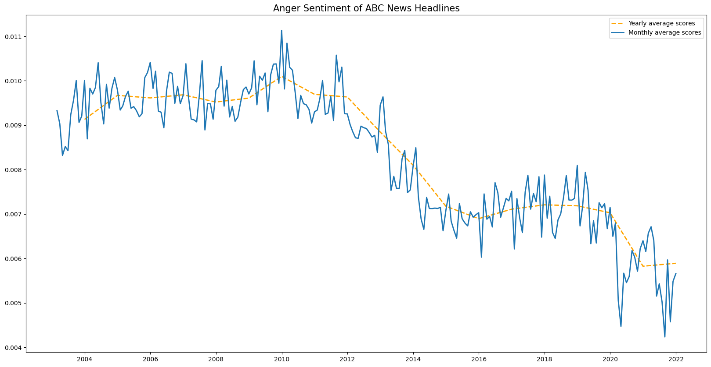
    


    
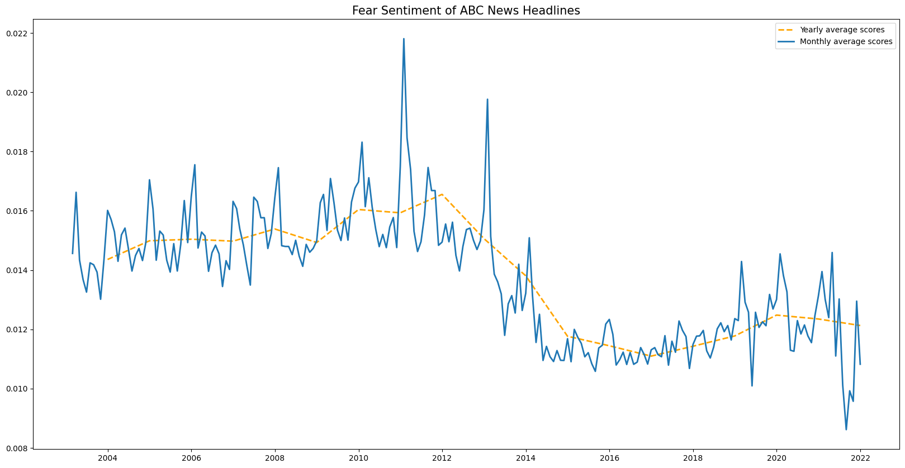
    


    
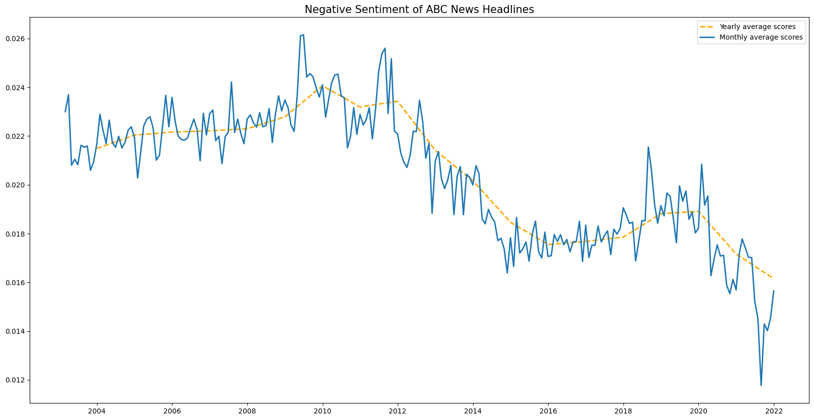
    


    
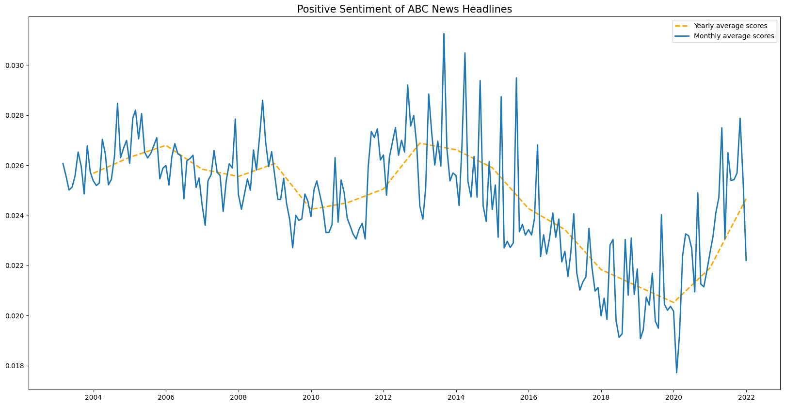
    


    
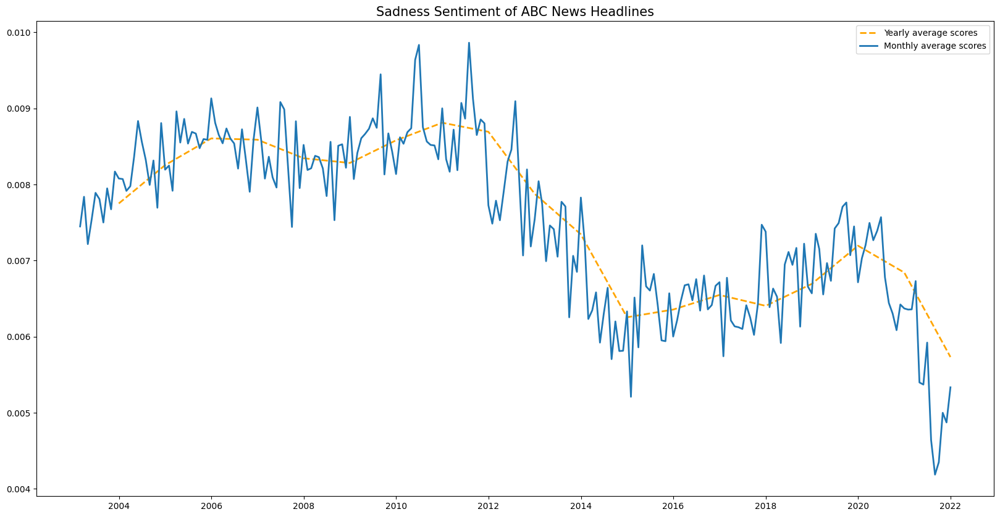
    


    
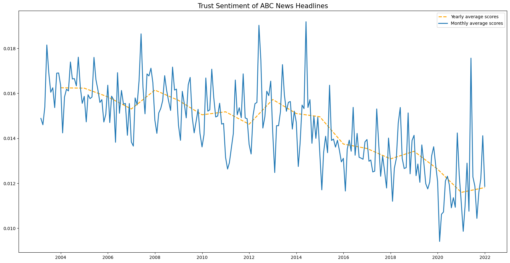
    


    
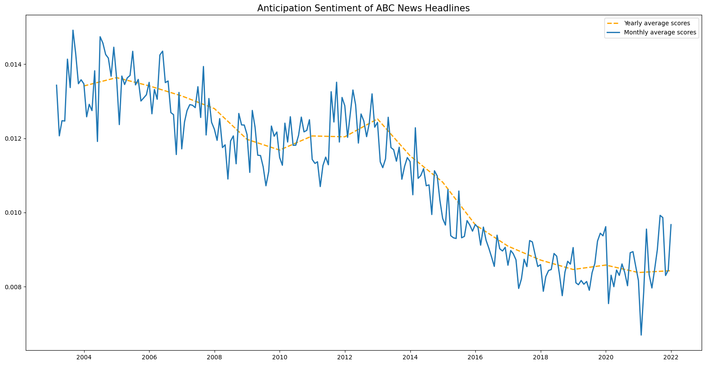
    


    
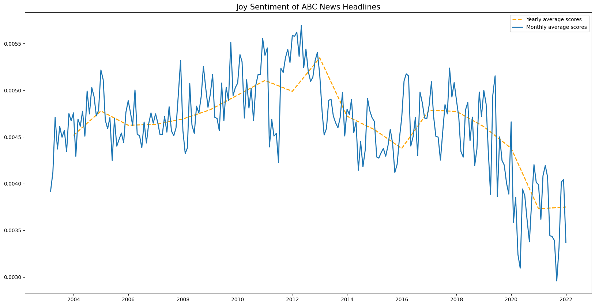
    


    
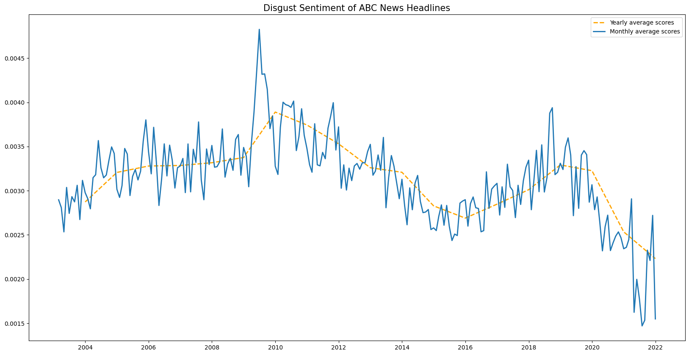
    


    
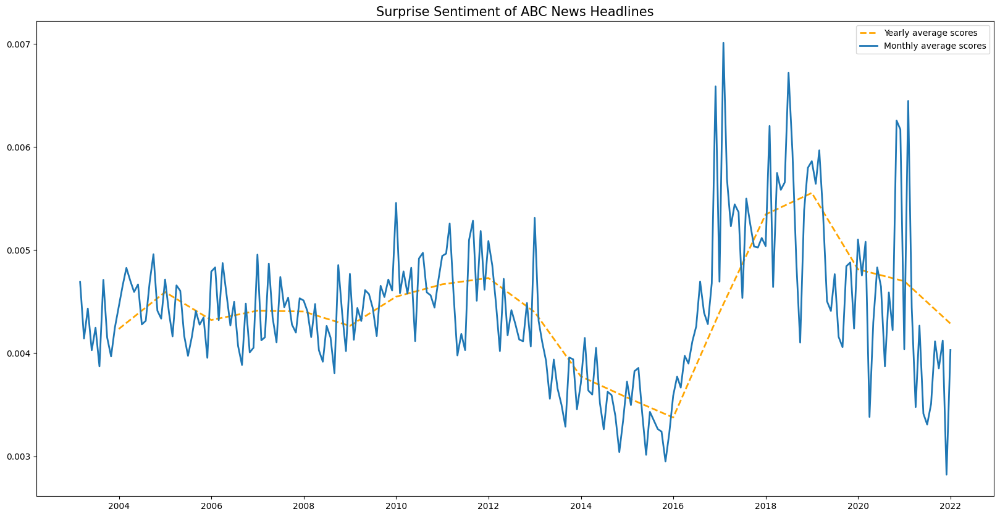
    


Anger, fear and negative are going downward.


```python
x= nrc_yearly_averages.index
y= [nrc_yearly_averages[emotion].tolist() for emotion in emotions]
plt.figure(figsize=(20,10))
plt.stackplot(x,y, colors=('#1f77b4',
                          '#ff7f0e',
                          '#2ca02c',
                          '#d62728',
                          '#9467bd',
                          '#8c564b',
                          '#e377c2',
                          '#7f7f7f',
                          '#bcbd22',
                          '#17becf'), labels=emotions)
plt.legend()
plt.show()
```


    
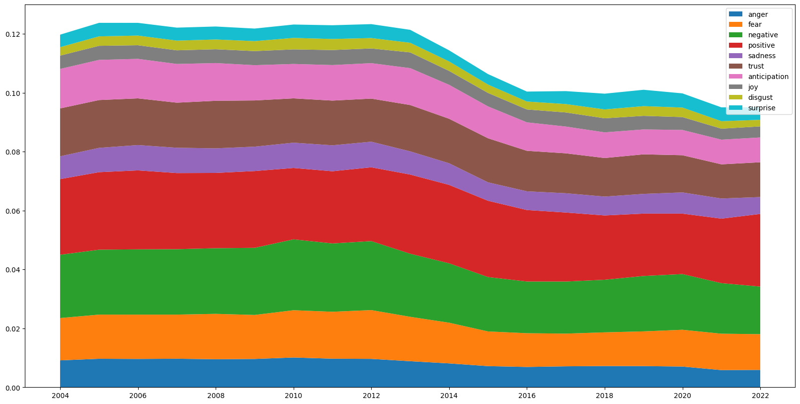
    


```python

```
