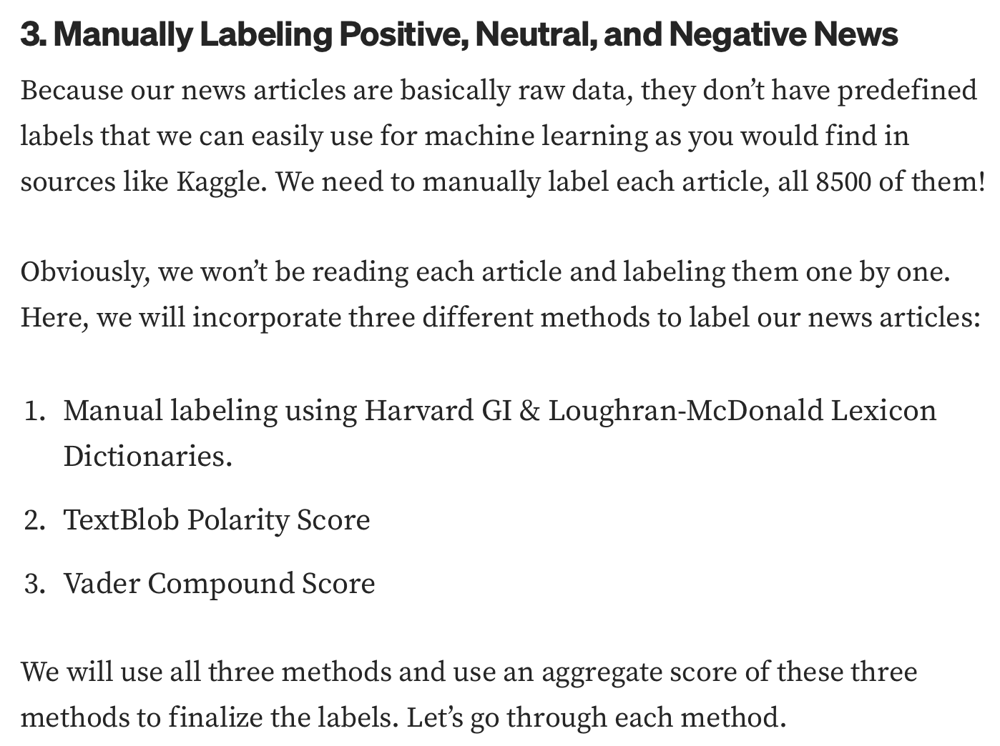
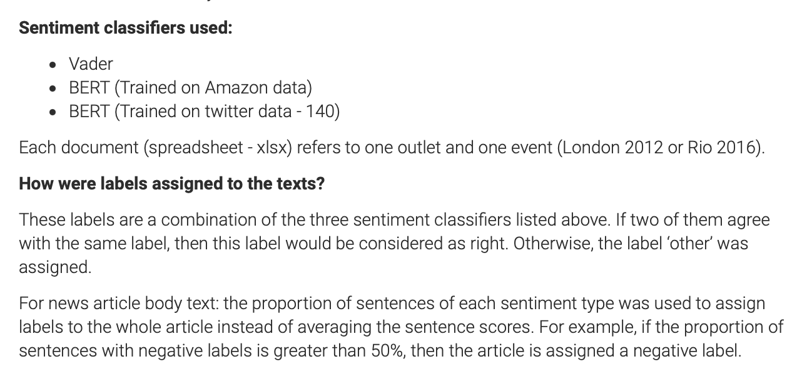

# Plan

## 1. Find the most efficient way to label data
* try Snorkel
* 
* image taken from: [Predicting News Article Sentiment Using Natural Language Processing — Part 1](https://cjlee-data.medium.com/predicting-news-article-sentiment-using-natural-language-processing-part-1-27ef1e33ba3b)
* 
* image taken from: [Sentiment Analysis outputs based on the combination of three classifiers for news headlines and body text](https://zenodo.org/record/6326348#.Y90Dpy-l3RY)
* 

## 2. Sentiment Analysis on News Headlines, English
* Combine ideas from example codes [[code_examples]]
* find the most accurate methods

## 3. Sentiment Analysis on news articles, English
* Find APIs that provide entire articles
* maybe add topic classification if not already provided

## 4. Combine Analysis of headlines and articles to get final classification
* Is there a change to be detected?

## 5. Optimise algorithms and try out different approaches with varying parameters
* Which libraries are best?
* What about BERT/DistilBERT, other transformers?

## 6. Create simple React App for good news feed
* Tutorial from here [[app]]
* start with ios
* get results from neg/pos classification as feed, so app only shows positive articles
* do the same with browser version

## 7. If time:
* add German news
* extend to Tweets, see: [Getting Started with Sentiment Analysis using Python](https://huggingface.co/blog/sentiment-analysis-python)
* when getting articles from good newspapers, check whether they would be labeled as positive by classifier
* check if 'human touch' is still needed
* compare to Assignment 2 of sem 1 NLP: create 'characters' of pos/neu/neg and see how new headlines would be predicted... does this mae a difference?
* if text summarisation is applied to the article, does it change the sentiment? [Text Summarizer Using NLP advanced](https://www.kaggle.com/code/midouazerty/text-summarizer-using-nlp-advanced)
* compare which summarisation algorithms stay true to the main sentiment: [ Summarization Comparison](https://www.kaggle.com/code/thomaslazarus/summarization-comparison)
* check if more neg or pos articles are classified as fake news: [Headline Classification - AutoEncoder](https://www.kaggle.com/code/antmarakis/headline-classification-autoencoder)
* show which topics are more pos/neg
* text generation of headline, when given article text: [Headline Generation - Million Headlines Dataset](https://www.kaggle.com/code/antmarakis/headline-generation-million-headlines-dataset)
* add emotions? [Distilbert-base-uncased-emotion](https://huggingface.co/bhadresh-savani/distilbert-base-uncased-emotion?text=I+feel+a+bit+let+down)
* try tweets with # badnews and # goodnews
* IMPORTANT: as final step, propose text generation, of how negative news can be rewritten to sound less negative -> solutions-oriented journalism, start with headlines
* 