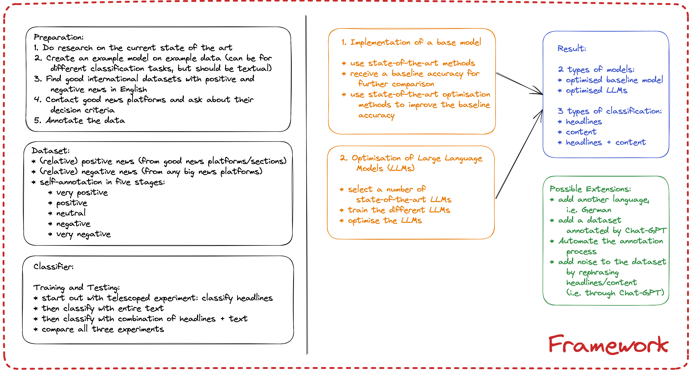

# Methodology

## Describe the various steps that you intend to follow in order for you to achieve your project aims.

The above imgae shows the general methodology regarding the final framework.

1. Review and analyse the current state-of-the-art methods
2. Annotate the dataset, which contains various kinds of news, to allow for a diverse dataset
3. Implement a base model
4. Optimise the base model
5. Implement Large Language Models and optimise them
6. Compare the results with different datasets
7. Create a pipeline to automate these processes and put everything together as a framework for future work

The above steps leave room for further possible extensions, if time and resources allow itL
1. add news articles in other languages than English to teh dataset
2. let Chat-GPT annotate the dataset

Justification:
- In order to use classifiers in applications, they need to undergo certain training and testing stages to ensure safety and quality
- However, these stages are time-consuming and therefore, need automated techniques, so that more time can be spent on the actual applications of said classifiers
- The framework will be created, so that in future arbitrary classifiers (e.g. for NLP) can undergo the same automated processes as the developed classifier 