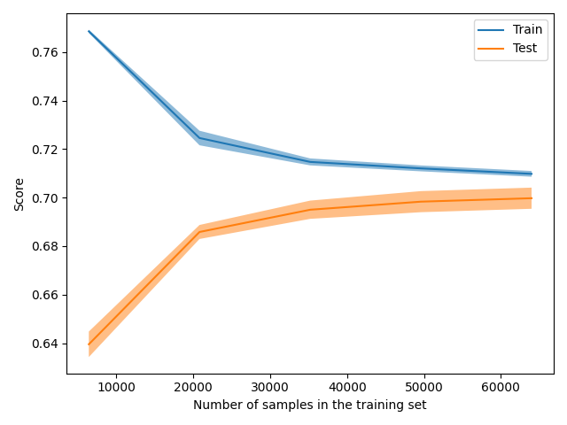
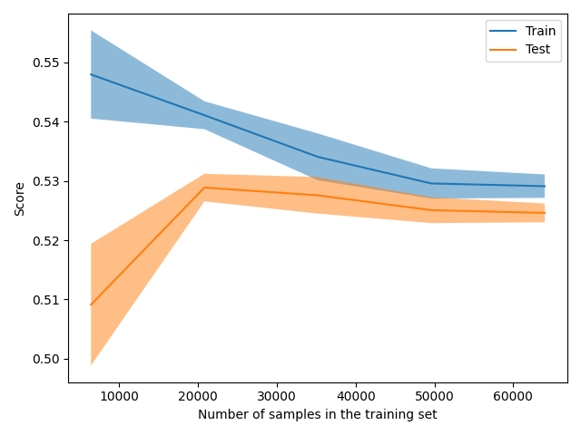

The size of this dataset is 100000.0

Showing results for count and log Model
Training Accuarcy: 0.709
Test Accuracy 0.701
              precision    recall  f1-score   support

    Negative       0.57      0.77      0.66      6105
    Positive       0.82      0.67      0.73      7754
     Neutral       0.76      0.67      0.71      6141

    accuracy                           0.70     20000
   macro avg       0.72      0.70      0.70     20000
weighted avg       0.73      0.70      0.70     20000

Boosting
The size of this dataset is 100000.0

Showing results for count and log Model
Training Accuarcy: 0.529
Test Accuracy 0.527
              precision    recall  f1-score   support

    Negative       0.42      0.34      0.38      6105
    Positive       0.51      0.75      0.60      7754
     Neutral       0.74      0.44      0.55      6141

    accuracy                           0.53     20000
   macro avg       0.55      0.51      0.51     20000
weighted avg       0.55      0.53      0.52     20000

