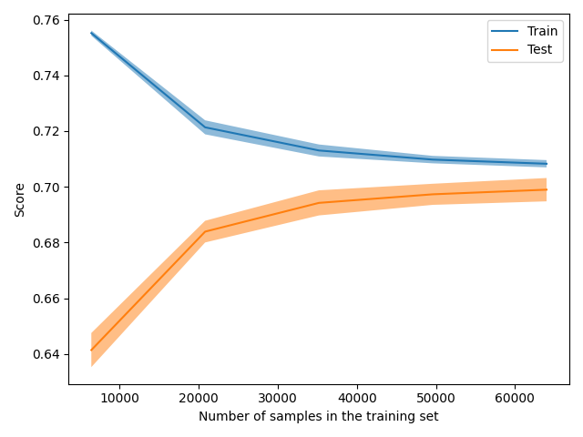
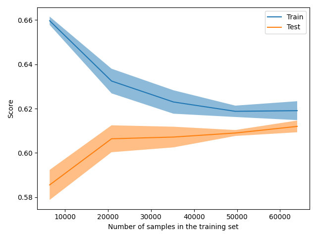

The size of this dataset is 100000.0

Showing results for tfidf and log Model
Training Accuarcy: 0.707
Test Accuracy 0.701
              precision    recall  f1-score   support

    Negative       0.57      0.77      0.66      6105
    Positive       0.81      0.67      0.73      7754
     Neutral       0.76      0.67      0.71      6141

    accuracy                           0.70     20000
   macro avg       0.72      0.70      0.70     20000
weighted avg       0.72      0.70      0.70     20000

Boosting
The size of this dataset is 100000.0

Showing results for tfidf and log Model
Training Accuarcy: 0.623
Test Accuracy 0.613
              precision    recall  f1-score   support

    Negative       0.49      0.75      0.59      6105
    Positive       0.73      0.54      0.62      7754
     Neutral       0.72      0.57      0.64      6141

    accuracy                           0.61     20000
   macro avg       0.64      0.62      0.62     20000
weighted avg       0.65      0.61      0.62     20000

