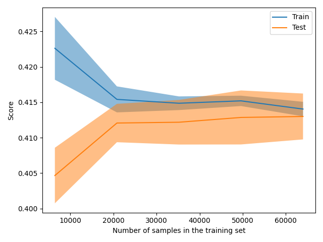
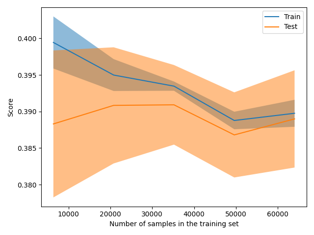

The size of this dataset is 100000.0

Showing results for w2v and log Model
Training Accuarcy: 0.414
Test Accuracy 0.414
              precision    recall  f1-score   support

    Negative       0.39      0.43      0.41      6105
    Positive       0.47      0.44      0.45      7754
     Neutral       0.37      0.37      0.37      6141

    accuracy                           0.41     20000
   macro avg       0.41      0.41      0.41     20000
weighted avg       0.42      0.41      0.41     20000

Boosting
The size of this dataset is 100000.0

Showing results for w2v and log Model
Training Accuarcy: 0.388
Test Accuracy 0.381
              precision    recall  f1-score   support

    Negative       0.34      0.65      0.45      6105
    Positive       0.45      0.44      0.45      7754
     Neutral       0.40      0.03      0.06      6141

    accuracy                           0.38     20000
   macro avg       0.39      0.38      0.32     20000
weighted avg       0.40      0.38      0.33     20000

