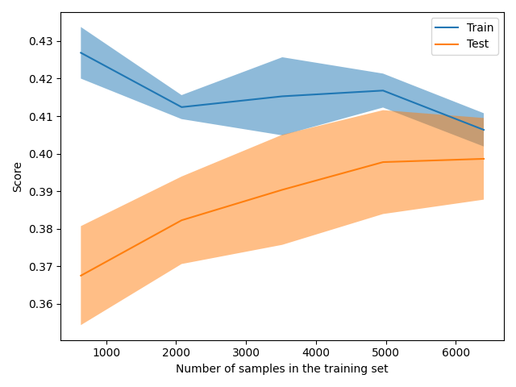

The size of this dataset is 10000.0

Showing results for w2v and nb Model
Training Accuarcy: 0.407
Test Accuracy 0.390
              precision    recall  f1-score   support

    Negative       0.34      0.35      0.35       607
    Positive       0.42      0.62      0.50       750
     Neutral       0.39      0.16      0.22       643

    accuracy                           0.39      2000
   macro avg       0.38      0.38      0.36      2000
weighted avg       0.39      0.39      0.36      2000

Boosting
The size of this dataset is 10000.0

Showing results for w2v and nb Model
Training Accuarcy: 0.403
Test Accuracy 0.399
              precision    recall  f1-score   support

    Negative       0.37      0.35      0.36       607
    Positive       0.41      0.64      0.50       750
     Neutral       0.41      0.16      0.23       643

    accuracy                           0.40      2000
   macro avg       0.40      0.38      0.36      2000
weighted avg       0.40      0.40      0.37      2000

