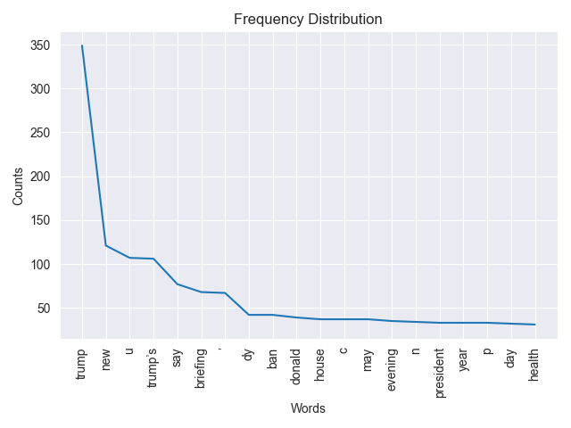
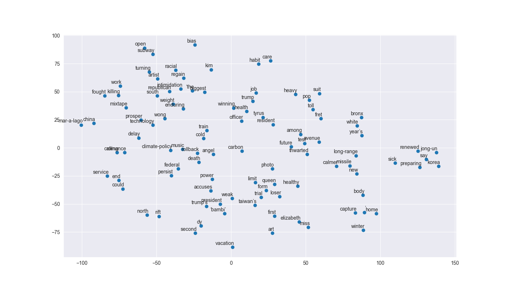

The size of this dataset is 2000.0
Number of unique words: 5238

Sample word2idx: [('house', 0), ('republican', 1), ('fret', 2), ('winning', 3), ('health', 4), ('care', 5), ('suit', 6), ('rift', 7), ('officer', 8), ('resident', 9)]

Sample idx2word: [(0, 'house'), (1, 'republican'), (2, 'fret'), (3, 'winning'), (4, 'health'), (5, 'care'), (6, 'suit'), (7, 'rift'), (8, 'officer'), (9, 'resident')]

Sample sents_as_id: [[0, 1, 2, 3, 4, 5, 6], [7, 8, 9, 10, 11, 12, 13], [14, 15, 16, 17, 18, 19, 20, 21], [22, 23, 24, 25, 26, 27], [28, 29, 30, 31, 32, 33, 34, 35, 36], [37, 38, 39, 40, 41, 42, 43, 44], [45, 46, 47, 48, 49, 50], [51, 52, 53, 54, 55, 56, 57, 58], [59, 60, 61], [62, 63, 64, 65, 66]]
None

{'death': ['step', 'teeth', 'roommate', 'slow', '‘walden’', 'presidential', 'c', 'toll', 'akihito', 'applicant'], 'life': ['scare', 'puppet', 'fall', 'denzel', 'opel', 'mother’s', 'flock', 'join', 'ban', '‘right'], 'good': ['citizen', 'tell', 'palestinian', 'patriot', 'arrested', 'in-law', 'wilder', 'cancel', 'libya', 'expand'], 'bad': ['responds', 'except', 'arrested', 'louvre', 'probably', 'coroner', 'driver', 'dip', 'police', 'schoolgirl'], 'man': ['keith', 'increase', 'fifth', 'emperor', 'mon', 'duterte’s', 'rent', 'gambia', 'push', 'draft'], 'woman': ['hidden', 'misleads', 'lead', 'considers', 'lamenting', 'coast', 'geert', 'loss', 'control', '‘apprentice’'], 'happy': ['request', 'nadal', 'sympathy', 'teenager', 'dressing', 'genetically', 'olympics', 'lady', 'editor', 'shaped']}

