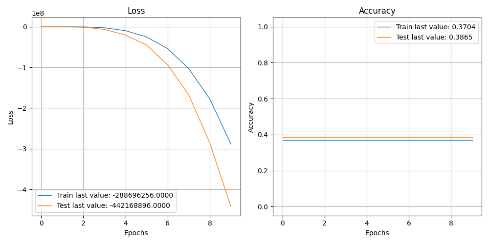

              precision    recall  f1-score   support

    Negative       0.00      0.00      0.00      1310
    Positive       0.39      1.00      0.56      1546
     Neutral       0.00      0.00      0.00      1144

    accuracy                           0.39      4000
   macro avg       0.13      0.33      0.19      4000
weighted avg       0.15      0.39      0.22      4000

[INFO] predicting...
house freedom caucus member desantis ’we pas something relatively soon’ obamacare
[0.]
u -led coalition confirms strike hit mosul site civilian died
[0.]
nypd man arrested connection death queen jogger
[0.]
russia deploys missile violating treaty challenging trump
[0.]
new york deploys counterterror critical response command following london terror spree
[0.]
united arab emirate cheer trump immigration policy
[0.]
convicted terrorist oscar lópez rivera booed nyc puerto rican day parade
[0.]
spurred orlando shooting g p senator offer gun control compromise
[0.]
eu support wane across europe thanks migrant crisis
[0.]
report least three anti-trump leaker identified referred proper authority expected fired soon
[0.]
