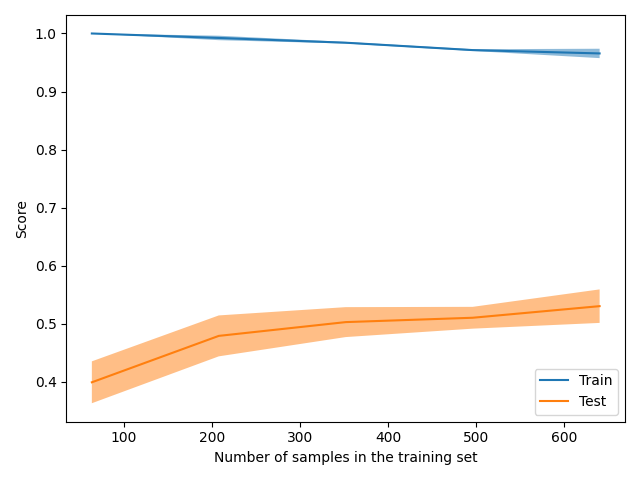

The size of this dataset is 2000.0

Showing results for count and log Model
Training Accuarcy: 0.951
Test Accuracy 0.565
              precision    recall  f1-score   support

    Negative       0.36      0.41      0.38        46
    Positive       0.63      0.71      0.67        80
     Neutral       0.65      0.50      0.56        74

    accuracy                           0.56       200
   macro avg       0.55      0.54      0.54       200
weighted avg       0.58      0.56      0.57       200

Confidence for each prediction: [[0.38181458 0.39733666 0.22084876]
 [0.14544524 0.07541442 0.77914034]
 [0.34963508 0.27099601 0.37936891]
 [0.29838457 0.39914694 0.30246849]
 [0.17569507 0.78854158 0.03576335]
 [0.22187814 0.59267063 0.18545123]
 [0.34356839 0.3342539  0.32217771]
 [0.03126513 0.03126666 0.9374682 ]
 [0.20437162 0.54302295 0.25260543]
 [0.60923683 0.07707011 0.31369306]
 [0.19337028 0.54392989 0.26269983]
 [0.18152884 0.26317793 0.55529322]
 [0.13930014 0.1585257  0.70217416]
 [0.03025289 0.13411032 0.83563679]
 [0.51864848 0.0973996  0.38395192]
 [0.60831997 0.0634057  0.32827434]
 [0.09460174 0.53395612 0.37144214]
 [0.181078   0.43417181 0.38475019]
 [0.21156206 0.54831549 0.24012245]
 [0.39581813 0.34384105 0.26034082]
 [0.29086084 0.45795577 0.25118339]
 [0.19528515 0.63280367 0.17191118]
 [0.42739287 0.18435139 0.38825573]
 [0.33379108 0.06040939 0.60579953]
 [0.19569569 0.41553335 0.38877096]
 [0.0185033  0.08806189 0.89343481]
 [0.30016    0.49298497 0.20685503]
 [0.33498252 0.34695581 0.31806167]
 [0.63132003 0.21015505 0.15852492]
 [0.33688279 0.34636171 0.31675551]
 [0.47847021 0.3802566  0.14127319]
 [0.66161042 0.1576564  0.18073318]
 [0.08603145 0.67088009 0.24308846]
 [0.09248829 0.79827131 0.1092404 ]
 [0.34657093 0.28902282 0.36440625]
 [0.53057559 0.26447801 0.2049464 ]
 [0.21227091 0.2341534  0.55357569]
 [0.09736233 0.76642962 0.13620805]
 [0.33498252 0.34695581 0.31806167]
 [0.57700323 0.20920773 0.21378903]
 [0.47536011 0.17877245 0.34586744]
 [0.17106281 0.63991382 0.18902337]
 [0.46098785 0.36473504 0.17427711]
 [0.15936332 0.21398529 0.62665138]
 [0.03354122 0.82442496 0.14203382]
 [0.64641874 0.10437873 0.24920253]
 [0.33018907 0.33717204 0.33263889]
 [0.25757896 0.56038665 0.18203439]
 [0.65739101 0.131721   0.210888  ]
 [0.37373286 0.49613881 0.13012833]
 [0.19467768 0.46454613 0.34077619]
 [0.17655683 0.10220206 0.72124111]
 [0.1411123  0.66831732 0.19057038]
 [0.24400155 0.37938212 0.37661632]
 [0.45408993 0.337564   0.20834607]
 [0.24508751 0.57693473 0.17797776]
 [0.35432863 0.1657001  0.47997127]
 [0.26445303 0.52159708 0.2139499 ]
 [0.32935821 0.47733059 0.1933112 ]
 [0.51837833 0.11530786 0.36631381]
 [0.51324848 0.15654176 0.33020977]
 [0.59245482 0.32171078 0.0858344 ]
 [0.2145749  0.45347466 0.33195044]
 [0.52674724 0.179915   0.29333776]
 [0.17863163 0.28556394 0.53580443]
 [0.46210424 0.25070094 0.28719482]
 [0.15012034 0.82843643 0.02144323]
 [0.09528042 0.37285177 0.53186782]
 [0.59797254 0.12964764 0.27237982]
 [0.17720287 0.44207005 0.38072708]
 [0.33498252 0.34695581 0.31806167]
 [0.15463781 0.26574994 0.57961225]
 [0.12231142 0.466235   0.41145358]
 [0.29805414 0.35969848 0.34224738]
 [0.21699175 0.49286537 0.29014288]
 [0.22028643 0.58171162 0.19800195]
 [0.08689666 0.52976105 0.38334229]
 [0.76025074 0.16223196 0.07751731]
 [0.106675   0.54186564 0.35145936]
 [0.17171883 0.55876434 0.26951683]
 [0.27481803 0.29387133 0.43131064]
 [0.57313878 0.12043459 0.30642663]
 [0.21691636 0.31373914 0.4693445 ]
 [0.38495138 0.26679963 0.34824899]
 [0.16906938 0.18424988 0.64668074]
 [0.18645714 0.29271026 0.52083259]
 [0.09324452 0.21423028 0.6925252 ]
 [0.11966412 0.58412274 0.29621314]
 [0.05527266 0.86719968 0.07752766]
 [0.3099181  0.31028663 0.37979527]
 [0.04662972 0.05754503 0.89582525]
 [0.4294989  0.28625164 0.28424946]
 [0.4558661  0.25692355 0.28721035]
 [0.49777265 0.35787824 0.14434911]
 [0.70402339 0.14421448 0.15176212]
 [0.33498252 0.34695581 0.31806167]
 [0.15393033 0.48359838 0.36247129]
 [0.34095353 0.15132212 0.50772436]
 [0.12192976 0.63930195 0.23876829]
 [0.07732605 0.70241161 0.22026234]
 [0.24239411 0.61616528 0.1414406 ]
 [0.3930189  0.31647609 0.29050501]
 [0.53725737 0.17165465 0.29108799]
 [0.11280765 0.66416662 0.22302572]
 [0.23451758 0.5935051  0.17197732]
 [0.40222633 0.53532749 0.06244618]
 [0.03842046 0.18971291 0.77186663]
 [0.33732298 0.52455372 0.1381233 ]
 [0.33498252 0.34695581 0.31806167]
 [0.27441546 0.4780835  0.24750104]
 [0.47842989 0.08719684 0.43437327]
 [0.03136399 0.08520138 0.88343463]
 [0.48655631 0.2477864  0.26565729]
 [0.25768842 0.21817182 0.52413976]
 [0.43091224 0.39462944 0.17445832]
 [0.14093894 0.71466751 0.14439355]
 [0.59021227 0.25578805 0.15399968]
 [0.12641006 0.75151156 0.12207838]
 [0.2450825  0.42963117 0.32528633]
 [0.0294823  0.07371961 0.89679809]
 [0.2770308  0.46152609 0.26144312]
 [0.27157739 0.26751244 0.46091018]
 [0.33751495 0.32441384 0.33807122]
 [0.43946294 0.28039312 0.28014393]
 [0.12027144 0.5747646  0.30496396]
 [0.11695351 0.14173605 0.74131044]
 [0.59051066 0.23672247 0.17276687]
 [0.08625333 0.07685744 0.83688923]
 [0.38082023 0.49156343 0.12761634]
 [0.3452483  0.36913789 0.2856138 ]
 [0.4614836  0.29331955 0.24519685]
 [0.17716192 0.39226261 0.43057547]
 [0.0097179  0.95694052 0.03334158]
 [0.2453714  0.26569797 0.48893063]
 [0.31413286 0.33197611 0.35389103]
 [0.25958883 0.2484149  0.49199626]
 [0.05355222 0.92632418 0.0201236 ]
 [0.13549828 0.69916611 0.1653356 ]
 [0.1147659  0.36075395 0.52448015]
 [0.15900893 0.35014025 0.49085083]
 [0.36347257 0.17681393 0.4597135 ]
 [0.11443805 0.30993351 0.57562845]
 [0.03239067 0.94752221 0.02008711]
 [0.63659092 0.06173237 0.30167671]
 [0.4540031  0.27103109 0.27496581]
 [0.08156898 0.25044485 0.66798617]
 [0.28719037 0.0102073  0.70260233]
 [0.46781383 0.33444153 0.19774464]
 [0.29177206 0.46239225 0.24583569]
 [0.35306034 0.40307731 0.24386235]
 [0.31259246 0.41034721 0.27706033]
 [0.58189788 0.30432896 0.11377316]
 [0.17985928 0.28838457 0.53175615]
 [0.01743936 0.9356534  0.04690724]
 [0.10894594 0.65980826 0.2312458 ]
 [0.21808577 0.51289184 0.2690224 ]
 [0.26330006 0.20002007 0.53667987]
 [0.11882145 0.18756518 0.69361337]
 [0.26495194 0.40049304 0.33455502]
 [0.338645   0.29105123 0.37030377]
 [0.14033257 0.16288298 0.69678445]
 [0.19752136 0.53674192 0.26573672]
 [0.37064503 0.4058597  0.22349527]
 [0.37942618 0.45318696 0.16738685]
 [0.35370835 0.44108022 0.20521143]
 [0.26889476 0.40076227 0.33034297]
 [0.06133493 0.05139106 0.88727401]
 [0.44822793 0.31388381 0.23788826]
 [0.14007433 0.2639777  0.59594797]
 [0.1242962  0.78394513 0.09175867]
 [0.42722099 0.08510567 0.48767334]
 [0.39799839 0.25368323 0.34831838]
 [0.11860341 0.73580436 0.14559223]
 [0.60543578 0.21074512 0.1838191 ]
 [0.11393441 0.04407301 0.84199259]
 [0.37956175 0.06862839 0.55180986]
 [0.20399123 0.39913313 0.39687564]
 [0.33321576 0.39371707 0.27306717]
 [0.3534596  0.37145661 0.27508379]
 [0.76024569 0.08923136 0.15052295]
 [0.55210217 0.21535849 0.23253934]
 [0.17350531 0.11305505 0.71343964]
 [0.71915996 0.14129485 0.13954519]
 [0.46219242 0.42462809 0.11317949]
 [0.07426942 0.15011043 0.77562015]
 [0.3852634  0.55158994 0.06314666]
 [0.13435071 0.81305769 0.0525916 ]
 [0.33911351 0.37536231 0.28552418]
 [0.24627791 0.36506538 0.38865671]
 [0.04182344 0.61085983 0.34731673]
 [0.37696598 0.20925709 0.41377693]
 [0.2098813  0.61200562 0.17811308]
 [0.35078223 0.43976051 0.20945726]
 [0.17896465 0.09054407 0.73049128]
 [0.69381779 0.07187166 0.23431055]
 [0.12932857 0.61069508 0.25997635]
 [0.69120723 0.11920675 0.18958602]
 [0.46432677 0.33487879 0.20079444]
 [0.07933027 0.59378726 0.32688246]
 [0.39960043 0.22263956 0.37776001]]
[INFO] predicting...
trump russia news story
-1.0
Confidence for each prediction: [-1 -1 -1 -1 -1  0 -1 -1 -1 -1 -1 -1  0 -1 -1 -1 -1  0 -1 -1 -1 -1 -1]
donation organization surge trump order
-1.0
Confidence for each prediction: [-1 -1 -1 -1 -1 -1 -1 -1  0 -1 -1 -1 -1 -1 -1 -1 -1 -1 -1 -1 -1  0 -1 -1
 -1 -1 -1  0 -1 -1 -1 -1 -1  0 -1 -1 -1 -1 -1]
postcard past crossing syria
-1.0
Confidence for each prediction: [-1 -1 -1 -1 -1 -1 -1 -1  0 -1 -1 -1 -1  0 -1 -1 -1 -1 -1 -1 -1 -1  0 -1
 -1 -1 -1 -1]
friday mailbag measuring crowd maligning region
-1.0
Confidence for each prediction: [-1 -1 -1 -1 -1 -1  0 -1 -1 -1 -1 -1 -1 -1  0 -1 -1 -1 -1 -1 -1 -1 -1 -1
  0 -1 -1 -1 -1 -1  0 -1 -1 -1 -1 -1 -1 -1 -1 -1  0 -1 -1 -1 -1 -1 -1]
pendant found nazi death camp ruin may anne frank link
-1.0
Confidence for each prediction: [-1 -1 -1 -1 -1 -1 -1  0 -1 -1 -1 -1 -1  0 -1 -1 -1 -1  0 -1 -1 -1 -1 -1
  0 -1 -1 -1 -1  0 -1 -1 -1 -1  0 -1 -1 -1  0 -1 -1 -1 -1  0 -1 -1 -1 -1
 -1  0 -1 -1 -1 -1]
trump unreality show echo business past
-1.0
Confidence for each prediction: [-1 -1 -1 -1 -1  0 -1 -1 -1 -1 -1 -1 -1 -1 -1  0 -1 -1 -1 -1  0 -1 -1 -1
 -1  0 -1 -1 -1 -1 -1 -1 -1 -1  0 -1 -1 -1 -1]
weather apps download store winter
-1.0
Confidence for each prediction: [-1 -1 -1 -1 -1 -1 -1  0 -1 -1 -1 -1  0 -1 -1 -1 -1 -1 -1 -1 -1  0 -1 -1
 -1 -1 -1  0 -1 -1 -1 -1 -1 -1]
emotion pet care help explain human health spending
-1.0
Confidence for each prediction: [-1 -1 -1 -1 -1 -1 -1  0 -1 -1 -1  0 -1 -1 -1 -1  0 -1 -1 -1 -1  0 -1 -1
 -1 -1 -1 -1 -1  0 -1 -1 -1 -1 -1  0 -1 -1 -1 -1 -1 -1  0 -1 -1 -1 -1 -1
 -1 -1 -1]
dress like woman mean
-1.0
Confidence for each prediction: [-1 -1 -1 -1 -1  0 -1 -1 -1 -1  0 -1 -1 -1 -1 -1  0 -1 -1 -1 -1]
senate confirmation hearing begin without background check
-1.0
Confidence for each prediction: [-1 -1 -1 -1 -1 -1  0 -1 -1 -1 -1 -1 -1 -1 -1 -1 -1 -1 -1  0 -1 -1 -1 -1
 -1 -1 -1  0 -1 -1 -1 -1 -1  0 -1 -1 -1 -1 -1 -1 -1  0 -1 -1 -1 -1 -1 -1
 -1 -1 -1 -1  0 -1 -1 -1 -1 -1]
