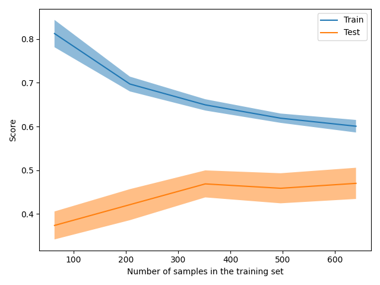

The size of this dataset is 2000.0

Showing results for tfidf and log Model
Training Accuarcy: 0.589
Test Accuracy 0.515
              precision    recall  f1-score   support

    Negative       0.41      0.35      0.38        46
    Positive       0.53      0.74      0.61        80
     Neutral       0.57      0.38      0.46        74

    accuracy                           0.52       200
   macro avg       0.50      0.49      0.48       200
weighted avg       0.52      0.52      0.50       200

Confidence for each prediction: [[0.40060031 0.39301126 0.20638843]
 [0.09318514 0.13235942 0.77445543]
 [0.33333241 0.33805703 0.32861057]
 [0.23436408 0.42433569 0.34130023]
 [0.15102365 0.78983015 0.0591462 ]
 [0.10483634 0.5697074  0.32545626]
 [0.33621637 0.3535861  0.31019753]
 [0.12548895 0.12467877 0.74983228]
 [0.47705507 0.19940115 0.32354378]
 [0.33621637 0.3535861  0.31019753]
 [0.3822447  0.42241786 0.19533744]
 [0.33621637 0.3535861  0.31019753]
 [0.19378631 0.29083259 0.5153811 ]
 [0.1413067  0.33335103 0.52534227]
 [0.53814971 0.1386365  0.32321379]
 [0.5797913  0.30273341 0.1174753 ]
 [0.10483634 0.5697074  0.32545626]
 [0.35769055 0.28098079 0.36132866]
 [0.32718351 0.35600604 0.31681045]
 [0.37025738 0.30030544 0.32943718]
 [0.3449462  0.2595618  0.395492  ]
 [0.37702566 0.40551054 0.21746379]
 [0.47705507 0.19940115 0.32354378]
 [0.37025308 0.43721631 0.19253061]
 [0.33580092 0.30674548 0.3574536 ]
 [0.08157084 0.13984032 0.77858884]
 [0.33621637 0.3535861  0.31019753]
 [0.33621637 0.3535861  0.31019753]
 [0.43507807 0.25129171 0.31363022]
 [0.33621637 0.3535861  0.31019753]
 [0.51867179 0.31662036 0.16470786]
 [0.49873223 0.36152012 0.13974765]
 [0.33621637 0.3535861  0.31019753]
 [0.33621637 0.3535861  0.31019753]
 [0.31635021 0.32323507 0.36041473]
 [0.37702566 0.40551054 0.21746379]
 [0.33621637 0.3535861  0.31019753]
 [0.12619715 0.73058423 0.14321862]
 [0.33621637 0.3535861  0.31019753]
 [0.26065728 0.42743415 0.31190857]
 [0.4607338  0.22489163 0.31437457]
 [0.33231803 0.1682373  0.49944467]
 [0.52984454 0.30433136 0.1658241 ]
 [0.25447391 0.23415746 0.51136863]
 [0.18170428 0.69460701 0.12368871]
 [0.40607077 0.23529129 0.35863794]
 [0.40185124 0.28008572 0.31806303]
 [0.57255261 0.19844534 0.22900205]
 [0.35673056 0.26333473 0.37993472]
 [0.42471322 0.23545085 0.33983593]
 [0.25168872 0.42254899 0.32576229]
 [0.24154729 0.23885929 0.51959342]
 [0.25168872 0.42254899 0.32576229]
 [0.33621637 0.3535861  0.31019753]
 [0.33621637 0.3535861  0.31019753]
 [0.33621637 0.3535861  0.31019753]
 [0.27525328 0.37279794 0.35194878]
 [0.28030106 0.44300042 0.27669852]
 [0.19506569 0.3093803  0.49555401]
 [0.64243713 0.169415   0.18814787]
 [0.33621637 0.3535861  0.31019753]
 [0.52984454 0.30433136 0.1658241 ]
 [0.33621637 0.3535861  0.31019753]
 [0.33621637 0.3535861  0.31019753]
 [0.42006625 0.41949769 0.16043606]
 [0.33333241 0.33805703 0.32861057]
 [0.13647051 0.75192059 0.1116089 ]
 [0.2323038  0.44480195 0.32289425]
 [0.48127233 0.31556478 0.20316289]
 [0.21973389 0.37488359 0.40538251]
 [0.33621637 0.3535861  0.31019753]
 [0.18621098 0.4617724  0.35201662]
 [0.198317   0.48502038 0.31666261]
 [0.33621637 0.3535861  0.31019753]
 [0.19506569 0.3093803  0.49555401]
 [0.26940005 0.37894186 0.35165809]
 [0.19650926 0.37825719 0.42523355]
 [0.32438005 0.35337705 0.3222429 ]
 [0.33621637 0.3535861  0.31019753]
 [0.2056233  0.48362083 0.31075587]
 [0.15548976 0.16849097 0.67601927]
 [0.69233973 0.17945793 0.12820234]
 [0.16231496 0.48540079 0.35228425]
 [0.33621637 0.3535861  0.31019753]
 [0.33621637 0.3535861  0.31019753]
 [0.20065251 0.29929321 0.50005428]
 [0.4607338  0.22489163 0.31437457]
 [0.33621637 0.3535861  0.31019753]
 [0.24403399 0.57059908 0.18536693]
 [0.33621637 0.3535861  0.31019753]
 [0.08413687 0.11175543 0.8041077 ]
 [0.33621637 0.3535861  0.31019753]
 [0.31635021 0.32323507 0.36041473]
 [0.43507807 0.25129171 0.31363022]
 [0.33621637 0.3535861  0.31019753]
 [0.33621637 0.3535861  0.31019753]
 [0.06654977 0.79179966 0.14165056]
 [0.50647865 0.3031462  0.19037515]
 [0.21973389 0.37488359 0.40538251]
 [0.09827979 0.62579881 0.27592141]
 [0.33621637 0.3535861  0.31019753]
 [0.52524364 0.25771486 0.21704151]
 [0.33621637 0.3535861  0.31019753]
 [0.06654977 0.79179966 0.14165056]
 [0.33621637 0.3535861  0.31019753]
 [0.24672594 0.61438912 0.13888495]
 [0.13340937 0.32770357 0.53888706]
 [0.63193501 0.27067538 0.09738961]
 [0.33621637 0.3535861  0.31019753]
 [0.36862036 0.39125889 0.24012075]
 [0.33621637 0.3535861  0.31019753]
 [0.09419544 0.60695068 0.29885388]
 [0.60771927 0.19084779 0.20143294]
 [0.31635021 0.32323507 0.36041473]
 [0.33621637 0.3535861  0.31019753]
 [0.33621637 0.3535861  0.31019753]
 [0.61809902 0.24255568 0.1393453 ]
 [0.06990741 0.83277202 0.09732056]
 [0.31290186 0.39327963 0.29381852]
 [0.09015789 0.09515464 0.81468747]
 [0.2119825  0.3976706  0.3903469 ]
 [0.15548976 0.16849097 0.67601927]
 [0.33621637 0.3535861  0.31019753]
 [0.40432017 0.23629135 0.35938848]
 [0.16343785 0.5654837  0.27107845]
 [0.15548976 0.16849097 0.67601927]
 [0.65709449 0.19026108 0.15264443]
 [0.31635021 0.32323507 0.36041473]
 [0.45307868 0.41523872 0.13168261]
 [0.29667396 0.44611261 0.25721343]
 [0.33621637 0.3535861  0.31019753]
 [0.33621637 0.3535861  0.31019753]
 [0.08502379 0.72691674 0.18805946]
 [0.33206496 0.31026088 0.35767416]
 [0.31635021 0.32323507 0.36041473]
 [0.33621637 0.3535861  0.31019753]
 [0.31750521 0.63352525 0.04896954]
 [0.33621637 0.3535861  0.31019753]
 [0.12146549 0.34380819 0.53472632]
 [0.47705507 0.19940115 0.32354378]
 [0.35956503 0.27289779 0.36753718]
 [0.27772982 0.38769743 0.33457275]
 [0.06610209 0.87302257 0.06087534]
 [0.70825748 0.10934712 0.18239541]
 [0.43011244 0.32312763 0.24675994]
 [0.23207539 0.43184888 0.33607573]
 [0.38142303 0.07905224 0.53952473]
 [0.35769055 0.28098079 0.36132866]
 [0.2669195  0.42539557 0.30768493]
 [0.33714307 0.43738374 0.22547319]
 [0.33621637 0.3535861  0.31019753]
 [0.35041419 0.49886666 0.15071916]
 [0.36787684 0.43874964 0.19337351]
 [0.1815053  0.49955083 0.31894387]
 [0.18125483 0.53968773 0.27905744]
 [0.33621637 0.3535861  0.31019753]
 [0.33621637 0.3535861  0.31019753]
 [0.09318514 0.13235942 0.77445543]
 [0.2188785  0.18781963 0.59330187]
 [0.23230164 0.64795827 0.11974009]
 [0.33621637 0.3535861  0.31019753]
 [0.33621637 0.3535861  0.31019753]
 [0.35769055 0.28098079 0.36132866]
 [0.36380179 0.42073805 0.21546016]
 [0.33621637 0.3535861  0.31019753]
 [0.29865922 0.37637462 0.32496616]
 [0.10874789 0.11000311 0.781249  ]
 [0.33621637 0.3535861  0.31019753]
 [0.26592268 0.40314083 0.33093649]
 [0.21328723 0.40602609 0.38068668]
 [0.32245714 0.17129768 0.50624518]
 [0.48844306 0.26403199 0.24752494]
 [0.30798142 0.44679736 0.24522122]
 [0.48720504 0.38142321 0.13137175]
 [0.12801322 0.13560008 0.7363867 ]
 [0.21310067 0.15953217 0.62736716]
 [0.17508078 0.37931846 0.44560076]
 [0.29771329 0.46786983 0.23441688]
 [0.31635021 0.32323507 0.36041473]
 [0.14023293 0.79679655 0.06297052]
 [0.23555798 0.33262851 0.43181351]
 [0.22423174 0.19133007 0.58443819]
 [0.33621637 0.3535861  0.31019753]
 [0.51524866 0.3618592  0.12289214]
 [0.31635021 0.32323507 0.36041473]
 [0.27923731 0.52549281 0.19526988]
 [0.13037601 0.77934792 0.09027607]
 [0.42471322 0.23545085 0.33983593]
 [0.33621637 0.3535861  0.31019753]
 [0.22115945 0.53849443 0.24034612]
 [0.29057088 0.34770712 0.361722  ]
 [0.15249138 0.60319266 0.24431596]
 [0.26691924 0.3198243  0.41325646]
 [0.09404228 0.10676543 0.79919229]
 [0.70825748 0.10934712 0.18239541]
 [0.14547891 0.53001997 0.32450112]
 [0.33621637 0.3535861  0.31019753]
 [0.59248907 0.28047658 0.12703435]
 [0.33621637 0.3535861  0.31019753]
 [0.33621637 0.3535861  0.31019753]]
[INFO] predicting...
trump russia news story
-1.0
Confidence for each prediction: [-1 -1 -1 -1 -1  0 -1 -1 -1 -1 -1 -1  0 -1 -1 -1 -1  0 -1 -1 -1 -1 -1]
donation organization surge trump order
-1.0
Confidence for each prediction: [-1 -1 -1 -1 -1 -1 -1 -1  0 -1 -1 -1 -1 -1 -1 -1 -1 -1 -1 -1 -1  0 -1 -1
 -1 -1 -1  0 -1 -1 -1 -1 -1  0 -1 -1 -1 -1 -1]
postcard past crossing syria
-1.0
Confidence for each prediction: [-1 -1 -1 -1 -1 -1 -1 -1  0 -1 -1 -1 -1  0 -1 -1 -1 -1 -1 -1 -1 -1  0 -1
 -1 -1 -1 -1]
friday mailbag measuring crowd maligning region
-1.0
Confidence for each prediction: [-1 -1 -1 -1 -1 -1  0 -1 -1 -1 -1 -1 -1 -1  0 -1 -1 -1 -1 -1 -1 -1 -1 -1
  0 -1 -1 -1 -1 -1  0 -1 -1 -1 -1 -1 -1 -1 -1 -1  0 -1 -1 -1 -1 -1 -1]
pendant found nazi death camp ruin may anne frank link
-1.0
Confidence for each prediction: [-1 -1 -1 -1 -1 -1 -1  0 -1 -1 -1 -1 -1  0 -1 -1 -1 -1  0 -1 -1 -1 -1 -1
  0 -1 -1 -1 -1  0 -1 -1 -1 -1  0 -1 -1 -1  0 -1 -1 -1 -1  0 -1 -1 -1 -1
 -1  0 -1 -1 -1 -1]
trump unreality show echo business past
-1.0
Confidence for each prediction: [-1 -1 -1 -1 -1  0 -1 -1 -1 -1 -1 -1 -1 -1 -1  0 -1 -1 -1 -1  0 -1 -1 -1
 -1  0 -1 -1 -1 -1 -1 -1 -1 -1  0 -1 -1 -1 -1]
weather apps download store winter
-1.0
Confidence for each prediction: [-1 -1 -1 -1 -1 -1 -1  0 -1 -1 -1 -1  0 -1 -1 -1 -1 -1 -1 -1 -1  0 -1 -1
 -1 -1 -1  0 -1 -1 -1 -1 -1 -1]
emotion pet care help explain human health spending
-1.0
Confidence for each prediction: [-1 -1 -1 -1 -1 -1 -1  0 -1 -1 -1  0 -1 -1 -1 -1  0 -1 -1 -1 -1  0 -1 -1
 -1 -1 -1 -1 -1  0 -1 -1 -1 -1 -1  0 -1 -1 -1 -1 -1 -1  0 -1 -1 -1 -1 -1
 -1 -1 -1]
dress like woman mean
-1.0
Confidence for each prediction: [-1 -1 -1 -1 -1  0 -1 -1 -1 -1  0 -1 -1 -1 -1 -1  0 -1 -1 -1 -1]
senate confirmation hearing begin without background check
-1.0
Confidence for each prediction: [-1 -1 -1 -1 -1 -1  0 -1 -1 -1 -1 -1 -1 -1 -1 -1 -1 -1 -1  0 -1 -1 -1 -1
 -1 -1 -1  0 -1 -1 -1 -1 -1  0 -1 -1 -1 -1 -1 -1 -1  0 -1 -1 -1 -1 -1 -1
 -1 -1 -1 -1  0 -1 -1 -1 -1 -1]
