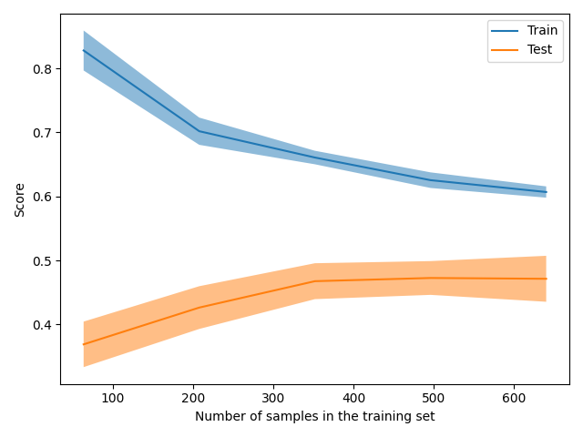

The size of this dataset is 2000.0

Showing results for count and log Model
Training Accuarcy: 0.599
Test Accuracy 0.515
              precision    recall  f1-score   support

    Negative       0.39      0.35      0.37        46
    Positive       0.54      0.74      0.62        80
     Neutral       0.57      0.38      0.46        74

    accuracy                           0.52       200
   macro avg       0.50      0.49      0.48       200
weighted avg       0.52      0.52      0.50       200

Confidence for each prediction: [[0.44170522 0.39377846 0.16451632]
 [0.0892572  0.12793236 0.78281044]
 [0.31748056 0.28419861 0.39832083]
 [0.22933653 0.45886322 0.31180025]
 [0.10777823 0.86730767 0.0249141 ]
 [0.07791907 0.60529291 0.31678801]
 [0.34135103 0.35208452 0.30656445]
 [0.14574513 0.14102441 0.71323046]
 [0.42784441 0.23869142 0.33346418]
 [0.34135103 0.35208452 0.30656445]
 [0.3755449  0.44648469 0.17797042]
 [0.34135103 0.35208452 0.30656445]
 [0.09230376 0.2590864  0.64860984]
 [0.04529764 0.29853423 0.65616813]
 [0.62012913 0.1115624  0.26830847]
 [0.5827828  0.29991564 0.11730156]
 [0.07791907 0.60529291 0.31678801]
 [0.35698633 0.30354606 0.33946761]
 [0.40668512 0.26656299 0.32675189]
 [0.3626699  0.32776463 0.30956546]
 [0.39517099 0.20329419 0.40153482]
 [0.36116593 0.43640831 0.20242576]
 [0.42784441 0.23869142 0.33346418]
 [0.33610049 0.46551526 0.19838425]
 [0.2974061  0.28526136 0.41733254]
 [0.01851544 0.05946681 0.92201776]
 [0.34135103 0.35208452 0.30656445]
 [0.34135103 0.35208452 0.30656445]
 [0.41229214 0.27350699 0.31420087]
 [0.34135103 0.35208452 0.30656445]
 [0.49718688 0.34500962 0.15780351]
 [0.51801588 0.4101824  0.07180172]
 [0.34135103 0.35208452 0.30656445]
 [0.34135103 0.35208452 0.30656445]
 [0.31861481 0.34067549 0.3407097 ]
 [0.36116593 0.43640831 0.20242576]
 [0.34135103 0.35208452 0.30656445]
 [0.04652077 0.89392318 0.05955605]
 [0.34135103 0.35208452 0.30656445]
 [0.2525906  0.4020572  0.3453522 ]
 [0.44605926 0.25792378 0.29601696]
 [0.3885581  0.14835982 0.46308208]
 [0.54853136 0.29031949 0.16114916]
 [0.22409264 0.27174623 0.50416113]
 [0.17272615 0.77090469 0.05636916]
 [0.39319342 0.24438491 0.36242167]
 [0.39832201 0.26812686 0.33355113]
 [0.62410713 0.16132633 0.21456654]
 [0.42559763 0.21120777 0.36319461]
 [0.42128472 0.25258911 0.32612617]
 [0.26362838 0.40940461 0.32696701]
 [0.21338103 0.14026183 0.64635714]
 [0.26362838 0.40940461 0.32696701]
 [0.34135103 0.35208452 0.30656445]
 [0.34135103 0.35208452 0.30656445]
 [0.34135103 0.35208452 0.30656445]
 [0.21050939 0.38433673 0.40515388]
 [0.29499384 0.41531737 0.28968879]
 [0.19633018 0.29516016 0.50850966]
 [0.72986024 0.12987512 0.14026464]
 [0.34135103 0.35208452 0.30656445]
 [0.54853136 0.29031949 0.16114916]
 [0.34135103 0.35208452 0.30656445]
 [0.34135103 0.35208452 0.30656445]
 [0.436974   0.45346586 0.10956014]
 [0.31748056 0.28419861 0.39832083]
 [0.01760262 0.97123085 0.01116652]
 [0.19689661 0.44906855 0.35403484]
 [0.47514157 0.31414255 0.21071587]
 [0.25403896 0.40392869 0.34203235]
 [0.34135103 0.35208452 0.30656445]
 [0.138642   0.40782941 0.45352858]
 [0.19953373 0.45234434 0.34812193]
 [0.34135103 0.35208452 0.30656445]
 [0.19633018 0.29516016 0.50850966]
 [0.31198805 0.38972061 0.29829134]
 [0.13768169 0.31942713 0.54289118]
 [0.36143673 0.27284374 0.36571953]
 [0.34135103 0.35208452 0.30656445]
 [0.22021454 0.44245284 0.33733263]
 [0.18175789 0.18129703 0.63694507]
 [0.66754221 0.22360212 0.10885567]
 [0.1875252  0.46492391 0.34755089]
 [0.34135103 0.35208452 0.30656445]
 [0.34135103 0.35208452 0.30656445]
 [0.17722814 0.27620565 0.54656621]
 [0.44605926 0.25792378 0.29601696]
 [0.34135103 0.35208452 0.30656445]
 [0.26218844 0.55527321 0.18253834]
 [0.34135103 0.35208452 0.30656445]
 [0.02209798 0.03445947 0.94344254]
 [0.34135103 0.35208452 0.30656445]
 [0.31861481 0.34067549 0.3407097 ]
 [0.41229214 0.27350699 0.31420087]
 [0.34135103 0.35208452 0.30656445]
 [0.34135103 0.35208452 0.30656445]
 [0.06559117 0.78395242 0.15045642]
 [0.51671412 0.28589887 0.19738701]
 [0.25403896 0.40392869 0.34203235]
 [0.05135658 0.74564539 0.20299803]
 [0.34135103 0.35208452 0.30656445]
 [0.51399142 0.28505113 0.20095745]
 [0.34135103 0.35208452 0.30656445]
 [0.06559117 0.78395242 0.15045642]
 [0.34135103 0.35208452 0.30656445]
 [0.22921736 0.69638228 0.07440036]
 [0.15881583 0.34054602 0.50063815]
 [0.51962439 0.34390306 0.13647255]
 [0.34135103 0.35208452 0.30656445]
 [0.34246999 0.42898093 0.22854909]
 [0.34135103 0.35208452 0.30656445]
 [0.08397621 0.62928712 0.28673668]
 [0.54840851 0.24300933 0.20858217]
 [0.31861481 0.34067549 0.3407097 ]
 [0.34135103 0.35208452 0.30656445]
 [0.34135103 0.35208452 0.30656445]
 [0.65420663 0.23835803 0.10743534]
 [0.03821615 0.90471037 0.05707348]
 [0.34951228 0.41586112 0.2346266 ]
 [0.09484155 0.10006418 0.80509427]
 [0.13531466 0.54604768 0.31863766]
 [0.18175789 0.18129703 0.63694507]
 [0.34135103 0.35208452 0.30656445]
 [0.36459603 0.23548088 0.3999231 ]
 [0.13567842 0.60328019 0.26104139]
 [0.18175789 0.18129703 0.63694507]
 [0.64876001 0.22527369 0.12596629]
 [0.31861481 0.34067549 0.3407097 ]
 [0.46101987 0.47366561 0.06531452]
 [0.31173393 0.42467889 0.26358717]
 [0.34135103 0.35208452 0.30656445]
 [0.34135103 0.35208452 0.30656445]
 [0.03030282 0.88369149 0.08600569]
 [0.35948411 0.24500034 0.39551555]
 [0.31861481 0.34067549 0.3407097 ]
 [0.34135103 0.35208452 0.30656445]
 [0.28949137 0.68455655 0.02595208]
 [0.34135103 0.35208452 0.30656445]
 [0.05085569 0.24528526 0.70385906]
 [0.42784441 0.23869142 0.33346418]
 [0.32539094 0.2247118  0.44989726]
 [0.24353117 0.36030285 0.39616597]
 [0.02197098 0.96104711 0.01698191]
 [0.80227553 0.0541502  0.14357427]
 [0.52334546 0.29899892 0.17765562]
 [0.18164474 0.42946368 0.38889159]
 [0.3082655  0.02363207 0.66810243]
 [0.35698633 0.30354606 0.33946761]
 [0.22921886 0.49339028 0.27739086]
 [0.27926749 0.54963913 0.17109339]
 [0.34135103 0.35208452 0.30656445]
 [0.41024709 0.50648516 0.08326775]
 [0.38323741 0.4204419  0.19632069]
 [0.146571   0.50028299 0.35314602]
 [0.08103177 0.71355239 0.20541584]
 [0.34135103 0.35208452 0.30656445]
 [0.34135103 0.35208452 0.30656445]
 [0.0892572  0.12793236 0.78281044]
 [0.12287304 0.12200535 0.75512161]
 [0.2123734  0.67360435 0.11402225]
 [0.34135103 0.35208452 0.30656445]
 [0.34135103 0.35208452 0.30656445]
 [0.35698633 0.30354606 0.33946761]
 [0.31861267 0.45746413 0.22392319]
 [0.34135103 0.35208452 0.30656445]
 [0.25441734 0.4157596  0.32982306]
 [0.04195001 0.04178392 0.91626608]
 [0.34135103 0.35208452 0.30656445]
 [0.2004832  0.47741556 0.32210125]
 [0.18250481 0.45845515 0.35904004]
 [0.35525619 0.14061486 0.50412895]
 [0.45611839 0.30430647 0.23957515]
 [0.34740847 0.44196884 0.2106227 ]
 [0.59816081 0.31596936 0.08586982]
 [0.12129072 0.13543576 0.74327352]
 [0.16143596 0.1019438  0.73662024]
 [0.22660735 0.3434797  0.42991295]
 [0.33065563 0.43453353 0.23481084]
 [0.31861481 0.34067549 0.3407097 ]
 [0.11357722 0.85943218 0.0269906 ]
 [0.25519453 0.29393788 0.4508676 ]
 [0.14194937 0.12594847 0.73210217]
 [0.34135103 0.35208452 0.30656445]
 [0.63669919 0.30947186 0.05382895]
 [0.2957112  0.32777206 0.37651674]
 [0.29694195 0.51465323 0.18840482]
 [0.1519354  0.75650295 0.09156164]
 [0.42128472 0.25258911 0.32612617]
 [0.34135103 0.35208452 0.30656445]
 [0.19926465 0.60809676 0.19263859]
 [0.28318415 0.36499152 0.35182433]
 [0.15688743 0.62434286 0.2187697 ]
 [0.2622213  0.34175236 0.39602634]
 [0.0626772  0.07634225 0.86098056]
 [0.80227553 0.0541502  0.14357427]
 [0.13699513 0.58184243 0.28116243]
 [0.34135103 0.35208452 0.30656445]
 [0.50030014 0.34324669 0.15645318]
 [0.34135103 0.35208452 0.30656445]
 [0.34135103 0.35208452 0.30656445]]
[INFO] predicting...
trump russia news story
-1.0
Confidence for each prediction: [-1 -1 -1 -1 -1  0 -1 -1 -1 -1 -1 -1  0 -1 -1 -1 -1  0 -1 -1 -1 -1 -1]
donation organization surge trump order
-1.0
Confidence for each prediction: [-1 -1 -1 -1 -1 -1 -1 -1  0 -1 -1 -1 -1 -1 -1 -1 -1 -1 -1 -1 -1  0 -1 -1
 -1 -1 -1  0 -1 -1 -1 -1 -1  0 -1 -1 -1 -1 -1]
postcard past crossing syria
-1.0
Confidence for each prediction: [-1 -1 -1 -1 -1 -1 -1 -1  0 -1 -1 -1 -1  0 -1 -1 -1 -1 -1 -1 -1 -1  0 -1
 -1 -1 -1 -1]
friday mailbag measuring crowd maligning region
-1.0
Confidence for each prediction: [-1 -1 -1 -1 -1 -1  0 -1 -1 -1 -1 -1 -1 -1  0 -1 -1 -1 -1 -1 -1 -1 -1 -1
  0 -1 -1 -1 -1 -1  0 -1 -1 -1 -1 -1 -1 -1 -1 -1  0 -1 -1 -1 -1 -1 -1]
pendant found nazi death camp ruin may anne frank link
-1.0
Confidence for each prediction: [-1 -1 -1 -1 -1 -1 -1  0 -1 -1 -1 -1 -1  0 -1 -1 -1 -1  0 -1 -1 -1 -1 -1
  0 -1 -1 -1 -1  0 -1 -1 -1 -1  0 -1 -1 -1  0 -1 -1 -1 -1  0 -1 -1 -1 -1
 -1  0 -1 -1 -1 -1]
trump unreality show echo business past
-1.0
Confidence for each prediction: [-1 -1 -1 -1 -1  0 -1 -1 -1 -1 -1 -1 -1 -1 -1  0 -1 -1 -1 -1  0 -1 -1 -1
 -1  0 -1 -1 -1 -1 -1 -1 -1 -1  0 -1 -1 -1 -1]
weather apps download store winter
-1.0
Confidence for each prediction: [-1 -1 -1 -1 -1 -1 -1  0 -1 -1 -1 -1  0 -1 -1 -1 -1 -1 -1 -1 -1  0 -1 -1
 -1 -1 -1  0 -1 -1 -1 -1 -1 -1]
emotion pet care help explain human health spending
-1.0
Confidence for each prediction: [-1 -1 -1 -1 -1 -1 -1  0 -1 -1 -1  0 -1 -1 -1 -1  0 -1 -1 -1 -1  0 -1 -1
 -1 -1 -1 -1 -1  0 -1 -1 -1 -1 -1  0 -1 -1 -1 -1 -1 -1  0 -1 -1 -1 -1 -1
 -1 -1 -1]
dress like woman mean
-1.0
Confidence for each prediction: [-1 -1 -1 -1 -1  0 -1 -1 -1 -1  0 -1 -1 -1 -1 -1  0 -1 -1 -1 -1]
senate confirmation hearing begin without background check
-1.0
Confidence for each prediction: [-1 -1 -1 -1 -1 -1  0 -1 -1 -1 -1 -1 -1 -1 -1 -1 -1 -1 -1  0 -1 -1 -1 -1
 -1 -1 -1  0 -1 -1 -1 -1 -1  0 -1 -1 -1 -1 -1 -1 -1  0 -1 -1 -1 -1 -1 -1
 -1 -1 -1 -1  0 -1 -1 -1 -1 -1]
