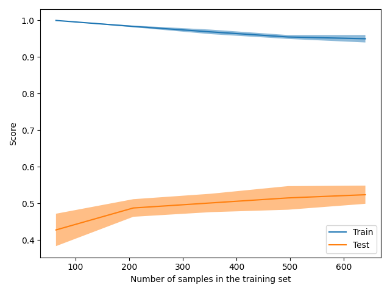

The size of this dataset is 1000.0

Showing results for tfidf and log Model
Training Accuarcy: 0.941
Test Accuracy 0.540
              precision    recall  f1-score   support

    Negative       0.35      0.46      0.40        46
    Positive       0.66      0.68      0.67        80
     Neutral       0.57      0.45      0.50        74

    accuracy                           0.54       200
   macro avg       0.53      0.53      0.52       200
weighted avg       0.55      0.54      0.54       200

Confidence for each prediction: [[0.3382047  0.38002642 0.28176887]
 [0.21210993 0.15418457 0.6337055 ]
 [0.34978742 0.32299159 0.32722098]
 [0.32006143 0.37341808 0.30652049]
 [0.2454891  0.62450498 0.13000592]
 [0.29795204 0.43359958 0.26844838]
 [0.34766906 0.31285211 0.33947883]
 [0.11511752 0.13062345 0.75425903]
 [0.22436657 0.50016997 0.27546346]
 [0.45672221 0.18120926 0.36206854]
 [0.26992602 0.44605212 0.28402186]
 [0.20798207 0.32339146 0.46862648]
 [0.26254853 0.21375042 0.52370105]
 [0.12705807 0.25481367 0.61812826]
 [0.39224697 0.21692437 0.39082867]
 [0.44872389 0.1859049  0.36537121]
 [0.16478771 0.43624574 0.39896655]
 [0.23076379 0.345382   0.4238542 ]
 [0.27290035 0.42518921 0.30191044]
 [0.40228663 0.2990274  0.29868597]
 [0.27472539 0.43392309 0.29135152]
 [0.25206519 0.47365763 0.27427718]
 [0.34971566 0.298243   0.35204134]
 [0.33778207 0.1967893  0.46542863]
 [0.2539273  0.37578238 0.37029032]
 [0.12127349 0.24544603 0.63328049]
 [0.31008148 0.47016458 0.21975394]
 [0.32211681 0.35227282 0.32561037]
 [0.52392681 0.26458865 0.21148454]
 [0.34311242 0.34170245 0.31518513]
 [0.38502969 0.38111446 0.23385586]
 [0.4777216  0.22544185 0.29683655]
 [0.16630638 0.53237946 0.30131417]
 [0.14804229 0.69307217 0.15888554]
 [0.33389945 0.28529531 0.38080524]
 [0.38587    0.29935304 0.31477697]
 [0.2147431  0.25849929 0.5267576 ]
 [0.20828998 0.52815485 0.26355517]
 [0.32211681 0.35227282 0.32561037]
 [0.45039522 0.26922913 0.28037565]
 [0.39532273 0.22363415 0.38104313]
 [0.24816294 0.4927803  0.25905676]
 [0.48913078 0.31888371 0.19198551]
 [0.22500533 0.23959199 0.53540269]
 [0.13976971 0.53101264 0.32921765]
 [0.49222617 0.20318473 0.3045891 ]
 [0.33130517 0.29506598 0.37362885]
 [0.33357628 0.42916268 0.23726104]
 [0.54436052 0.20088306 0.25475642]
 [0.36864817 0.42327169 0.20808013]
 [0.24585439 0.42319766 0.33094795]
 [0.26303778 0.24500665 0.49195557]
 [0.2247017  0.52427438 0.25102392]
 [0.23715196 0.37387816 0.38896988]
 [0.3916911  0.35039403 0.25791488]
 [0.28240365 0.51341964 0.20417671]
 [0.28789235 0.22592212 0.48618553]
 [0.32277334 0.37772381 0.29950285]
 [0.32028071 0.43152402 0.24819527]
 [0.47256353 0.1706554  0.35678107]
 [0.43932519 0.19166635 0.36900846]
 [0.47276439 0.33939479 0.18784082]
 [0.24526183 0.41333326 0.34140491]
 [0.40049509 0.28551463 0.31399028]
 [0.26460705 0.33483148 0.40056147]
 [0.39247205 0.33394157 0.27358638]
 [0.38193408 0.46379157 0.15427435]
 [0.20310496 0.4030592  0.39383584]
 [0.46144338 0.22003341 0.31852321]
 [0.21316139 0.43059213 0.35624648]
 [0.32211681 0.35227282 0.32561037]
 [0.22866889 0.35211972 0.41921139]
 [0.25495778 0.40583332 0.3392089 ]
 [0.29153455 0.36023987 0.34822558]
 [0.27256019 0.41784694 0.30959288]
 [0.27561768 0.44358582 0.2807965 ]
 [0.19361294 0.42170695 0.3846801 ]
 [0.47057267 0.31326803 0.2161593 ]
 [0.18487599 0.45934713 0.35577688]
 [0.24081547 0.46544383 0.29374069]
 [0.27806392 0.32480806 0.39712803]
 [0.44505269 0.19693669 0.35801062]
 [0.26699203 0.3173013  0.41570666]
 [0.37039787 0.27146844 0.35813369]
 [0.19426952 0.21430866 0.59142181]
 [0.16870353 0.2401442  0.59115227]
 [0.19719756 0.33254102 0.47026142]
 [0.19960369 0.4504518  0.34994451]
 [0.18885604 0.60184391 0.20930004]
 [0.31461254 0.3071059  0.37828155]
 [0.18539996 0.20709388 0.60750616]
 [0.37561451 0.32923485 0.29515064]
 [0.42646904 0.25687032 0.31666064]
 [0.3929518  0.38648726 0.22056094]
 [0.53439621 0.2263869  0.23921689]
 [0.32211681 0.35227282 0.32561037]
 [0.21726533 0.45746151 0.32527316]
 [0.38132801 0.25055979 0.3681122 ]
 [0.18316495 0.52789959 0.28893545]
 [0.16477768 0.53077605 0.30444627]
 [0.25967184 0.5459885  0.19433966]
 [0.37118123 0.31132855 0.31749022]
 [0.46011066 0.22863275 0.31125659]
 [0.11328127 0.67638014 0.21033858]
 [0.26449084 0.4750038  0.26050535]
 [0.33674234 0.45900751 0.20425014]
 [0.12952882 0.27133004 0.59914114]
 [0.375855   0.40687449 0.21727051]
 [0.32211681 0.35227282 0.32561037]
 [0.30180108 0.37801867 0.32018025]
 [0.38635612 0.22267235 0.39097153]
 [0.15201458 0.21154013 0.63644529]
 [0.42500557 0.27875444 0.29623999]
 [0.27950735 0.24619319 0.47429946]
 [0.44920905 0.36109293 0.18969802]
 [0.1869738  0.60657487 0.20645133]
 [0.57880908 0.24308101 0.1781099 ]
 [0.24971665 0.52028932 0.22999402]
 [0.29726703 0.40979457 0.2929384 ]
 [0.12056436 0.17602694 0.7034087 ]
 [0.33296768 0.33906827 0.32796405]
 [0.28262813 0.30176103 0.41561085]
 [0.34620225 0.335419   0.31837875]
 [0.37939527 0.30242172 0.31818301]
 [0.18907039 0.47491014 0.33601947]
 [0.18242023 0.24178085 0.57579892]
 [0.58618649 0.20290978 0.21090373]
 [0.14933402 0.13898646 0.71167952]
 [0.36292045 0.44871142 0.18836813]
 [0.32516738 0.33713576 0.33769685]
 [0.45344439 0.28610643 0.26044918]
 [0.210265   0.37770649 0.4120285 ]
 [0.11574732 0.70023705 0.18401563]
 [0.26288546 0.28956067 0.44755386]
 [0.28321505 0.22740531 0.48937964]
 [0.25273206 0.2707981  0.47646984]
 [0.22905742 0.62128808 0.14965449]
 [0.2456004  0.49014329 0.26425631]
 [0.16307473 0.34714262 0.48978265]
 [0.24127093 0.37179206 0.38693701]
 [0.38951267 0.23939785 0.37108948]
 [0.20510774 0.31957864 0.47531361]
 [0.12104915 0.76668242 0.11226843]
 [0.52191836 0.16347087 0.31461077]
 [0.3850185  0.28986334 0.32511817]
 [0.19613712 0.34620586 0.45765702]
 [0.37347768 0.10347618 0.52304615]
 [0.41827867 0.30987959 0.27184174]
 [0.31129807 0.39452032 0.29418161]
 [0.32163298 0.35834564 0.32002138]
 [0.32961317 0.35900189 0.31138494]
 [0.46479448 0.33250969 0.20269583]
 [0.24418797 0.36543486 0.39037717]
 [0.13932808 0.68337948 0.17729245]
 [0.19304767 0.52018212 0.28677021]
 [0.21450123 0.50679425 0.27870451]
 [0.29721762 0.2514315  0.45135088]
 [0.21235396 0.27017686 0.51746918]
 [0.31763078 0.31589138 0.36647784]
 [0.28342711 0.3430267  0.37354619]
 [0.2262346  0.25520407 0.51856132]
 [0.24645169 0.43822197 0.31532634]
 [0.3417552  0.35629225 0.30195255]
 [0.36987463 0.3676737  0.26245167]
 [0.35002157 0.42069952 0.22927891]
 [0.28678163 0.36711796 0.34610041]
 [0.17668717 0.17872407 0.64458876]
 [0.415522   0.32895878 0.25551922]
 [0.21477697 0.27596594 0.50925709]
 [0.22246962 0.54852479 0.22900559]
 [0.44767914 0.18745196 0.3648689 ]
 [0.39751075 0.25251122 0.34997803]
 [0.2326518  0.50145753 0.26589067]
 [0.49390469 0.24397462 0.2621207 ]
 [0.23829266 0.13973615 0.62197119]
 [0.36584522 0.17433007 0.45982472]
 [0.21026551 0.37639041 0.41334408]
 [0.29990259 0.36585404 0.33424337]
 [0.33480788 0.35041164 0.31478048]
 [0.49346827 0.24463389 0.26189784]
 [0.41298188 0.29839832 0.2886198 ]
 [0.24508276 0.18177638 0.57314085]
 [0.69947185 0.15193138 0.14859676]
 [0.39499617 0.36119806 0.24380577]
 [0.16978332 0.20846324 0.62175344]
 [0.3611208  0.4894967  0.14938249]
 [0.23218767 0.598501   0.16931133]
 [0.35227358 0.34088013 0.30684629]
 [0.23351453 0.38960065 0.37688482]
 [0.15863868 0.45093443 0.39042689]
 [0.37137248 0.24794056 0.38068695]
 [0.26800199 0.44839721 0.2836008 ]
 [0.37648372 0.35013961 0.27337666]
 [0.23697313 0.15287931 0.61014755]
 [0.60896109 0.13517018 0.25586873]
 [0.24588984 0.45527757 0.29883259]
 [0.52640168 0.2072055  0.26639282]
 [0.41691514 0.31704328 0.26604158]
 [0.16392002 0.51735256 0.31872741]
 [0.35304901 0.29630967 0.35064132]]
[INFO] predicting...
trump russia news story
0.0
Confidence for each prediction: [0 0 0 0 0 0 0 0 0 0 0 0 0 0 0 0 0 0 0 0 0 0 0]
donation organization surge trump order
0.0
Confidence for each prediction: [0 0 0 0 0 0 0 0 0 0 0 0 0 0 0 0 0 0 0 0 0 0 0 0 0 0 0 0 0 0 0 0 0 0 0 0 0
 0 0]
postcard past crossing syria
0.0
Confidence for each prediction: [0 0 0 0 0 0 0 0 0 0 0 0 0 0 0 0 0 0 0 0 0 0 0 0 0 0 0 0]
friday mailbag measuring crowd maligning region
0.0
Confidence for each prediction: [0 0 0 0 0 0 0 0 0 0 0 0 0 0 0 0 0 0 0 0 0 0 0 0 0 0 0 0 0 0 0 0 0 0 0 0 0
 0 0 0 0 0 0 0 0 0 0]
pendant found nazi death camp ruin may anne frank link
0.0
Confidence for each prediction: [0 0 0 0 0 0 0 0 0 0 0 0 0 0 0 0 0 0 0 0 0 0 0 0 0 0 0 0 0 0 0 0 0 0 0 0 0
 0 0 0 0 0 0 0 0 0 0 0 0 0 0 0 0 0]
trump unreality show echo business past
0.0
Confidence for each prediction: [0 0 0 0 0 0 0 0 0 0 0 0 0 0 0 0 0 0 0 0 0 0 0 0 0 0 0 0 0 0 0 0 0 0 0 0 0
 0 0]
weather apps download store winter
0.0
Confidence for each prediction: [0 0 0 0 0 0 0 0 0 0 0 0 0 0 0 0 0 0 0 0 0 0 0 0 0 0 0 0 0 0 0 0 0 0]
emotion pet care help explain human health spending
0.0
Confidence for each prediction: [0 0 0 0 0 0 0 0 0 0 0 0 0 0 0 0 0 0 0 0 0 0 0 0 0 0 0 0 0 0 0 0 0 0 0 0 0
 0 0 0 0 0 0 0 0 0 0 0 0 0 0]
dress like woman mean
0.0
Confidence for each prediction: [0 0 0 0 0 0 0 0 0 0 0 0 0 0 0 0 0 0 0 0 0]
senate confirmation hearing begin without background check
0.0
Confidence for each prediction: [0 0 0 0 0 0 0 0 0 0 0 0 0 0 0 0 0 0 0 0 0 0 0 0 0 0 0 0 0 0 0 0 0 0 0 0 0
 0 0 0 0 0 0 0 0 0 0 0 0 0 0 0 0 0 0 0 0 0]
