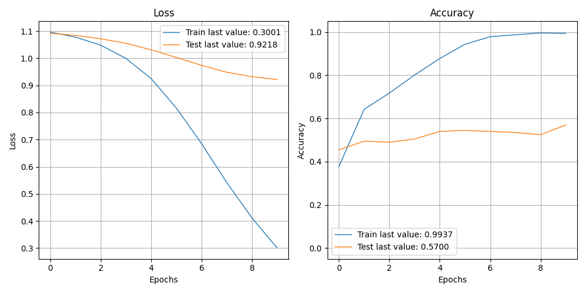

The size of this dataset is 1000.0
              precision    recall  f1-score   support

    Negative       0.31      0.24      0.27        46
    Positive       0.73      0.59      0.65        80
     Neutral       0.55      0.76      0.64        74

    accuracy                           0.57       200
   macro avg       0.53      0.53      0.52       200
weighted avg       0.57      0.57      0.56       200

> 57.000

Showing results for tfidf and basic Model
Training Accuarcy: 0.570
Test Accuracy 0.570
Confidence for each prediction: [[0.28490308 0.4217531  0.2933438 ]
 [0.10082589 0.05076787 0.8484062 ]
 [0.28837737 0.23604664 0.475576  ]
 [0.31032795 0.35055017 0.33912188]
 [0.19784382 0.6585249  0.1436313 ]
 [0.18644251 0.6911694  0.12238814]
 [0.3610733  0.30003977 0.3388869 ]
 [0.09383287 0.04380309 0.862364  ]
 [0.16827829 0.30202785 0.52969384]
 [0.36336914 0.08610252 0.5505283 ]
 [0.18554536 0.55443305 0.2600216 ]
 [0.15002596 0.22719833 0.6227757 ]
 [0.24731427 0.24508087 0.50760484]
 [0.11157902 0.14989413 0.7385269 ]
 [0.357994   0.14329898 0.498707  ]
 [0.21338369 0.06092206 0.7256943 ]
 [0.19591689 0.520366   0.28371713]
 [0.1722064  0.35244203 0.4753515 ]
 [0.2594963  0.4818839  0.25861987]
 [0.3591057  0.3162765  0.32461777]
 [0.2182097  0.5477734  0.23401678]
 [0.17453697 0.68029904 0.145164  ]
 [0.3900333  0.25851727 0.35144943]
 [0.17196049 0.07365438 0.75438505]
 [0.1889545  0.2805192  0.5305263 ]
 [0.08716257 0.08278679 0.83005065]
 [0.46719033 0.2716421  0.2611676 ]
 [0.2909698  0.1601266  0.5489036 ]
 [0.44388062 0.24351884 0.31260055]
 [0.400646   0.27050668 0.32884735]
 [0.2492145  0.23844314 0.51234233]
 [0.4877948  0.18242425 0.32978097]
 [0.15251319 0.5661763  0.28131053]
 [0.11159681 0.82143646 0.06696669]
 [0.45185196 0.2599756  0.28817245]
 [0.3048347  0.28237095 0.41279435]
 [0.14017797 0.23906836 0.62075365]
 [0.17495355 0.4191462  0.40590015]
 [0.17416728 0.609766   0.21606675]
 [0.44370535 0.17383173 0.382463  ]
 [0.6462667  0.11778156 0.23595178]
 [0.19350453 0.30902213 0.4974734 ]
 [0.21953325 0.6650986  0.11536815]
 [0.15477918 0.19776031 0.64746046]
 [0.13994606 0.46895033 0.39110368]
 [0.67613435 0.09861029 0.22525537]
 [0.19147256 0.16776158 0.64076585]
 [0.26847908 0.40241292 0.32910797]
 [0.48068517 0.12638721 0.39292765]
 [0.35126695 0.42560712 0.223126  ]
 [0.16808535 0.27597246 0.5559422 ]
 [0.18413143 0.12917197 0.6866966 ]
 [0.14295165 0.7325925  0.12445585]
 [0.37549004 0.46563178 0.15887815]
 [0.2994828  0.15323168 0.5472855 ]
 [0.16565368 0.73540854 0.09893776]
 [0.220688   0.16427287 0.6150391 ]
 [0.37657613 0.36046723 0.26295665]
 [0.27810326 0.51750743 0.20438932]
 [0.25006    0.12914588 0.6207941 ]
 [0.3967876  0.07638729 0.52682513]
 [0.3882607  0.31380364 0.29793572]
 [0.13035366 0.17383404 0.6958123 ]
 [0.42417854 0.2565358  0.3192857 ]
 [0.19915205 0.39210433 0.4087436 ]
 [0.360187   0.4090402  0.23077281]
 [0.48655227 0.43351063 0.07993702]
 [0.16612534 0.27297443 0.5609002 ]
 [0.548423   0.10226086 0.3493161 ]
 [0.1430389  0.62489396 0.23206712]
 [0.17880031 0.28796247 0.53323716]
 [0.1625725  0.1959159  0.64151156]
 [0.24274139 0.29553843 0.46172017]
 [0.21486595 0.21357809 0.57155603]
 [0.25664783 0.46632466 0.27702752]
 [0.18141975 0.6770585  0.1415218 ]
 [0.18244955 0.34823108 0.4693193 ]
 [0.4809645  0.28715664 0.23187886]
 [0.15738866 0.4198908  0.4227206 ]
 [0.23851764 0.38757598 0.3739063 ]
 [0.30029565 0.24668126 0.45302305]
 [0.3374526  0.09746809 0.56507933]
 [0.26235145 0.36696115 0.3706874 ]
 [0.22776118 0.11067758 0.6615612 ]
 [0.22956444 0.1020006  0.668435  ]
 [0.25680542 0.19560954 0.54758507]
 [0.15357982 0.25444078 0.59197944]
 [0.14411502 0.52362144 0.33226356]
 [0.12410992 0.79097694 0.08491319]
 [0.2195223  0.21151032 0.56896734]
 [0.08792681 0.06120207 0.8508711 ]
 [0.48893362 0.20917468 0.30189162]
 [0.35878527 0.23580678 0.405408  ]
 [0.3676891  0.47598535 0.15632556]
 [0.6942096  0.14078467 0.16500576]
 [0.26582968 0.17399567 0.5601746 ]
 [0.19865373 0.28346565 0.5178806 ]
 [0.24466592 0.18236172 0.57297236]
 [0.16492191 0.480872   0.3542061 ]
 [0.18112251 0.38474575 0.43413174]
 [0.28678426 0.59266025 0.12055551]
 [0.3259491  0.2142566  0.4597943 ]
 [0.39209566 0.12058633 0.4873181 ]
 [0.17193353 0.52977145 0.298295  ]
 [0.18897197 0.5993673  0.2116607 ]
 [0.3788072  0.51758295 0.10360978]
 [0.0919947  0.11370755 0.79429775]
 [0.22985971 0.6419457  0.12819445]
 [0.17477852 0.71422255 0.11099893]
 [0.24124186 0.4499713  0.30878678]
 [0.2134055  0.0752626  0.71133184]
 [0.07949233 0.06239357 0.8581141 ]
 [0.28056386 0.27800366 0.44143245]
 [0.31385124 0.1316194  0.5545293 ]
 [0.37652805 0.3247072  0.2987647 ]
 [0.16325873 0.74160343 0.09513785]
 [0.36570024 0.25719318 0.3771066 ]
 [0.24977738 0.56838125 0.1818414 ]
 [0.26976907 0.3143841  0.4158468 ]
 [0.13837062 0.12396029 0.7376691 ]
 [0.30803734 0.22885549 0.46310726]
 [0.21160343 0.39422104 0.39417556]
 [0.23181191 0.25786892 0.5103191 ]
 [0.37684983 0.25409436 0.36905584]
 [0.17573357 0.36661744 0.457649  ]
 [0.09952122 0.084206   0.8162728 ]
 [0.41059414 0.24181062 0.34759524]
 [0.09964018 0.06496619 0.83539367]
 [0.39606547 0.45786467 0.14606982]
 [0.21242927 0.32770982 0.45986092]
 [0.46151665 0.2225125  0.3159709 ]
 [0.1722719  0.33785185 0.4898762 ]
 [0.14354984 0.64758116 0.20886903]
 [0.19540401 0.45878467 0.34581122]
 [0.32227373 0.22734748 0.45037878]
 [0.14325428 0.12263533 0.7341104 ]
 [0.21615556 0.708726   0.07511841]
 [0.23190783 0.57601863 0.19207355]
 [0.12952569 0.24402644 0.62644786]
 [0.16485235 0.37439865 0.460749  ]
 [0.51117754 0.23615034 0.25267214]
 [0.17652272 0.14581497 0.6776624 ]
 [0.10581554 0.8382225  0.05596197]
 [0.5434796  0.11058952 0.3459309 ]
 [0.31955534 0.24361187 0.43683288]
 [0.22812289 0.27808315 0.493794  ]
 [0.22852458 0.03403509 0.73744035]
 [0.33423176 0.34683126 0.318937  ]
 [0.27902275 0.3328678  0.38810948]
 [0.32995063 0.36413747 0.30591193]
 [0.31214392 0.28050444 0.4073517 ]
 [0.4560776  0.3567646  0.18715782]
 [0.29866928 0.19707476 0.504256  ]
 [0.12553635 0.791965   0.08249868]
 [0.14935714 0.66984737 0.18079548]
 [0.16855511 0.6631656  0.16827929]
 [0.17707312 0.10736784 0.715559  ]
 [0.22894174 0.14076109 0.6302972 ]
 [0.29099208 0.42495504 0.28405294]
 [0.2843297  0.32819518 0.38747513]
 [0.1844156  0.0672846  0.74829984]
 [0.24672043 0.36101213 0.3922675 ]
 [0.3057524  0.4492564  0.24499118]
 [0.37072107 0.36479312 0.26448584]
 [0.31899098 0.31551003 0.3654989 ]
 [0.23549303 0.26778826 0.49671873]
 [0.06286781 0.03092174 0.9062104 ]
 [0.34494725 0.30235064 0.35270208]
 [0.18105085 0.20947404 0.6094751 ]
 [0.12615427 0.77458024 0.09926549]
 [0.34272376 0.09465825 0.562618  ]
 [0.23176624 0.15052317 0.61771053]
 [0.18848598 0.67260253 0.13891147]
 [0.39728007 0.1975352  0.4051847 ]
 [0.09637256 0.0351247  0.86850274]
 [0.3703333  0.09378918 0.53587747]
 [0.17542107 0.6058687  0.21871026]
 [0.19247702 0.46008277 0.34744018]
 [0.25880697 0.33937427 0.40181875]
 [0.42449734 0.18268014 0.39282253]
 [0.45517313 0.32352483 0.221302  ]
 [0.15765077 0.09285308 0.7494961 ]
 [0.3659942  0.2249784  0.40902743]
 [0.3901228  0.34490186 0.26497525]
 [0.05750348 0.03945834 0.9030382 ]
 [0.22570695 0.6991171  0.07517588]
 [0.15515369 0.7575976  0.08724876]
 [0.36619303 0.2946802  0.33912674]
 [0.17188476 0.44743538 0.38067985]
 [0.1666675  0.43277904 0.40055344]
 [0.35387042 0.23579493 0.4103346 ]
 [0.23351438 0.39476475 0.37172088]
 [0.3296153  0.26893958 0.40144515]
 [0.06789979 0.03510861 0.8969916 ]
 [0.5252414  0.07005374 0.40470496]
 [0.2118643  0.5043451  0.28379053]
 [0.8164136  0.04264581 0.14094055]
 [0.5350533  0.33900994 0.12593672]
 [0.1141137  0.73199695 0.15388936]
 [0.24888393 0.2349621  0.51615393]]
[INFO] predicting...
trump russia news story
Confidence for each prediction: [0.21455032 0.25082925 0.5346204 ]
donation organization surge trump order
Confidence for each prediction: [0.21455032 0.25082925 0.5346204 ]
postcard past crossing syria
Confidence for each prediction: [0.21455032 0.25082925 0.5346204 ]
friday mailbag measuring crowd maligning region
Confidence for each prediction: [0.21455032 0.25082925 0.5346204 ]
pendant found nazi death camp ruin may anne frank link
Confidence for each prediction: [0.21455032 0.25082925 0.5346204 ]
trump unreality show echo business past
Confidence for each prediction: [0.21455032 0.25082925 0.5346204 ]
weather apps download store winter
Confidence for each prediction: [0.21455032 0.25082925 0.5346204 ]
emotion pet care help explain human health spending
Confidence for each prediction: [0.21455032 0.25082925 0.5346204 ]
dress like woman mean
Confidence for each prediction: [0.21455032 0.25082925 0.5346204 ]
senate confirmation hearing begin without background check
Confidence for each prediction: [0.21455032 0.25082925 0.5346204 ]
The size of this dataset is 1000.0
