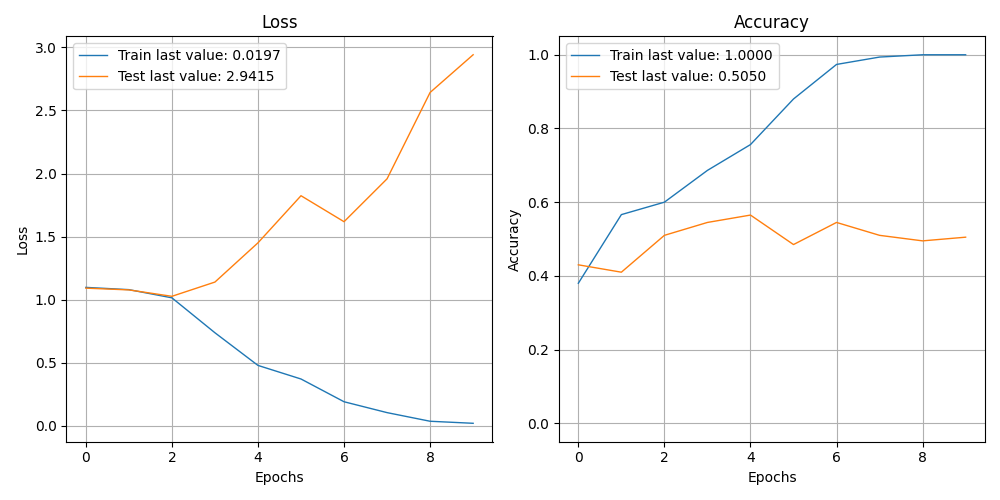

              precision    recall  f1-score   support

    Negative       0.35      0.26      0.30        46
    Positive       0.74      0.40      0.52        80
     Neutral       0.46      0.77      0.58        74

    accuracy                           0.51       200
   macro avg       0.52      0.48      0.47       200
weighted avg       0.55      0.51      0.49       200

> 50.500

Showing results for tfidf and lstm Model
Training Accuarcy: 0.505
Test Accuracy 0.505
Confidence for each prediction: [[1.53626904e-01 4.99308527e-01 3.47064614e-01]
 [2.72366822e-01 7.69487163e-03 7.19938278e-01]
 [2.82365650e-01 2.00587034e-01 5.17047346e-01]
 [1.84251577e-01 2.04032008e-02 7.95345247e-01]
 [2.29019156e-06 4.96100120e-06 9.99992728e-01]
 [6.96375445e-02 4.96419400e-01 4.33943152e-01]
 [5.33930242e-01 1.76383674e-01 2.89686054e-01]
 [4.08929100e-06 1.40911693e-09 9.99995947e-01]
 [6.44388050e-02 2.60452420e-01 6.75108790e-01]
 [3.03213345e-03 4.28915783e-08 9.96967852e-01]
 [2.41573360e-02 8.63950074e-01 1.11892596e-01]
 [1.28209526e-02 2.77789775e-02 9.59400117e-01]
 [5.28244273e-05 1.42750851e-08 9.99947190e-01]
 [4.68609784e-07 3.33589233e-11 9.99999523e-01]
 [2.40945518e-02 8.09119319e-06 9.75897372e-01]
 [4.04348793e-06 3.72030268e-10 9.99995947e-01]
 [1.83362921e-03 9.57545638e-01 4.06207331e-02]
 [7.38474948e-04 6.70397189e-03 9.92557526e-01]
 [6.61761675e-04 9.87548947e-01 1.17892763e-02]
 [9.38170776e-03 7.41044816e-04 9.89877284e-01]
 [5.40063977e-02 1.03342630e-01 8.42650950e-01]
 [4.79485877e-02 2.18538474e-02 9.30197537e-01]
 [1.22052900e-01 6.69568479e-02 8.10990214e-01]
 [2.24134983e-05 3.94380661e-09 9.99977589e-01]
 [1.91249987e-04 2.78338208e-04 9.99530435e-01]
 [4.14391543e-05 1.80015050e-07 9.99958396e-01]
 [3.32160264e-01 2.51275897e-01 4.16563869e-01]
 [8.83467138e-01 2.15254794e-03 1.14380307e-01]
 [9.56542730e-01 1.05568470e-04 4.33517285e-02]
 [4.40347493e-01 5.38182985e-06 5.59647143e-01]
 [9.90929897e-04 1.49471191e-06 9.99007642e-01]
 [2.65023082e-01 5.82583481e-04 7.34394312e-01]
 [3.88780795e-03 6.63187075e-03 9.89480257e-01]
 [7.73993379e-04 9.97433960e-01 1.79207860e-03]
 [4.55674678e-01 4.50419150e-02 4.99283463e-01]
 [1.29161865e-01 2.46174529e-01 6.24663591e-01]
 [8.45337659e-02 1.37047380e-01 7.78418899e-01]
 [3.02876835e-03 6.27284264e-03 9.90698397e-01]
 [1.91197440e-01 5.90609193e-01 2.18193352e-01]
 [9.89754140e-01 1.29875025e-05 1.02328090e-02]
 [9.99586046e-01 6.41202689e-07 4.13400005e-04]
 [3.99506632e-07 6.06204670e-11 9.99999642e-01]
 [6.19927227e-01 1.60528347e-01 2.19544366e-01]
 [8.86884955e-05 7.60480089e-06 9.99903679e-01]
 [9.95031325e-04 6.05366290e-01 3.93638641e-01]
 [9.98762608e-01 2.16928038e-06 1.23532000e-03]
 [1.45639628e-02 1.64872453e-01 8.20563555e-01]
 [5.60646935e-04 3.89566321e-06 9.99435484e-01]
 [9.64765489e-01 6.52813120e-04 3.45817097e-02]
 [3.11452448e-01 1.27822813e-02 6.75765276e-01]
 [3.94926989e-04 3.55665870e-05 9.99569476e-01]
 [1.58508774e-05 3.73392588e-08 9.99984145e-01]
 [1.83758102e-02 9.37692225e-01 4.39319462e-02]
 [1.07669666e-01 5.52269995e-01 3.40060264e-01]
 [1.92307115e-01 1.54895643e-02 7.92203367e-01]
 [1.66144483e-02 9.59680676e-01 2.37048473e-02]
 [9.40821040e-03 9.30492606e-05 9.90498722e-01]
 [8.07688339e-05 4.11736378e-09 9.99919176e-01]
 [1.10293264e-02 9.48046613e-03 9.79490221e-01]
 [9.97608304e-01 7.46495843e-09 2.39173346e-03]
 [7.32283533e-01 1.16242634e-04 2.67600149e-01]
 [1.06646970e-01 3.62096151e-04 8.92990947e-01]
 [3.62679102e-02 7.82377422e-02 8.85494411e-01]
 [5.07763540e-03 9.75998046e-05 9.94824767e-01]
 [2.18604091e-05 4.53632083e-07 9.99977708e-01]
 [1.16856940e-01 3.21564883e-01 5.61578214e-01]
 [9.99570310e-01 4.51786082e-06 4.25129198e-04]
 [1.40917655e-06 4.85056662e-09 9.99998569e-01]
 [2.89322287e-01 9.19134527e-06 7.10668564e-01]
 [4.04593768e-03 9.68098104e-01 2.78559346e-02]
 [1.46663308e-01 4.72022668e-02 8.06134403e-01]
 [1.79212613e-04 5.69231622e-03 9.94128466e-01]
 [2.78267682e-01 5.12422780e-08 7.21732259e-01]
 [3.92653257e-01 1.95108805e-04 6.07151568e-01]
 [4.40764561e-04 1.09759763e-04 9.99449432e-01]
 [1.57529139e-03 9.90986407e-01 7.43821589e-03]
 [8.41422603e-02 1.42373264e-01 7.73484468e-01]
 [4.45781529e-01 1.44367784e-01 4.09850717e-01]
 [3.16717639e-03 9.22447026e-01 7.43857846e-02]
 [6.10457696e-02 8.51273723e-03 9.30441439e-01]
 [1.15472474e-04 6.55053518e-05 9.99819100e-01]
 [4.02049273e-01 2.13391650e-02 5.76611519e-01]
 [1.27696797e-01 2.60615230e-01 6.11688077e-01]
 [2.11241603e-01 9.25251991e-02 6.96233273e-01]
 [2.24344294e-05 2.23837546e-07 9.99977350e-01]
 [9.02568027e-02 7.11991976e-04 9.09031212e-01]
 [6.34531098e-05 7.22821554e-08 9.99936461e-01]
 [9.90828965e-04 9.70890760e-01 2.81183403e-02]
 [4.52163185e-05 9.99346554e-01 6.08124014e-04]
 [1.43971637e-01 2.73399567e-03 8.53294373e-01]
 [8.06803564e-06 1.87512743e-08 9.99991894e-01]
 [9.64374781e-01 2.79900763e-04 3.53453234e-02]
 [8.79139721e-01 2.70330906e-03 1.18156888e-01]
 [6.01989508e-04 9.97537017e-01 1.86102907e-03]
 [9.77131426e-01 3.57294717e-04 2.25112420e-02]
 [5.44490404e-02 3.64514324e-03 9.41905856e-01]
 [2.59055272e-02 3.12016569e-02 9.42892790e-01]
 [2.86012632e-03 2.26992797e-05 9.97117162e-01]
 [3.04833334e-03 9.66357470e-01 3.05941310e-02]
 [1.45021100e-02 1.01420544e-01 8.84077370e-01]
 [1.12726009e-02 9.63829815e-01 2.48976145e-02]
 [4.78410363e-01 7.46877268e-02 4.46901947e-01]
 [3.51792481e-03 1.47808464e-06 9.96480644e-01]
 [2.35119089e-02 2.57905219e-02 9.50697541e-01]
 [2.02210667e-03 7.91412385e-05 9.97898698e-01]
 [2.31013240e-04 9.94408906e-01 5.36006363e-03]
 [1.60196470e-03 2.05724878e-04 9.98192370e-01]
 [1.07178586e-02 9.70976174e-01 1.83059536e-02]
 [1.30110770e-01 7.17374921e-01 1.52514249e-01]
 [5.89640588e-02 4.71218437e-01 4.69817460e-01]
 [5.26278105e-04 6.62272157e-08 9.99473631e-01]
 [8.80694461e-06 9.96491001e-10 9.99991179e-01]
 [1.49657158e-02 3.37698907e-02 9.51264381e-01]
 [7.25776911e-01 6.35739649e-04 2.73587346e-01]
 [6.01212025e-01 7.92211145e-02 3.19566786e-01]
 [8.02702925e-05 9.99414563e-01 5.05166769e-04]
 [1.93366736e-01 2.74701277e-03 8.03886175e-01]
 [1.99525580e-02 2.54115526e-04 9.79793310e-01]
 [6.17414638e-02 9.53263976e-03 9.28725898e-01]
 [6.90080640e-07 1.49380286e-10 9.99999285e-01]
 [2.59889862e-06 1.21437430e-10 9.99997377e-01]
 [2.90500792e-03 9.11042690e-01 8.60523507e-02]
 [3.36673498e-01 1.07266665e-01 5.56059897e-01]
 [7.44894028e-01 3.04798968e-03 2.52057910e-01]
 [3.63366016e-05 3.57634909e-02 9.64200199e-01]
 [1.05273880e-01 5.22458963e-02 8.42480242e-01]
 [5.10380626e-01 1.79842025e-01 3.09777290e-01]
 [5.59446227e-04 6.51689788e-06 9.99434054e-01]
 [3.15751672e-01 4.79359776e-01 2.04888582e-01]
 [3.52347106e-01 8.13425407e-02 5.66310346e-01]
 [4.96594429e-01 1.38201043e-02 4.89585519e-01]
 [2.28100829e-03 8.22310336e-04 9.96896625e-01]
 [3.16240112e-05 9.63189721e-01 3.67787629e-02]
 [1.00371763e-02 8.35565984e-01 1.54396757e-01]
 [6.38159871e-01 2.29370408e-03 3.59546393e-01]
 [2.27373868e-01 1.44052774e-01 6.28573418e-01]
 [9.76660252e-01 1.47097243e-03 2.18688492e-02]
 [1.53339785e-02 7.44670868e-01 2.39995137e-01]
 [7.53726959e-02 2.62432806e-02 8.98384035e-01]
 [1.19083282e-02 1.05075091e-02 9.77584183e-01]
 [9.94748414e-01 2.04712924e-05 5.23102889e-03]
 [4.49952631e-06 8.45061887e-09 9.99995470e-01]
 [1.75812864e-03 9.94747221e-01 3.49468272e-03]
 [1.49618551e-01 2.22131348e-06 8.50379288e-01]
 [3.94439325e-03 4.66314486e-05 9.96008992e-01]
 [7.89078331e-06 1.92827034e-08 9.99992132e-01]
 [8.51879653e-04 8.37522163e-10 9.99148130e-01]
 [3.84984195e-01 3.97756174e-02 5.75240195e-01]
 [8.42005014e-01 7.03660990e-05 1.57924667e-01]
 [9.90800321e-01 3.44878499e-05 9.16513056e-03]
 [8.23469460e-02 3.94560136e-02 8.78197014e-01]
 [2.62887329e-01 8.35531577e-02 6.53559506e-01]
 [9.13536875e-04 4.29574675e-06 9.99082208e-01]
 [7.99636837e-07 9.99971509e-01 2.76794181e-05]
 [2.03988151e-04 8.39592397e-01 1.60203651e-01]
 [4.61988859e-02 8.78897667e-01 7.49033839e-02]
 [3.85284051e-02 9.51590762e-03 9.51955736e-01]
 [7.27702260e-01 3.60359177e-02 2.36261830e-01]
 [1.13540667e-03 6.96687341e-01 3.02177310e-01]
 [2.94354521e-07 2.41596569e-11 9.99999762e-01]
 [2.97278553e-01 8.69486073e-04 7.01851904e-01]
 [3.79635096e-01 9.95718758e-04 6.19369209e-01]
 [6.86777979e-02 2.11026460e-01 7.20295727e-01]
 [4.03329104e-01 1.54153526e-01 4.42517430e-01]
 [3.53140473e-01 6.03298172e-02 5.86529732e-01]
 [2.44665459e-01 2.54998505e-01 5.00335991e-01]
 [3.53540666e-03 3.15521866e-05 9.96433020e-01]
 [5.49026787e-01 4.56088521e-02 4.05364305e-01]
 [2.55751144e-03 6.07679482e-04 9.96834815e-01]
 [1.62283861e-04 9.96733665e-01 3.10399872e-03]
 [2.14343117e-06 2.22514965e-10 9.99997854e-01]
 [4.72229440e-03 2.98312217e-01 6.96965456e-01]
 [3.19766290e-02 8.52282465e-01 1.15740851e-01]
 [1.94974933e-02 2.59110152e-06 9.80499864e-01]
 [2.08041706e-06 8.34738459e-11 9.99997973e-01]
 [3.71953115e-06 5.17239376e-11 9.99996305e-01]
 [2.80563574e-04 9.96371865e-01 3.34756426e-03]
 [3.14792879e-02 6.30270958e-01 3.38249773e-01]
 [1.40102267e-01 6.33062571e-02 7.96591401e-01]
 [2.05378577e-01 4.94766716e-08 7.94621348e-01]
 [8.89193118e-01 1.07006645e-02 1.00106157e-01]
 [1.78068459e-01 6.48449808e-02 7.57086515e-01]
 [6.91244900e-01 5.73108019e-03 3.03023994e-01]
 [8.52534175e-02 7.44556665e-01 1.70189887e-01]
 [1.33128371e-02 5.63134551e-02 9.30373788e-01]
 [1.91395476e-01 6.88528538e-01 1.20075986e-01]
 [5.39822668e-06 9.99970675e-01 2.39677302e-05]
 [9.99877095e-01 8.46186410e-08 1.22771933e-04]
 [3.39529030e-02 5.38311243e-01 4.27735835e-01]
 [2.07892549e-03 4.01534373e-03 9.93905723e-01]
 [2.63574248e-06 1.75987569e-09 9.99997377e-01]
 [2.33253031e-05 6.35208853e-05 9.99913096e-01]
 [5.83312358e-04 1.73058972e-01 8.26357663e-01]
 [5.58453337e-07 9.57623494e-11 9.99999404e-01]
 [9.98408020e-01 2.81854477e-06 1.58918498e-03]
 [6.49899477e-04 1.58668924e-02 9.83483195e-01]
 [9.48446393e-01 1.13453716e-03 5.04190177e-02]
 [4.69265491e-01 3.35920841e-01 1.94813639e-01]
 [1.96716022e-02 8.49450231e-01 1.30878136e-01]
 [5.74996360e-02 2.92273093e-04 9.42208111e-01]]
[INFO] predicting...
