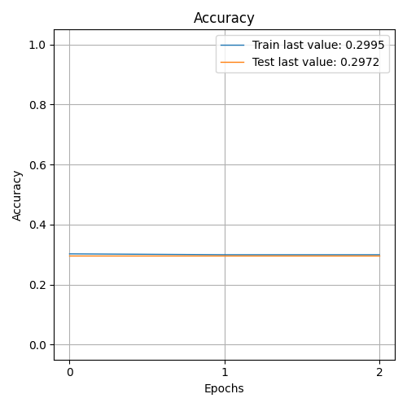

The size of this dataset is 142570.0

              precision    recall  f1-score   support

    Negative       0.30      1.00      0.46      8473
    Positive       0.00      0.00      0.00     10928
     Neutral       0.00      0.00      0.00      9113

    accuracy                           0.30     28514
   macro avg       0.10      0.33      0.15     28514
weighted avg       0.09      0.30      0.14     28514

> 29.715

Showing results for tfidf and basic Model
Training Accuarcy: 0.297
Test Accuracy 0.297
Confidence for each prediction: [[nan nan nan]
 [nan nan nan]
 [nan nan nan]
 ...
 [nan nan nan]
 [nan nan nan]
 [nan nan nan]]
[INFO] predicting...
possible hack phone sound wave researcher show
Confidence for each prediction: [nan nan nan]
politically correct school official reject gifted talented label student
Confidence for each prediction: [nan nan nan]
clinton sander use primary frame long battle come
Confidence for each prediction: [nan nan nan]
ambitious democrat make trump university explode
Confidence for each prediction: [nan nan nan]
people slamming tribeca film festival screening anti vaccine activist documentary
Confidence for each prediction: [nan nan nan]
kobe bryant sucker punched
Confidence for each prediction: [nan nan nan]
current tally least hillary clinton email classified material
Confidence for each prediction: [nan nan nan]
yankee avoid humiliation steal win one hit escape
Confidence for each prediction: [nan nan nan]
fifth ave gop
Confidence for each prediction: [nan nan nan]
saudi arabia russia sign oil pact may limit output future
Confidence for each prediction: [nan nan nan]
