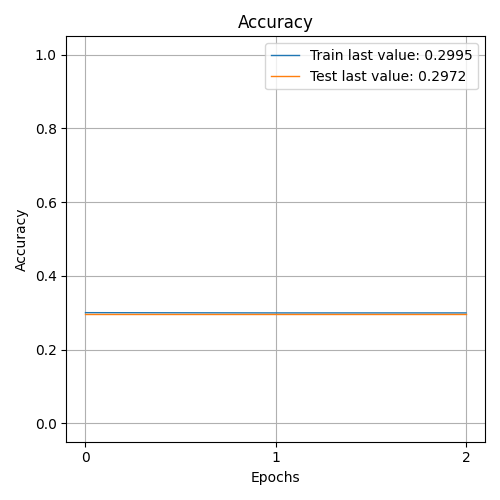

              precision    recall  f1-score   support

    Negative       0.30      1.00      0.46      8473
    Positive       0.00      0.00      0.00     10928
     Neutral       0.00      0.00      0.00      9113

    accuracy                           0.30     28514
   macro avg       0.10      0.33      0.15     28514
weighted avg       0.09      0.30      0.14     28514

> 29.715

Showing results for tfidf and basic Model
Training Accuarcy: 0.297
Test Accuracy 0.297
Confidence for each prediction: [[nan nan nan]
 [nan nan nan]
 [nan nan nan]
 ...
 [nan nan nan]
 [nan nan nan]
 [nan nan nan]]
[INFO] predicting...
