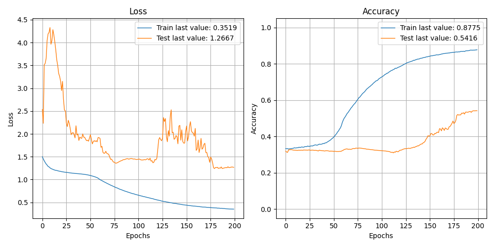

The size of this dataset is 142570.0

              precision    recall  f1-score   support

    Negative       0.63      0.71      0.67      8473
    Positive       1.00      0.04      0.09     10928
     Neutral       0.48      0.98      0.65      9113

    accuracy                           0.54     28514
   macro avg       0.70      0.58      0.47     28514
weighted avg       0.72      0.54      0.44     28514

> 54.156

Showing results for tfidf and cnn Model
Training Accuarcy: 0.542
Test Accuracy 0.542
Confidence for each prediction: [[0.14034928 0.08011845 0.7795323 ]
 [0.36362824 0.00317537 0.63319635]
 [0.6223886  0.02262085 0.3549905 ]
 ...
 [0.3238857  0.11981913 0.55629516]
 [0.7284785  0.00696068 0.26456088]
 [0.04811847 0.00194122 0.94994026]]
[INFO] predicting...
possible hack phone sound wave researcher show
Confidence for each prediction: [0.543351   0.00667422 0.44997475]
politically correct school official reject gifted talented label student
Confidence for each prediction: [0.543351   0.00667422 0.44997475]
clinton sander use primary frame long battle come
Confidence for each prediction: [0.543351   0.00667422 0.44997475]
ambitious democrat make trump university explode
Confidence for each prediction: [0.543351   0.00667422 0.44997475]
people slamming tribeca film festival screening anti vaccine activist documentary
Confidence for each prediction: [0.543351   0.00667422 0.44997475]
kobe bryant sucker punched
Confidence for each prediction: [0.543351   0.00667422 0.44997475]
current tally least hillary clinton email classified material
Confidence for each prediction: [0.543351   0.00667422 0.44997475]
yankee avoid humiliation steal win one hit escape
Confidence for each prediction: [0.543351   0.00667422 0.44997475]
fifth ave gop
Confidence for each prediction: [0.543351   0.00667422 0.4499748 ]
saudi arabia russia sign oil pact may limit output future
Confidence for each prediction: [0.543351   0.00667422 0.44997475]
