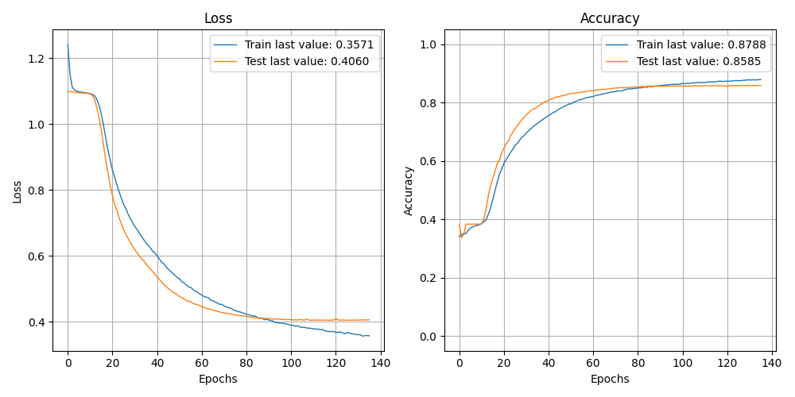

              precision    recall  f1-score   support

    Negative       0.83      0.75      0.79      8473
    Positive       0.88      0.91      0.89     10928
     Neutral       0.85      0.90      0.88      9113

    accuracy                           0.86     28514
   macro avg       0.86      0.85      0.85     28514
weighted avg       0.86      0.86      0.86     28514

> 85.849

Showing results for tfidf and bilstm Model
Training Accuarcy: 0.858
Test Accuracy 0.858
Confidence for each prediction: [[0.00235201 0.9938851  0.00376289]
 [0.06650173 0.00262766 0.93087065]
 [0.36101243 0.62201995 0.01696767]
 ...
 [0.01543407 0.9811839  0.00338205]
 [0.9307689  0.03284431 0.03638676]
 [0.06036928 0.15631181 0.78331894]]
[INFO] predicting...
