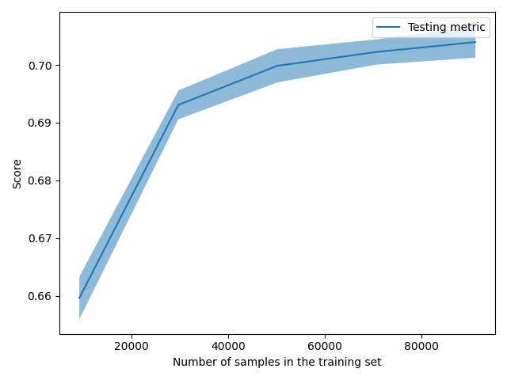

The size of this dataset is 142570.0

Showing results for tfidf and log Model
Training Accuarcy: 0.710
Test Accuracy 0.704
              precision    recall  f1-score   support

    Negative       0.58      0.75      0.65      8473
    Positive       0.80      0.67      0.73     10928
     Neutral       0.77      0.70      0.73      9113

    accuracy                           0.70     28514
   macro avg       0.72      0.71      0.70     28514
weighted avg       0.72      0.70      0.71     28514

Confidence for each prediction: [[0.00464579 0.98097311 0.0143811 ]
 [0.19662636 0.74534396 0.05802969]
 [0.37366326 0.48602324 0.1403135 ]
 ...
 [0.65305107 0.20609491 0.14085402]
 [0.65924738 0.13113032 0.2096223 ]
 [0.01392535 0.96318408 0.02289057]]
[INFO] predicting...
possible hack phone sound wave researcher show
