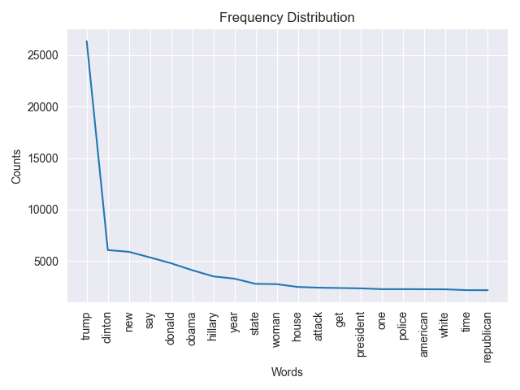
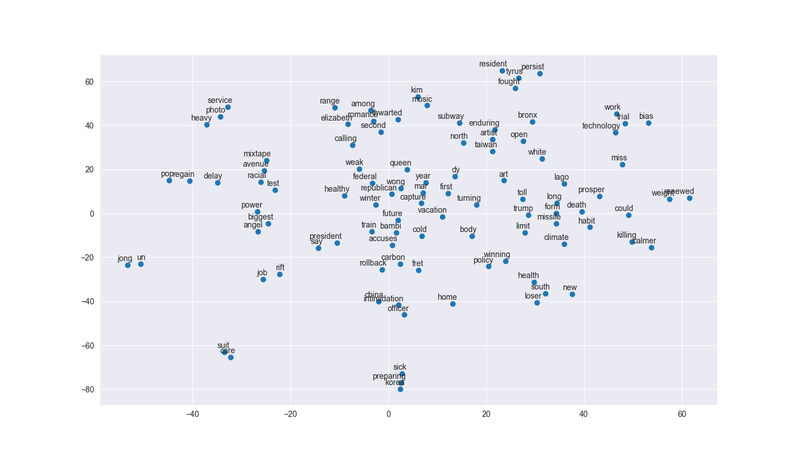

The size of this dataset is 142570.0
Number of unique words: 36575

Sample word2idx: [('house', 0), ('republican', 1), ('fret', 2), ('winning', 3), ('health', 4), ('care', 5), ('suit', 6), ('rift', 7), ('officer', 8), ('resident', 9)]

Sample idx2word: [(0, 'house'), (1, 'republican'), (2, 'fret'), (3, 'winning'), (4, 'health'), (5, 'care'), (6, 'suit'), (7, 'rift'), (8, 'officer'), (9, 'resident')]

Sample sents_as_id: [[0, 1, 2, 3, 4, 5, 6], [7, 8, 9, 10, 11, 12, 13], [14, 15, 16, 17, 18, 19, 20, 21], [22, 23, 24, 25, 26, 27], [28, 29, 30, 31, 32, 33, 34, 35, 36, 37, 38], [39, 40, 41, 42, 43, 44, 45, 46], [47, 48, 49, 50, 51, 52], [53, 54, 55, 56, 57, 58], [59, 60, 61], [62, 63, 64, 65, 66]]

{'death': ['crutcher', 'madaya', 'charleston', 'earthquake', 'brutal', 'vicious', 'jumping', 'family', 'orleans', 'quake'], 'life': ['acknowledges', 'mold', 'gentrifying', 'searching', 'genital', 'dilemma', 'tory', 'primarily', 'dreamless', 'femme'], 'good': ['eternal', 'conservatism', 'way', 'biopic', 'hammer', 'rory', 'filter', 'fracturing', 'critique', 'lotto'], 'bad': ['typical', 'jonbenét', 'kanté', 'higgs', 'showering', 'refreeze', 'nader', 'bang', 'lb', 'joanne'], 'man': ['allegedly', 'jaffa', 'tulsa', 'hyena', 'skydiver', 'trash', 'bangalore', 'bystander', 'stepson', 'suspect'], 'woman': ['gym', 'microbeads', 'slims', 'bam', 'tit', 'punched', 'picasso', 'probe', 'oppresses', 'unconscious'], 'happy': ['cher', 'deadpool', 'mcqueen', 'wonderland', 'ghostbusters', 'tribute', 'shortsighted', 'lawrence', 'television', 'origin'], 'unhappy': ['reconsider', 'corzine', 'caving', 'smacking', 'unmitigated', 'disparate', 'wiping', 'secy', 'warmed', 'b—and'], 'obama': ['barack', 'shifted', 'policy', 'attend', 'grassley', 'rousey', 'administration', 'hiroshima', 'stayed', 'obamatrade'], 'trump': ['predictor', 'nationalism', 'homecoming', 'gasoline', 'mph', 'airstream', 'chameleon', 'remix', 'hospitalized', 'catchy'], 'book': ['siriusxm', 'album', 'retirement', 'mann', 'board', 'walton', 'oscarssowhite', 'faculty', 'co', 'adelson'], 'school': ['student', 'satanic', 'scapegoat', 'disability', 'yale', 'teacher', 'campus', 'quadruplet', 'twelve', 'tiffany'], 'sex': ['sexually', 'disorder', 'transplant', 'dna', 'abuse', 'kissing', 'inspire', 'poker', 'hyena', 'frugality'], 'apple': ['iphone', 'revenue', 'hindering', 'software', 'earbuds', 'qualcomm', 'bolster', 'oracle', 'workforce', 'wireless'], 'movie': ['batman', 'trailer', 'dyke', 'composer', 'creative', 'yuja', 'comic', 'song', 'superheroes', 'wbgo'], 'university': ['campus', 'professor', 'satanic', 'satanist', 'student', 'abuse', 'glorification', 'retweets', 'sprayed', 'mistakenly'], 'london': ['terror', 'swimwear', 'collude', 'kubrick', 'masood', 'vile', 'relentless', 'cleaver', 'transgender', 'heathrow'], 'russia': ['russian', 'ukraine', 'sanction', 'ceasefire', 'spy', 'bashar', 'treaty', 'picking', 'installed', 'missile'], 'army': ['civilian', 'ite', 'fighter', 'seal', 'navy', 'tribal', 'warplane', 'squadron', 'shi', 'lumber'], 'feminism': ['ghostbusters', 'thrilling', 'wright', 'winslet', 'rushdie', 'rihanna', 'segregationist', 'reinvigorated', 'poser', 'kung'], 'girl': ['boko', 'boy', 'schoolgirl', 'haram', 'nigerian', 'parking', 'chibok', 'cameroon', 'reunited', 'eco'], 'boy': ['mother', 'stripper', 'girl', 'pirate', 'sportswriter', 'tribeca', 'ankle', 'hopeful', 'gorilla', 'parent']}

