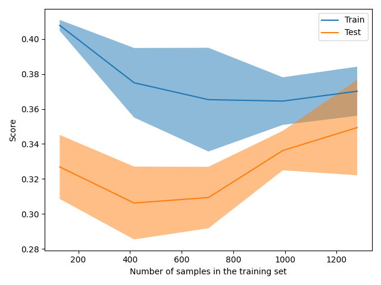

The size of this dataset is 2000.0

Showing results for w2v and log Model
Training Accuarcy: 0.373
Test Accuracy 0.385
              precision    recall  f1-score   support

    Negative       0.32      0.29      0.30       115
    Positive       0.43      0.40      0.41       145
     Neutral       0.39      0.45      0.42       140

    accuracy                           0.38       400
   macro avg       0.38      0.38      0.38       400
weighted avg       0.38      0.39      0.38       400

Confidence for each prediction: [[0.33342062 0.33335472 0.33322466]
 [0.33380971 0.33361606 0.33257424]
 [0.33279731 0.33319965 0.33400303]
 ...
 [0.33388883 0.33368259 0.33242858]
 [0.33312294 0.33277396 0.3341031 ]
 [0.33424599 0.33261674 0.33313727]]
[INFO] predicting...
gorsuch conservative activist see test case reshaping judiciary
