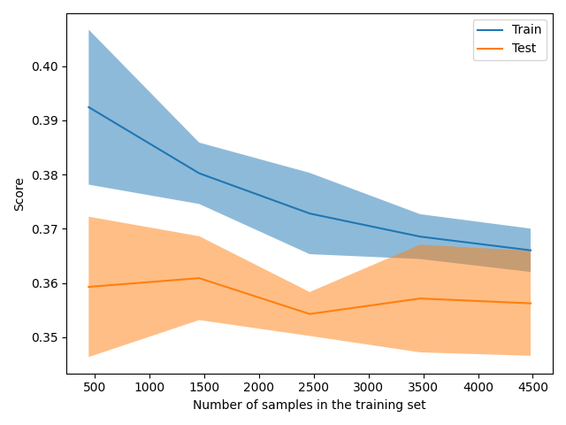

The size of this dataset is 7000.0

Showing results for w2v and log Model
Training Accuarcy: 0.366
Test Accuracy 0.341
              precision    recall  f1-score   support

    Negative       0.31      0.49      0.38       409
    Positive       0.39      0.40      0.40       526
     Neutral       0.31      0.14      0.20       465

    accuracy                           0.34      1400
   macro avg       0.34      0.34      0.32      1400
weighted avg       0.34      0.34      0.32      1400

Confidence for each prediction: [[0.3292805  0.33300177 0.33771773]
 [0.39591913 0.29635977 0.3077211 ]
 [0.33284969 0.33232073 0.33482959]
 ...
 [0.35720075 0.31771422 0.32508502]
 [0.27569402 0.37337196 0.35093402]
 [0.31561146 0.33983212 0.34455642]]
[INFO] predicting...
christmas reveler leave ton trash australian beach
Confidence for each prediction: 0
bernie sander refuse concede nomination hillary clinton
Confidence for each prediction: 0
russian agent killed lawmaker kiev ukraine official say
Confidence for each prediction: 0
snow act magical balm anxious turkey
Confidence for each prediction: 0
peter thiel donate million support donald trump
Confidence for each prediction: 0
colbert character convention
Confidence for each prediction: 0
lest forget spent time doping wilderness
Confidence for each prediction: 0
ford move cited victory trump effect job
Confidence for each prediction: 0
despite cancer diagnosis husband death keeping positive outlook
Confidence for each prediction: 0
question melania trump speech set finger pointing
Confidence for each prediction: 0
