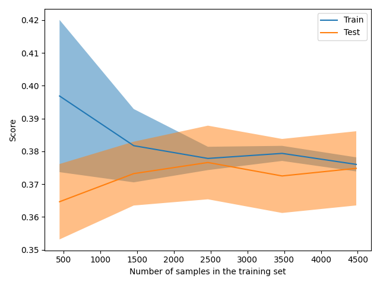

Showing results for w2v and log Model
Training Accuarcy: 0.373
Test Accuracy 0.367
              precision    recall  f1-score   support

    Negative       0.34      0.54      0.42       409
    Positive       0.40      0.45      0.43       526
     Neutral       0.33      0.13      0.18       465

    accuracy                           0.37      1400
   macro avg       0.36      0.37      0.34      1400
weighted avg       0.36      0.37      0.34      1400

Confidence for each prediction: [[0.30615795 0.35212706 0.34171499]
 [0.37982477 0.29527582 0.32489941]
 [0.33889735 0.32135871 0.33974394]
 ...
 [0.44597054 0.24077898 0.31325049]
 [0.26020467 0.38996958 0.34982575]
 [0.29547567 0.36627233 0.338252  ]]
[INFO] predicting...
christmas reveler leave ton trash australian beach
