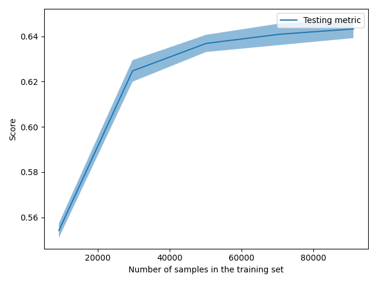

Showing results for count and svm Model
Training Accuarcy: 0.704
Test Accuracy 0.700
              precision    recall  f1-score   support

    Negative       0.58      0.72      0.64      8473
    Positive       0.80      0.67      0.73     10928
     Neutral       0.75      0.71      0.73      9113

    accuracy                           0.70     28514
   macro avg       0.71      0.70      0.70     28514
weighted avg       0.72      0.70      0.70     28514

Confidence for each prediction: [[0.00000000e+000 1.00000000e+000 7.78816077e-308]
 [0.00000000e+000 1.00000000e+000 6.84353143e-092]
 [1.10786210e-014 2.18010703e-004 9.99781989e-001]
 ...
 [1.00000000e+000 4.06990591e-059 1.17253987e-151]
 [1.00000000e+000 2.49106858e-112 2.08146124e-089]
 [0.00000000e+000 1.00000000e+000 4.97549200e-173]]
[INFO] predicting...
