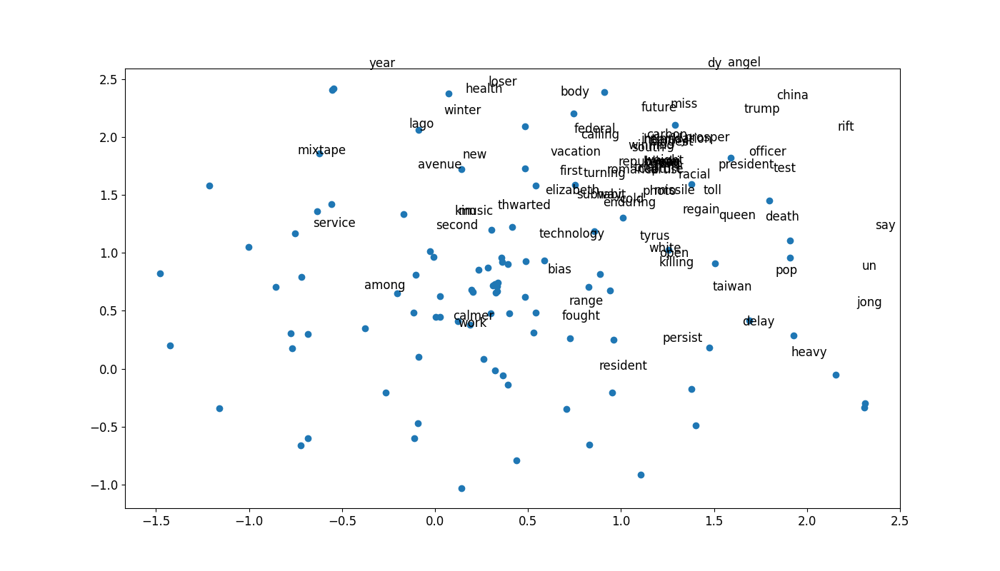

{'death': ['crutcher', 'madaya', 'charleston', 'earthquake', 'brutal', 'vicious', 'jumping', 'family', 'orleans', 'quake'], 'life': ['acknowledges', 'mold', 'gentrifying', 'searching', 'genital', 'dilemma', 'tory', 'primarily', 'dreamless', 'femme'], 'good': ['eternal', 'conservatism', 'way', 'biopic', 'hammer', 'rory', 'filter', 'fracturing', 'critique', 'lotto'], 'bad': ['typical', 'jonbenét', 'kanté', 'higgs', 'showering', 'refreeze', 'nader', 'bang', 'lb', 'joanne'], 'man': ['allegedly', 'jaffa', 'tulsa', 'hyena', 'skydiver', 'trash', 'bangalore', 'bystander', 'stepson', 'suspect'], 'woman': ['gym', 'microbeads', 'slims', 'bam', 'tit', 'punched', 'picasso', 'probe', 'oppresses', 'unconscious'], 'happy': ['cher', 'deadpool', 'mcqueen', 'wonderland', 'ghostbusters', 'tribute', 'shortsighted', 'lawrence', 'television', 'origin'], 'unhappy': ['reconsider', 'corzine', 'caving', 'smacking', 'unmitigated', 'disparate', 'wiping', 'secy', 'warmed', 'b—and'], 'obama': ['barack', 'shifted', 'policy', 'attend', 'grassley', 'rousey', 'administration', 'hiroshima', 'stayed', 'obamatrade'], 'trump': ['predictor', 'nationalism', 'homecoming', 'gasoline', 'mph', 'airstream', 'chameleon', 'remix', 'hospitalized', 'catchy'], 'book': ['siriusxm', 'album', 'retirement', 'mann', 'board', 'walton', 'oscarssowhite', 'faculty', 'co', 'adelson'], 'school': ['student', 'satanic', 'scapegoat', 'disability', 'yale', 'teacher', 'campus', 'quadruplet', 'twelve', 'tiffany'], 'sex': ['sexually', 'disorder', 'transplant', 'dna', 'abuse', 'kissing', 'inspire', 'poker', 'hyena', 'frugality'], 'apple': ['iphone', 'revenue', 'hindering', 'software', 'earbuds', 'qualcomm', 'bolster', 'oracle', 'workforce', 'wireless'], 'movie': ['batman', 'trailer', 'dyke', 'composer', 'creative', 'yuja', 'comic', 'song', 'superheroes', 'wbgo'], 'university': ['campus', 'professor', 'satanic', 'satanist', 'student', 'abuse', 'glorification', 'retweets', 'sprayed', 'mistakenly'], 'london': ['terror', 'swimwear', 'collude', 'kubrick', 'masood', 'vile', 'relentless', 'cleaver', 'transgender', 'heathrow'], 'russia': ['russian', 'ukraine', 'sanction', 'ceasefire', 'spy', 'bashar', 'treaty', 'picking', 'installed', 'missile'], 'army': ['civilian', 'ite', 'fighter', 'seal', 'navy', 'tribal', 'warplane', 'squadron', 'shi', 'lumber'], 'feminism': ['ghostbusters', 'thrilling', 'wright', 'winslet', 'rushdie', 'rihanna', 'segregationist', 'reinvigorated', 'poser', 'kung'], 'girl': ['boko', 'boy', 'schoolgirl', 'haram', 'nigerian', 'parking', 'chibok', 'cameroon', 'reunited', 'eco'], 'boy': ['mother', 'stripper', 'girl', 'pirate', 'sportswriter', 'tribeca', 'ankle', 'hopeful', 'gorilla', 'parent'], 'kim': ['jong', 'tsang', 'nam', 'kardashian', 'lived', 'toxin', 'sister', 'assassin', 'kooky', 'auction'], 'music': ['pop', 'ghostbusters', 'villa', 'photographer', 'corinne', 'opera', 'crawford', 'hijab', 'artist', 'towards'], 'woke': ['photobombs', 'chauffeur', 'lovely', 'unsellable', 'syracuse', 'included', 'winslet', 'dunst', 'smoky', 'ledecky'], 'attack': ['mosque', 'burkina', 'terrorist', 'victim', 'terror', 'aqap', 'akbar', 'faso', 'martyrdom', 'massacre'], 'terror': ['islamist', 'attacker', 'jihad', 'attack', 'flex', 'detains', 'terrorist', 'assailant', 'emirate', 'backlog'], 'christian': ['armenian', 'affiliate', 'cathedral', 'condemns', 'manbij', 'sharif', 'iftar', 'province', 'islamist', 'egypt'], 'muslim': ['islamist', 'mattress', 'hate', 'shiite', 'warming’hellish', 'condemns', 'cologne', 'ecuadorian', 'mogul', 'exhausted'], 'modern': ['infinite', 'marry', 'fuel', 'faux', 'klimt', 'playground', 'dicey', 'lyricist', 'crab', 'sky'], 'art': ['scoop', 'paulson', 'graffiti', 'pizza', 'delicious', 'learned', 'marvel', 'circle', 'foremost', 'xx'], 'election': ['presidential', 'macron', 'contracted', 'derek', 'butt', 'outcome', 'centrist', 'artan', 'played', 'latin'], 'bias': ['funding', 'execution', 'kirsten', 'religious', 'condom', 'viewed', 'waymo', 'product', 'fails', 'rehash'], 'ai': ['borrower', 'drag', 'penthouse', 'mimic', 'scribe', 'boating', 'amplify', 'iggy', 'arundhati', 'stringent']}

[INFO] predicting...
