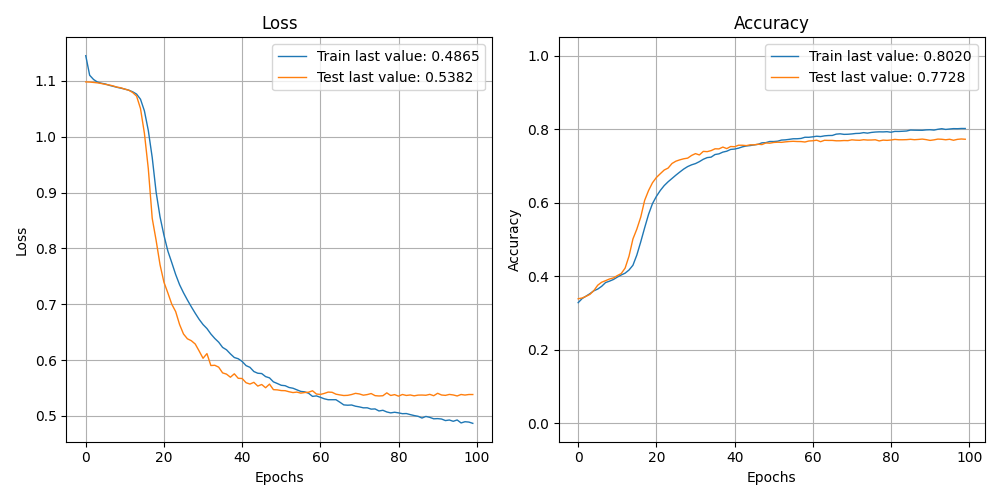

The size of this dataset is 100000.0

              precision    recall  f1-score   support

    Negative       0.59      0.62      0.61      5374
    Positive       0.84      0.82      0.83      6439
     Neutral       0.85      0.83      0.84      8187

    accuracy                           0.77     20000
   macro avg       0.76      0.76      0.76     20000
weighted avg       0.78      0.77      0.77     20000

> 77.275

Showing results for tfidf and rnn Model using articles
Training Accuarcy: 0.773
Test Accuracy 0.773
Confidence for each prediction: [[0.5147003  0.04401994 0.44127977]
 [0.10335812 0.8898835  0.00675837]
 [0.36476636 0.03087247 0.6043612 ]
 ...
 [0.66717243 0.13022651 0.20260109]
 [0.28373483 0.01663646 0.6996287 ]
 [0.484602   0.06858853 0.44680953]]
[INFO] predicting...
aba decides against community broadcasting licence
[0.71289706 0.14502306 0.14207985]
[[0.71289706 0.14502306 0.14207985]
 [0.7209864  0.12986585 0.14914766]
 [0.71289706 0.14502306 0.14207985]
 [0.7330934  0.138435   0.12847158]
 [0.7134515  0.14706345 0.13948505]
 [0.72206926 0.1398     0.13813078]
 [0.70113015 0.15123749 0.14763238]
 [0.71547884 0.13883188 0.14568926]
 [0.7134515  0.14706345 0.13948505]
 [0.72206926 0.1398     0.13813078]
 [0.71182686 0.15122688 0.1369463 ]
 [0.7330934  0.138435   0.12847158]
 [0.71289706 0.14502306 0.14207985]
 [0.6986685  0.14697182 0.15435977]
 [0.71289706 0.14502306 0.14207985]
 [0.71547884 0.13883188 0.14568926]
 [0.7268748  0.13566919 0.13745597]
 [0.71182686 0.15122688 0.1369463 ]
 [0.7162417  0.1734109  0.1103474 ]
 [0.7330934  0.138435   0.12847158]
 [0.70113015 0.15123749 0.14763238]
 [0.7282425  0.15524854 0.11650895]
 [0.7051403  0.14127792 0.15358172]
 [0.7051403  0.14127792 0.15358172]
 [0.7366148  0.13570125 0.12768392]
 [0.7268748  0.13566919 0.13745597]
 [0.71547884 0.13883188 0.14568926]
 [0.7162417  0.1734109  0.1103474 ]
 [0.6870976  0.18982887 0.12307353]
 [0.7330934  0.138435   0.12847158]
 [0.7209864  0.12986585 0.14914766]
 [0.725832   0.12994839 0.1442196 ]
 [0.7282425  0.15524854 0.11650895]
 [0.71289706 0.14502306 0.14207985]
 [0.7134515  0.14706345 0.13948505]
 [0.70113015 0.15123749 0.14763238]
 [0.71289706 0.14502306 0.14207985]
 [0.71182686 0.15122688 0.1369463 ]
 [0.7162417  0.1734109  0.1103474 ]
 [0.71547884 0.13883188 0.14568926]
 [0.7268748  0.13566919 0.13745597]
 [0.6986685  0.14697182 0.15435977]
 [0.7330934  0.138435   0.12847158]
 [0.7234602  0.14526534 0.13127445]
 [0.71547884 0.13883188 0.14568926]
 [0.70113015 0.15123749 0.14763238]
 [0.72206926 0.1398     0.13813078]
 [0.7268748  0.13566919 0.13745597]
 [0.70113015 0.15123749 0.14763238]
 [0.72206926 0.1398     0.13813078]]
0
Negative
act fire witnesses must be aware of defamation
[0.71289706 0.14502306 0.14207985]
[[0.71289706 0.14502306 0.14207985]
 [0.70113015 0.15123749 0.14763238]
 [0.7162417  0.1734109  0.1103474 ]
 [0.7330934  0.138435   0.12847158]
 [0.68248963 0.14417513 0.17333527]
 [0.71547884 0.13883188 0.14568926]
 [0.725832   0.12994839 0.1442196 ]
 [0.72206926 0.1398     0.13813078]
 [0.7330934  0.138435   0.12847158]
 [0.6833289  0.13034318 0.1863279 ]
 [0.71547884 0.13883188 0.14568926]
 [0.7162417  0.1734109  0.1103474 ]
 [0.7268748  0.13566919 0.13745597]
 [0.72206926 0.1398     0.13813078]
 [0.71182686 0.15122688 0.1369463 ]
 [0.71182686 0.15122688 0.1369463 ]
 [0.72206926 0.1398     0.13813078]
 [0.71182686 0.15122688 0.1369463 ]
 [0.7330934  0.138435   0.12847158]
 [0.7051403  0.14127792 0.15358172]
 [0.7366148  0.13570125 0.12768392]
 [0.71182686 0.15122688 0.1369463 ]
 [0.7162417  0.1734109  0.1103474 ]
 [0.7330934  0.138435   0.12847158]
 [0.7209864  0.12986585 0.14914766]
 [0.72206926 0.1398     0.13813078]
 [0.7330934  0.138435   0.12847158]
 [0.71289706 0.14502306 0.14207985]
 [0.6833289  0.13034318 0.1863279 ]
 [0.71289706 0.14502306 0.14207985]
 [0.725832   0.12994839 0.1442196 ]
 [0.72206926 0.1398     0.13813078]
 [0.7330934  0.13843499 0.12847161]
 [0.7282425  0.15524854 0.11650895]
 [0.6824896  0.14417511 0.17333528]
 [0.7330934  0.13843499 0.12847161]
 [0.7134515  0.1470634  0.13948505]
 [0.72206926 0.13979997 0.13813078]
 [0.6824896  0.14417511 0.17333528]
 [0.71289706 0.14502305 0.14207985]
 [0.7051403  0.14127794 0.15358177]
 [0.71289706 0.14502305 0.14207985]
 [0.7162417  0.17341088 0.11034736]
 [0.71547884 0.13883191 0.1456893 ]
 [0.7282425  0.15524854 0.11650895]
 [0.7268749  0.13566916 0.13745594]]
0
Negative
a g calls for infrastructure protection summit
[0.71289706 0.14502306 0.14207985]
[[0.71289706 0.14502306 0.14207985]
 [0.7330934  0.138435   0.12847158]
 [0.6986685  0.14697182 0.15435977]
 [0.7330934  0.138435   0.12847158]
 [0.70113015 0.15123749 0.14763238]
 [0.71289706 0.14502306 0.14207985]
 [0.7234602  0.14526534 0.13127445]
 [0.7234602  0.14526534 0.13127445]
 [0.71182686 0.15122688 0.1369463 ]
 [0.7330934  0.138435   0.12847158]
 [0.68248963 0.14417513 0.17333527]
 [0.7282425  0.15524854 0.11650895]
 [0.725832   0.12994839 0.1442196 ]
 [0.7330934  0.138435   0.12847158]
 [0.71547884 0.13883188 0.14568926]
 [0.7268748  0.13566919 0.13745597]
 [0.68248963 0.14417513 0.17333527]
 [0.725832   0.12994839 0.1442196 ]
 [0.71289706 0.14502306 0.14207985]
 [0.71182686 0.15122688 0.1369463 ]
 [0.7162417  0.1734109  0.1103474 ]
 [0.725832   0.12994839 0.1442196 ]
 [0.7366148  0.13570125 0.12768392]
 [0.70113015 0.15123749 0.14763238]
 [0.7162417  0.1734109  0.1103474 ]
 [0.7366148  0.13570125 0.12768392]
 [0.725832   0.12994839 0.1442196 ]
 [0.72206926 0.1398     0.13813078]
 [0.7330934  0.138435   0.12847158]
 [0.7247197  0.14755808 0.12772223]
 [0.725832   0.12994839 0.1442196 ]
 [0.7282425  0.15524854 0.11650895]
 [0.7162417  0.17341088 0.11034736]
 [0.72206926 0.13979997 0.13813078]
 [0.7011301  0.15123749 0.1476324 ]
 [0.7162417  0.17341088 0.11034736]
 [0.71547884 0.13883191 0.1456893 ]
 [0.7282425  0.15524854 0.11650895]
 [0.7268749  0.13566916 0.13745594]
 [0.7330934  0.13843499 0.12847161]
 [0.71182674 0.15122691 0.13694632]
 [0.7366148  0.13570125 0.12768392]
 [0.7051403  0.14127794 0.15358177]
 [0.7051403  0.14127794 0.15358177]
 [0.71547884 0.13883191 0.1456893 ]
 [0.7162417  0.17341088 0.11034736]]
0
Negative
air nz staff in aust strike for pay rise
[0.71289706 0.14502306 0.14207985]
[[0.71289706 0.14502306 0.14207985]
 [0.71547884 0.13883188 0.14568926]
 [0.725832   0.12994839 0.1442196 ]
 [0.7330934  0.138435   0.12847158]
 [0.7268748  0.13566919 0.13745597]
 [0.7064072  0.14976247 0.14383031]
 [0.7330934  0.138435   0.12847158]
 [0.71182686 0.15122688 0.1369463 ]
 [0.7162417  0.1734109  0.1103474 ]
 [0.71289706 0.14502306 0.14207985]
 [0.68248963 0.14417513 0.17333527]
 [0.68248963 0.14417513 0.17333527]
 [0.7330934  0.138435   0.12847158]
 [0.71547884 0.13883188 0.14568926]
 [0.7268748  0.13566919 0.13745597]
 [0.7330934  0.138435   0.12847158]
 [0.71289706 0.14502306 0.14207985]
 [0.7366148  0.13570125 0.12768392]
 [0.71182686 0.15122688 0.1369463 ]
 [0.7162417  0.1734109  0.1103474 ]
 [0.7330934  0.138435   0.12847158]
 [0.71182686 0.15122688 0.1369463 ]
 [0.7162417  0.1734109  0.1103474 ]
 [0.725832   0.12994839 0.1442196 ]
 [0.71547884 0.13883188 0.14568926]
 [0.71530837 0.13527517 0.14941645]
 [0.72206926 0.1398     0.13813078]
 [0.7330934  0.138435   0.12847158]
 [0.68248963 0.14417513 0.17333527]
 [0.7282425  0.15524854 0.11650895]
 [0.725832   0.12994839 0.1442196 ]
 [0.7330934  0.138435   0.12847158]
 [0.7247197  0.1475581  0.12772223]
 [0.71289706 0.14502305 0.14207985]
 [0.6870976  0.18982883 0.12307351]
 [0.7330934  0.13843499 0.12847161]
 [0.7258319  0.12994842 0.14421968]
 [0.71547884 0.13883191 0.1456893 ]
 [0.71182674 0.15122691 0.13694632]
 [0.72206926 0.13979997 0.13813078]]
0
Negative
air nz strike to affect australian travellers
[0.71289706 0.14502306 0.14207985]
[[0.71289706 0.14502306 0.14207985]
 [0.71547884 0.13883188 0.14568926]
 [0.725832   0.12994839 0.1442196 ]
 [0.7330934  0.138435   0.12847158]
 [0.7268748  0.13566919 0.13745597]
 [0.7064072  0.14976247 0.14383031]
 [0.7330934  0.138435   0.12847158]
 [0.71182686 0.15122688 0.1369463 ]
 [0.7162417  0.1734109  0.1103474 ]
 [0.725832   0.12994839 0.1442196 ]
 [0.71547884 0.13883188 0.14568926]
 [0.71530837 0.13527517 0.14941645]
 [0.72206926 0.1398     0.13813078]
 [0.7330934  0.138435   0.12847158]
 [0.7162417  0.1734109  0.1103474 ]
 [0.7282425  0.15524854 0.11650895]
 [0.7330934  0.138435   0.12847158]
 [0.71289706 0.14502306 0.14207985]
 [0.68248963 0.14417513 0.17333527]
 [0.68248963 0.14417513 0.17333527]
 [0.72206926 0.1398     0.13813078]
 [0.70113015 0.15123749 0.14763238]
 [0.7162417  0.1734109  0.1103474 ]
 [0.7330934  0.138435   0.12847158]
 [0.71289706 0.14502306 0.14207985]
 [0.7366148  0.13570125 0.12768392]
 [0.71182686 0.15122688 0.1369463 ]
 [0.7162417  0.1734109  0.1103474 ]
 [0.725832   0.12994839 0.1442196 ]
 [0.71289706 0.14502306 0.14207985]
 [0.7234602  0.14526534 0.13127445]
 [0.71547884 0.13883188 0.14568926]
 [0.71289706 0.14502305 0.14207985]
 [0.7268749  0.13566916 0.13745594]
 [0.7330934  0.13843499 0.12847161]
 [0.7162417  0.17341088 0.11034736]
 [0.7258319  0.12994842 0.14421968]
 [0.71289706 0.14502305 0.14207985]
 [0.71745104 0.15038377 0.13216524]
 [0.72206926 0.13979997 0.13813078]
 [0.7234602  0.14526534 0.13127449]
 [0.7234602  0.14526534 0.13127449]
 [0.72206926 0.13979997 0.13813078]
 [0.7258319  0.12994842 0.14421968]
 [0.71182674 0.15122691 0.13694632]]
0
Negative
ambitious olsson wins triple jump
[0.71289706 0.14502306 0.14207985]
[[0.71289706 0.14502306 0.14207985]
 [0.7051403  0.14127792 0.15358172]
 [0.7209864  0.12986585 0.14914766]
 [0.71547884 0.13883188 0.14568926]
 [0.7162417  0.1734109  0.1103474 ]
 [0.71547884 0.13883188 0.14568926]
 [0.7282425  0.15524854 0.11650895]
 [0.7366148  0.13570125 0.12768392]
 [0.71182686 0.15122688 0.1369463 ]
 [0.7330934  0.138435   0.12847158]
 [0.7282425  0.15524854 0.11650895]
 [0.7234602  0.14526534 0.13127445]
 [0.71182686 0.15122688 0.1369463 ]
 [0.71182686 0.15122688 0.1369463 ]
 [0.7282425  0.15524854 0.11650895]
 [0.7268748  0.13566919 0.13745597]
 [0.7330934  0.138435   0.12847158]
 [0.6833289  0.13034318 0.1863279 ]
 [0.71547884 0.13883188 0.14568926]
 [0.7268748  0.13566919 0.13745597]
 [0.71182686 0.15122688 0.1369463 ]
 [0.7330934  0.138435   0.12847158]
 [0.7162417  0.1734109  0.1103474 ]
 [0.725832   0.12994839 0.1442196 ]
 [0.71547884 0.13883188 0.14568926]
 [0.7247197  0.14755808 0.12772223]
 [0.7234602  0.14526534 0.13127445]
 [0.72206926 0.1398     0.13813078]
 [0.7330934  0.138435   0.12847158]
 [0.7195866  0.14603496 0.13437846]
 [0.7366148  0.13570125 0.12768392]
 [0.7051403  0.14127792 0.15358172]
 [0.72471964 0.14755811 0.1277222 ]]
0
Negative
antic delighted with record breaking barca
[0.71289706 0.14502306 0.14207985]
[[0.71289706 0.14502306 0.14207985]
 [0.7268748  0.13566919 0.13745597]
 [0.7162417  0.1734109  0.1103474 ]
 [0.71547884 0.13883188 0.14568926]
 [0.70113015 0.15123749 0.14763238]
 [0.7330934  0.138435   0.12847158]
 [0.7134515  0.14706345 0.13948505]
 [0.72206926 0.1398     0.13813078]
 [0.7234602  0.14526534 0.13127445]
 [0.71547884 0.13883188 0.14568926]
 [0.6986685  0.14697182 0.15435977]
 [0.7358825  0.12349746 0.14062007]
 [0.7162417  0.1734109  0.1103474 ]
 [0.72206926 0.1398     0.13813078]
 [0.7134515  0.14706345 0.13948505]
 [0.7330934  0.138435   0.12847158]
 [0.6833289  0.13034318 0.1863279 ]
 [0.71547884 0.13883188 0.14568926]
 [0.7162417  0.1734109  0.1103474 ]
 [0.7358825  0.12349746 0.14062007]
 [0.7330934  0.138435   0.12847158]
 [0.725832   0.12994839 0.1442196 ]
 [0.72206926 0.1398     0.13813078]
 [0.70113015 0.15123749 0.14763238]
 [0.7282425  0.15524854 0.11650895]
 [0.725832   0.12994839 0.1442196 ]
 [0.7134515  0.14706345 0.13948505]
 [0.7330934  0.138435   0.12847158]
 [0.7209864  0.12986585 0.14914766]
 [0.725832   0.12994839 0.1442196 ]
 [0.72206926 0.1398     0.13813078]
 [0.71289706 0.14502306 0.14207985]
 [0.71530837 0.13527517 0.14941648]
 [0.71547884 0.13883191 0.1456893 ]
 [0.7268749  0.13566916 0.13745594]
 [0.6986685  0.1469718  0.15435977]
 [0.7330934  0.13843499 0.12847161]
 [0.7209865  0.12986584 0.14914769]
 [0.71289706 0.14502305 0.14207985]
 [0.7258319  0.12994842 0.14421968]
 [0.7011301  0.15123749 0.1476324 ]
 [0.71289706 0.14502305 0.14207985]]
0
Negative
aussie qualifier stosur wastes four memphis match
[0.71289706 0.14502306 0.14207985]
[[0.71289706 0.14502306 0.14207985]
 [0.7366148  0.13570125 0.12768392]
 [0.71182686 0.15122688 0.1369463 ]
 [0.71182686 0.15122688 0.1369463 ]
 [0.71547884 0.13883188 0.14568926]
 [0.72206926 0.1398     0.13813078]
 [0.7330934  0.138435   0.12847158]
 [0.6907403  0.17131561 0.13794409]
 [0.7366148  0.13570125 0.12768392]
 [0.71289706 0.14502306 0.14207985]
 [0.7234602  0.14526534 0.13127445]
 [0.71547884 0.13883188 0.14568926]
 [0.68248963 0.14417513 0.17333527]
 [0.71547884 0.13883188 0.14568926]
 [0.72206926 0.1398     0.13813078]
 [0.725832   0.12994839 0.1442196 ]
 [0.7330934  0.138435   0.12847158]
 [0.71182686 0.15122688 0.1369463 ]
 [0.7162417  0.1734109  0.1103474 ]
 [0.7282425  0.15524854 0.11650895]
 [0.71182686 0.15122688 0.1369463 ]
 [0.7366148  0.13570125 0.12768392]
 [0.725832   0.12994839 0.1442196 ]
 [0.7330934  0.138435   0.12847158]
 [0.6833289  0.13034318 0.1863279 ]
 [0.71289706 0.14502306 0.14207985]
 [0.71182686 0.15122688 0.1369463 ]
 [0.7162417  0.1734109  0.1103474 ]
 [0.72206926 0.1398     0.13813078]
 [0.71182686 0.15122688 0.1369463 ]
 [0.7330934  0.138435   0.12847158]
 [0.68248963 0.14417513 0.17333527]
 [0.7282425  0.15524854 0.11650895]
 [0.7366148  0.13570125 0.12768392]
 [0.725832   0.12994839 0.1442196 ]
 [0.7330934  0.138435   0.12847158]
 [0.7051403  0.14127792 0.15358172]
 [0.72206926 0.1398     0.13813078]
 [0.7051403  0.14127792 0.15358172]
 [0.7247197  0.14755808 0.12772223]
 [0.7358825  0.12349746 0.14062007]
 [0.71547884 0.13883188 0.14568926]
 [0.71182686 0.15122688 0.1369463 ]
 [0.7330934  0.138435   0.12847158]
 [0.7051403  0.14127792 0.15358172]
 [0.71289706 0.14502306 0.14207985]
 [0.7162417  0.1734109  0.1103474 ]
 [0.70113015 0.15123749 0.14763238]
 [0.7358825  0.12349746 0.14062007]]
0
Negative
aust addresses un security council over iraq
[0.71289706 0.14502306 0.14207985]
[[0.71289706 0.14502306 0.14207985]
 [0.7366148  0.13570125 0.12768392]
 [0.71182686 0.15122688 0.1369463 ]
 [0.7162417  0.1734109  0.1103474 ]
 [0.7330934  0.138435   0.12847158]
 [0.71289706 0.14502306 0.14207985]
 [0.7134515  0.14706345 0.13948505]
 [0.7134515  0.14706345 0.13948505]
 [0.725832   0.12994839 0.1442196 ]
 [0.72206926 0.1398     0.13813078]
 [0.71182686 0.15122688 0.1369463 ]
 [0.71182686 0.15122688 0.1369463 ]
 [0.72206926 0.1398     0.13813078]
 [0.71182686 0.15122688 0.1369463 ]
 [0.7330934  0.138435   0.12847158]
 [0.7366148  0.13570125 0.12768392]
 [0.7268748  0.13566919 0.13745597]
 [0.7330934  0.138435   0.12847158]
 [0.71182686 0.15122688 0.1369463 ]
 [0.72206926 0.1398     0.13813078]
 [0.70113015 0.15123749 0.14763238]
 [0.7366148  0.13570125 0.12768392]
 [0.725832   0.12994839 0.1442196 ]
 [0.71547884 0.13883188 0.14568926]
 [0.7162417  0.1734109  0.1103474 ]
 [0.6870976  0.18982887 0.12307353]
 [0.7330934  0.138435   0.12847158]
 [0.70113015 0.15123749 0.14763238]
 [0.7282425  0.15524854 0.11650895]
 [0.7366148  0.13570125 0.12768392]
 [0.7268748  0.13566919 0.13745597]
 [0.70113015 0.15123749 0.14763238]
 [0.71547884 0.13883191 0.1456893 ]
 [0.7234602  0.14526534 0.13127449]
 [0.7330934  0.13843499 0.12847161]
 [0.7282425  0.15524854 0.11650895]
 [0.71745104 0.15038377 0.13216524]
 [0.72206926 0.13979997 0.13813078]
 [0.7258319  0.12994842 0.14421968]
 [0.7330934  0.13843499 0.12847161]
 [0.71547884 0.13883191 0.1456893 ]
 [0.7258319  0.12994842 0.14421968]
 [0.71289706 0.14502305 0.14207985]
 [0.69074035 0.17131557 0.13794407]]
0
Negative
australia is locked into war timetable opp
[0.71289706 0.14502306 0.14207985]
[[0.71289706 0.14502306 0.14207985]
 [0.7366148  0.13570125 0.12768392]
 [0.71182686 0.15122688 0.1369463 ]
 [0.7162417  0.1734109  0.1103474 ]
 [0.725832   0.12994839 0.1442196 ]
 [0.71289706 0.14502306 0.14207985]
 [0.7234602  0.14526534 0.13127445]
 [0.71547884 0.13883188 0.14568926]
 [0.71289706 0.14502306 0.14207985]
 [0.7330934  0.138435   0.12847158]
 [0.71547884 0.13883188 0.14568926]
 [0.71182686 0.15122688 0.1369463 ]
 [0.7330934  0.138435   0.12847158]
 [0.7234602  0.14526534 0.13127445]
 [0.7282425  0.15524854 0.11650895]
 [0.70113015 0.15123749 0.14763238]
 [0.71530837 0.13527517 0.14941645]
 [0.72206926 0.1398     0.13813078]
 [0.7134515  0.14706345 0.13948505]
 [0.7330934  0.138435   0.12847158]
 [0.71547884 0.13883188 0.14568926]
 [0.7268748  0.13566919 0.13745597]
 [0.7162417  0.1734109  0.1103474 ]
 [0.7282425  0.15524854 0.11650895]
 [0.7330934  0.138435   0.12847158]
 [0.6833289  0.13034318 0.1863279 ]
 [0.71289706 0.14502306 0.14207985]
 [0.725832   0.12994839 0.1442196 ]
 [0.7330934  0.138435   0.12847158]
 [0.7162417  0.1734109  0.1103474 ]
 [0.71547884 0.13883188 0.14568926]
 [0.7051403  0.14127792 0.15358172]
 [0.72206926 0.13979997 0.13813078]
 [0.7162417  0.17341088 0.11034736]
 [0.71289706 0.14502305 0.14207985]
 [0.7209865  0.12986584 0.14914769]
 [0.7234602  0.14526534 0.13127449]
 [0.72206926 0.13979997 0.13813078]
 [0.7330934  0.13843499 0.12847161]
 [0.7282425  0.15524854 0.11650895]
 [0.7247197  0.1475581  0.12772223]
 [0.7247197  0.1475581  0.12772223]]
0
Negative
australia to contribute 10 million in aid to iraq
[0.71289706 0.14502306 0.14207985]
[[0.71289706 0.14502306 0.14207985]
 [0.7366148  0.13570125 0.12768392]
 [0.71182686 0.15122688 0.1369463 ]
 [0.7162417  0.1734109  0.1103474 ]
 [0.725832   0.12994839 0.1442196 ]
 [0.71289706 0.14502306 0.14207985]
 [0.7234602  0.14526534 0.13127445]
 [0.71547884 0.13883188 0.14568926]
 [0.71289706 0.14502306 0.14207985]
 [0.7330934  0.138435   0.12847158]
 [0.7162417  0.1734109  0.1103474 ]
 [0.7282425  0.15524854 0.11650895]
 [0.7330934  0.138435   0.12847158]
 [0.70113015 0.15123749 0.14763238]
 [0.7282425  0.15524854 0.11650895]
 [0.7268748  0.13566919 0.13745597]
 [0.7162417  0.1734109  0.1103474 ]
 [0.725832   0.12994839 0.1442196 ]
 [0.71547884 0.13883188 0.14568926]
 [0.7209864  0.12986585 0.14914766]
 [0.7366148  0.13570125 0.12768392]
 [0.7162417  0.1734109  0.1103474 ]
 [0.72206926 0.1398     0.13813078]
 [0.7330934  0.138435   0.12847158]
 [0.7214812  0.12705015 0.15146865]
 [0.6832712  0.24148221 0.07524659]
 [0.7330934  0.138435   0.12847158]
 [0.7051403  0.14127792 0.15358172]
 [0.71547884 0.13883188 0.14568926]
 [0.7234602  0.14526534 0.13127445]
 [0.7234602  0.14526534 0.13127445]
 [0.71547884 0.13883188 0.14568926]
 [0.7282425  0.15524854 0.11650895]
 [0.7268748  0.13566919 0.13745597]
 [0.7330934  0.138435   0.12847158]
 [0.71547884 0.13883188 0.14568926]
 [0.7268748  0.13566919 0.13745597]
 [0.7330934  0.138435   0.12847158]
 [0.71289706 0.14502306 0.14207985]
 [0.71547884 0.13883188 0.14568926]
 [0.7134515  0.14706345 0.13948505]
 [0.7330934  0.138435   0.12847158]
 [0.7162417  0.1734109  0.1103474 ]
 [0.7282425  0.15524854 0.11650895]
 [0.7330934  0.138435   0.12847158]
 [0.71547884 0.13883188 0.14568926]
 [0.725832   0.12994839 0.1442196 ]
 [0.71289706 0.14502306 0.14207985]
 [0.6907403  0.17131561 0.13794409]]
0
Negative
barca take record as robson celebrates birthday in
[0.7209864  0.12986585 0.14914766]
[[0.7209864  0.12986585 0.14914766]
 [0.71289706 0.14502306 0.14207985]
 [0.725832   0.12994839 0.1442196 ]
 [0.70113015 0.15123749 0.14763238]
 [0.71289706 0.14502306 0.14207985]
 [0.7330934  0.138435   0.12847158]
 [0.7162417  0.1734109  0.1103474 ]
 [0.71289706 0.14502306 0.14207985]
 [0.71530837 0.13527517 0.14941645]
 [0.72206926 0.1398     0.13813078]
 [0.7330934  0.138435   0.12847158]
 [0.725832   0.12994839 0.1442196 ]
 [0.72206926 0.1398     0.13813078]
 [0.70113015 0.15123749 0.14763238]
 [0.7282425  0.15524854 0.11650895]
 [0.725832   0.12994839 0.1442196 ]
 [0.7134515  0.14706345 0.13948505]
 [0.7330934  0.138435   0.12847158]
 [0.71289706 0.14502306 0.14207985]
 [0.71182686 0.15122688 0.1369463 ]
 [0.7330934  0.138435   0.12847158]
 [0.725832   0.12994839 0.1442196 ]
 [0.7282425  0.15524854 0.11650895]
 [0.7209864  0.12986585 0.14914766]
 [0.71182686 0.15122688 0.1369463 ]
 [0.7282425  0.15524854 0.11650895]
 [0.7268748  0.13566919 0.13745597]
 [0.7330934  0.138435   0.12847158]
 [0.70113015 0.15123749 0.14763238]
 [0.72206926 0.1398     0.13813078]
 [0.7234602  0.14526534 0.13127445]
 [0.72206926 0.1398     0.13813078]
 [0.7209864  0.12986585 0.14914766]
 [0.725832   0.12994839 0.1442196 ]
 [0.71289706 0.14502306 0.14207985]
 [0.7162417  0.1734109  0.1103474 ]
 [0.72206926 0.1398     0.13813078]
 [0.71182686 0.15122688 0.1369463 ]
 [0.7330934  0.138435   0.12847158]
 [0.7209864  0.12986585 0.14914766]
 [0.71547884 0.13883188 0.14568926]
 [0.725832   0.12994839 0.1442196 ]
 [0.7162417  0.1734109  0.1103474 ]
 [0.7358825  0.12349746 0.14062007]
 [0.7134515  0.14706345 0.13948505]
 [0.71289706 0.14502306 0.14207985]
 [0.6870976  0.18982887 0.12307353]
 [0.7330934  0.138435   0.12847158]
 [0.71547884 0.13883188 0.14568926]
 [0.7268748  0.13566919 0.13745597]]
0
Negative
bathhouse plans move ahead
[0.7209864  0.12986585 0.14914766]
[[0.7209864  0.12986585 0.14914766]
 [0.71289706 0.14502306 0.14207985]
 [0.7162417  0.1734109  0.1103474 ]
 [0.7358825  0.12349746 0.14062007]
 [0.7358825  0.12349746 0.14062007]
 [0.7282425  0.15524854 0.11650895]
 [0.7366148  0.13570125 0.12768392]
 [0.71182686 0.15122688 0.1369463 ]
 [0.72206926 0.1398     0.13813078]
 [0.7330934  0.138435   0.12847158]
 [0.7247197  0.14755808 0.12772223]
 [0.7234602  0.14526534 0.13127445]
 [0.71289706 0.14502306 0.14207985]
 [0.7268748  0.13566919 0.13745597]
 [0.71182686 0.15122688 0.1369463 ]
 [0.7330934  0.138435   0.12847158]
 [0.7051403  0.14127792 0.15358172]
 [0.7282425  0.15524854 0.11650895]
 [0.7174509  0.1503838  0.13216525]
 [0.72206926 0.1398     0.13813078]
 [0.7330934  0.138435   0.12847158]
 [0.71289706 0.14502306 0.14207985]
 [0.7358825  0.12349746 0.14062007]
 [0.72206926 0.1398     0.13813078]
 [0.71289706 0.14502306 0.14207985]
 [0.7134515  0.14706345 0.13948505]]
0
Negative
big hopes for launceston cycling championship
[0.7209864  0.12986585 0.14914766]
[[0.7209864  0.12986585 0.14914766]
 [0.71547884 0.13883188 0.14568926]
 [0.6986685  0.14697182 0.15435977]
 [0.7330934  0.138435   0.12847158]
 [0.7358825  0.12349746 0.14062007]
 [0.7282425  0.15524854 0.11650895]
 [0.7247197  0.14755808 0.12772223]
 [0.72206926 0.1398     0.13813078]
 [0.71182686 0.15122688 0.1369463 ]
 [0.7330934  0.138435   0.12847158]
 [0.68248963 0.14417513 0.17333527]
 [0.7282425  0.15524854 0.11650895]
 [0.725832   0.12994839 0.1442196 ]
 [0.7330934  0.138435   0.12847158]
 [0.7234602  0.14526534 0.13127445]
 [0.71289706 0.14502306 0.14207985]
 [0.7366148  0.13570125 0.12768392]
 [0.7268748  0.13566919 0.13745597]
 [0.70113015 0.15123749 0.14763238]
 [0.72206926 0.1398     0.13813078]
 [0.71182686 0.15122688 0.1369463 ]
 [0.7162417  0.1734109  0.1103474 ]
 [0.7282425  0.15524854 0.11650895]
 [0.7268748  0.13566919 0.13745597]
 [0.7330934  0.138435   0.12847158]
 [0.70113015 0.15123749 0.14763238]
 [0.6870976  0.18982887 0.12307353]
 [0.70113015 0.15123749 0.14763238]
 [0.7234602  0.14526534 0.13127445]
 [0.71547884 0.13883188 0.14568926]
 [0.7268748  0.13566919 0.13745597]
 [0.6986685  0.14697182 0.15435977]
 [0.7330934  0.13843499 0.12847161]
 [0.7011301  0.15123749 0.1476324 ]
 [0.7358824  0.12349747 0.14062007]
 [0.71289706 0.14502305 0.14207985]
 [0.7051403  0.14127794 0.15358177]
 [0.7247197  0.1475581  0.12772223]
 [0.71547884 0.13883191 0.1456893 ]
 [0.7282425  0.15524854 0.11650895]
 [0.7268749  0.13566916 0.13745594]
 [0.71182674 0.15122691 0.13694632]
 [0.7358824  0.12349747 0.14062007]
 [0.71547884 0.13883191 0.1456893 ]
 [0.7247197  0.1475581  0.12772223]]
0
Negative
big plan to boost paroo water supplies
[0.7209864  0.12986585 0.14914766]
[[0.7209864  0.12986585 0.14914766]
 [0.71547884 0.13883188 0.14568926]
 [0.6986685  0.14697182 0.15435977]
 [0.7330934  0.138435   0.12847158]
 [0.7247197  0.14755808 0.12772223]
 [0.7234602  0.14526534 0.13127445]
 [0.71289706 0.14502306 0.14207985]
 [0.7268748  0.13566919 0.13745597]
 [0.7330934  0.138435   0.12847158]
 [0.7162417  0.1734109  0.1103474 ]
 [0.7282425  0.15524854 0.11650895]
 [0.7330934  0.138435   0.12847158]
 [0.7209864  0.12986585 0.14914766]
 [0.7282425  0.15524854 0.11650895]
 [0.7282425  0.15524854 0.11650895]
 [0.71182686 0.15122688 0.1369463 ]
 [0.7162417  0.1734109  0.1103474 ]
 [0.7330934  0.138435   0.12847158]
 [0.7247197  0.14755808 0.12772223]
 [0.71289706 0.14502306 0.14207985]
 [0.725832   0.12994839 0.1442196 ]
 [0.7282425  0.15524854 0.11650895]
 [0.7282425  0.15524854 0.11650895]
 [0.7330934  0.138435   0.12847158]
 [0.6833289  0.13034318 0.1863279 ]
 [0.71289706 0.14502306 0.14207985]
 [0.7162417  0.1734109  0.1103474 ]
 [0.72206926 0.1398     0.13813078]
 [0.725832   0.12994839 0.1442196 ]
 [0.7330934  0.138435   0.12847158]
 [0.71182686 0.15122688 0.1369463 ]
 [0.7366148  0.13570125 0.12768392]
 [0.7247197  0.1475581  0.12772223]
 [0.7247197  0.1475581  0.12772223]
 [0.7234602  0.14526534 0.13127449]
 [0.71547884 0.13883191 0.1456893 ]
 [0.72206926 0.13979997 0.13813078]
 [0.71182674 0.15122691 0.13694632]]
0
Negative
blizzard buries united states in bills
[0.7209864  0.12986585 0.14914766]
[[0.7209864  0.12986585 0.14914766]
 [0.7234602  0.14526534 0.13127445]
 [0.71547884 0.13883188 0.14568926]
 [0.7064072  0.14976247 0.14383031]
 [0.7064072  0.14976247 0.14383031]
 [0.71289706 0.14502306 0.14207985]
 [0.725832   0.12994839 0.1442196 ]
 [0.7134515  0.14706345 0.13948505]
 [0.7330934  0.138435   0.12847158]
 [0.7209864  0.12986585 0.14914766]
 [0.7366148  0.13570125 0.12768392]
 [0.725832   0.12994839 0.1442196 ]
 [0.71547884 0.13883188 0.14568926]
 [0.72206926 0.1398     0.13813078]
 [0.71182686 0.15122688 0.1369463 ]
 [0.7330934  0.138435   0.12847158]
 [0.7366148  0.13570125 0.12768392]
 [0.7268748  0.13566919 0.13745597]
 [0.71547884 0.13883188 0.14568926]
 [0.7162417  0.1734109  0.1103474 ]
 [0.72206926 0.1398     0.13813078]
 [0.7134515  0.14706345 0.13948505]
 [0.7330934  0.138435   0.12847158]
 [0.71182686 0.15122688 0.1369463 ]
 [0.7162417  0.1734109  0.1103474 ]
 [0.71289706 0.14502306 0.14207985]
 [0.7162417  0.1734109  0.1103474 ]
 [0.72206926 0.1398     0.13813078]
 [0.71182686 0.15122688 0.1369463 ]
 [0.7330934  0.138435   0.12847158]
 [0.71547884 0.13883188 0.14568926]
 [0.7268748  0.13566919 0.13745597]
 [0.7330934  0.13843499 0.12847161]
 [0.7209865  0.12986584 0.14914769]
 [0.71547884 0.13883191 0.1456893 ]
 [0.7234602  0.14526534 0.13127449]
 [0.7234602  0.14526534 0.13127449]
 [0.71182674 0.15122691 0.13694632]]
0
Negative
brigadier dismisses reports troops harassed in
[0.7209864  0.12986585 0.14914766]
[[0.7209864  0.12986585 0.14914766]
 [0.725832   0.12994839 0.1442196 ]
 [0.71547884 0.13883188 0.14568926]
 [0.6986685  0.14697182 0.15435977]
 [0.71289706 0.14502306 0.14207985]
 [0.7134515  0.14706345 0.13948505]
 [0.71547884 0.13883188 0.14568926]
 [0.72206926 0.1398     0.13813078]
 [0.725832   0.12994839 0.1442196 ]
 [0.7330934  0.138435   0.12847158]
 [0.7134515  0.14706345 0.13948505]
 [0.71547884 0.13883188 0.14568926]
 [0.71182686 0.15122688 0.1369463 ]
 [0.7051403  0.14127792 0.15358172]
 [0.71547884 0.13883188 0.14568926]
 [0.71182686 0.15122688 0.1369463 ]
 [0.71182686 0.15122688 0.1369463 ]
 [0.72206926 0.1398     0.13813078]
 [0.71182686 0.15122688 0.1369463 ]
 [0.7330934  0.138435   0.12847158]
 [0.725832   0.12994839 0.1442196 ]
 [0.72206926 0.1398     0.13813078]
 [0.7247197  0.14755808 0.12772223]
 [0.7282425  0.15524854 0.11650895]
 [0.725832   0.12994839 0.1442196 ]
 [0.7162417  0.1734109  0.1103474 ]
 [0.71182686 0.15122688 0.1369463 ]
 [0.7330934  0.138435   0.12847158]
 [0.7162417  0.1734109  0.1103474 ]
 [0.725832   0.12994839 0.1442196 ]
 [0.7282425  0.15524854 0.11650895]
 [0.7282425  0.15524854 0.11650895]
 [0.7247197  0.1475581  0.12772223]
 [0.71182674 0.15122691 0.13694632]
 [0.7330934  0.13843499 0.12847161]
 [0.7358824  0.12349747 0.14062007]
 [0.71289706 0.14502305 0.14207985]
 [0.7258319  0.12994842 0.14421968]
 [0.71289706 0.14502305 0.14207985]
 [0.71182674 0.15122691 0.13694632]
 [0.71182674 0.15122691 0.13694632]
 [0.72206926 0.13979997 0.13813078]
 [0.7134515  0.1470634  0.13948505]
 [0.7330934  0.13843499 0.12847161]
 [0.71547884 0.13883191 0.1456893 ]
 [0.7268749  0.13566916 0.13745594]]
0
Negative
british combat troops arriving daily in kuwait
[0.7209864  0.12986585 0.14914766]
[[0.7209864  0.12986585 0.14914766]
 [0.725832   0.12994839 0.1442196 ]
 [0.71547884 0.13883188 0.14568926]
 [0.7162417  0.1734109  0.1103474 ]
 [0.71547884 0.13883188 0.14568926]
 [0.71182686 0.15122688 0.1369463 ]
 [0.7358825  0.12349746 0.14062007]
 [0.7330934  0.138435   0.12847158]
 [0.70113015 0.15123749 0.14763238]
 [0.7282425  0.15524854 0.11650895]
 [0.7051403  0.14127792 0.15358172]
 [0.7209864  0.12986585 0.14914766]
 [0.71289706 0.14502306 0.14207985]
 [0.7162417  0.1734109  0.1103474 ]
 [0.7330934  0.138435   0.12847158]
 [0.7162417  0.1734109  0.1103474 ]
 [0.725832   0.12994839 0.1442196 ]
 [0.7282425  0.15524854 0.11650895]
 [0.7282425  0.15524854 0.11650895]
 [0.7247197  0.14755808 0.12772223]
 [0.71182686 0.15122688 0.1369463 ]
 [0.7330934  0.138435   0.12847158]
 [0.71289706 0.14502306 0.14207985]
 [0.725832   0.12994839 0.1442196 ]
 [0.725832   0.12994839 0.1442196 ]
 [0.71547884 0.13883188 0.14568926]
 [0.7174509  0.1503838  0.13216525]
 [0.71547884 0.13883188 0.14568926]
 [0.7268748  0.13566919 0.13745597]
 [0.6986685  0.14697182 0.15435977]
 [0.7330934  0.138435   0.12847158]
 [0.7134515  0.14706345 0.13948505]
 [0.71289706 0.14502305 0.14207985]
 [0.71547884 0.13883191 0.1456893 ]
 [0.7234602  0.14526534 0.13127449]
 [0.6870976  0.18982883 0.12307351]
 [0.7330934  0.13843499 0.12847161]
 [0.71547884 0.13883191 0.1456893 ]
 [0.7268749  0.13566916 0.13745594]
 [0.7330934  0.13843499 0.12847161]
 [0.71530837 0.13527517 0.14941648]
 [0.7366148  0.13570125 0.12768392]
 [0.68332887 0.13034318 0.18632795]
 [0.71289706 0.14502305 0.14207985]
 [0.71547884 0.13883191 0.1456893 ]
 [0.7162417  0.17341088 0.11034736]]
0
Negative
bryant leads lakers to double overtime win
[0.7209864  0.12986585 0.14914766]
[[0.7209864  0.12986585 0.14914766]
 [0.725832   0.12994839 0.1442196 ]
 [0.6870976  0.18982887 0.12307353]
 [0.71289706 0.14502306 0.14207985]
 [0.7268748  0.13566919 0.13745597]
 [0.7162417  0.1734109  0.1103474 ]
 [0.7330934  0.138435   0.12847158]
 [0.7234602  0.14526534 0.13127445]
 [0.72206926 0.1398     0.13813078]
 [0.71289706 0.14502306 0.14207985]
 [0.7134515  0.14706345 0.13948505]
 [0.71182686 0.15122688 0.1369463 ]
 [0.7330934  0.138435   0.12847158]
 [0.7234602  0.14526534 0.13127445]
 [0.71289706 0.14502306 0.14207985]
 [0.71530837 0.13527517 0.14941645]
 [0.72206926 0.1398     0.13813078]
 [0.725832   0.12994839 0.1442196 ]
 [0.71182686 0.15122688 0.1369463 ]
 [0.7330934  0.138435   0.12847158]
 [0.7162417  0.1734109  0.1103474 ]
 [0.7282425  0.15524854 0.11650895]
 [0.7330934  0.138435   0.12847158]
 [0.7134515  0.14706345 0.13948505]
 [0.7282425  0.15524854 0.11650895]
 [0.7366148  0.13570125 0.12768392]
 [0.7209864  0.12986585 0.14914766]
 [0.7234602  0.14526534 0.13127445]
 [0.72206926 0.1398     0.13813078]
 [0.7330934  0.138435   0.12847158]
 [0.7282425  0.15524854 0.11650895]
 [0.7174509  0.1503838  0.13216525]
 [0.72206926 0.13979997 0.13813078]
 [0.7258319  0.12994842 0.14421968]
 [0.7162417  0.17341088 0.11034736]
 [0.71547884 0.13883191 0.1456893 ]
 [0.7051403  0.14127794 0.15358177]
 [0.72206926 0.13979997 0.13813078]
 [0.7330934  0.13843499 0.12847161]
 [0.68332887 0.13034318 0.18632795]
 [0.71547884 0.13883191 0.1456893 ]
 [0.7268749  0.13566916 0.13745594]]
0
Negative
bushfire victims urged to see centrelink
[0.7209864  0.12986585 0.14914766]
[[0.7209864  0.12986585 0.14914766]
 [0.7366148  0.13570125 0.12768392]
 [0.71182686 0.15122688 0.1369463 ]
 [0.7358825  0.12349746 0.14062007]
 [0.68248963 0.14417513 0.17333527]
 [0.71547884 0.13883188 0.14568926]
 [0.725832   0.12994839 0.1442196 ]
 [0.72206926 0.1398     0.13813078]
 [0.7330934  0.138435   0.12847158]
 [0.7174509  0.1503838  0.13216525]
 [0.71547884 0.13883188 0.14568926]
 [0.70113015 0.15123749 0.14763238]
 [0.7162417  0.1734109  0.1103474 ]
 [0.71547884 0.13883188 0.14568926]
 [0.7051403  0.14127792 0.15358172]
 [0.71182686 0.15122688 0.1369463 ]
 [0.7330934  0.138435   0.12847158]
 [0.7366148  0.13570125 0.12768392]
 [0.725832   0.12994839 0.1442196 ]
 [0.6986685  0.14697182 0.15435977]
 [0.72206926 0.1398     0.13813078]
 [0.7134515  0.14706345 0.13948505]
 [0.7330934  0.138435   0.12847158]
 [0.7162417  0.1734109  0.1103474 ]
 [0.7282425  0.15524854 0.11650895]
 [0.7330934  0.138435   0.12847158]
 [0.71182686 0.15122688 0.1369463 ]
 [0.72206926 0.1398     0.13813078]
 [0.72206926 0.1398     0.13813078]
 [0.7330934  0.138435   0.12847158]
 [0.70113015 0.15123749 0.14763238]
 [0.72206926 0.1398     0.13813078]
 [0.7268749  0.13566916 0.13745594]
 [0.7162417  0.17341088 0.11034736]
 [0.7258319  0.12994842 0.14421968]
 [0.72206926 0.13979997 0.13813078]
 [0.7234602  0.14526534 0.13127449]
 [0.71547884 0.13883191 0.1456893 ]
 [0.7268749  0.13566916 0.13745594]
 [0.71530837 0.13527517 0.14941648]]
0
Negative
businesses should prepare for terrorist attacks
[0.7209864  0.12986585 0.14914766]
[[0.7209864  0.12986585 0.14914766]
 [0.7366148  0.13570125 0.12768392]
 [0.71182686 0.15122688 0.1369463 ]
 [0.71547884 0.13883188 0.14568926]
 [0.7268748  0.13566919 0.13745597]
 [0.72206926 0.1398     0.13813078]
 [0.71182686 0.15122688 0.1369463 ]
 [0.71182686 0.15122688 0.1369463 ]
 [0.72206926 0.1398     0.13813078]
 [0.71182686 0.15122688 0.1369463 ]
 [0.7330934  0.138435   0.12847158]
 [0.71182686 0.15122688 0.1369463 ]
 [0.7358825  0.12349746 0.14062007]
 [0.7282425  0.15524854 0.11650895]
 [0.7366148  0.13570125 0.12768392]
 [0.7234602  0.14526534 0.13127445]
 [0.7134515  0.14706345 0.13948505]
 [0.7330934  0.138435   0.12847158]
 [0.7247197  0.14755808 0.12772223]
 [0.725832   0.12994839 0.1442196 ]
 [0.72206926 0.1398     0.13813078]
 [0.7247197  0.14755808 0.12772223]
 [0.71289706 0.14502306 0.14207985]
 [0.725832   0.12994839 0.1442196 ]
 [0.72206926 0.1398     0.13813078]
 [0.7330934  0.138435   0.12847158]
 [0.68248963 0.14417513 0.17333527]
 [0.7282425  0.15524854 0.11650895]
 [0.725832   0.12994839 0.1442196 ]
 [0.7330934  0.138435   0.12847158]
 [0.7162417  0.1734109  0.1103474 ]
 [0.72206926 0.1398     0.13813078]
 [0.7258319  0.12994842 0.14421968]
 [0.7258319  0.12994842 0.14421968]
 [0.72824246 0.15524857 0.11650895]
 [0.7258319  0.12994842 0.14421968]
 [0.71547884 0.13883193 0.14568926]
 [0.71182674 0.15122694 0.13694632]
 [0.7162417  0.1734109  0.11034736]
 [0.73309344 0.13843498 0.12847157]
 [0.71289706 0.14502305 0.14207985]
 [0.7162417  0.1734109  0.11034736]
 [0.7162417  0.1734109  0.11034736]
 [0.71289706 0.14502305 0.14207985]
 [0.7011301  0.15123749 0.1476324 ]
 [0.7153083  0.1352752  0.14941645]
 [0.71182674 0.15122694 0.13694632]]
0
Negative
calleri avenges final defeat to eliminate massu
[0.70113015 0.15123749 0.14763238]
[[0.70113015 0.15123749 0.14763238]
 [0.71289706 0.14502306 0.14207985]
 [0.7234602  0.14526534 0.13127445]
 [0.7234602  0.14526534 0.13127445]
 [0.72206926 0.1398     0.13813078]
 [0.725832   0.12994839 0.1442196 ]
 [0.71547884 0.13883188 0.14568926]
 [0.7330934  0.138435   0.12847158]
 [0.71289706 0.14502306 0.14207985]
 [0.7174509  0.1503838  0.13216525]
 [0.72206926 0.1398     0.13813078]
 [0.7268748  0.13566919 0.13745597]
 [0.6986685  0.14697182 0.15435977]
 [0.72206926 0.1398     0.13813078]
 [0.71182686 0.15122688 0.1369463 ]
 [0.7330934  0.138435   0.12847158]
 [0.68248963 0.14417513 0.17333527]
 [0.71547884 0.13883188 0.14568926]
 [0.7268748  0.13566919 0.13745597]
 [0.71289706 0.14502306 0.14207985]
 [0.7234602  0.14526534 0.13127445]
 [0.7330934  0.138435   0.12847158]
 [0.7134515  0.14706345 0.13948505]
 [0.72206926 0.1398     0.13813078]
 [0.68248963 0.14417513 0.17333527]
 [0.72206926 0.1398     0.13813078]
 [0.71289706 0.14502306 0.14207985]
 [0.7162417  0.1734109  0.1103474 ]
 [0.7330934  0.138435   0.12847158]
 [0.7162417  0.1734109  0.1103474 ]
 [0.7282425  0.15524854 0.11650895]
 [0.7330934  0.138435   0.12847158]
 [0.72206926 0.1398     0.13813078]
 [0.7234602  0.14526534 0.13127446]
 [0.71547884 0.13883193 0.14568926]
 [0.7051403  0.14127795 0.15358177]
 [0.71547884 0.13883193 0.14568926]
 [0.7268748  0.1356692  0.13745596]
 [0.71289706 0.14502305 0.14207985]
 [0.7162417  0.1734109  0.11034736]
 [0.72206926 0.1398     0.13813078]
 [0.73309344 0.13843498 0.12847157]
 [0.7051403  0.14127795 0.15358177]
 [0.71289706 0.14502305 0.14207985]
 [0.71182674 0.15122694 0.13694632]
 [0.71182674 0.15122694 0.13694632]
 [0.7366148  0.13570128 0.12768394]]
0
Negative
call for ethanol blend fuel to go ahead
[0.70113015 0.15123749 0.14763238]
[[0.70113015 0.15123749 0.14763238]
 [0.71289706 0.14502306 0.14207985]
 [0.7234602  0.14526534 0.13127445]
 [0.7234602  0.14526534 0.13127445]
 [0.7330934  0.138435   0.12847158]
 [0.68248963 0.14417513 0.17333527]
 [0.7282425  0.15524854 0.11650895]
 [0.725832   0.12994839 0.1442196 ]
 [0.7330934  0.138435   0.12847158]
 [0.72206926 0.1398     0.13813078]
 [0.7162417  0.1734109  0.1103474 ]
 [0.7358825  0.12349746 0.14062007]
 [0.71289706 0.14502306 0.14207985]
 [0.7268748  0.13566919 0.13745597]
 [0.7282425  0.15524854 0.11650895]
 [0.7234602  0.14526534 0.13127445]
 [0.7330934  0.138435   0.12847158]
 [0.7209864  0.12986585 0.14914766]
 [0.7234602  0.14526534 0.13127445]
 [0.72206926 0.1398     0.13813078]
 [0.7268748  0.13566919 0.13745597]
 [0.7134515  0.14706345 0.13948505]
 [0.7330934  0.138435   0.12847158]
 [0.68248963 0.14417513 0.17333527]
 [0.7366148  0.13570125 0.12768392]
 [0.72206926 0.1398     0.13813078]
 [0.7234602  0.14526534 0.13127445]
 [0.7330934  0.138435   0.12847158]
 [0.7162417  0.1734109  0.1103474 ]
 [0.7282425  0.15524854 0.11650895]
 [0.7330934  0.138435   0.12847158]
 [0.6986685  0.14697182 0.15435977]
 [0.7282425  0.15524854 0.11650895]
 [0.7330934  0.13843499 0.12847161]
 [0.71289706 0.14502305 0.14207985]
 [0.7358824  0.12349747 0.14062007]
 [0.72206926 0.13979997 0.13813078]
 [0.71289706 0.14502305 0.14207985]
 [0.7134515  0.1470634  0.13948505]]
0
Negative
carews freak goal leaves roma in ruins
[0.70113015 0.15123749 0.14763238]
[[0.70113015 0.15123749 0.14763238]
 [0.71289706 0.14502306 0.14207985]
 [0.725832   0.12994839 0.1442196 ]
 [0.72206926 0.1398     0.13813078]
 [0.6833289  0.13034318 0.1863279 ]
 [0.71182686 0.15122688 0.1369463 ]
 [0.7330934  0.138435   0.12847158]
 [0.68248963 0.14417513 0.17333527]
 [0.725832   0.12994839 0.1442196 ]
 [0.72206926 0.1398     0.13813078]
 [0.71289706 0.14502306 0.14207985]
 [0.71530837 0.13527517 0.14941645]
 [0.7330934  0.138435   0.12847158]
 [0.6986685  0.14697182 0.15435977]
 [0.7282425  0.15524854 0.11650895]
 [0.71289706 0.14502306 0.14207985]
 [0.7234602  0.14526534 0.13127445]
 [0.7330934  0.138435   0.12847158]
 [0.7234602  0.14526534 0.13127445]
 [0.72206926 0.1398     0.13813078]
 [0.71289706 0.14502306 0.14207985]
 [0.7174509  0.1503838  0.13216525]
 [0.72206926 0.1398     0.13813078]
 [0.71182686 0.15122688 0.1369463 ]
 [0.7330934  0.138435   0.12847158]
 [0.725832   0.12994839 0.1442196 ]
 [0.7282425  0.15524854 0.11650895]
 [0.7051403  0.14127792 0.15358172]
 [0.71289706 0.14502306 0.14207985]
 [0.7330934  0.138435   0.12847158]
 [0.71547884 0.13883188 0.14568926]
 [0.7268748  0.13566919 0.13745597]
 [0.7330934  0.13843499 0.12847161]
 [0.7258319  0.12994842 0.14421968]
 [0.7366148  0.13570125 0.12768392]
 [0.71547884 0.13883191 0.1456893 ]
 [0.7268749  0.13566916 0.13745594]
 [0.71182674 0.15122691 0.13694632]]
0
Negative
cemeteries miss out on funds
[0.70113015 0.15123749 0.14763238]
[[0.70113015 0.15123749 0.14763238]
 [0.72206926 0.1398     0.13813078]
 [0.7051403  0.14127792 0.15358172]
 [0.72206926 0.1398     0.13813078]
 [0.7162417  0.1734109  0.1103474 ]
 [0.72206926 0.1398     0.13813078]
 [0.725832   0.12994839 0.1442196 ]
 [0.71547884 0.13883188 0.14568926]
 [0.72206926 0.1398     0.13813078]
 [0.71182686 0.15122688 0.1369463 ]
 [0.7330934  0.138435   0.12847158]
 [0.7051403  0.14127792 0.15358172]
 [0.71547884 0.13883188 0.14568926]
 [0.71182686 0.15122688 0.1369463 ]
 [0.71182686 0.15122688 0.1369463 ]
 [0.7330934  0.138435   0.12847158]
 [0.7282425  0.15524854 0.11650895]
 [0.7366148  0.13570125 0.12768392]
 [0.7162417  0.1734109  0.1103474 ]
 [0.7330934  0.138435   0.12847158]
 [0.7282425  0.15524854 0.11650895]
 [0.7268748  0.13566919 0.13745597]
 [0.7330934  0.138435   0.12847158]
 [0.68248963 0.14417513 0.17333527]
 [0.7366148  0.13570125 0.12768392]
 [0.7268748  0.13566919 0.13745597]
 [0.7134515  0.14706345 0.13948505]
 [0.71182686 0.15122688 0.1369463 ]]
0
Negative
code of conduct toughens organ donation regulations
[0.70113015 0.15123749 0.14763238]
[[0.70113015 0.15123749 0.14763238]
 [0.7282425  0.15524854 0.11650895]
 [0.7134515  0.14706345 0.13948505]
 [0.72206926 0.1398     0.13813078]
 [0.7330934  0.138435   0.12847158]
 [0.7282425  0.15524854 0.11650895]
 [0.68248963 0.14417513 0.17333527]
 [0.7330934  0.138435   0.12847158]
 [0.70113015 0.15123749 0.14763238]
 [0.7282425  0.15524854 0.11650895]
 [0.7268748  0.13566919 0.13745597]
 [0.7134515  0.14706345 0.13948505]
 [0.7366148  0.13570125 0.12768392]
 [0.70113015 0.15123749 0.14763238]
 [0.7162417  0.1734109  0.1103474 ]
 [0.7330934  0.138435   0.12847158]
 [0.7162417  0.1734109  0.1103474 ]
 [0.7282425  0.15524854 0.11650895]
 [0.7366148  0.13570125 0.12768392]
 [0.6986685  0.14697182 0.15435977]
 [0.7358825  0.12349746 0.14062007]
 [0.72206926 0.1398     0.13813078]
 [0.7268748  0.13566919 0.13745597]
 [0.71182686 0.15122688 0.1369463 ]
 [0.7330934  0.138435   0.12847158]
 [0.7282425  0.15524854 0.11650895]
 [0.725832   0.12994839 0.1442196 ]
 [0.6986685  0.14697182 0.15435977]
 [0.71289706 0.14502306 0.14207985]
 [0.7268748  0.13566919 0.13745597]
 [0.7330934  0.138435   0.12847158]
 [0.7134515  0.14706345 0.13948505]
 [0.7282425  0.15524854 0.11650895]
 [0.7268748  0.13566919 0.13745597]
 [0.71289706 0.14502306 0.14207985]
 [0.7162417  0.1734109  0.1103474 ]
 [0.71547884 0.13883188 0.14568926]
 [0.7282425  0.15524854 0.11650895]
 [0.7268748  0.13566919 0.13745597]
 [0.7330934  0.138435   0.12847158]
 [0.725832   0.12994839 0.1442196 ]
 [0.72206926 0.1398     0.13813078]
 [0.6986685  0.14697182 0.15435977]
 [0.7366148  0.13570125 0.12768392]
 [0.7234602  0.14526534 0.13127445]
 [0.71289706 0.14502306 0.14207985]
 [0.7162417  0.1734109  0.1103474 ]
 [0.71547884 0.13883188 0.14568926]
 [0.7282425  0.15524854 0.11650895]
 [0.7268748  0.13566919 0.13745597]
 [0.71182686 0.15122688 0.1369463 ]]
0
Negative
commonwealth bank cuts fixed home loan rates
[0.70113015 0.15123749 0.14763238]
[[0.70113015 0.15123749 0.14763238]
 [0.7282425  0.15524854 0.11650895]
 [0.7051403  0.14127792 0.15358172]
 [0.7051403  0.14127792 0.15358172]
 [0.7282425  0.15524854 0.11650895]
 [0.7268748  0.13566919 0.13745597]
 [0.6833289  0.13034318 0.1863279 ]
 [0.72206926 0.1398     0.13813078]
 [0.71289706 0.14502306 0.14207985]
 [0.7234602  0.14526534 0.13127445]
 [0.7162417  0.1734109  0.1103474 ]
 [0.7358825  0.12349746 0.14062007]
 [0.7330934  0.138435   0.12847158]
 [0.7209864  0.12986585 0.14914766]
 [0.71289706 0.14502306 0.14207985]
 [0.7268748  0.13566919 0.13745597]
 [0.71530837 0.13527517 0.14941645]
 [0.7330934  0.138435   0.12847158]
 [0.70113015 0.15123749 0.14763238]
 [0.7366148  0.13570125 0.12768392]
 [0.7162417  0.1734109  0.1103474 ]
 [0.71182686 0.15122688 0.1369463 ]
 [0.7330934  0.138435   0.12847158]
 [0.68248963 0.14417513 0.17333527]
 [0.71547884 0.13883188 0.14568926]
 [0.7220808  0.14076006 0.13715905]
 [0.72206926 0.1398     0.13813078]
 [0.7134515  0.14706345 0.13948505]
 [0.7330934  0.138435   0.12847158]
 [0.7358825  0.12349746 0.14062007]
 [0.7282425  0.15524854 0.11650895]
 [0.7051403  0.14127792 0.15358172]
 [0.72206926 0.13979997 0.13813078]
 [0.7330934  0.13843499 0.12847161]
 [0.7234602  0.14526534 0.13127449]
 [0.7282425  0.15524854 0.11650895]
 [0.71289706 0.14502305 0.14207985]
 [0.7268749  0.13566916 0.13745594]
 [0.7330934  0.13843499 0.12847161]
 [0.7258319  0.12994842 0.14421968]
 [0.71289706 0.14502305 0.14207985]
 [0.7162417  0.17341088 0.11034736]
 [0.72206926 0.13979997 0.13813078]
 [0.71182674 0.15122691 0.13694632]]
0
Negative
community urged to help homeless youth
[0.70113015 0.15123749 0.14763238]
[[0.70113015 0.15123749 0.14763238]
 [0.7282425  0.15524854 0.11650895]
 [0.7051403  0.14127792 0.15358172]
 [0.7051403  0.14127792 0.15358172]
 [0.7366148  0.13570125 0.12768392]
 [0.7268748  0.13566919 0.13745597]
 [0.71547884 0.13883188 0.14568926]
 [0.7162417  0.1734109  0.1103474 ]
 [0.6870976  0.18982887 0.12307353]
 [0.7330934  0.138435   0.12847158]
 [0.7366148  0.13570125 0.12768392]
 [0.725832   0.12994839 0.1442196 ]
 [0.6986685  0.14697182 0.15435977]
 [0.72206926 0.1398     0.13813078]
 [0.7134515  0.14706345 0.13948505]
 [0.7330934  0.138435   0.12847158]
 [0.7162417  0.1734109  0.1103474 ]
 [0.7282425  0.15524854 0.11650895]
 [0.7330934  0.138435   0.12847158]
 [0.7358825  0.12349746 0.14062007]
 [0.72206926 0.1398     0.13813078]
 [0.7234602  0.14526534 0.13127445]
 [0.7247197  0.14755808 0.12772223]
 [0.7330934  0.138435   0.12847158]
 [0.7358825  0.12349746 0.14062007]
 [0.7282425  0.15524854 0.11650895]
 [0.7051403  0.14127792 0.15358172]
 [0.72206926 0.1398     0.13813078]
 [0.7234602  0.14526534 0.13127445]
 [0.72206926 0.1398     0.13813078]
 [0.71182686 0.15122688 0.1369463 ]
 [0.71182686 0.15122688 0.1369463 ]
 [0.7330934  0.13843499 0.12847161]
 [0.6870976  0.18982883 0.12307351]
 [0.7282425  0.15524854 0.11650895]
 [0.7366148  0.13570125 0.12768392]
 [0.7162417  0.17341088 0.11034736]
 [0.7358824  0.12349747 0.14062007]]
0
Negative
council chief executive fails to secure position
[0.70113015 0.15123749 0.14763238]
[[0.70113015 0.15123749 0.14763238]
 [0.7282425  0.15524854 0.11650895]
 [0.7366148  0.13570125 0.12768392]
 [0.7268748  0.13566919 0.13745597]
 [0.70113015 0.15123749 0.14763238]
 [0.71547884 0.13883188 0.14568926]
 [0.7234602  0.14526534 0.13127445]
 [0.7330934  0.138435   0.12847158]
 [0.70113015 0.15123749 0.14763238]
 [0.7358825  0.12349746 0.14062007]
 [0.71547884 0.13883188 0.14568926]
 [0.72206926 0.1398     0.13813078]
 [0.68248963 0.14417513 0.17333527]
 [0.7330934  0.138435   0.12847158]
 [0.72206926 0.1398     0.13813078]
 [0.7220808  0.14076006 0.13715905]
 [0.72206926 0.1398     0.13813078]
 [0.70113015 0.15123749 0.14763238]
 [0.7366148  0.13570125 0.12768392]
 [0.7162417  0.1734109  0.1103474 ]
 [0.71547884 0.13883188 0.14568926]
 [0.7174509  0.1503838  0.13216525]
 [0.72206926 0.1398     0.13813078]
 [0.7330934  0.138435   0.12847158]
 [0.68248963 0.14417513 0.17333527]
 [0.71289706 0.14502306 0.14207985]
 [0.71547884 0.13883188 0.14568926]
 [0.7234602  0.14526534 0.13127445]
 [0.71182686 0.15122688 0.1369463 ]
 [0.7330934  0.138435   0.12847158]
 [0.7162417  0.1734109  0.1103474 ]
 [0.7282425  0.15524854 0.11650895]
 [0.73309344 0.13843498 0.12847157]
 [0.71182674 0.15122694 0.13694632]
 [0.72206926 0.1398     0.13813078]
 [0.7011301  0.15123749 0.1476324 ]
 [0.7366148  0.13570128 0.12768394]
 [0.7258319  0.12994842 0.14421968]
 [0.72206926 0.1398     0.13813078]
 [0.73309344 0.13843498 0.12847157]
 [0.7247197  0.1475581  0.12772223]
 [0.72824246 0.15524857 0.11650895]
 [0.71182674 0.15122694 0.13694632]
 [0.71547884 0.13883193 0.14568926]
 [0.7162417  0.1734109  0.11034736]
 [0.71547884 0.13883193 0.14568926]
 [0.72824246 0.15524857 0.11650895]
 [0.7268748  0.1356692  0.13745596]]
0
Negative
councillor to contest wollongong as independent
[0.70113015 0.15123749 0.14763238]
[[0.70113015 0.15123749 0.14763238]
 [0.7282425  0.15524854 0.11650895]
 [0.7366148  0.13570125 0.12768392]
 [0.7268748  0.13566919 0.13745597]
 [0.70113015 0.15123749 0.14763238]
 [0.71547884 0.13883188 0.14568926]
 [0.7234602  0.14526534 0.13127445]
 [0.7234602  0.14526534 0.13127445]
 [0.7282425  0.15524854 0.11650895]
 [0.725832   0.12994839 0.1442196 ]
 [0.7330934  0.138435   0.12847158]
 [0.7162417  0.1734109  0.1103474 ]
 [0.7282425  0.15524854 0.11650895]
 [0.7330934  0.138435   0.12847158]
 [0.70113015 0.15123749 0.14763238]
 [0.7282425  0.15524854 0.11650895]
 [0.7268748  0.13566919 0.13745597]
 [0.7162417  0.1734109  0.1103474 ]
 [0.72206926 0.1398     0.13813078]
 [0.71182686 0.15122688 0.1369463 ]
 [0.7162417  0.1734109  0.1103474 ]
 [0.7330934  0.138435   0.12847158]
 [0.6833289  0.13034318 0.1863279 ]
 [0.7282425  0.15524854 0.11650895]
 [0.7234602  0.14526534 0.13127445]
 [0.7234602  0.14526534 0.13127445]
 [0.7282425  0.15524854 0.11650895]
 [0.7268748  0.13566919 0.13745597]
 [0.6986685  0.14697182 0.15435977]
 [0.7282425  0.15524854 0.11650895]
 [0.7268748  0.13566919 0.13745597]
 [0.6986685  0.14697182 0.15435977]
 [0.73309344 0.13843498 0.12847157]
 [0.71289706 0.14502305 0.14207985]
 [0.71182674 0.15122694 0.13694632]
 [0.73309344 0.13843498 0.12847157]
 [0.71547884 0.13883193 0.14568926]
 [0.7268748  0.1356692  0.13745596]
 [0.71345156 0.14706346 0.13948502]
 [0.72206926 0.1398     0.13813078]
 [0.7247197  0.1475581  0.12772223]
 [0.72206926 0.1398     0.13813078]
 [0.7268748  0.1356692  0.13745596]
 [0.71345156 0.14706346 0.13948502]
 [0.72206926 0.1398     0.13813078]
 [0.7268748  0.1356692  0.13745596]
 [0.7162417  0.1734109  0.11034736]]
0
Negative
council moves to protect tas heritage garden
[0.70113015 0.15123749 0.14763238]
[[0.70113015 0.15123749 0.14763238]
 [0.7282425  0.15524854 0.11650895]
 [0.7366148  0.13570125 0.12768392]
 [0.7268748  0.13566919 0.13745597]
 [0.70113015 0.15123749 0.14763238]
 [0.71547884 0.13883188 0.14568926]
 [0.7234602  0.14526534 0.13127445]
 [0.7330934  0.138435   0.12847158]
 [0.7051403  0.14127792 0.15358172]
 [0.7282425  0.15524854 0.11650895]
 [0.7174509  0.1503838  0.13216525]
 [0.72206926 0.1398     0.13813078]
 [0.71182686 0.15122688 0.1369463 ]
 [0.7330934  0.138435   0.12847158]
 [0.7162417  0.1734109  0.1103474 ]
 [0.7282425  0.15524854 0.11650895]
 [0.7330934  0.138435   0.12847158]
 [0.7247197  0.14755808 0.12772223]
 [0.725832   0.12994839 0.1442196 ]
 [0.7282425  0.15524854 0.11650895]
 [0.7162417  0.1734109  0.1103474 ]
 [0.72206926 0.1398     0.13813078]
 [0.70113015 0.15123749 0.14763238]
 [0.7162417  0.1734109  0.1103474 ]
 [0.7330934  0.138435   0.12847158]
 [0.7162417  0.1734109  0.1103474 ]
 [0.71289706 0.14502306 0.14207985]
 [0.71182686 0.15122688 0.1369463 ]
 [0.7330934  0.138435   0.12847158]
 [0.7358825  0.12349746 0.14062007]
 [0.72206926 0.1398     0.13813078]
 [0.725832   0.12994839 0.1442196 ]
 [0.71547884 0.13883191 0.1456893 ]
 [0.7162417  0.17341088 0.11034736]
 [0.71289706 0.14502305 0.14207985]
 [0.6986685  0.1469718  0.15435977]
 [0.72206926 0.13979997 0.13813078]
 [0.7330934  0.13843499 0.12847161]
 [0.6986685  0.1469718  0.15435977]
 [0.71289706 0.14502305 0.14207985]
 [0.7258319  0.12994842 0.14421968]
 [0.7134515  0.1470634  0.13948505]
 [0.72206926 0.13979997 0.13813078]
 [0.7268749  0.13566916 0.13745594]]
0
Negative
council welcomes ambulance levy decision
[0.70113015 0.15123749 0.14763238]
[[0.70113015 0.15123749 0.14763238]
 [0.7282425  0.15524854 0.11650895]
 [0.7366148  0.13570125 0.12768392]
 [0.7268748  0.13566919 0.13745597]
 [0.70113015 0.15123749 0.14763238]
 [0.71547884 0.13883188 0.14568926]
 [0.7234602  0.14526534 0.13127445]
 [0.7330934  0.138435   0.12847158]
 [0.6833289  0.13034318 0.1863279 ]
 [0.72206926 0.1398     0.13813078]
 [0.7234602  0.14526534 0.13127445]
 [0.70113015 0.15123749 0.14763238]
 [0.7282425  0.15524854 0.11650895]
 [0.7051403  0.14127792 0.15358172]
 [0.72206926 0.1398     0.13813078]
 [0.71182686 0.15122688 0.1369463 ]
 [0.7330934  0.138435   0.12847158]
 [0.71289706 0.14502306 0.14207985]
 [0.7051403  0.14127792 0.15358172]
 [0.7209864  0.12986585 0.14914766]
 [0.7366148  0.13570125 0.12768392]
 [0.7234602  0.14526534 0.13127445]
 [0.71289706 0.14502306 0.14207985]
 [0.7268748  0.13566919 0.13745597]
 [0.70113015 0.15123749 0.14763238]
 [0.72206926 0.1398     0.13813078]
 [0.7330934  0.138435   0.12847158]
 [0.7234602  0.14526534 0.13127445]
 [0.72206926 0.1398     0.13813078]
 [0.7174509  0.1503838  0.13216525]
 [0.6870976  0.18982887 0.12307353]
 [0.7330934  0.138435   0.12847158]
 [0.7134515  0.1470634  0.13948505]
 [0.72206926 0.13979997 0.13813078]
 [0.7011301  0.15123749 0.1476324 ]
 [0.71547884 0.13883191 0.1456893 ]
 [0.71182674 0.15122691 0.13694632]
 [0.71547884 0.13883191 0.1456893 ]
 [0.7282425  0.15524854 0.11650895]
 [0.7268749  0.13566916 0.13745594]]
0
Negative
council welcomes insurance breakthrough
[0.70113015 0.15123749 0.14763238]
[[0.70113015 0.15123749 0.14763238]
 [0.7282425  0.15524854 0.11650895]
 [0.7366148  0.13570125 0.12768392]
 [0.7268748  0.13566919 0.13745597]
 [0.70113015 0.15123749 0.14763238]
 [0.71547884 0.13883188 0.14568926]
 [0.7234602  0.14526534 0.13127445]
 [0.7330934  0.138435   0.12847158]
 [0.6833289  0.13034318 0.1863279 ]
 [0.72206926 0.1398     0.13813078]
 [0.7234602  0.14526534 0.13127445]
 [0.70113015 0.15123749 0.14763238]
 [0.7282425  0.15524854 0.11650895]
 [0.7051403  0.14127792 0.15358172]
 [0.72206926 0.1398     0.13813078]
 [0.71182686 0.15122688 0.1369463 ]
 [0.7330934  0.138435   0.12847158]
 [0.71547884 0.13883188 0.14568926]
 [0.7268748  0.13566919 0.13745597]
 [0.71182686 0.15122688 0.1369463 ]
 [0.7366148  0.13570125 0.12768392]
 [0.725832   0.12994839 0.1442196 ]
 [0.71289706 0.14502306 0.14207985]
 [0.7268748  0.13566919 0.13745597]
 [0.70113015 0.15123749 0.14763238]
 [0.72206926 0.1398     0.13813078]
 [0.7330934  0.138435   0.12847158]
 [0.7209864  0.12986585 0.14914766]
 [0.725832   0.12994839 0.1442196 ]
 [0.72206926 0.1398     0.13813078]
 [0.71289706 0.14502306 0.14207985]
 [0.71530837 0.13527517 0.14941645]
 [0.7162417  0.17341088 0.11034736]
 [0.7358824  0.12349747 0.14062007]
 [0.7258319  0.12994842 0.14421968]
 [0.7282425  0.15524854 0.11650895]
 [0.7366148  0.13570125 0.12768392]
 [0.6986685  0.1469718  0.15435977]
 [0.7358824  0.12349747 0.14062007]]
0
Negative
crean tells alp leadership critics to shut up
[0.70113015 0.15123749 0.14763238]
[[0.70113015 0.15123749 0.14763238]
 [0.725832   0.12994839 0.1442196 ]
 [0.72206926 0.1398     0.13813078]
 [0.71289706 0.14502306 0.14207985]
 [0.7268748  0.13566919 0.13745597]
 [0.7330934  0.138435   0.12847158]
 [0.7162417  0.1734109  0.1103474 ]
 [0.72206926 0.1398     0.13813078]
 [0.7234602  0.14526534 0.13127445]
 [0.7234602  0.14526534 0.13127445]
 [0.71182686 0.15122688 0.1369463 ]
 [0.7330934  0.138435   0.12847158]
 [0.71289706 0.14502306 0.14207985]
 [0.7234602  0.14526534 0.13127445]
 [0.7247197  0.14755808 0.12772223]
 [0.7330934  0.138435   0.12847158]
 [0.7234602  0.14526534 0.13127445]
 [0.72206926 0.1398     0.13813078]
 [0.71289706 0.14502306 0.14207985]
 [0.7134515  0.14706345 0.13948505]
 [0.72206926 0.1398     0.13813078]
 [0.725832   0.12994839 0.1442196 ]
 [0.71182686 0.15122688 0.1369463 ]
 [0.7358825  0.12349746 0.14062007]
 [0.71547884 0.13883188 0.14568926]
 [0.7247197  0.14755808 0.12772223]
 [0.7330934  0.138435   0.12847158]
 [0.70113015 0.15123749 0.14763238]
 [0.725832   0.12994839 0.1442196 ]
 [0.71547884 0.13883188 0.14568926]
 [0.7162417  0.1734109  0.1103474 ]
 [0.71547884 0.13883188 0.14568926]
 [0.7011301  0.15123749 0.1476324 ]
 [0.71182674 0.15122691 0.13694632]
 [0.7330934  0.13843499 0.12847161]
 [0.7162417  0.17341088 0.11034736]
 [0.7282425  0.15524854 0.11650895]
 [0.7330934  0.13843499 0.12847161]
 [0.71182674 0.15122691 0.13694632]
 [0.7358824  0.12349747 0.14062007]
 [0.7366148  0.13570125 0.12768392]
 [0.7162417  0.17341088 0.11034736]
 [0.7330934  0.13843499 0.12847161]
 [0.7366148  0.13570125 0.12768392]
 [0.7247197  0.1475581  0.12772223]]
0
Negative
dargo fire threat expected to rise
[0.7134515  0.14706345 0.13948505]
[[0.7134515  0.14706345 0.13948505]
 [0.71289706 0.14502306 0.14207985]
 [0.725832   0.12994839 0.1442196 ]
 [0.6986685  0.14697182 0.15435977]
 [0.7282425  0.15524854 0.11650895]
 [0.7330934  0.138435   0.12847158]
 [0.68248963 0.14417513 0.17333527]
 [0.71547884 0.13883188 0.14568926]
 [0.725832   0.12994839 0.1442196 ]
 [0.72206926 0.1398     0.13813078]
 [0.7330934  0.138435   0.12847158]
 [0.7162417  0.1734109  0.1103474 ]
 [0.7358825  0.12349746 0.14062007]
 [0.725832   0.12994839 0.1442196 ]
 [0.72206926 0.1398     0.13813078]
 [0.71289706 0.14502306 0.14207985]
 [0.7162417  0.1734109  0.1103474 ]
 [0.7330934  0.138435   0.12847158]
 [0.72206926 0.1398     0.13813078]
 [0.7220808  0.14076006 0.13715905]
 [0.7247197  0.14755808 0.12772223]
 [0.72206926 0.1398     0.13813078]
 [0.70113015 0.15123749 0.14763238]
 [0.7162417  0.1734109  0.1103474 ]
 [0.72206926 0.1398     0.13813078]
 [0.7134515  0.14706345 0.13948505]
 [0.7330934  0.138435   0.12847158]
 [0.7162417  0.1734109  0.1103474 ]
 [0.7282425  0.15524854 0.11650895]
 [0.7330934  0.138435   0.12847158]
 [0.725832   0.12994839 0.1442196 ]
 [0.71547884 0.13883188 0.14568926]
 [0.71182674 0.15122698 0.13694632]
 [0.7220692  0.13980006 0.13813074]]
0
Negative
death toll continues to climb in south korean subway
[0.7134515  0.14706345 0.13948505]
[[0.7134515  0.14706345 0.13948505]
 [0.72206926 0.1398     0.13813078]
 [0.71289706 0.14502306 0.14207985]
 [0.7162417  0.1734109  0.1103474 ]
 [0.7358825  0.12349746 0.14062007]
 [0.7330934  0.138435   0.12847158]
 [0.7162417  0.1734109  0.1103474 ]
 [0.7282425  0.15524854 0.11650895]
 [0.7234602  0.14526534 0.13127445]
 [0.7234602  0.14526534 0.13127445]
 [0.7330934  0.138435   0.12847158]
 [0.70113015 0.15123749 0.14763238]
 [0.7282425  0.15524854 0.11650895]
 [0.7268748  0.13566919 0.13745597]
 [0.7162417  0.1734109  0.1103474 ]
 [0.71547884 0.13883188 0.14568926]
 [0.7268748  0.13566919 0.13745597]
 [0.7366148  0.13570125 0.12768392]
 [0.72206926 0.1398     0.13813078]
 [0.71182686 0.15122688 0.1369463 ]
 [0.7330934  0.138435   0.12847158]
 [0.7162417  0.1734109  0.1103474 ]
 [0.7282425  0.15524854 0.11650895]
 [0.7330934  0.138435   0.12847158]
 [0.70113015 0.15123749 0.14763238]
 [0.7234602  0.14526534 0.13127445]
 [0.71547884 0.13883188 0.14568926]
 [0.7051403  0.14127792 0.15358172]
 [0.7209864  0.12986585 0.14914766]
 [0.7330934  0.138435   0.12847158]
 [0.71547884 0.13883188 0.14568926]
 [0.7268748  0.13566919 0.13745597]
 [0.7330934  0.138435   0.12847158]
 [0.71182686 0.15122688 0.1369463 ]
 [0.7282425  0.15524854 0.11650895]
 [0.7366148  0.13570125 0.12768392]
 [0.7162417  0.1734109  0.1103474 ]
 [0.7358825  0.12349746 0.14062007]
 [0.7330934  0.138435   0.12847158]
 [0.71530837 0.13527517 0.14941645]
 [0.7282425  0.15524854 0.11650895]
 [0.725832   0.12994839 0.1442196 ]
 [0.72206926 0.1398     0.13813078]
 [0.71289706 0.14502306 0.14207985]
 [0.7268748  0.13566919 0.13745597]
 [0.7330934  0.138435   0.12847158]
 [0.71182686 0.15122688 0.1369463 ]
 [0.7366148  0.13570125 0.12768392]
 [0.7209864  0.12986585 0.14914766]
 [0.6833289  0.13034318 0.1863279 ]
 [0.71289706 0.14502306 0.14207985]
 [0.6870976  0.18982887 0.12307353]]
0
Negative
dems hold plebiscite over iraqi conflict
[0.7134515  0.14706345 0.13948505]
[[0.7134515  0.14706345 0.13948505]
 [0.72206926 0.1398     0.13813078]
 [0.7051403  0.14127792 0.15358172]
 [0.71182686 0.15122688 0.1369463 ]
 [0.7330934  0.138435   0.12847158]
 [0.7358825  0.12349746 0.14062007]
 [0.7282425  0.15524854 0.11650895]
 [0.7234602  0.14526534 0.13127445]
 [0.7134515  0.14706345 0.13948505]
 [0.7330934  0.138435   0.12847158]
 [0.7247197  0.14755808 0.12772223]
 [0.7234602  0.14526534 0.13127445]
 [0.72206926 0.1398     0.13813078]
 [0.7209864  0.12986585 0.14914766]
 [0.71547884 0.13883188 0.14568926]
 [0.71182686 0.15122688 0.1369463 ]
 [0.70113015 0.15123749 0.14763238]
 [0.71547884 0.13883188 0.14568926]
 [0.7162417  0.1734109  0.1103474 ]
 [0.72206926 0.1398     0.13813078]
 [0.7330934  0.138435   0.12847158]
 [0.7282425  0.15524854 0.11650895]
 [0.7174509  0.1503838  0.13216525]
 [0.72206926 0.1398     0.13813078]
 [0.725832   0.12994839 0.1442196 ]
 [0.7330934  0.138435   0.12847158]
 [0.71547884 0.13883188 0.14568926]
 [0.725832   0.12994839 0.1442196 ]
 [0.71289706 0.14502306 0.14207985]
 [0.6907403  0.17131561 0.13794409]
 [0.71547884 0.13883188 0.14568926]
 [0.7330934  0.138435   0.12847158]
 [0.7011301  0.15123749 0.1476324 ]
 [0.7282425  0.15524854 0.11650895]
 [0.7268749  0.13566916 0.13745594]
 [0.6824896  0.14417511 0.17333528]
 [0.7234602  0.14526534 0.13127449]
 [0.71547884 0.13883191 0.1456893 ]
 [0.7011301  0.15123749 0.1476324 ]
 [0.7162417  0.17341088 0.11034736]]
0
Negative
dent downs philippoussis in tie break thriller
[0.7134515  0.14706345 0.13948505]
[[0.7134515  0.14706345 0.13948505]
 [0.72206926 0.1398     0.13813078]
 [0.7268748  0.13566919 0.13745597]
 [0.7162417  0.1734109  0.1103474 ]
 [0.7330934  0.138435   0.12847158]
 [0.7134515  0.14706345 0.13948505]
 [0.7282425  0.15524854 0.11650895]
 [0.6833289  0.13034318 0.1863279 ]
 [0.7268748  0.13566919 0.13745597]
 [0.71182686 0.15122688 0.1369463 ]
 [0.7330934  0.138435   0.12847158]
 [0.7247197  0.14755808 0.12772223]
 [0.7358825  0.12349746 0.14062007]
 [0.71547884 0.13883188 0.14568926]
 [0.7234602  0.14526534 0.13127445]
 [0.71547884 0.13883188 0.14568926]
 [0.7247197  0.14755808 0.12772223]
 [0.7247197  0.14755808 0.12772223]
 [0.7282425  0.15524854 0.11650895]
 [0.7366148  0.13570125 0.12768392]
 [0.71182686 0.15122688 0.1369463 ]
 [0.71182686 0.15122688 0.1369463 ]
 [0.71547884 0.13883188 0.14568926]
 [0.71182686 0.15122688 0.1369463 ]
 [0.7330934  0.138435   0.12847158]
 [0.71547884 0.13883188 0.14568926]
 [0.7268748  0.13566919 0.13745597]
 [0.7330934  0.138435   0.12847158]
 [0.7162417  0.1734109  0.1103474 ]
 [0.71547884 0.13883188 0.14568926]
 [0.72206926 0.1398     0.13813078]
 [0.7330934  0.138435   0.12847158]
 [0.7209865  0.12986584 0.14914769]
 [0.7258319  0.12994842 0.14421968]
 [0.72206926 0.13979997 0.13813078]
 [0.71289706 0.14502305 0.14207985]
 [0.71530837 0.13527517 0.14941648]
 [0.7330934  0.13843499 0.12847161]
 [0.7162417  0.17341088 0.11034736]
 [0.7358824  0.12349747 0.14062007]
 [0.7258319  0.12994842 0.14421968]
 [0.71547884 0.13883191 0.1456893 ]
 [0.7234602  0.14526534 0.13127449]
 [0.7234602  0.14526534 0.13127449]
 [0.72206926 0.13979997 0.13813078]
 [0.7258319  0.12994842 0.14421968]]
0
Negative
de villiers to learn fate on march 5
[0.7134515  0.14706345 0.13948505]
[[0.7134515  0.14706345 0.13948505]
 [0.72206926 0.1398     0.13813078]
 [0.7330934  0.138435   0.12847158]
 [0.7174509  0.1503838  0.13216525]
 [0.71547884 0.13883188 0.14568926]
 [0.7234602  0.14526534 0.13127445]
 [0.7234602  0.14526534 0.13127445]
 [0.71547884 0.13883188 0.14568926]
 [0.72206926 0.1398     0.13813078]
 [0.725832   0.12994839 0.1442196 ]
 [0.71182686 0.15122688 0.1369463 ]
 [0.7330934  0.138435   0.12847158]
 [0.7162417  0.1734109  0.1103474 ]
 [0.7282425  0.15524854 0.11650895]
 [0.7330934  0.138435   0.12847158]
 [0.7234602  0.14526534 0.13127445]
 [0.72206926 0.1398     0.13813078]
 [0.71289706 0.14502306 0.14207985]
 [0.725832   0.12994839 0.1442196 ]
 [0.7268748  0.13566919 0.13745597]
 [0.7330934  0.138435   0.12847158]
 [0.68248963 0.14417513 0.17333527]
 [0.71289706 0.14502306 0.14207985]
 [0.7162417  0.1734109  0.1103474 ]
 [0.72206926 0.1398     0.13813078]
 [0.7330934  0.138435   0.12847158]
 [0.7282425  0.15524854 0.11650895]
 [0.7268748  0.13566919 0.13745597]
 [0.7330934  0.138435   0.12847158]
 [0.7051403  0.14127792 0.15358172]
 [0.71289706 0.14502306 0.14207985]
 [0.725832   0.12994839 0.1442196 ]
 [0.7011301  0.15123752 0.14763235]
 [0.7358824  0.12349753 0.14062007]
 [0.73309344 0.13843504 0.12847155]
 [0.7101988  0.15439682 0.13540441]]
0
Negative
digital tv will become commonplace summit
[0.7134515  0.14706345 0.13948505]
[[0.7134515  0.14706345 0.13948505]
 [0.71547884 0.13883188 0.14568926]
 [0.6986685  0.14697182 0.15435977]
 [0.71547884 0.13883188 0.14568926]
 [0.7162417  0.1734109  0.1103474 ]
 [0.71289706 0.14502306 0.14207985]
 [0.7234602  0.14526534 0.13127445]
 [0.7330934  0.138435   0.12847158]
 [0.7162417  0.1734109  0.1103474 ]
 [0.7174509  0.1503838  0.13216525]
 [0.7330934  0.138435   0.12847158]
 [0.6833289  0.13034318 0.1863279 ]
 [0.71547884 0.13883188 0.14568926]
 [0.7234602  0.14526534 0.13127445]
 [0.7234602  0.14526534 0.13127445]
 [0.7330934  0.138435   0.12847158]
 [0.7209864  0.12986585 0.14914766]
 [0.72206926 0.1398     0.13813078]
 [0.70113015 0.15123749 0.14763238]
 [0.7282425  0.15524854 0.11650895]
 [0.7051403  0.14127792 0.15358172]
 [0.72206926 0.1398     0.13813078]
 [0.7330934  0.138435   0.12847158]
 [0.70113015 0.15123749 0.14763238]
 [0.7282425  0.15524854 0.11650895]
 [0.7051403  0.14127792 0.15358172]
 [0.7051403  0.14127792 0.15358172]
 [0.7282425  0.15524854 0.11650895]
 [0.7268748  0.13566919 0.13745597]
 [0.7247197  0.14755808 0.12772223]
 [0.7234602  0.14526534 0.13127445]
 [0.71289706 0.14502306 0.14207985]
 [0.7011301  0.15123749 0.1476324 ]
 [0.72206926 0.13979997 0.13813078]
 [0.7330934  0.13843499 0.12847161]
 [0.71182674 0.15122691 0.13694632]
 [0.7366148  0.13570125 0.12768392]
 [0.7051403  0.14127794 0.15358177]
 [0.7051403  0.14127794 0.15358177]
 [0.71547884 0.13883191 0.1456893 ]
 [0.7162417  0.17341088 0.11034736]]
0
Negative
direct anger at govt not soldiers crean urges
[0.7134515  0.14706345 0.13948505]
[[0.7134515  0.14706345 0.13948505]
 [0.71547884 0.13883188 0.14568926]
 [0.725832   0.12994839 0.1442196 ]
 [0.72206926 0.1398     0.13813078]
 [0.70113015 0.15123749 0.14763238]
 [0.7162417  0.1734109  0.1103474 ]
 [0.7330934  0.138435   0.12847158]
 [0.71289706 0.14502306 0.14207985]
 [0.7268748  0.13566919 0.13745597]
 [0.6986685  0.14697182 0.15435977]
 [0.72206926 0.1398     0.13813078]
 [0.725832   0.12994839 0.1442196 ]
 [0.7330934  0.138435   0.12847158]
 [0.71289706 0.14502306 0.14207985]
 [0.7162417  0.1734109  0.1103474 ]
 [0.7330934  0.138435   0.12847158]
 [0.6986685  0.14697182 0.15435977]
 [0.7282425  0.15524854 0.11650895]
 [0.7174509  0.1503838  0.13216525]
 [0.7162417  0.1734109  0.1103474 ]
 [0.7330934  0.138435   0.12847158]
 [0.7268748  0.13566919 0.13745597]
 [0.7282425  0.15524854 0.11650895]
 [0.7162417  0.1734109  0.1103474 ]
 [0.7330934  0.138435   0.12847158]
 [0.71182686 0.15122688 0.1369463 ]
 [0.7282425  0.15524854 0.11650895]
 [0.7234602  0.14526534 0.13127445]
 [0.7134515  0.14706345 0.13948505]
 [0.71547884 0.13883188 0.14568926]
 [0.72206926 0.1398     0.13813078]
 [0.725832   0.12994839 0.1442196 ]
 [0.71182674 0.15122691 0.13694632]
 [0.7330934  0.13843499 0.12847161]
 [0.7011301  0.15123749 0.1476324 ]
 [0.7258319  0.12994842 0.14421968]
 [0.72206926 0.13979997 0.13813078]
 [0.71289706 0.14502305 0.14207985]
 [0.7268749  0.13566916 0.13745594]
 [0.7330934  0.13843499 0.12847161]
 [0.7366148  0.13570125 0.12768392]
 [0.7258319  0.12994842 0.14421968]
 [0.6986685  0.1469718  0.15435977]
 [0.72206926 0.13979997 0.13813078]
 [0.71182674 0.15122691 0.13694632]]
0
Negative
dispute over at smithton vegetable processing plant
[0.7134515  0.14706345 0.13948505]
[[0.7134515  0.14706345 0.13948505]
 [0.71547884 0.13883188 0.14568926]
 [0.71182686 0.15122688 0.1369463 ]
 [0.7247197  0.14755808 0.12772223]
 [0.7366148  0.13570125 0.12768392]
 [0.7162417  0.1734109  0.1103474 ]
 [0.72206926 0.1398     0.13813078]
 [0.7330934  0.138435   0.12847158]
 [0.7282425  0.15524854 0.11650895]
 [0.7174509  0.1503838  0.13216525]
 [0.72206926 0.1398     0.13813078]
 [0.725832   0.12994839 0.1442196 ]
 [0.7330934  0.138435   0.12847158]
 [0.71289706 0.14502306 0.14207985]
 [0.7162417  0.1734109  0.1103474 ]
 [0.7330934  0.138435   0.12847158]
 [0.71182686 0.15122688 0.1369463 ]
 [0.7051403  0.14127792 0.15358172]
 [0.71547884 0.13883188 0.14568926]
 [0.7162417  0.1734109  0.1103474 ]
 [0.7358825  0.12349746 0.14062007]
 [0.7162417  0.1734109  0.1103474 ]
 [0.7282425  0.15524854 0.11650895]
 [0.7268748  0.13566919 0.13745597]
 [0.7330934  0.138435   0.12847158]
 [0.7174509  0.1503838  0.13216525]
 [0.72206926 0.1398     0.13813078]
 [0.6986685  0.14697182 0.15435977]
 [0.72206926 0.1398     0.13813078]
 [0.7162417  0.1734109  0.1103474 ]
 [0.71289706 0.14502306 0.14207985]
 [0.7209864  0.12986585 0.14914766]
 [0.7234602  0.14526534 0.13127445]
 [0.72206926 0.1398     0.13813078]
 [0.7330934  0.138435   0.12847158]
 [0.7247197  0.14755808 0.12772223]
 [0.725832   0.12994839 0.1442196 ]
 [0.7282425  0.15524854 0.11650895]
 [0.70113015 0.15123749 0.14763238]
 [0.72206926 0.1398     0.13813078]
 [0.71182686 0.15122688 0.1369463 ]
 [0.71182686 0.15122688 0.1369463 ]
 [0.71547884 0.13883188 0.14568926]
 [0.7268748  0.13566919 0.13745597]
 [0.6986685  0.14697182 0.15435977]
 [0.7330934  0.138435   0.12847158]
 [0.7247197  0.14755808 0.12772223]
 [0.7234602  0.14526534 0.13127445]
 [0.71289706 0.14502306 0.14207985]
 [0.7268748  0.13566919 0.13745597]
 [0.7162417  0.1734109  0.1103474 ]]
0
Negative
dog mauls 18 month old toddler in nsw
[0.7134515  0.14706345 0.13948505]
[[0.7134515  0.14706345 0.13948505]
 [0.7282425  0.15524854 0.11650895]
 [0.6986685  0.14697182 0.15435977]
 [0.7330934  0.138435   0.12847158]
 [0.7051403  0.14127792 0.15358172]
 [0.71289706 0.14502306 0.14207985]
 [0.7366148  0.13570125 0.12768392]
 [0.7234602  0.14526534 0.13127445]
 [0.71182686 0.15122688 0.1369463 ]
 [0.7330934  0.138435   0.12847158]
 [0.7214812  0.12705015 0.15146865]
 [0.71753377 0.14034066 0.14212565]
 [0.7330934  0.138435   0.12847158]
 [0.7051403  0.14127792 0.15358172]
 [0.7282425  0.15524854 0.11650895]
 [0.7268748  0.13566919 0.13745597]
 [0.7162417  0.1734109  0.1103474 ]
 [0.7358825  0.12349746 0.14062007]
 [0.7330934  0.138435   0.12847158]
 [0.7282425  0.15524854 0.11650895]
 [0.7234602  0.14526534 0.13127445]
 [0.7134515  0.14706345 0.13948505]
 [0.7330934  0.138435   0.12847158]
 [0.7162417  0.1734109  0.1103474 ]
 [0.7282425  0.15524854 0.11650895]
 [0.7134515  0.14706345 0.13948505]
 [0.7134515  0.14706345 0.13948505]
 [0.7234602  0.14526534 0.13127445]
 [0.72206926 0.1398     0.13813078]
 [0.725832   0.12994839 0.1442196 ]
 [0.7330934  0.138435   0.12847158]
 [0.71547884 0.13883188 0.14568926]
 [0.7268749  0.13566916 0.13745594]
 [0.7330934  0.13843499 0.12847161]
 [0.7268749  0.13566916 0.13745594]
 [0.71182674 0.15122691 0.13694632]
 [0.68332887 0.13034318 0.18632795]]
0
Negative
dying korean subway passengers phoned for help
[0.7134515  0.14706345 0.13948505]
[[0.7134515  0.14706345 0.13948505]
 [0.6870976  0.18982887 0.12307353]
 [0.71547884 0.13883188 0.14568926]
 [0.7268748  0.13566919 0.13745597]
 [0.6986685  0.14697182 0.15435977]
 [0.7330934  0.138435   0.12847158]
 [0.71530837 0.13527517 0.14941645]
 [0.7282425  0.15524854 0.11650895]
 [0.725832   0.12994839 0.1442196 ]
 [0.72206926 0.1398     0.13813078]
 [0.71289706 0.14502306 0.14207985]
 [0.7268748  0.13566919 0.13745597]
 [0.7330934  0.138435   0.12847158]
 [0.71182686 0.15122688 0.1369463 ]
 [0.7366148  0.13570125 0.12768392]
 [0.7209864  0.12986585 0.14914766]
 [0.6833289  0.13034318 0.1863279 ]
 [0.71289706 0.14502306 0.14207985]
 [0.6870976  0.18982887 0.12307353]
 [0.7330934  0.138435   0.12847158]
 [0.7247197  0.14755808 0.12772223]
 [0.71289706 0.14502306 0.14207985]
 [0.71182686 0.15122688 0.1369463 ]
 [0.71182686 0.15122688 0.1369463 ]
 [0.72206926 0.1398     0.13813078]
 [0.7268748  0.13566919 0.13745597]
 [0.6986685  0.14697182 0.15435977]
 [0.72206926 0.1398     0.13813078]
 [0.725832   0.12994839 0.1442196 ]
 [0.71182686 0.15122688 0.1369463 ]
 [0.7330934  0.138435   0.12847158]
 [0.7247197  0.14755808 0.12772223]
 [0.7358824  0.12349747 0.14062007]
 [0.7282425  0.15524854 0.11650895]
 [0.7268749  0.13566916 0.13745594]
 [0.72206926 0.13979997 0.13813078]
 [0.7134515  0.1470634  0.13948505]
 [0.7330934  0.13843499 0.12847161]
 [0.6824896  0.14417511 0.17333528]
 [0.7282425  0.15524854 0.11650895]
 [0.7258319  0.12994842 0.14421968]
 [0.7330934  0.13843499 0.12847161]
 [0.7358824  0.12349747 0.14062007]
 [0.72206926 0.13979997 0.13813078]
 [0.7234602  0.14526534 0.13127449]
 [0.7247197  0.1475581  0.12772223]]
0
Negative
england change three for wales match
[0.72206926 0.1398     0.13813078]
[[0.72206926 0.1398     0.13813078]
 [0.7268748  0.13566919 0.13745597]
 [0.6986685  0.14697182 0.15435977]
 [0.7234602  0.14526534 0.13127445]
 [0.71289706 0.14502306 0.14207985]
 [0.7268748  0.13566919 0.13745597]
 [0.7134515  0.14706345 0.13948505]
 [0.7330934  0.138435   0.12847158]
 [0.70113015 0.15123749 0.14763238]
 [0.7358825  0.12349746 0.14062007]
 [0.71289706 0.14502306 0.14207985]
 [0.7268748  0.13566919 0.13745597]
 [0.6986685  0.14697182 0.15435977]
 [0.72206926 0.1398     0.13813078]
 [0.7330934  0.138435   0.12847158]
 [0.7162417  0.1734109  0.1103474 ]
 [0.7358825  0.12349746 0.14062007]
 [0.725832   0.12994839 0.1442196 ]
 [0.72206926 0.1398     0.13813078]
 [0.72206926 0.1398     0.13813078]
 [0.7330934  0.138435   0.12847158]
 [0.68248963 0.14417513 0.17333527]
 [0.7282425  0.15524854 0.11650895]
 [0.725832   0.12994839 0.1442196 ]
 [0.7330934  0.138435   0.12847158]
 [0.6833289  0.13034318 0.1863279 ]
 [0.71289706 0.14502306 0.14207985]
 [0.7234602  0.14526534 0.13127445]
 [0.72206926 0.1398     0.13813078]
 [0.71182686 0.15122688 0.1369463 ]
 [0.7330934  0.138435   0.12847158]
 [0.7051403  0.14127792 0.15358172]
 [0.71289706 0.14502311 0.14207985]
 [0.71624166 0.17341098 0.11034737]
 [0.7011301  0.15123752 0.14763235]
 [0.7358824  0.12349753 0.14062007]]
0
Negative
epa still trying to recover chemical clean up costs
[0.72206926 0.1398     0.13813078]
[[0.72206926 0.1398     0.13813078]
 [0.7247197  0.14755808 0.12772223]
 [0.71289706 0.14502306 0.14207985]
 [0.7330934  0.138435   0.12847158]
 [0.71182686 0.15122688 0.1369463 ]
 [0.7162417  0.1734109  0.1103474 ]
 [0.71547884 0.13883188 0.14568926]
 [0.7234602  0.14526534 0.13127445]
 [0.7234602  0.14526534 0.13127445]
 [0.7330934  0.138435   0.12847158]
 [0.7162417  0.1734109  0.1103474 ]
 [0.725832   0.12994839 0.1442196 ]
 [0.6870976  0.18982887 0.12307353]
 [0.71547884 0.13883188 0.14568926]
 [0.7268748  0.13566919 0.13745597]
 [0.6986685  0.14697182 0.15435977]
 [0.7330934  0.138435   0.12847158]
 [0.7162417  0.1734109  0.1103474 ]
 [0.7282425  0.15524854 0.11650895]
 [0.7330934  0.138435   0.12847158]
 [0.725832   0.12994839 0.1442196 ]
 [0.72206926 0.1398     0.13813078]
 [0.70113015 0.15123749 0.14763238]
 [0.7282425  0.15524854 0.11650895]
 [0.7174509  0.1503838  0.13216525]
 [0.72206926 0.1398     0.13813078]
 [0.725832   0.12994839 0.1442196 ]
 [0.7330934  0.138435   0.12847158]
 [0.70113015 0.15123749 0.14763238]
 [0.7358825  0.12349746 0.14062007]
 [0.72206926 0.1398     0.13813078]
 [0.7051403  0.14127792 0.15358172]
 [0.71547884 0.13883188 0.14568926]
 [0.70113015 0.15123749 0.14763238]
 [0.71289706 0.14502306 0.14207985]
 [0.7234602  0.14526534 0.13127445]
 [0.7330934  0.138435   0.12847158]
 [0.70113015 0.15123749 0.14763238]
 [0.7234602  0.14526534 0.13127445]
 [0.72206926 0.1398     0.13813078]
 [0.71289706 0.14502306 0.14207985]
 [0.7268748  0.13566919 0.13745597]
 [0.7330934  0.138435   0.12847158]
 [0.7366148  0.13570125 0.12768392]
 [0.7247197  0.14755808 0.12772223]
 [0.7330934  0.138435   0.12847158]
 [0.70113015 0.15123749 0.14763238]
 [0.7282425  0.15524854 0.11650895]
 [0.71182686 0.15122688 0.1369463 ]
 [0.7162417  0.1734109  0.1103474 ]
 [0.71182686 0.15122688 0.1369463 ]]
0
Negative
expressions of interest sought to build livestock
[0.72206926 0.1398     0.13813078]
[[0.72206926 0.1398     0.13813078]
 [0.7220808  0.14076006 0.13715905]
 [0.7247197  0.14755808 0.12772223]
 [0.725832   0.12994839 0.1442196 ]
 [0.72206926 0.1398     0.13813078]
 [0.71182686 0.15122688 0.1369463 ]
 [0.71182686 0.15122688 0.1369463 ]
 [0.71547884 0.13883188 0.14568926]
 [0.7282425  0.15524854 0.11650895]
 [0.7268748  0.13566919 0.13745597]
 [0.71182686 0.15122688 0.1369463 ]
 [0.7330934  0.138435   0.12847158]
 [0.7282425  0.15524854 0.11650895]
 [0.68248963 0.14417513 0.17333527]
 [0.7330934  0.138435   0.12847158]
 [0.71547884 0.13883188 0.14568926]
 [0.7268748  0.13566919 0.13745597]
 [0.7162417  0.1734109  0.1103474 ]
 [0.72206926 0.1398     0.13813078]
 [0.725832   0.12994839 0.1442196 ]
 [0.72206926 0.1398     0.13813078]
 [0.71182686 0.15122688 0.1369463 ]
 [0.7162417  0.1734109  0.1103474 ]
 [0.7330934  0.138435   0.12847158]
 [0.71182686 0.15122688 0.1369463 ]
 [0.7282425  0.15524854 0.11650895]
 [0.7366148  0.13570125 0.12768392]
 [0.6986685  0.14697182 0.15435977]
 [0.7358825  0.12349746 0.14062007]
 [0.7162417  0.1734109  0.1103474 ]
 [0.7330934  0.138435   0.12847158]
 [0.7162417  0.1734109  0.1103474 ]
 [0.7282425  0.15524854 0.11650895]
 [0.7330934  0.138435   0.12847158]
 [0.7209864  0.12986585 0.14914766]
 [0.7366148  0.13570125 0.12768392]
 [0.71547884 0.13883188 0.14568926]
 [0.7234602  0.14526534 0.13127445]
 [0.7134515  0.14706345 0.13948505]
 [0.7330934  0.138435   0.12847158]
 [0.7234602  0.14526534 0.13127445]
 [0.71547884 0.13883188 0.14568926]
 [0.7174509  0.1503838  0.13216525]
 [0.72206926 0.1398     0.13813078]
 [0.71182686 0.15122688 0.1369463 ]
 [0.7162417  0.1734109  0.1103474 ]
 [0.7282425  0.15524854 0.11650895]
 [0.70113015 0.15123749 0.14763238]
 [0.71530837 0.13527517 0.14941645]]
0
Negative
fed opp to re introduce national insurance
[0.68248963 0.14417513 0.17333527]
[[0.68248963 0.14417513 0.17333527]
 [0.72206926 0.1398     0.13813078]
 [0.7134515  0.14706345 0.13948505]
 [0.7330934  0.138435   0.12847158]
 [0.7282425  0.15524854 0.11650895]
 [0.7247197  0.14755808 0.12772223]
 [0.7247197  0.14755808 0.12772223]
 [0.7330934  0.138435   0.12847158]
 [0.7162417  0.1734109  0.1103474 ]
 [0.7282425  0.15524854 0.11650895]
 [0.7330934  0.138435   0.12847158]
 [0.725832   0.12994839 0.1442196 ]
 [0.72206926 0.1398     0.13813078]
 [0.7330934  0.138435   0.12847158]
 [0.71547884 0.13883188 0.14568926]
 [0.7268748  0.13566919 0.13745597]
 [0.7162417  0.1734109  0.1103474 ]
 [0.725832   0.12994839 0.1442196 ]
 [0.7282425  0.15524854 0.11650895]
 [0.7134515  0.14706345 0.13948505]
 [0.7366148  0.13570125 0.12768392]
 [0.70113015 0.15123749 0.14763238]
 [0.72206926 0.1398     0.13813078]
 [0.7330934  0.138435   0.12847158]
 [0.7268748  0.13566919 0.13745597]
 [0.71289706 0.14502306 0.14207985]
 [0.7162417  0.1734109  0.1103474 ]
 [0.71547884 0.13883188 0.14568926]
 [0.7282425  0.15524854 0.11650895]
 [0.7268748  0.13566919 0.13745597]
 [0.71289706 0.14502306 0.14207985]
 [0.7234602  0.14526534 0.13127445]
 [0.7330934  0.13843499 0.12847161]
 [0.71547884 0.13883191 0.1456893 ]
 [0.7268749  0.13566916 0.13745594]
 [0.71182674 0.15122691 0.13694632]
 [0.7366148  0.13570125 0.12768392]
 [0.7258319  0.12994842 0.14421968]
 [0.71289706 0.14502305 0.14207985]
 [0.7268749  0.13566916 0.13745594]
 [0.7011301  0.15123749 0.1476324 ]
 [0.72206926 0.13979997 0.13813078]]
0
Negative
firefighters contain acid spill
[0.68248963 0.14417513 0.17333527]
[[0.68248963 0.14417513 0.17333527]
 [0.71547884 0.13883188 0.14568926]
 [0.725832   0.12994839 0.1442196 ]
 [0.72206926 0.1398     0.13813078]
 [0.68248963 0.14417513 0.17333527]
 [0.71547884 0.13883188 0.14568926]
 [0.6986685  0.14697182 0.15435977]
 [0.7358825  0.12349746 0.14062007]
 [0.7162417  0.1734109  0.1103474 ]
 [0.72206926 0.1398     0.13813078]
 [0.725832   0.12994839 0.1442196 ]
 [0.71182686 0.15122688 0.1369463 ]
 [0.7330934  0.138435   0.12847158]
 [0.70113015 0.15123749 0.14763238]
 [0.7282425  0.15524854 0.11650895]
 [0.7268748  0.13566919 0.13745597]
 [0.7162417  0.1734109  0.1103474 ]
 [0.71289706 0.14502306 0.14207985]
 [0.71547884 0.13883188 0.14568926]
 [0.7268748  0.13566919 0.13745597]
 [0.7330934  0.138435   0.12847158]
 [0.71289706 0.14502306 0.14207985]
 [0.70113015 0.15123749 0.14763238]
 [0.71547884 0.13883188 0.14568926]
 [0.7134515  0.14706345 0.13948505]
 [0.7330934  0.138435   0.12847158]
 [0.71182686 0.15122688 0.1369463 ]
 [0.7247197  0.14755808 0.12772223]
 [0.71547884 0.13883188 0.14568926]
 [0.7234602  0.14526534 0.13127445]
 [0.7234602  0.14526534 0.13127445]]
0
Negative
four injured in head on highway crash
[0.68248963 0.14417513 0.17333527]
[[0.68248963 0.14417513 0.17333527]
 [0.7282425  0.15524854 0.11650895]
 [0.7366148  0.13570125 0.12768392]
 [0.725832   0.12994839 0.1442196 ]
 [0.7330934  0.138435   0.12847158]
 [0.71547884 0.13883188 0.14568926]
 [0.7268748  0.13566919 0.13745597]
 [0.7195866  0.14603496 0.13437846]
 [0.7366148  0.13570125 0.12768392]
 [0.725832   0.12994839 0.1442196 ]
 [0.72206926 0.1398     0.13813078]
 [0.7134515  0.14706345 0.13948505]
 [0.7330934  0.138435   0.12847158]
 [0.71547884 0.13883188 0.14568926]
 [0.7268748  0.13566919 0.13745597]
 [0.7330934  0.138435   0.12847158]
 [0.7358825  0.12349746 0.14062007]
 [0.72206926 0.1398     0.13813078]
 [0.71289706 0.14502306 0.14207985]
 [0.7134515  0.14706345 0.13948505]
 [0.7330934  0.138435   0.12847158]
 [0.7282425  0.15524854 0.11650895]
 [0.7268748  0.13566919 0.13745597]
 [0.7330934  0.138435   0.12847158]
 [0.7358825  0.12349746 0.14062007]
 [0.71547884 0.13883188 0.14568926]
 [0.6986685  0.14697182 0.15435977]
 [0.7358825  0.12349746 0.14062007]
 [0.6833289  0.13034318 0.1863279 ]
 [0.71289706 0.14502306 0.14207985]
 [0.6870976  0.18982887 0.12307353]
 [0.7330934  0.138435   0.12847158]
 [0.7011301  0.15123749 0.1476324 ]
 [0.7258319  0.12994842 0.14421968]
 [0.71289706 0.14502305 0.14207985]
 [0.71182674 0.15122691 0.13694632]
 [0.7358824  0.12349747 0.14062007]]
0
Negative
freedom records net profit for third successive
[0.68248963 0.14417513 0.17333527]
[[0.68248963 0.14417513 0.17333527]
 [0.725832   0.12994839 0.1442196 ]
 [0.72206926 0.1398     0.13813078]
 [0.72206926 0.1398     0.13813078]
 [0.7134515  0.14706345 0.13948505]
 [0.7282425  0.15524854 0.11650895]
 [0.7051403  0.14127792 0.15358172]
 [0.7330934  0.138435   0.12847158]
 [0.725832   0.12994839 0.1442196 ]
 [0.72206926 0.1398     0.13813078]
 [0.70113015 0.15123749 0.14763238]
 [0.7282425  0.15524854 0.11650895]
 [0.725832   0.12994839 0.1442196 ]
 [0.7134515  0.14706345 0.13948505]
 [0.71182686 0.15122688 0.1369463 ]
 [0.7330934  0.138435   0.12847158]
 [0.7268748  0.13566919 0.13745597]
 [0.72206926 0.1398     0.13813078]
 [0.7162417  0.1734109  0.1103474 ]
 [0.7330934  0.138435   0.12847158]
 [0.7247197  0.14755808 0.12772223]
 [0.725832   0.12994839 0.1442196 ]
 [0.7282425  0.15524854 0.11650895]
 [0.68248963 0.14417513 0.17333527]
 [0.71547884 0.13883188 0.14568926]
 [0.7162417  0.1734109  0.1103474 ]
 [0.7330934  0.138435   0.12847158]
 [0.68248963 0.14417513 0.17333527]
 [0.7282425  0.15524854 0.11650895]
 [0.725832   0.12994839 0.1442196 ]
 [0.7330934  0.138435   0.12847158]
 [0.7162417  0.1734109  0.1103474 ]
 [0.73588246 0.12349749 0.14062007]
 [0.71547884 0.13883193 0.14568926]
 [0.7258319  0.12994842 0.14421968]
 [0.71345156 0.14706346 0.13948502]
 [0.73309344 0.13843498 0.12847157]
 [0.71182674 0.15122694 0.13694632]
 [0.7366148  0.13570128 0.12768394]
 [0.7011301  0.15123749 0.1476324 ]
 [0.7011301  0.15123749 0.1476324 ]
 [0.72206926 0.1398     0.13813078]
 [0.71182674 0.15122694 0.13694632]
 [0.71182674 0.15122694 0.13694632]
 [0.71547884 0.13883193 0.14568926]
 [0.717451   0.15038379 0.13216524]
 [0.72206926 0.1398     0.13813078]]
0
Negative
funds allocated for domestic violence victims
[0.68248963 0.14417513 0.17333527]
[[0.68248963 0.14417513 0.17333527]
 [0.7366148  0.13570125 0.12768392]
 [0.7268748  0.13566919 0.13745597]
 [0.7134515  0.14706345 0.13948505]
 [0.71182686 0.15122688 0.1369463 ]
 [0.7330934  0.138435   0.12847158]
 [0.71289706 0.14502306 0.14207985]
 [0.7234602  0.14526534 0.13127445]
 [0.7234602  0.14526534 0.13127445]
 [0.7282425  0.15524854 0.11650895]
 [0.70113015 0.15123749 0.14763238]
 [0.71289706 0.14502306 0.14207985]
 [0.7162417  0.1734109  0.1103474 ]
 [0.72206926 0.1398     0.13813078]
 [0.7134515  0.14706345 0.13948505]
 [0.7330934  0.138435   0.12847158]
 [0.68248963 0.14417513 0.17333527]
 [0.7282425  0.15524854 0.11650895]
 [0.725832   0.12994839 0.1442196 ]
 [0.7330934  0.138435   0.12847158]
 [0.7134515  0.14706345 0.13948505]
 [0.7282425  0.15524854 0.11650895]
 [0.7051403  0.14127792 0.15358172]
 [0.72206926 0.1398     0.13813078]
 [0.71182686 0.15122688 0.1369463 ]
 [0.7162417  0.1734109  0.1103474 ]
 [0.71547884 0.13883188 0.14568926]
 [0.70113015 0.15123749 0.14763238]
 [0.7330934  0.138435   0.12847158]
 [0.7174509  0.1503838  0.13216525]
 [0.71547884 0.13883188 0.14568926]
 [0.7282425  0.15524854 0.11650895]
 [0.7234602  0.14526534 0.13127449]
 [0.72206926 0.13979997 0.13813078]
 [0.7268749  0.13566916 0.13745594]
 [0.7011301  0.15123749 0.1476324 ]
 [0.72206926 0.13979997 0.13813078]
 [0.7330934  0.13843499 0.12847161]
 [0.71745104 0.15038377 0.13216524]
 [0.71547884 0.13883191 0.1456893 ]
 [0.7011301  0.15123749 0.1476324 ]
 [0.7162417  0.17341088 0.11034736]
 [0.71547884 0.13883191 0.1456893 ]
 [0.7051403  0.14127794 0.15358177]
 [0.71182674 0.15122691 0.13694632]]
0
Negative
funds allocated for youth at risk
[0.68248963 0.14417513 0.17333527]
[[0.68248963 0.14417513 0.17333527]
 [0.7366148  0.13570125 0.12768392]
 [0.7268748  0.13566919 0.13745597]
 [0.7134515  0.14706345 0.13948505]
 [0.71182686 0.15122688 0.1369463 ]
 [0.7330934  0.138435   0.12847158]
 [0.71289706 0.14502306 0.14207985]
 [0.7234602  0.14526534 0.13127445]
 [0.7234602  0.14526534 0.13127445]
 [0.7282425  0.15524854 0.11650895]
 [0.70113015 0.15123749 0.14763238]
 [0.71289706 0.14502306 0.14207985]
 [0.7162417  0.1734109  0.1103474 ]
 [0.72206926 0.1398     0.13813078]
 [0.7134515  0.14706345 0.13948505]
 [0.7330934  0.138435   0.12847158]
 [0.68248963 0.14417513 0.17333527]
 [0.7282425  0.15524854 0.11650895]
 [0.725832   0.12994839 0.1442196 ]
 [0.7330934  0.138435   0.12847158]
 [0.6870976  0.18982887 0.12307353]
 [0.7282425  0.15524854 0.11650895]
 [0.7366148  0.13570125 0.12768392]
 [0.7162417  0.1734109  0.1103474 ]
 [0.7358825  0.12349746 0.14062007]
 [0.7330934  0.138435   0.12847158]
 [0.71289706 0.14502306 0.14207985]
 [0.7162417  0.1734109  0.1103474 ]
 [0.7330934  0.138435   0.12847158]
 [0.725832   0.12994839 0.1442196 ]
 [0.71547884 0.13883188 0.14568926]
 [0.71182686 0.15122688 0.1369463 ]
 [0.7153083  0.13527523 0.14941643]]
0
Negative
funds announced for bridge work
[0.68248963 0.14417513 0.17333527]
[[0.68248963 0.14417513 0.17333527]
 [0.7366148  0.13570125 0.12768392]
 [0.7268748  0.13566919 0.13745597]
 [0.7134515  0.14706345 0.13948505]
 [0.71182686 0.15122688 0.1369463 ]
 [0.7330934  0.138435   0.12847158]
 [0.71289706 0.14502306 0.14207985]
 [0.7268748  0.13566919 0.13745597]
 [0.7268748  0.13566919 0.13745597]
 [0.7282425  0.15524854 0.11650895]
 [0.7366148  0.13570125 0.12768392]
 [0.7268748  0.13566919 0.13745597]
 [0.70113015 0.15123749 0.14763238]
 [0.72206926 0.1398     0.13813078]
 [0.7134515  0.14706345 0.13948505]
 [0.7330934  0.138435   0.12847158]
 [0.68248963 0.14417513 0.17333527]
 [0.7282425  0.15524854 0.11650895]
 [0.725832   0.12994839 0.1442196 ]
 [0.7330934  0.138435   0.12847158]
 [0.7209864  0.12986585 0.14914766]
 [0.725832   0.12994839 0.1442196 ]
 [0.71547884 0.13883188 0.14568926]
 [0.7134515  0.14706345 0.13948505]
 [0.6986685  0.14697182 0.15435977]
 [0.72206926 0.1398     0.13813078]
 [0.7330934  0.138435   0.12847158]
 [0.6833289  0.13034318 0.1863279 ]
 [0.7282425  0.15524854 0.11650895]
 [0.725832   0.12994839 0.1442196 ]
 [0.71530837 0.13527517 0.14941645]]
0
Negative
funds to go to cadell upgrade
[0.68248963 0.14417513 0.17333527]
[[0.68248963 0.14417513 0.17333527]
 [0.7366148  0.13570125 0.12768392]
 [0.7268748  0.13566919 0.13745597]
 [0.7134515  0.14706345 0.13948505]
 [0.71182686 0.15122688 0.1369463 ]
 [0.7330934  0.138435   0.12847158]
 [0.7162417  0.1734109  0.1103474 ]
 [0.7282425  0.15524854 0.11650895]
 [0.7330934  0.138435   0.12847158]
 [0.6986685  0.14697182 0.15435977]
 [0.7282425  0.15524854 0.11650895]
 [0.7330934  0.138435   0.12847158]
 [0.7162417  0.1734109  0.1103474 ]
 [0.7282425  0.15524854 0.11650895]
 [0.7330934  0.138435   0.12847158]
 [0.70113015 0.15123749 0.14763238]
 [0.71289706 0.14502306 0.14207985]
 [0.7134515  0.14706345 0.13948505]
 [0.72206926 0.1398     0.13813078]
 [0.7234602  0.14526534 0.13127445]
 [0.7234602  0.14526534 0.13127445]
 [0.7330934  0.138435   0.12847158]
 [0.7366148  0.13570125 0.12768392]
 [0.7247197  0.14755808 0.12772223]
 [0.6986685  0.14697182 0.15435977]
 [0.725832   0.12994839 0.1442196 ]
 [0.71289706 0.14502306 0.14207985]
 [0.7134515  0.14706345 0.13948505]
 [0.72206926 0.1398     0.13813078]]
0
Negative
funds to help restore cossack
[0.68248963 0.14417513 0.17333527]
[[0.68248963 0.14417513 0.17333527]
 [0.7366148  0.13570125 0.12768392]
 [0.7268748  0.13566919 0.13745597]
 [0.7134515  0.14706345 0.13948505]
 [0.71182686 0.15122688 0.1369463 ]
 [0.7330934  0.138435   0.12847158]
 [0.7162417  0.1734109  0.1103474 ]
 [0.7282425  0.15524854 0.11650895]
 [0.7330934  0.138435   0.12847158]
 [0.7358825  0.12349746 0.14062007]
 [0.72206926 0.1398     0.13813078]
 [0.7234602  0.14526534 0.13127445]
 [0.7247197  0.14755808 0.12772223]
 [0.7330934  0.138435   0.12847158]
 [0.725832   0.12994839 0.1442196 ]
 [0.72206926 0.1398     0.13813078]
 [0.71182686 0.15122688 0.1369463 ]
 [0.7162417  0.1734109  0.1103474 ]
 [0.7282425  0.15524854 0.11650895]
 [0.725832   0.12994839 0.1442196 ]
 [0.72206926 0.1398     0.13813078]
 [0.7330934  0.138435   0.12847158]
 [0.70113015 0.15123749 0.14763238]
 [0.7282425  0.15524854 0.11650895]
 [0.71182686 0.15122688 0.1369463 ]
 [0.71182686 0.15122688 0.1369463 ]
 [0.71289706 0.14502306 0.14207985]
 [0.70113015 0.15123749 0.14763238]
 [0.71530837 0.13527517 0.14941645]]
0
Negative
german court to give verdict on sept 11 accused
[0.6986685  0.14697182 0.15435977]
[[0.6986685  0.14697182 0.15435977]
 [0.72206926 0.1398     0.13813078]
 [0.725832   0.12994839 0.1442196 ]
 [0.7051403  0.14127792 0.15358172]
 [0.71289706 0.14502306 0.14207985]
 [0.7268748  0.13566919 0.13745597]
 [0.7330934  0.138435   0.12847158]
 [0.70113015 0.15123749 0.14763238]
 [0.7282425  0.15524854 0.11650895]
 [0.7366148  0.13570125 0.12768392]
 [0.725832   0.12994839 0.1442196 ]
 [0.7162417  0.1734109  0.1103474 ]
 [0.7330934  0.138435   0.12847158]
 [0.7162417  0.1734109  0.1103474 ]
 [0.7282425  0.15524854 0.11650895]
 [0.7330934  0.138435   0.12847158]
 [0.6986685  0.14697182 0.15435977]
 [0.71547884 0.13883188 0.14568926]
 [0.7174509  0.1503838  0.13216525]
 [0.72206926 0.1398     0.13813078]
 [0.7330934  0.138435   0.12847158]
 [0.7174509  0.1503838  0.13216525]
 [0.72206926 0.1398     0.13813078]
 [0.725832   0.12994839 0.1442196 ]
 [0.7134515  0.14706345 0.13948505]
 [0.71547884 0.13883188 0.14568926]
 [0.70113015 0.15123749 0.14763238]
 [0.7162417  0.1734109  0.1103474 ]
 [0.7330934  0.138435   0.12847158]
 [0.7282425  0.15524854 0.11650895]
 [0.7268748  0.13566919 0.13745597]
 [0.7330934  0.138435   0.12847158]
 [0.71182674 0.15122694 0.13694632]
 [0.72206926 0.1398     0.13813078]
 [0.7247197  0.1475581  0.12772223]
 [0.7162417  0.1734109  0.11034736]
 [0.73309344 0.13843498 0.12847157]
 [0.7214812  0.12705013 0.15146865]
 [0.7214812  0.12705013 0.15146865]
 [0.73309344 0.13843498 0.12847157]
 [0.71289706 0.14502305 0.14207985]
 [0.7011301  0.15123749 0.1476324 ]
 [0.7011301  0.15123749 0.1476324 ]
 [0.7366148  0.13570128 0.12768394]
 [0.71182674 0.15122694 0.13694632]
 [0.72206926 0.1398     0.13813078]
 [0.71345156 0.14706346 0.13948502]]
0
Negative
gilchrist backs rest policy
[0.6986685  0.14697182 0.15435977]
[[0.6986685  0.14697182 0.15435977]
 [0.71547884 0.13883188 0.14568926]
 [0.7234602  0.14526534 0.13127445]
 [0.70113015 0.15123749 0.14763238]
 [0.7358825  0.12349746 0.14062007]
 [0.725832   0.12994839 0.1442196 ]
 [0.71547884 0.13883188 0.14568926]
 [0.71182686 0.15122688 0.1369463 ]
 [0.7162417  0.1734109  0.1103474 ]
 [0.7330934  0.138435   0.12847158]
 [0.7209864  0.12986585 0.14914766]
 [0.71289706 0.14502306 0.14207985]
 [0.70113015 0.15123749 0.14763238]
 [0.71530837 0.13527517 0.14941645]
 [0.71182686 0.15122688 0.1369463 ]
 [0.7330934  0.138435   0.12847158]
 [0.725832   0.12994839 0.1442196 ]
 [0.72206926 0.1398     0.13813078]
 [0.71182686 0.15122688 0.1369463 ]
 [0.7162417  0.1734109  0.1103474 ]
 [0.7330934  0.138435   0.12847158]
 [0.7247197  0.14755808 0.12772223]
 [0.7282425  0.15524854 0.11650895]
 [0.7234602  0.14526534 0.13127445]
 [0.71547884 0.13883188 0.14568926]
 [0.70113015 0.15123749 0.14763238]
 [0.6870976  0.18982887 0.12307353]]
0
Negative
girl injured in head on highway crash
[0.6986685  0.14697182 0.15435977]
[[0.6986685  0.14697182 0.15435977]
 [0.71547884 0.13883188 0.14568926]
 [0.725832   0.12994839 0.1442196 ]
 [0.7234602  0.14526534 0.13127445]
 [0.7330934  0.138435   0.12847158]
 [0.71547884 0.13883188 0.14568926]
 [0.7268748  0.13566919 0.13745597]
 [0.7195866  0.14603496 0.13437846]
 [0.7366148  0.13570125 0.12768392]
 [0.725832   0.12994839 0.1442196 ]
 [0.72206926 0.1398     0.13813078]
 [0.7134515  0.14706345 0.13948505]
 [0.7330934  0.138435   0.12847158]
 [0.71547884 0.13883188 0.14568926]
 [0.7268748  0.13566919 0.13745597]
 [0.7330934  0.138435   0.12847158]
 [0.7358825  0.12349746 0.14062007]
 [0.72206926 0.1398     0.13813078]
 [0.71289706 0.14502306 0.14207985]
 [0.7134515  0.14706345 0.13948505]
 [0.7330934  0.138435   0.12847158]
 [0.7282425  0.15524854 0.11650895]
 [0.7268748  0.13566919 0.13745597]
 [0.7330934  0.138435   0.12847158]
 [0.7358825  0.12349746 0.14062007]
 [0.71547884 0.13883188 0.14568926]
 [0.6986685  0.14697182 0.15435977]
 [0.7358825  0.12349746 0.14062007]
 [0.6833289  0.13034318 0.1863279 ]
 [0.71289706 0.14502306 0.14207985]
 [0.6870976  0.18982887 0.12307353]
 [0.7330934  0.138435   0.12847158]
 [0.7011301  0.15123749 0.1476324 ]
 [0.7258319  0.12994842 0.14421968]
 [0.71289706 0.14502305 0.14207985]
 [0.71182674 0.15122691 0.13694632]
 [0.7358824  0.12349747 0.14062007]]
0
Negative
gold coast to hear about bilby project
[0.6986685  0.14697182 0.15435977]
[[0.6986685  0.14697182 0.15435977]
 [0.7282425  0.15524854 0.11650895]
 [0.7234602  0.14526534 0.13127445]
 [0.7134515  0.14706345 0.13948505]
 [0.7330934  0.138435   0.12847158]
 [0.70113015 0.15123749 0.14763238]
 [0.7282425  0.15524854 0.11650895]
 [0.71289706 0.14502306 0.14207985]
 [0.71182686 0.15122688 0.1369463 ]
 [0.7162417  0.1734109  0.1103474 ]
 [0.7330934  0.138435   0.12847158]
 [0.7162417  0.1734109  0.1103474 ]
 [0.7282425  0.15524854 0.11650895]
 [0.7330934  0.138435   0.12847158]
 [0.7358825  0.12349746 0.14062007]
 [0.72206926 0.1398     0.13813078]
 [0.71289706 0.14502306 0.14207985]
 [0.725832   0.12994839 0.1442196 ]
 [0.7330934  0.138435   0.12847158]
 [0.71289706 0.14502306 0.14207985]
 [0.7209864  0.12986585 0.14914766]
 [0.7282425  0.15524854 0.11650895]
 [0.7366148  0.13570125 0.12768392]
 [0.7162417  0.1734109  0.1103474 ]
 [0.7330934  0.138435   0.12847158]
 [0.7209864  0.12986585 0.14914766]
 [0.71547884 0.13883188 0.14568926]
 [0.7234602  0.14526534 0.13127445]
 [0.7209864  0.12986585 0.14914766]
 [0.6870976  0.18982887 0.12307353]
 [0.7330934  0.138435   0.12847158]
 [0.7247197  0.14755808 0.12772223]
 [0.7258319  0.12994842 0.14421968]
 [0.7282425  0.15524854 0.11650895]
 [0.7195866  0.14603496 0.13437846]
 [0.72206926 0.13979997 0.13813078]
 [0.7011301  0.15123749 0.1476324 ]
 [0.7162417  0.17341088 0.11034736]]
0
Negative
golf club feeling smoking ban impact
[0.6986685  0.14697182 0.15435977]
[[0.6986685  0.14697182 0.15435977]
 [0.7282425  0.15524854 0.11650895]
 [0.7234602  0.14526534 0.13127445]
 [0.68248963 0.14417513 0.17333527]
 [0.7330934  0.138435   0.12847158]
 [0.70113015 0.15123749 0.14763238]
 [0.7234602  0.14526534 0.13127445]
 [0.7366148  0.13570125 0.12768392]
 [0.7209864  0.12986585 0.14914766]
 [0.7330934  0.138435   0.12847158]
 [0.68248963 0.14417513 0.17333527]
 [0.72206926 0.1398     0.13813078]
 [0.72206926 0.1398     0.13813078]
 [0.7234602  0.14526534 0.13127445]
 [0.71547884 0.13883188 0.14568926]
 [0.7268748  0.13566919 0.13745597]
 [0.6986685  0.14697182 0.15435977]
 [0.7330934  0.138435   0.12847158]
 [0.71182686 0.15122688 0.1369463 ]
 [0.7051403  0.14127792 0.15358172]
 [0.7282425  0.15524854 0.11650895]
 [0.71530837 0.13527517 0.14941645]
 [0.71547884 0.13883188 0.14568926]
 [0.7268748  0.13566919 0.13745597]
 [0.6986685  0.14697182 0.15435977]
 [0.7330934  0.138435   0.12847158]
 [0.7209864  0.12986585 0.14914766]
 [0.71289706 0.14502306 0.14207985]
 [0.7268748  0.13566919 0.13745597]
 [0.7330934  0.138435   0.12847158]
 [0.71547884 0.13883188 0.14568926]
 [0.7051403  0.14127792 0.15358172]
 [0.72471964 0.14755811 0.1277222 ]
 [0.71289706 0.14502311 0.14207985]
 [0.7011301  0.15123752 0.14763235]
 [0.71624166 0.17341098 0.11034737]]
0
Negative
govt is to blame for ethanols unpopularity opp
[0.6986685  0.14697182 0.15435977]
[[0.6986685  0.14697182 0.15435977]
 [0.7282425  0.15524854 0.11650895]
 [0.7174509  0.1503838  0.13216525]
 [0.7162417  0.1734109  0.1103474 ]
 [0.7330934  0.138435   0.12847158]
 [0.71547884 0.13883188 0.14568926]
 [0.71182686 0.15122688 0.1369463 ]
 [0.7330934  0.138435   0.12847158]
 [0.7162417  0.1734109  0.1103474 ]
 [0.7282425  0.15524854 0.11650895]
 [0.7330934  0.138435   0.12847158]
 [0.7209864  0.12986585 0.14914766]
 [0.7234602  0.14526534 0.13127445]
 [0.71289706 0.14502306 0.14207985]
 [0.7051403  0.14127792 0.15358172]
 [0.72206926 0.1398     0.13813078]
 [0.7330934  0.138435   0.12847158]
 [0.68248963 0.14417513 0.17333527]
 [0.7282425  0.15524854 0.11650895]
 [0.725832   0.12994839 0.1442196 ]
 [0.7330934  0.138435   0.12847158]
 [0.72206926 0.1398     0.13813078]
 [0.7162417  0.1734109  0.1103474 ]
 [0.7358825  0.12349746 0.14062007]
 [0.71289706 0.14502306 0.14207985]
 [0.7268748  0.13566919 0.13745597]
 [0.7282425  0.15524854 0.11650895]
 [0.7234602  0.14526534 0.13127445]
 [0.71182686 0.15122688 0.1369463 ]
 [0.7330934  0.138435   0.12847158]
 [0.7366148  0.13570125 0.12768392]
 [0.7268748  0.13566919 0.13745597]
 [0.7247197  0.1475581  0.12772223]
 [0.7282425  0.15524854 0.11650895]
 [0.7247197  0.1475581  0.12772223]
 [0.7366148  0.13570125 0.12768392]
 [0.7234602  0.14526534 0.13127449]
 [0.71289706 0.14502305 0.14207985]
 [0.7258319  0.12994842 0.14421968]
 [0.71547884 0.13883191 0.1456893 ]
 [0.7162417  0.17341088 0.11034736]
 [0.6870976  0.18982883 0.12307351]
 [0.7330934  0.13843499 0.12847161]
 [0.7282425  0.15524854 0.11650895]
 [0.7247197  0.1475581  0.12772223]
 [0.7247197  0.1475581  0.12772223]]
0
Negative
greens offer police station alternative
[0.6986685  0.14697182 0.15435977]
[[0.6986685  0.14697182 0.15435977]
 [0.725832   0.12994839 0.1442196 ]
 [0.72206926 0.1398     0.13813078]
 [0.72206926 0.1398     0.13813078]
 [0.7268748  0.13566919 0.13745597]
 [0.71182686 0.15122688 0.1369463 ]
 [0.7330934  0.138435   0.12847158]
 [0.7282425  0.15524854 0.11650895]
 [0.68248963 0.14417513 0.17333527]
 [0.68248963 0.14417513 0.17333527]
 [0.72206926 0.1398     0.13813078]
 [0.725832   0.12994839 0.1442196 ]
 [0.7330934  0.138435   0.12847158]
 [0.7247197  0.14755808 0.12772223]
 [0.7282425  0.15524854 0.11650895]
 [0.7234602  0.14526534 0.13127445]
 [0.71547884 0.13883188 0.14568926]
 [0.70113015 0.15123749 0.14763238]
 [0.72206926 0.1398     0.13813078]
 [0.7330934  0.138435   0.12847158]
 [0.71182686 0.15122688 0.1369463 ]
 [0.7162417  0.1734109  0.1103474 ]
 [0.71289706 0.14502306 0.14207985]
 [0.7162417  0.1734109  0.1103474 ]
 [0.71547884 0.13883188 0.14568926]
 [0.7282425  0.15524854 0.11650895]
 [0.7268748  0.13566919 0.13745597]
 [0.7330934  0.138435   0.12847158]
 [0.71289706 0.14502306 0.14207985]
 [0.7234602  0.14526534 0.13127445]
 [0.7162417  0.1734109  0.1103474 ]
 [0.72206926 0.1398     0.13813078]
 [0.7258319  0.12994842 0.14421968]
 [0.7268749  0.13566916 0.13745594]
 [0.71289706 0.14502305 0.14207985]
 [0.7162417  0.17341088 0.11034736]
 [0.71547884 0.13883191 0.1456893 ]
 [0.71745104 0.15038377 0.13216524]
 [0.72206926 0.13979997 0.13813078]]
0
Negative
griffiths under fire over project knock back
[0.6986685  0.14697182 0.15435977]
[[0.6986685  0.14697182 0.15435977]
 [0.725832   0.12994839 0.1442196 ]
 [0.71547884 0.13883188 0.14568926]
 [0.68248963 0.14417513 0.17333527]
 [0.68248963 0.14417513 0.17333527]
 [0.71547884 0.13883188 0.14568926]
 [0.7162417  0.1734109  0.1103474 ]
 [0.7358825  0.12349746 0.14062007]
 [0.71182686 0.15122688 0.1369463 ]
 [0.7330934  0.138435   0.12847158]
 [0.7366148  0.13570125 0.12768392]
 [0.7268748  0.13566919 0.13745597]
 [0.7134515  0.14706345 0.13948505]
 [0.72206926 0.1398     0.13813078]
 [0.725832   0.12994839 0.1442196 ]
 [0.7330934  0.138435   0.12847158]
 [0.68248963 0.14417513 0.17333527]
 [0.71547884 0.13883188 0.14568926]
 [0.725832   0.12994839 0.1442196 ]
 [0.72206926 0.1398     0.13813078]
 [0.7330934  0.138435   0.12847158]
 [0.7282425  0.15524854 0.11650895]
 [0.7174509  0.1503838  0.13216525]
 [0.72206926 0.1398     0.13813078]
 [0.725832   0.12994839 0.1442196 ]
 [0.7330934  0.138435   0.12847158]
 [0.7247197  0.14755808 0.12772223]
 [0.725832   0.12994839 0.1442196 ]
 [0.7282425  0.15524854 0.11650895]
 [0.7195866  0.14603496 0.13437846]
 [0.72206926 0.1398     0.13813078]
 [0.70113015 0.15123749 0.14763238]
 [0.7162417  0.17341088 0.11034736]
 [0.7330934  0.13843499 0.12847161]
 [0.71530837 0.13527517 0.14941648]
 [0.7268749  0.13566916 0.13745594]
 [0.7282425  0.15524854 0.11650895]
 [0.7011301  0.15123749 0.1476324 ]
 [0.71530837 0.13527517 0.14941648]
 [0.7330934  0.13843499 0.12847161]
 [0.7209865  0.12986584 0.14914769]
 [0.71289706 0.14502305 0.14207985]
 [0.7011301  0.15123749 0.1476324 ]
 [0.71530837 0.13527517 0.14941648]]
0
Negative
group to meet in north west wa over rock art
[0.6986685  0.14697182 0.15435977]
[[0.6986685  0.14697182 0.15435977]
 [0.725832   0.12994839 0.1442196 ]
 [0.7282425  0.15524854 0.11650895]
 [0.7366148  0.13570125 0.12768392]
 [0.7247197  0.14755808 0.12772223]
 [0.7330934  0.138435   0.12847158]
 [0.7162417  0.1734109  0.1103474 ]
 [0.7282425  0.15524854 0.11650895]
 [0.7330934  0.138435   0.12847158]
 [0.7051403  0.14127792 0.15358172]
 [0.72206926 0.1398     0.13813078]
 [0.72206926 0.1398     0.13813078]
 [0.7162417  0.1734109  0.1103474 ]
 [0.7330934  0.138435   0.12847158]
 [0.71547884 0.13883188 0.14568926]
 [0.7268748  0.13566919 0.13745597]
 [0.7330934  0.138435   0.12847158]
 [0.7268748  0.13566919 0.13745597]
 [0.7282425  0.15524854 0.11650895]
 [0.725832   0.12994839 0.1442196 ]
 [0.7162417  0.1734109  0.1103474 ]
 [0.7358825  0.12349746 0.14062007]
 [0.7330934  0.138435   0.12847158]
 [0.6833289  0.13034318 0.1863279 ]
 [0.72206926 0.1398     0.13813078]
 [0.71182686 0.15122688 0.1369463 ]
 [0.7162417  0.1734109  0.1103474 ]
 [0.7330934  0.138435   0.12847158]
 [0.6833289  0.13034318 0.1863279 ]
 [0.71289706 0.14502306 0.14207985]
 [0.7330934  0.138435   0.12847158]
 [0.7282425  0.15524854 0.11650895]
 [0.71745104 0.15038377 0.13216524]
 [0.72206926 0.13979997 0.13813078]
 [0.7258319  0.12994842 0.14421968]
 [0.7330934  0.13843499 0.12847161]
 [0.7258319  0.12994842 0.14421968]
 [0.7282425  0.15524854 0.11650895]
 [0.7011301  0.15123749 0.1476324 ]
 [0.71530837 0.13527517 0.14941648]
 [0.7330934  0.13843499 0.12847161]
 [0.71289706 0.14502305 0.14207985]
 [0.7258319  0.12994842 0.14421968]
 [0.7162417  0.17341088 0.11034736]]
0
Negative
hacker gains access to eight million credit cards
[0.7358825  0.12349746 0.14062007]
[[0.7358825  0.12349746 0.14062007]
 [0.71289706 0.14502306 0.14207985]
 [0.70113015 0.15123749 0.14763238]
 [0.71530837 0.13527517 0.14941645]
 [0.72206926 0.1398     0.13813078]
 [0.725832   0.12994839 0.1442196 ]
 [0.7330934  0.138435   0.12847158]
 [0.6986685  0.14697182 0.15435977]
 [0.71289706 0.14502306 0.14207985]
 [0.71547884 0.13883188 0.14568926]
 [0.7268748  0.13566919 0.13745597]
 [0.71182686 0.15122688 0.1369463 ]
 [0.7330934  0.138435   0.12847158]
 [0.71289706 0.14502306 0.14207985]
 [0.70113015 0.15123749 0.14763238]
 [0.70113015 0.15123749 0.14763238]
 [0.72206926 0.1398     0.13813078]
 [0.71182686 0.15122688 0.1369463 ]
 [0.71182686 0.15122688 0.1369463 ]
 [0.7330934  0.138435   0.12847158]
 [0.7162417  0.1734109  0.1103474 ]
 [0.7282425  0.15524854 0.11650895]
 [0.7330934  0.138435   0.12847158]
 [0.72206926 0.1398     0.13813078]
 [0.71547884 0.13883188 0.14568926]
 [0.6986685  0.14697182 0.15435977]
 [0.7358825  0.12349746 0.14062007]
 [0.7162417  0.1734109  0.1103474 ]
 [0.7330934  0.138435   0.12847158]
 [0.7051403  0.14127792 0.15358172]
 [0.71547884 0.13883188 0.14568926]
 [0.7234602  0.14526534 0.13127445]
 [0.7234602  0.14526534 0.13127445]
 [0.71547884 0.13883188 0.14568926]
 [0.7282425  0.15524854 0.11650895]
 [0.7268748  0.13566919 0.13745597]
 [0.7330934  0.138435   0.12847158]
 [0.70113015 0.15123749 0.14763238]
 [0.725832   0.12994839 0.1442196 ]
 [0.72206926 0.1398     0.13813078]
 [0.7134515  0.14706345 0.13948505]
 [0.71547884 0.13883188 0.14568926]
 [0.7162417  0.1734109  0.1103474 ]
 [0.7330934  0.138435   0.12847158]
 [0.70113015 0.15123749 0.14763238]
 [0.71289706 0.14502306 0.14207985]
 [0.725832   0.12994839 0.1442196 ]
 [0.7134515  0.14706345 0.13948505]
 [0.71182686 0.15122688 0.1369463 ]]
0
Negative
hanson is grossly naive over nsw issues costa
[0.7358825  0.12349746 0.14062007]
[[0.7358825  0.12349746 0.14062007]
 [0.71289706 0.14502306 0.14207985]
 [0.7268748  0.13566919 0.13745597]
 [0.71182686 0.15122688 0.1369463 ]
 [0.7282425  0.15524854 0.11650895]
 [0.7268748  0.13566919 0.13745597]
 [0.7330934  0.138435   0.12847158]
 [0.71547884 0.13883188 0.14568926]
 [0.71182686 0.15122688 0.1369463 ]
 [0.7330934  0.138435   0.12847158]
 [0.6986685  0.14697182 0.15435977]
 [0.725832   0.12994839 0.1442196 ]
 [0.7282425  0.15524854 0.11650895]
 [0.71182686 0.15122688 0.1369463 ]
 [0.71182686 0.15122688 0.1369463 ]
 [0.7234602  0.14526534 0.13127445]
 [0.6870976  0.18982887 0.12307353]
 [0.7330934  0.138435   0.12847158]
 [0.7268748  0.13566919 0.13745597]
 [0.71289706 0.14502306 0.14207985]
 [0.71547884 0.13883188 0.14568926]
 [0.7174509  0.1503838  0.13216525]
 [0.72206926 0.1398     0.13813078]
 [0.7330934  0.138435   0.12847158]
 [0.7282425  0.15524854 0.11650895]
 [0.7174509  0.1503838  0.13216525]
 [0.72206926 0.1398     0.13813078]
 [0.725832   0.12994839 0.1442196 ]
 [0.7330934  0.138435   0.12847158]
 [0.7268748  0.13566919 0.13745597]
 [0.71182686 0.15122688 0.1369463 ]
 [0.6833289  0.13034318 0.1863279 ]
 [0.7330934  0.13843499 0.12847161]
 [0.71547884 0.13883191 0.1456893 ]
 [0.71182674 0.15122691 0.13694632]
 [0.71182674 0.15122691 0.13694632]
 [0.7366148  0.13570125 0.12768392]
 [0.72206926 0.13979997 0.13813078]
 [0.71182674 0.15122691 0.13694632]
 [0.7330934  0.13843499 0.12847161]
 [0.7011301  0.15123749 0.1476324 ]
 [0.7282425  0.15524854 0.11650895]
 [0.71182674 0.15122691 0.13694632]
 [0.7162417  0.17341088 0.11034736]
 [0.71289706 0.14502305 0.14207985]]
0
Negative
hanson should go back where she came from nsw mp
[0.7358825  0.12349746 0.14062007]
[[0.7358825  0.12349746 0.14062007]
 [0.71289706 0.14502306 0.14207985]
 [0.7268748  0.13566919 0.13745597]
 [0.71182686 0.15122688 0.1369463 ]
 [0.7282425  0.15524854 0.11650895]
 [0.7268748  0.13566919 0.13745597]
 [0.7330934  0.138435   0.12847158]
 [0.71182686 0.15122688 0.1369463 ]
 [0.7358825  0.12349746 0.14062007]
 [0.7282425  0.15524854 0.11650895]
 [0.7366148  0.13570125 0.12768392]
 [0.7234602  0.14526534 0.13127445]
 [0.7134515  0.14706345 0.13948505]
 [0.7330934  0.138435   0.12847158]
 [0.6986685  0.14697182 0.15435977]
 [0.7282425  0.15524854 0.11650895]
 [0.7330934  0.138435   0.12847158]
 [0.7209864  0.12986585 0.14914766]
 [0.71289706 0.14502306 0.14207985]
 [0.70113015 0.15123749 0.14763238]
 [0.71530837 0.13527517 0.14941645]
 [0.7330934  0.138435   0.12847158]
 [0.6833289  0.13034318 0.1863279 ]
 [0.7358825  0.12349746 0.14062007]
 [0.72206926 0.1398     0.13813078]
 [0.725832   0.12994839 0.1442196 ]
 [0.72206926 0.1398     0.13813078]
 [0.7330934  0.138435   0.12847158]
 [0.71182686 0.15122688 0.1369463 ]
 [0.7358825  0.12349746 0.14062007]
 [0.72206926 0.1398     0.13813078]
 [0.7330934  0.138435   0.12847158]
 [0.7011301  0.15123749 0.1476324 ]
 [0.71289706 0.14502305 0.14207985]
 [0.7051403  0.14127795 0.15358177]
 [0.72206926 0.1398     0.13813078]
 [0.73309344 0.13843498 0.12847157]
 [0.68248963 0.14417513 0.17333527]
 [0.7258319  0.12994842 0.14421968]
 [0.72824246 0.15524857 0.11650895]
 [0.7051403  0.14127795 0.15358177]
 [0.73309344 0.13843498 0.12847157]
 [0.7268748  0.1356692  0.13745596]
 [0.71182674 0.15122694 0.13694632]
 [0.6833289  0.13034318 0.1863279 ]
 [0.73309344 0.13843498 0.12847157]
 [0.7051403  0.14127795 0.15358177]
 [0.7247197  0.1475581  0.12772223]]
0
Negative
harrington raring to go after break
[0.7358825  0.12349746 0.14062007]
[[0.7358825  0.12349746 0.14062007]
 [0.71289706 0.14502306 0.14207985]
 [0.725832   0.12994839 0.1442196 ]
 [0.725832   0.12994839 0.1442196 ]
 [0.71547884 0.13883188 0.14568926]
 [0.7268748  0.13566919 0.13745597]
 [0.6986685  0.14697182 0.15435977]
 [0.7162417  0.1734109  0.1103474 ]
 [0.7282425  0.15524854 0.11650895]
 [0.7268748  0.13566919 0.13745597]
 [0.7330934  0.138435   0.12847158]
 [0.725832   0.12994839 0.1442196 ]
 [0.71289706 0.14502306 0.14207985]
 [0.725832   0.12994839 0.1442196 ]
 [0.71547884 0.13883188 0.14568926]
 [0.7268748  0.13566919 0.13745597]
 [0.6986685  0.14697182 0.15435977]
 [0.7330934  0.138435   0.12847158]
 [0.7162417  0.1734109  0.1103474 ]
 [0.7282425  0.15524854 0.11650895]
 [0.7330934  0.138435   0.12847158]
 [0.6986685  0.14697182 0.15435977]
 [0.7282425  0.15524854 0.11650895]
 [0.7330934  0.138435   0.12847158]
 [0.71289706 0.14502306 0.14207985]
 [0.68248963 0.14417513 0.17333527]
 [0.7162417  0.1734109  0.1103474 ]
 [0.72206926 0.1398     0.13813078]
 [0.725832   0.12994839 0.1442196 ]
 [0.7330934  0.138435   0.12847158]
 [0.7209864  0.12986585 0.14914766]
 [0.725832   0.12994839 0.1442196 ]
 [0.7220692  0.13980006 0.13813074]
 [0.71289706 0.14502311 0.14207985]
 [0.71530825 0.13527526 0.14941643]]
0
Negative
health minister backs organ and tissue storage
[0.7358825  0.12349746 0.14062007]
[[0.7358825  0.12349746 0.14062007]
 [0.72206926 0.1398     0.13813078]
 [0.71289706 0.14502306 0.14207985]
 [0.7234602  0.14526534 0.13127445]
 [0.7162417  0.1734109  0.1103474 ]
 [0.7358825  0.12349746 0.14062007]
 [0.7330934  0.138435   0.12847158]
 [0.7051403  0.14127792 0.15358172]
 [0.71547884 0.13883188 0.14568926]
 [0.7268748  0.13566919 0.13745597]
 [0.71547884 0.13883188 0.14568926]
 [0.71182686 0.15122688 0.1369463 ]
 [0.7162417  0.1734109  0.1103474 ]
 [0.72206926 0.1398     0.13813078]
 [0.725832   0.12994839 0.1442196 ]
 [0.7330934  0.138435   0.12847158]
 [0.7209864  0.12986585 0.14914766]
 [0.71289706 0.14502306 0.14207985]
 [0.70113015 0.15123749 0.14763238]
 [0.71530837 0.13527517 0.14941645]
 [0.71182686 0.15122688 0.1369463 ]
 [0.7330934  0.138435   0.12847158]
 [0.7282425  0.15524854 0.11650895]
 [0.725832   0.12994839 0.1442196 ]
 [0.6986685  0.14697182 0.15435977]
 [0.71289706 0.14502306 0.14207985]
 [0.7268748  0.13566919 0.13745597]
 [0.7330934  0.138435   0.12847158]
 [0.71289706 0.14502306 0.14207985]
 [0.7268748  0.13566919 0.13745597]
 [0.7134515  0.14706345 0.13948505]
 [0.7330934  0.138435   0.12847158]
 [0.7162417  0.17341088 0.11034736]
 [0.71547884 0.13883191 0.1456893 ]
 [0.71182674 0.15122691 0.13694632]
 [0.71182674 0.15122691 0.13694632]
 [0.7366148  0.13570125 0.12768392]
 [0.72206926 0.13979997 0.13813078]
 [0.7330934  0.13843499 0.12847161]
 [0.71182674 0.15122691 0.13694632]
 [0.7162417  0.17341088 0.11034736]
 [0.7282425  0.15524854 0.11650895]
 [0.7258319  0.12994842 0.14421968]
 [0.71289706 0.14502305 0.14207985]
 [0.6986685  0.1469718  0.15435977]
 [0.72206926 0.13979997 0.13813078]]
0
Negative
heavy metal deposits survey nearing end
[0.7358825  0.12349746 0.14062007]
[[0.7358825  0.12349746 0.14062007]
 [0.72206926 0.1398     0.13813078]
 [0.71289706 0.14502306 0.14207985]
 [0.7174509  0.1503838  0.13216525]
 [0.6870976  0.18982887 0.12307353]
 [0.7330934  0.138435   0.12847158]
 [0.7051403  0.14127792 0.15358172]
 [0.72206926 0.1398     0.13813078]
 [0.7162417  0.1734109  0.1103474 ]
 [0.71289706 0.14502306 0.14207985]
 [0.7234602  0.14526534 0.13127445]
 [0.7330934  0.138435   0.12847158]
 [0.7134515  0.14706345 0.13948505]
 [0.72206926 0.1398     0.13813078]
 [0.7247197  0.14755808 0.12772223]
 [0.7282425  0.15524854 0.11650895]
 [0.71182686 0.15122688 0.1369463 ]
 [0.71547884 0.13883188 0.14568926]
 [0.7162417  0.1734109  0.1103474 ]
 [0.71182686 0.15122688 0.1369463 ]
 [0.7330934  0.138435   0.12847158]
 [0.71182686 0.15122688 0.1369463 ]
 [0.7366148  0.13570125 0.12768392]
 [0.725832   0.12994839 0.1442196 ]
 [0.7174509  0.1503838  0.13216525]
 [0.72206926 0.1398     0.13813078]
 [0.6870976  0.18982887 0.12307353]
 [0.7330934  0.138435   0.12847158]
 [0.7268748  0.13566919 0.13745597]
 [0.72206926 0.1398     0.13813078]
 [0.71289706 0.14502306 0.14207985]
 [0.725832   0.12994839 0.1442196 ]
 [0.71547884 0.13883191 0.1456893 ]
 [0.7268749  0.13566916 0.13745594]
 [0.6986685  0.1469718  0.15435977]
 [0.7330934  0.13843499 0.12847161]
 [0.72206926 0.13979997 0.13813078]
 [0.7268749  0.13566916 0.13745594]
 [0.7134515  0.1470634  0.13948505]]
0
Negative
injured rios pulls out of buenos aires open
[0.71547884 0.13883188 0.14568926]
[[0.71547884 0.13883188 0.14568926]
 [0.7268748  0.13566919 0.13745597]
 [0.7195866  0.14603496 0.13437846]
 [0.7366148  0.13570125 0.12768392]
 [0.725832   0.12994839 0.1442196 ]
 [0.72206926 0.1398     0.13813078]
 [0.7134515  0.14706345 0.13948505]
 [0.7330934  0.138435   0.12847158]
 [0.725832   0.12994839 0.1442196 ]
 [0.71547884 0.13883188 0.14568926]
 [0.7282425  0.15524854 0.11650895]
 [0.71182686 0.15122688 0.1369463 ]
 [0.7330934  0.138435   0.12847158]
 [0.7247197  0.14755808 0.12772223]
 [0.7366148  0.13570125 0.12768392]
 [0.7234602  0.14526534 0.13127445]
 [0.7234602  0.14526534 0.13127445]
 [0.71182686 0.15122688 0.1369463 ]
 [0.7330934  0.138435   0.12847158]
 [0.7282425  0.15524854 0.11650895]
 [0.7366148  0.13570125 0.12768392]
 [0.7162417  0.1734109  0.1103474 ]
 [0.7330934  0.138435   0.12847158]
 [0.7282425  0.15524854 0.11650895]
 [0.68248963 0.14417513 0.17333527]
 [0.7330934  0.138435   0.12847158]
 [0.7209864  0.12986585 0.14914766]
 [0.7366148  0.13570125 0.12768392]
 [0.72206926 0.1398     0.13813078]
 [0.7268748  0.13566919 0.13745597]
 [0.7282425  0.15524854 0.11650895]
 [0.71182686 0.15122688 0.1369463 ]
 [0.7330934  0.13843499 0.12847161]
 [0.71289706 0.14502305 0.14207985]
 [0.71547884 0.13883191 0.1456893 ]
 [0.7258319  0.12994842 0.14421968]
 [0.72206926 0.13979997 0.13813078]
 [0.71182674 0.15122691 0.13694632]
 [0.7330934  0.13843499 0.12847161]
 [0.7282425  0.15524854 0.11650895]
 [0.7247197  0.1475581  0.12772223]
 [0.72206926 0.13979997 0.13813078]
 [0.7268749  0.13566916 0.13745594]]
0
Negative
inquest finds mans death accidental
[0.71547884 0.13883188 0.14568926]
[[0.71547884 0.13883188 0.14568926]
 [0.7268748  0.13566919 0.13745597]
 [0.6907403  0.17131561 0.13794409]
 [0.7366148  0.13570125 0.12768392]
 [0.72206926 0.1398     0.13813078]
 [0.71182686 0.15122688 0.1369463 ]
 [0.7162417  0.1734109  0.1103474 ]
 [0.7330934  0.138435   0.12847158]
 [0.68248963 0.14417513 0.17333527]
 [0.71547884 0.13883188 0.14568926]
 [0.7268748  0.13566919 0.13745597]
 [0.7134515  0.14706345 0.13948505]
 [0.71182686 0.15122688 0.1369463 ]
 [0.7330934  0.138435   0.12847158]
 [0.7051403  0.14127792 0.15358172]
 [0.71289706 0.14502306 0.14207985]
 [0.7268748  0.13566919 0.13745597]
 [0.71182686 0.15122688 0.1369463 ]
 [0.7330934  0.138435   0.12847158]
 [0.7134515  0.14706345 0.13948505]
 [0.72206926 0.1398     0.13813078]
 [0.71289706 0.14502306 0.14207985]
 [0.7162417  0.1734109  0.1103474 ]
 [0.7358825  0.12349746 0.14062007]
 [0.7330934  0.138435   0.12847158]
 [0.71289706 0.14502306 0.14207985]
 [0.70113015 0.15123749 0.14763238]
 [0.70113015 0.15123749 0.14763238]
 [0.71547884 0.13883188 0.14568926]
 [0.7134515  0.14706345 0.13948505]
 [0.72206926 0.1398     0.13813078]
 [0.7268748  0.13566919 0.13745597]
 [0.71624166 0.17341098 0.11034737]
 [0.71289706 0.14502311 0.14207985]
 [0.72346014 0.14526537 0.13127442]]
0
Negative
investigations underway into death toll of korean
[0.71547884 0.13883188 0.14568926]
[[0.71547884 0.13883188 0.14568926]
 [0.7268748  0.13566919 0.13745597]
 [0.7174509  0.1503838  0.13216525]
 [0.72206926 0.1398     0.13813078]
 [0.71182686 0.15122688 0.1369463 ]
 [0.7162417  0.1734109  0.1103474 ]
 [0.71547884 0.13883188 0.14568926]
 [0.6986685  0.14697182 0.15435977]
 [0.71289706 0.14502306 0.14207985]
 [0.7162417  0.1734109  0.1103474 ]
 [0.71547884 0.13883188 0.14568926]
 [0.7282425  0.15524854 0.11650895]
 [0.7268748  0.13566919 0.13745597]
 [0.71182686 0.15122688 0.1369463 ]
 [0.7330934  0.138435   0.12847158]
 [0.7366148  0.13570125 0.12768392]
 [0.7268748  0.13566919 0.13745597]
 [0.7134515  0.14706345 0.13948505]
 [0.72206926 0.1398     0.13813078]
 [0.725832   0.12994839 0.1442196 ]
 [0.6833289  0.13034318 0.1863279 ]
 [0.71289706 0.14502306 0.14207985]
 [0.6870976  0.18982887 0.12307353]
 [0.7330934  0.138435   0.12847158]
 [0.71547884 0.13883188 0.14568926]
 [0.7268748  0.13566919 0.13745597]
 [0.7162417  0.1734109  0.1103474 ]
 [0.7282425  0.15524854 0.11650895]
 [0.7330934  0.138435   0.12847158]
 [0.7134515  0.14706345 0.13948505]
 [0.72206926 0.1398     0.13813078]
 [0.71289706 0.14502306 0.14207985]
 [0.7162417  0.1734109  0.1103474 ]
 [0.7358825  0.12349746 0.14062007]
 [0.7330934  0.138435   0.12847158]
 [0.7162417  0.1734109  0.1103474 ]
 [0.7282425  0.15524854 0.11650895]
 [0.7234602  0.14526534 0.13127445]
 [0.7234602  0.14526534 0.13127445]
 [0.7330934  0.138435   0.12847158]
 [0.7282425  0.15524854 0.11650895]
 [0.68248963 0.14417513 0.17333527]
 [0.7330934  0.138435   0.12847158]
 [0.71530837 0.13527517 0.14941645]
 [0.7282425  0.15524854 0.11650895]
 [0.725832   0.12994839 0.1442196 ]
 [0.72206926 0.1398     0.13813078]
 [0.71289706 0.14502306 0.14207985]
 [0.7268748  0.13566919 0.13745597]]
0
Negative
investigation underway into elster creek spill
[0.71547884 0.13883188 0.14568926]
[[0.71547884 0.13883188 0.14568926]
 [0.7268748  0.13566919 0.13745597]
 [0.7174509  0.1503838  0.13216525]
 [0.72206926 0.1398     0.13813078]
 [0.71182686 0.15122688 0.1369463 ]
 [0.7162417  0.1734109  0.1103474 ]
 [0.71547884 0.13883188 0.14568926]
 [0.6986685  0.14697182 0.15435977]
 [0.71289706 0.14502306 0.14207985]
 [0.7162417  0.1734109  0.1103474 ]
 [0.71547884 0.13883188 0.14568926]
 [0.7282425  0.15524854 0.11650895]
 [0.7268748  0.13566919 0.13745597]
 [0.7330934  0.138435   0.12847158]
 [0.7366148  0.13570125 0.12768392]
 [0.7268748  0.13566919 0.13745597]
 [0.7134515  0.14706345 0.13948505]
 [0.72206926 0.1398     0.13813078]
 [0.725832   0.12994839 0.1442196 ]
 [0.6833289  0.13034318 0.1863279 ]
 [0.71289706 0.14502306 0.14207985]
 [0.6870976  0.18982887 0.12307353]
 [0.7330934  0.138435   0.12847158]
 [0.71547884 0.13883188 0.14568926]
 [0.7268748  0.13566919 0.13745597]
 [0.7162417  0.1734109  0.1103474 ]
 [0.7282425  0.15524854 0.11650895]
 [0.7330934  0.138435   0.12847158]
 [0.72206926 0.1398     0.13813078]
 [0.7234602  0.14526534 0.13127445]
 [0.71182686 0.15122688 0.1369463 ]
 [0.7162417  0.1734109  0.1103474 ]
 [0.72206926 0.13979997 0.13813078]
 [0.7258319  0.12994842 0.14421968]
 [0.7330934  0.13843499 0.12847161]
 [0.7011301  0.15123749 0.1476324 ]
 [0.7258319  0.12994842 0.14421968]
 [0.72206926 0.13979997 0.13813078]
 [0.72206926 0.13979997 0.13813078]
 [0.71530837 0.13527517 0.14941648]
 [0.7330934  0.13843499 0.12847161]
 [0.71182674 0.15122691 0.13694632]
 [0.7247197  0.1475581  0.12772223]
 [0.71547884 0.13883191 0.1456893 ]
 [0.7234602  0.14526534 0.13127449]
 [0.7234602  0.14526534 0.13127449]]
0
Negative
iraqs neighbours plead for continued un inspections
[0.71547884 0.13883188 0.14568926]
[[0.71547884 0.13883188 0.14568926]
 [0.725832   0.12994839 0.1442196 ]
 [0.71289706 0.14502306 0.14207985]
 [0.6907403  0.17131561 0.13794409]
 [0.71182686 0.15122688 0.1369463 ]
 [0.7330934  0.138435   0.12847158]
 [0.7268748  0.13566919 0.13745597]
 [0.72206926 0.1398     0.13813078]
 [0.71547884 0.13883188 0.14568926]
 [0.6986685  0.14697182 0.15435977]
 [0.7358825  0.12349746 0.14062007]
 [0.7209864  0.12986585 0.14914766]
 [0.7282425  0.15524854 0.11650895]
 [0.7366148  0.13570125 0.12768392]
 [0.725832   0.12994839 0.1442196 ]
 [0.71182686 0.15122688 0.1369463 ]
 [0.7330934  0.138435   0.12847158]
 [0.7247197  0.14755808 0.12772223]
 [0.7234602  0.14526534 0.13127445]
 [0.72206926 0.1398     0.13813078]
 [0.71289706 0.14502306 0.14207985]
 [0.7134515  0.14706345 0.13948505]
 [0.7330934  0.138435   0.12847158]
 [0.68248963 0.14417513 0.17333527]
 [0.7282425  0.15524854 0.11650895]
 [0.725832   0.12994839 0.1442196 ]
 [0.7330934  0.138435   0.12847158]
 [0.70113015 0.15123749 0.14763238]
 [0.7282425  0.15524854 0.11650895]
 [0.7268748  0.13566919 0.13745597]
 [0.7162417  0.1734109  0.1103474 ]
 [0.71547884 0.13883188 0.14568926]
 [0.7268748  0.13566919 0.13745597]
 [0.7366148  0.13570125 0.12768392]
 [0.72206926 0.1398     0.13813078]
 [0.7134515  0.14706345 0.13948505]
 [0.7330934  0.138435   0.12847158]
 [0.7366148  0.13570125 0.12768392]
 [0.7268748  0.13566919 0.13745597]
 [0.7330934  0.138435   0.12847158]
 [0.71547884 0.13883188 0.14568926]
 [0.7268748  0.13566919 0.13745597]
 [0.71182686 0.15122688 0.1369463 ]
 [0.7247197  0.14755808 0.12772223]
 [0.72206926 0.1398     0.13813078]
 [0.70113015 0.15123749 0.14763238]
 [0.7162417  0.1734109  0.1103474 ]
 [0.71547884 0.13883188 0.14568926]
 [0.7282425  0.15524854 0.11650895]
 [0.7268748  0.13566919 0.13745597]
 [0.71182686 0.15122688 0.1369463 ]]
0
Negative
iraq to pay for own rebuilding white house
[0.71547884 0.13883188 0.14568926]
[[0.71547884 0.13883188 0.14568926]
 [0.725832   0.12994839 0.1442196 ]
 [0.71289706 0.14502306 0.14207985]
 [0.6907403  0.17131561 0.13794409]
 [0.7330934  0.138435   0.12847158]
 [0.7162417  0.1734109  0.1103474 ]
 [0.7282425  0.15524854 0.11650895]
 [0.7330934  0.138435   0.12847158]
 [0.7247197  0.14755808 0.12772223]
 [0.71289706 0.14502306 0.14207985]
 [0.6870976  0.18982887 0.12307353]
 [0.7330934  0.138435   0.12847158]
 [0.68248963 0.14417513 0.17333527]
 [0.7282425  0.15524854 0.11650895]
 [0.725832   0.12994839 0.1442196 ]
 [0.7330934  0.138435   0.12847158]
 [0.7282425  0.15524854 0.11650895]
 [0.6833289  0.13034318 0.1863279 ]
 [0.7268748  0.13566919 0.13745597]
 [0.7330934  0.138435   0.12847158]
 [0.725832   0.12994839 0.1442196 ]
 [0.72206926 0.1398     0.13813078]
 [0.7209864  0.12986585 0.14914766]
 [0.7366148  0.13570125 0.12768392]
 [0.71547884 0.13883188 0.14568926]
 [0.7234602  0.14526534 0.13127445]
 [0.7134515  0.14706345 0.13948505]
 [0.71547884 0.13883188 0.14568926]
 [0.7268748  0.13566919 0.13745597]
 [0.6986685  0.14697182 0.15435977]
 [0.7330934  0.138435   0.12847158]
 [0.6833289  0.13034318 0.1863279 ]
 [0.7358824  0.12349747 0.14062007]
 [0.71547884 0.13883191 0.1456893 ]
 [0.7162417  0.17341088 0.11034736]
 [0.72206926 0.13979997 0.13813078]
 [0.7330934  0.13843499 0.12847161]
 [0.7358824  0.12349747 0.14062007]
 [0.7282425  0.15524854 0.11650895]
 [0.7366148  0.13570125 0.12768392]
 [0.71182674 0.15122691 0.13694632]
 [0.72206926 0.13979997 0.13813078]]
0
Negative
irish man arrested over omagh bombing
[0.71547884 0.13883188 0.14568926]
[[0.71547884 0.13883188 0.14568926]
 [0.725832   0.12994839 0.1442196 ]
 [0.71547884 0.13883188 0.14568926]
 [0.71182686 0.15122688 0.1369463 ]
 [0.7358825  0.12349746 0.14062007]
 [0.7330934  0.138435   0.12847158]
 [0.7051403  0.14127792 0.15358172]
 [0.71289706 0.14502306 0.14207985]
 [0.7268748  0.13566919 0.13745597]
 [0.7330934  0.138435   0.12847158]
 [0.71289706 0.14502306 0.14207985]
 [0.725832   0.12994839 0.1442196 ]
 [0.725832   0.12994839 0.1442196 ]
 [0.72206926 0.1398     0.13813078]
 [0.71182686 0.15122688 0.1369463 ]
 [0.7162417  0.1734109  0.1103474 ]
 [0.72206926 0.1398     0.13813078]
 [0.7134515  0.14706345 0.13948505]
 [0.7330934  0.138435   0.12847158]
 [0.7282425  0.15524854 0.11650895]
 [0.7174509  0.1503838  0.13216525]
 [0.72206926 0.1398     0.13813078]
 [0.725832   0.12994839 0.1442196 ]
 [0.7330934  0.138435   0.12847158]
 [0.7282425  0.15524854 0.11650895]
 [0.7051403  0.14127792 0.15358172]
 [0.71289706 0.14502306 0.14207985]
 [0.6986685  0.14697182 0.15435977]
 [0.7358825  0.12349746 0.14062007]
 [0.7330934  0.138435   0.12847158]
 [0.7209864  0.12986585 0.14914766]
 [0.7282425  0.15524854 0.11650895]
 [0.7051403  0.14127794 0.15358177]
 [0.7209865  0.12986584 0.14914769]
 [0.71547884 0.13883191 0.1456893 ]
 [0.7268749  0.13566916 0.13745594]
 [0.6986685  0.1469718  0.15435977]]
0
Negative
irrigators vote over river management
[0.71547884 0.13883188 0.14568926]
[[0.71547884 0.13883188 0.14568926]
 [0.725832   0.12994839 0.1442196 ]
 [0.725832   0.12994839 0.1442196 ]
 [0.71547884 0.13883188 0.14568926]
 [0.6986685  0.14697182 0.15435977]
 [0.71289706 0.14502306 0.14207985]
 [0.7162417  0.1734109  0.1103474 ]
 [0.7282425  0.15524854 0.11650895]
 [0.725832   0.12994839 0.1442196 ]
 [0.71182686 0.15122688 0.1369463 ]
 [0.7330934  0.138435   0.12847158]
 [0.7174509  0.1503838  0.13216525]
 [0.7282425  0.15524854 0.11650895]
 [0.7162417  0.1734109  0.1103474 ]
 [0.72206926 0.1398     0.13813078]
 [0.7330934  0.138435   0.12847158]
 [0.7282425  0.15524854 0.11650895]
 [0.7174509  0.1503838  0.13216525]
 [0.72206926 0.1398     0.13813078]
 [0.725832   0.12994839 0.1442196 ]
 [0.7330934  0.138435   0.12847158]
 [0.725832   0.12994839 0.1442196 ]
 [0.71547884 0.13883188 0.14568926]
 [0.7174509  0.1503838  0.13216525]
 [0.72206926 0.1398     0.13813078]
 [0.725832   0.12994839 0.1442196 ]
 [0.7330934  0.138435   0.12847158]
 [0.7051403  0.14127792 0.15358172]
 [0.71289706 0.14502306 0.14207985]
 [0.7268748  0.13566919 0.13745597]
 [0.71289706 0.14502306 0.14207985]
 [0.6986685  0.14697182 0.15435977]
 [0.72206926 0.13979997 0.13813078]
 [0.7051403  0.14127794 0.15358177]
 [0.72206926 0.13979997 0.13813078]
 [0.7268749  0.13566916 0.13745594]
 [0.7162417  0.17341088 0.11034736]]
0
Negative
israeli forces push into gaza strip
[0.71547884 0.13883188 0.14568926]
[[0.71547884 0.13883188 0.14568926]
 [0.71182686 0.15122688 0.1369463 ]
 [0.725832   0.12994839 0.1442196 ]
 [0.71289706 0.14502306 0.14207985]
 [0.72206926 0.1398     0.13813078]
 [0.7234602  0.14526534 0.13127445]
 [0.71547884 0.13883188 0.14568926]
 [0.7330934  0.138435   0.12847158]
 [0.68248963 0.14417513 0.17333527]
 [0.7282425  0.15524854 0.11650895]
 [0.725832   0.12994839 0.1442196 ]
 [0.70113015 0.15123749 0.14763238]
 [0.72206926 0.1398     0.13813078]
 [0.71182686 0.15122688 0.1369463 ]
 [0.7330934  0.138435   0.12847158]
 [0.7247197  0.14755808 0.12772223]
 [0.7366148  0.13570125 0.12768392]
 [0.71182686 0.15122688 0.1369463 ]
 [0.7358825  0.12349746 0.14062007]
 [0.7330934  0.138435   0.12847158]
 [0.71547884 0.13883188 0.14568926]
 [0.7268748  0.13566919 0.13745597]
 [0.7162417  0.1734109  0.1103474 ]
 [0.7282425  0.15524854 0.11650895]
 [0.7330934  0.138435   0.12847158]
 [0.6986685  0.14697182 0.15435977]
 [0.71289706 0.14502306 0.14207985]
 [0.7064072  0.14976247 0.14383031]
 [0.71289706 0.14502306 0.14207985]
 [0.7330934  0.138435   0.12847158]
 [0.71182686 0.15122688 0.1369463 ]
 [0.7162417  0.1734109  0.1103474 ]
 [0.72583187 0.12994845 0.14421964]
 [0.7154788  0.13883199 0.14568925]
 [0.72471964 0.14755811 0.1277222 ]]
0
Negative
jury to consider verdict in murder case
[0.7195866  0.14603496 0.13437846]
[[0.7195866  0.14603496 0.13437846]
 [0.7366148  0.13570125 0.12768392]
 [0.725832   0.12994839 0.1442196 ]
 [0.6870976  0.18982887 0.12307353]
 [0.7330934  0.138435   0.12847158]
 [0.7162417  0.1734109  0.1103474 ]
 [0.7282425  0.15524854 0.11650895]
 [0.7330934  0.138435   0.12847158]
 [0.70113015 0.15123749 0.14763238]
 [0.7282425  0.15524854 0.11650895]
 [0.7268748  0.13566919 0.13745597]
 [0.71182686 0.15122688 0.1369463 ]
 [0.71547884 0.13883188 0.14568926]
 [0.7134515  0.14706345 0.13948505]
 [0.72206926 0.1398     0.13813078]
 [0.725832   0.12994839 0.1442196 ]
 [0.7330934  0.138435   0.12847158]
 [0.7174509  0.1503838  0.13216525]
 [0.72206926 0.1398     0.13813078]
 [0.725832   0.12994839 0.1442196 ]
 [0.7134515  0.14706345 0.13948505]
 [0.71547884 0.13883188 0.14568926]
 [0.70113015 0.15123749 0.14763238]
 [0.7162417  0.1734109  0.1103474 ]
 [0.7330934  0.138435   0.12847158]
 [0.71547884 0.13883188 0.14568926]
 [0.7268748  0.13566919 0.13745597]
 [0.7330934  0.138435   0.12847158]
 [0.7051403  0.14127792 0.15358172]
 [0.7366148  0.13570125 0.12768392]
 [0.725832   0.12994839 0.1442196 ]
 [0.7134515  0.14706345 0.13948505]
 [0.72206926 0.13979997 0.13813078]
 [0.7258319  0.12994842 0.14421968]
 [0.7330934  0.13843499 0.12847161]
 [0.7011301  0.15123749 0.1476324 ]
 [0.71289706 0.14502305 0.14207985]
 [0.71182674 0.15122691 0.13694632]
 [0.72206926 0.13979997 0.13813078]]
0
Negative
juvenile sex offenders unlikely to reoffend as
[0.7195866  0.14603496 0.13437846]
[[0.7195866  0.14603496 0.13437846]
 [0.7366148  0.13570125 0.12768392]
 [0.7174509  0.1503838  0.13216525]
 [0.72206926 0.1398     0.13813078]
 [0.7268748  0.13566919 0.13745597]
 [0.71547884 0.13883188 0.14568926]
 [0.7234602  0.14526534 0.13127445]
 [0.72206926 0.1398     0.13813078]
 [0.7330934  0.138435   0.12847158]
 [0.71182686 0.15122688 0.1369463 ]
 [0.72206926 0.1398     0.13813078]
 [0.7220808  0.14076006 0.13715905]
 [0.7330934  0.138435   0.12847158]
 [0.7282425  0.15524854 0.11650895]
 [0.68248963 0.14417513 0.17333527]
 [0.68248963 0.14417513 0.17333527]
 [0.72206926 0.1398     0.13813078]
 [0.7268748  0.13566919 0.13745597]
 [0.7134515  0.14706345 0.13948505]
 [0.72206926 0.1398     0.13813078]
 [0.725832   0.12994839 0.1442196 ]
 [0.71182686 0.15122688 0.1369463 ]
 [0.7330934  0.138435   0.12847158]
 [0.7366148  0.13570125 0.12768392]
 [0.7268748  0.13566919 0.13745597]
 [0.7234602  0.14526534 0.13127445]
 [0.71547884 0.13883188 0.14568926]
 [0.71530837 0.13527517 0.14941645]
 [0.72206926 0.1398     0.13813078]
 [0.7234602  0.14526534 0.13127445]
 [0.6870976  0.18982887 0.12307353]
 [0.7330934  0.138435   0.12847158]
 [0.7162417  0.17341088 0.11034736]
 [0.7282425  0.15524854 0.11650895]
 [0.7330934  0.13843499 0.12847161]
 [0.7258319  0.12994842 0.14421968]
 [0.72206926 0.13979997 0.13813078]
 [0.7282425  0.15524854 0.11650895]
 [0.6824896  0.14417511 0.17333528]
 [0.6824896  0.14417511 0.17333528]
 [0.72206926 0.13979997 0.13813078]
 [0.7268749  0.13566916 0.13745594]
 [0.7134515  0.1470634  0.13948505]
 [0.7330934  0.13843499 0.12847161]
 [0.71289706 0.14502305 0.14207985]
 [0.71182674 0.15122691 0.13694632]]
0
Negative
kelly disgusted at alleged bp ethanol scare
[0.71530837 0.13527517 0.14941645]
[[0.71530837 0.13527517 0.14941645]
 [0.72206926 0.1398     0.13813078]
 [0.7234602  0.14526534 0.13127445]
 [0.7234602  0.14526534 0.13127445]
 [0.6870976  0.18982887 0.12307353]
 [0.7330934  0.138435   0.12847158]
 [0.7134515  0.14706345 0.13948505]
 [0.71547884 0.13883188 0.14568926]
 [0.71182686 0.15122688 0.1369463 ]
 [0.6986685  0.14697182 0.15435977]
 [0.7366148  0.13570125 0.12768392]
 [0.71182686 0.15122688 0.1369463 ]
 [0.7162417  0.1734109  0.1103474 ]
 [0.72206926 0.1398     0.13813078]
 [0.7134515  0.14706345 0.13948505]
 [0.7330934  0.138435   0.12847158]
 [0.71289706 0.14502306 0.14207985]
 [0.7162417  0.1734109  0.1103474 ]
 [0.7330934  0.138435   0.12847158]
 [0.71289706 0.14502306 0.14207985]
 [0.7234602  0.14526534 0.13127445]
 [0.7234602  0.14526534 0.13127445]
 [0.72206926 0.1398     0.13813078]
 [0.6986685  0.14697182 0.15435977]
 [0.72206926 0.1398     0.13813078]
 [0.7134515  0.14706345 0.13948505]
 [0.7330934  0.138435   0.12847158]
 [0.7209864  0.12986585 0.14914766]
 [0.7247197  0.14755808 0.12772223]
 [0.7330934  0.138435   0.12847158]
 [0.72206926 0.1398     0.13813078]
 [0.7162417  0.1734109  0.1103474 ]
 [0.7358824  0.12349747 0.14062007]
 [0.71289706 0.14502305 0.14207985]
 [0.7268749  0.13566916 0.13745594]
 [0.7282425  0.15524854 0.11650895]
 [0.7234602  0.14526534 0.13127449]
 [0.7330934  0.13843499 0.12847161]
 [0.71182674 0.15122691 0.13694632]
 [0.7011301  0.15123749 0.1476324 ]
 [0.71289706 0.14502305 0.14207985]
 [0.7258319  0.12994842 0.14421968]
 [0.72206926 0.13979997 0.13813078]]
0
Negative
kelly not surprised ethanol confidence low
[0.71530837 0.13527517 0.14941645]
[[0.71530837 0.13527517 0.14941645]
 [0.72206926 0.1398     0.13813078]
 [0.7234602  0.14526534 0.13127445]
 [0.7234602  0.14526534 0.13127445]
 [0.6870976  0.18982887 0.12307353]
 [0.7330934  0.138435   0.12847158]
 [0.7268748  0.13566919 0.13745597]
 [0.7282425  0.15524854 0.11650895]
 [0.7162417  0.1734109  0.1103474 ]
 [0.7330934  0.138435   0.12847158]
 [0.71182686 0.15122688 0.1369463 ]
 [0.7366148  0.13570125 0.12768392]
 [0.725832   0.12994839 0.1442196 ]
 [0.7247197  0.14755808 0.12772223]
 [0.725832   0.12994839 0.1442196 ]
 [0.71547884 0.13883188 0.14568926]
 [0.71182686 0.15122688 0.1369463 ]
 [0.72206926 0.1398     0.13813078]
 [0.7134515  0.14706345 0.13948505]
 [0.7330934  0.138435   0.12847158]
 [0.72206926 0.1398     0.13813078]
 [0.7162417  0.1734109  0.1103474 ]
 [0.7358825  0.12349746 0.14062007]
 [0.71289706 0.14502306 0.14207985]
 [0.7268748  0.13566919 0.13745597]
 [0.7282425  0.15524854 0.11650895]
 [0.7234602  0.14526534 0.13127445]
 [0.7330934  0.138435   0.12847158]
 [0.70113015 0.15123749 0.14763238]
 [0.7282425  0.15524854 0.11650895]
 [0.7268748  0.13566919 0.13745597]
 [0.68248963 0.14417513 0.17333527]
 [0.71547884 0.13883191 0.1456893 ]
 [0.7134515  0.1470634  0.13948505]
 [0.72206926 0.13979997 0.13813078]
 [0.7268749  0.13566916 0.13745594]
 [0.7011301  0.15123749 0.1476324 ]
 [0.72206926 0.13979997 0.13813078]
 [0.7330934  0.13843499 0.12847161]
 [0.7234602  0.14526534 0.13127449]
 [0.7282425  0.15524854 0.11650895]
 [0.68332887 0.13034318 0.18632795]]
0
Negative
korean subway fire 314 still missing
[0.71530837 0.13527517 0.14941645]
[[0.71530837 0.13527517 0.14941645]
 [0.7282425  0.15524854 0.11650895]
 [0.725832   0.12994839 0.1442196 ]
 [0.72206926 0.1398     0.13813078]
 [0.71289706 0.14502306 0.14207985]
 [0.7268748  0.13566919 0.13745597]
 [0.7330934  0.138435   0.12847158]
 [0.71182686 0.15122688 0.1369463 ]
 [0.7366148  0.13570125 0.12768392]
 [0.7209864  0.12986585 0.14914766]
 [0.6833289  0.13034318 0.1863279 ]
 [0.71289706 0.14502306 0.14207985]
 [0.6870976  0.18982887 0.12307353]
 [0.7330934  0.138435   0.12847158]
 [0.68248963 0.14417513 0.17333527]
 [0.71547884 0.13883188 0.14568926]
 [0.725832   0.12994839 0.1442196 ]
 [0.72206926 0.1398     0.13813078]
 [0.7330934  0.138435   0.12847158]
 [0.70260626 0.11472188 0.18267186]
 [0.7214812  0.12705015 0.15146865]
 [0.7328503  0.13718303 0.12996663]
 [0.7330934  0.138435   0.12847158]
 [0.71182686 0.15122688 0.1369463 ]
 [0.7162417  0.1734109  0.1103474 ]
 [0.71547884 0.13883188 0.14568926]
 [0.7234602  0.14526534 0.13127445]
 [0.7234602  0.14526534 0.13127445]
 [0.7330934  0.138435   0.12847158]
 [0.7051403  0.14127792 0.15358172]
 [0.71547884 0.13883188 0.14568926]
 [0.71182686 0.15122688 0.1369463 ]
 [0.71182674 0.15122698 0.13694632]
 [0.7154788  0.13883199 0.14568925]
 [0.7268748  0.1356692  0.13745593]
 [0.6986684  0.14697185 0.15435974]]
0
Negative
last minute call hands alinghi big lead
[0.7234602  0.14526534 0.13127445]
[[0.7234602  0.14526534 0.13127445]
 [0.71289706 0.14502306 0.14207985]
 [0.71182686 0.15122688 0.1369463 ]
 [0.7162417  0.1734109  0.1103474 ]
 [0.7330934  0.138435   0.12847158]
 [0.7051403  0.14127792 0.15358172]
 [0.71547884 0.13883188 0.14568926]
 [0.7268748  0.13566919 0.13745597]
 [0.7366148  0.13570125 0.12768392]
 [0.7162417  0.1734109  0.1103474 ]
 [0.72206926 0.1398     0.13813078]
 [0.7330934  0.138435   0.12847158]
 [0.70113015 0.15123749 0.14763238]
 [0.71289706 0.14502306 0.14207985]
 [0.7234602  0.14526534 0.13127445]
 [0.7234602  0.14526534 0.13127445]
 [0.7330934  0.138435   0.12847158]
 [0.7358825  0.12349746 0.14062007]
 [0.71289706 0.14502306 0.14207985]
 [0.7268748  0.13566919 0.13745597]
 [0.7134515  0.14706345 0.13948505]
 [0.71182686 0.15122688 0.1369463 ]
 [0.7330934  0.138435   0.12847158]
 [0.71289706 0.14502306 0.14207985]
 [0.7234602  0.14526534 0.13127445]
 [0.71547884 0.13883188 0.14568926]
 [0.7268748  0.13566919 0.13745597]
 [0.6986685  0.14697182 0.15435977]
 [0.7358825  0.12349746 0.14062007]
 [0.71547884 0.13883188 0.14568926]
 [0.7330934  0.138435   0.12847158]
 [0.7209864  0.12986585 0.14914766]
 [0.71547884 0.13883191 0.1456893 ]
 [0.6986685  0.1469718  0.15435977]
 [0.7330934  0.13843499 0.12847161]
 [0.7234602  0.14526534 0.13127449]
 [0.72206926 0.13979997 0.13813078]
 [0.71289706 0.14502305 0.14207985]
 [0.7134515  0.1470634  0.13948505]]
0
Negative
low demand forces air service cuts
[0.7234602  0.14526534 0.13127445]
[[0.7234602  0.14526534 0.13127445]
 [0.7282425  0.15524854 0.11650895]
 [0.6833289  0.13034318 0.1863279 ]
 [0.7330934  0.138435   0.12847158]
 [0.7134515  0.14706345 0.13948505]
 [0.72206926 0.1398     0.13813078]
 [0.7051403  0.14127792 0.15358172]
 [0.71289706 0.14502306 0.14207985]
 [0.7268748  0.13566919 0.13745597]
 [0.7134515  0.14706345 0.13948505]
 [0.7330934  0.138435   0.12847158]
 [0.68248963 0.14417513 0.17333527]
 [0.7282425  0.15524854 0.11650895]
 [0.725832   0.12994839 0.1442196 ]
 [0.70113015 0.15123749 0.14763238]
 [0.72206926 0.1398     0.13813078]
 [0.71182686 0.15122688 0.1369463 ]
 [0.7330934  0.138435   0.12847158]
 [0.71289706 0.14502306 0.14207985]
 [0.71547884 0.13883188 0.14568926]
 [0.725832   0.12994839 0.1442196 ]
 [0.7330934  0.138435   0.12847158]
 [0.71182686 0.15122688 0.1369463 ]
 [0.72206926 0.1398     0.13813078]
 [0.725832   0.12994839 0.1442196 ]
 [0.7174509  0.1503838  0.13216525]
 [0.71547884 0.13883188 0.14568926]
 [0.70113015 0.15123749 0.14763238]
 [0.72206926 0.1398     0.13813078]
 [0.7330934  0.138435   0.12847158]
 [0.70113015 0.15123749 0.14763238]
 [0.7366148  0.13570125 0.12768392]
 [0.71624166 0.17341098 0.11034737]
 [0.71182674 0.15122698 0.13694632]]
0
Negative
man arrested after central qld hijack attempt
[0.7051403  0.14127792 0.15358172]
[[0.7051403  0.14127792 0.15358172]
 [0.71289706 0.14502306 0.14207985]
 [0.7268748  0.13566919 0.13745597]
 [0.7330934  0.138435   0.12847158]
 [0.71289706 0.14502306 0.14207985]
 [0.725832   0.12994839 0.1442196 ]
 [0.725832   0.12994839 0.1442196 ]
 [0.72206926 0.1398     0.13813078]
 [0.71182686 0.15122688 0.1369463 ]
 [0.7162417  0.1734109  0.1103474 ]
 [0.72206926 0.1398     0.13813078]
 [0.7134515  0.14706345 0.13948505]
 [0.7330934  0.138435   0.12847158]
 [0.71289706 0.14502306 0.14207985]
 [0.68248963 0.14417513 0.17333527]
 [0.7162417  0.1734109  0.1103474 ]
 [0.72206926 0.1398     0.13813078]
 [0.725832   0.12994839 0.1442196 ]
 [0.7330934  0.138435   0.12847158]
 [0.70113015 0.15123749 0.14763238]
 [0.72206926 0.1398     0.13813078]
 [0.7268748  0.13566919 0.13745597]
 [0.7162417  0.1734109  0.1103474 ]
 [0.725832   0.12994839 0.1442196 ]
 [0.71289706 0.14502306 0.14207985]
 [0.7234602  0.14526534 0.13127445]
 [0.7330934  0.138435   0.12847158]
 [0.6907403  0.17131561 0.13794409]
 [0.7234602  0.14526534 0.13127445]
 [0.7134515  0.14706345 0.13948505]
 [0.7330934  0.138435   0.12847158]
 [0.7358825  0.12349746 0.14062007]
 [0.71547884 0.13883191 0.1456893 ]
 [0.7195866  0.14603496 0.13437846]
 [0.71289706 0.14502305 0.14207985]
 [0.7011301  0.15123749 0.1476324 ]
 [0.71530837 0.13527517 0.14941648]
 [0.7330934  0.13843499 0.12847161]
 [0.71289706 0.14502305 0.14207985]
 [0.7162417  0.17341088 0.11034736]
 [0.7162417  0.17341088 0.11034736]
 [0.72206926 0.13979997 0.13813078]
 [0.7051403  0.14127794 0.15358177]
 [0.7247197  0.1475581  0.12772223]
 [0.7162417  0.17341088 0.11034736]]
0
Negative
man charged over cooma murder
[0.7051403  0.14127792 0.15358172]
[[0.7051403  0.14127792 0.15358172]
 [0.71289706 0.14502306 0.14207985]
 [0.7268748  0.13566919 0.13745597]
 [0.7330934  0.138435   0.12847158]
 [0.70113015 0.15123749 0.14763238]
 [0.7358825  0.12349746 0.14062007]
 [0.71289706 0.14502306 0.14207985]
 [0.725832   0.12994839 0.1442196 ]
 [0.6986685  0.14697182 0.15435977]
 [0.72206926 0.1398     0.13813078]
 [0.7134515  0.14706345 0.13948505]
 [0.7330934  0.138435   0.12847158]
 [0.7282425  0.15524854 0.11650895]
 [0.7174509  0.1503838  0.13216525]
 [0.72206926 0.1398     0.13813078]
 [0.725832   0.12994839 0.1442196 ]
 [0.7330934  0.138435   0.12847158]
 [0.70113015 0.15123749 0.14763238]
 [0.7282425  0.15524854 0.11650895]
 [0.7282425  0.15524854 0.11650895]
 [0.7051403  0.14127792 0.15358172]
 [0.71289706 0.14502306 0.14207985]
 [0.7330934  0.138435   0.12847158]
 [0.7051403  0.14127792 0.15358172]
 [0.7366148  0.13570125 0.12768392]
 [0.725832   0.12994839 0.1442196 ]
 [0.7134515  0.14706345 0.13948505]
 [0.72206926 0.1398     0.13813078]
 [0.725832   0.12994839 0.1442196 ]]
0
Negative
man fined after aboriginal tent embassy raid
[0.7051403  0.14127792 0.15358172]
[[0.7051403  0.14127792 0.15358172]
 [0.71289706 0.14502306 0.14207985]
 [0.7268748  0.13566919 0.13745597]
 [0.7330934  0.138435   0.12847158]
 [0.68248963 0.14417513 0.17333527]
 [0.71547884 0.13883188 0.14568926]
 [0.7268748  0.13566919 0.13745597]
 [0.72206926 0.1398     0.13813078]
 [0.7134515  0.14706345 0.13948505]
 [0.7330934  0.138435   0.12847158]
 [0.71289706 0.14502306 0.14207985]
 [0.68248963 0.14417513 0.17333527]
 [0.7162417  0.1734109  0.1103474 ]
 [0.72206926 0.1398     0.13813078]
 [0.725832   0.12994839 0.1442196 ]
 [0.7330934  0.138435   0.12847158]
 [0.71289706 0.14502306 0.14207985]
 [0.7209864  0.12986585 0.14914766]
 [0.7282425  0.15524854 0.11650895]
 [0.725832   0.12994839 0.1442196 ]
 [0.71547884 0.13883188 0.14568926]
 [0.6986685  0.14697182 0.15435977]
 [0.71547884 0.13883188 0.14568926]
 [0.7268748  0.13566919 0.13745597]
 [0.71289706 0.14502306 0.14207985]
 [0.7234602  0.14526534 0.13127445]
 [0.7330934  0.138435   0.12847158]
 [0.7162417  0.1734109  0.1103474 ]
 [0.72206926 0.1398     0.13813078]
 [0.7268748  0.13566919 0.13745597]
 [0.7162417  0.1734109  0.1103474 ]
 [0.7330934  0.138435   0.12847158]
 [0.72206926 0.13979997 0.13813078]
 [0.7051403  0.14127794 0.15358177]
 [0.7209865  0.12986584 0.14914769]
 [0.71289706 0.14502305 0.14207985]
 [0.71182674 0.15122691 0.13694632]
 [0.71182674 0.15122691 0.13694632]
 [0.6870976  0.18982883 0.12307351]
 [0.7330934  0.13843499 0.12847161]
 [0.7258319  0.12994842 0.14421968]
 [0.71289706 0.14502305 0.14207985]
 [0.71547884 0.13883191 0.1456893 ]
 [0.7134515  0.1470634  0.13948505]]
0
Negative
man jailed over keno fraud
[0.7051403  0.14127792 0.15358172]
[[0.7051403  0.14127792 0.15358172]
 [0.71289706 0.14502306 0.14207985]
 [0.7268748  0.13566919 0.13745597]
 [0.7330934  0.138435   0.12847158]
 [0.7195866  0.14603496 0.13437846]
 [0.71289706 0.14502306 0.14207985]
 [0.71547884 0.13883188 0.14568926]
 [0.7234602  0.14526534 0.13127445]
 [0.72206926 0.1398     0.13813078]
 [0.7134515  0.14706345 0.13948505]
 [0.7330934  0.138435   0.12847158]
 [0.7282425  0.15524854 0.11650895]
 [0.7174509  0.1503838  0.13216525]
 [0.72206926 0.1398     0.13813078]
 [0.725832   0.12994839 0.1442196 ]
 [0.7330934  0.138435   0.12847158]
 [0.71530837 0.13527517 0.14941645]
 [0.72206926 0.1398     0.13813078]
 [0.7268748  0.13566919 0.13745597]
 [0.7282425  0.15524854 0.11650895]
 [0.7330934  0.138435   0.12847158]
 [0.68248963 0.14417513 0.17333527]
 [0.725832   0.12994839 0.1442196 ]
 [0.71289706 0.14502306 0.14207985]
 [0.7366148  0.13570125 0.12768392]
 [0.7134515  0.14706345 0.13948505]]
0
Negative
man with knife hijacks light plane
[0.7051403  0.14127792 0.15358172]
[[0.7051403  0.14127792 0.15358172]
 [0.71289706 0.14502306 0.14207985]
 [0.7268748  0.13566919 0.13745597]
 [0.7330934  0.138435   0.12847158]
 [0.6833289  0.13034318 0.1863279 ]
 [0.71547884 0.13883188 0.14568926]
 [0.7162417  0.1734109  0.1103474 ]
 [0.7358825  0.12349746 0.14062007]
 [0.7330934  0.138435   0.12847158]
 [0.71530837 0.13527517 0.14941645]
 [0.7268748  0.13566919 0.13745597]
 [0.71547884 0.13883188 0.14568926]
 [0.68248963 0.14417513 0.17333527]
 [0.72206926 0.1398     0.13813078]
 [0.7330934  0.138435   0.12847158]
 [0.7358825  0.12349746 0.14062007]
 [0.71547884 0.13883188 0.14568926]
 [0.7195866  0.14603496 0.13437846]
 [0.71289706 0.14502306 0.14207985]
 [0.70113015 0.15123749 0.14763238]
 [0.71530837 0.13527517 0.14941645]
 [0.71182686 0.15122688 0.1369463 ]
 [0.7330934  0.138435   0.12847158]
 [0.7234602  0.14526534 0.13127445]
 [0.71547884 0.13883188 0.14568926]
 [0.6986685  0.14697182 0.15435977]
 [0.7358825  0.12349746 0.14062007]
 [0.7162417  0.1734109  0.1103474 ]
 [0.7330934  0.138435   0.12847158]
 [0.7247197  0.14755808 0.12772223]
 [0.7234602  0.14526534 0.13127445]
 [0.71289706 0.14502306 0.14207985]
 [0.7268748  0.1356692  0.13745593]
 [0.7220692  0.13980006 0.13813074]]
0
Negative
martin to lobby against losing nt seat in fed
[0.7051403  0.14127792 0.15358172]
[[0.7051403  0.14127792 0.15358172]
 [0.71289706 0.14502306 0.14207985]
 [0.725832   0.12994839 0.1442196 ]
 [0.7162417  0.1734109  0.1103474 ]
 [0.71547884 0.13883188 0.14568926]
 [0.7268748  0.13566919 0.13745597]
 [0.7330934  0.138435   0.12847158]
 [0.7162417  0.1734109  0.1103474 ]
 [0.7282425  0.15524854 0.11650895]
 [0.7330934  0.138435   0.12847158]
 [0.7234602  0.14526534 0.13127445]
 [0.7282425  0.15524854 0.11650895]
 [0.7209864  0.12986585 0.14914766]
 [0.7209864  0.12986585 0.14914766]
 [0.6870976  0.18982887 0.12307353]
 [0.7330934  0.138435   0.12847158]
 [0.71289706 0.14502306 0.14207985]
 [0.6986685  0.14697182 0.15435977]
 [0.71289706 0.14502306 0.14207985]
 [0.71547884 0.13883188 0.14568926]
 [0.7268748  0.13566919 0.13745597]
 [0.71182686 0.15122688 0.1369463 ]
 [0.7162417  0.1734109  0.1103474 ]
 [0.7330934  0.138435   0.12847158]
 [0.7234602  0.14526534 0.13127445]
 [0.7282425  0.15524854 0.11650895]
 [0.71182686 0.15122688 0.1369463 ]
 [0.71547884 0.13883188 0.14568926]
 [0.7268748  0.13566919 0.13745597]
 [0.6986685  0.14697182 0.15435977]
 [0.7330934  0.138435   0.12847158]
 [0.7268748  0.13566919 0.13745597]
 [0.7162417  0.17341088 0.11034736]
 [0.7330934  0.13843499 0.12847161]
 [0.71182674 0.15122691 0.13694632]
 [0.72206926 0.13979997 0.13813078]
 [0.71289706 0.14502305 0.14207985]
 [0.7162417  0.17341088 0.11034736]
 [0.7330934  0.13843499 0.12847161]
 [0.71547884 0.13883191 0.1456893 ]
 [0.7268749  0.13566916 0.13745594]
 [0.7330934  0.13843499 0.12847161]
 [0.6824896  0.14417511 0.17333528]
 [0.72206926 0.13979997 0.13813078]
 [0.7134515  0.1470634  0.13948505]]
0
Negative
massive drug crop discovered in western nsw
[0.7051403  0.14127792 0.15358172]
[[0.7051403  0.14127792 0.15358172]
 [0.71289706 0.14502306 0.14207985]
 [0.71182686 0.15122688 0.1369463 ]
 [0.71182686 0.15122688 0.1369463 ]
 [0.71547884 0.13883188 0.14568926]
 [0.7174509  0.1503838  0.13216525]
 [0.72206926 0.1398     0.13813078]
 [0.7330934  0.138435   0.12847158]
 [0.7134515  0.14706345 0.13948505]
 [0.725832   0.12994839 0.1442196 ]
 [0.7366148  0.13570125 0.12768392]
 [0.6986685  0.14697182 0.15435977]
 [0.7330934  0.138435   0.12847158]
 [0.70113015 0.15123749 0.14763238]
 [0.725832   0.12994839 0.1442196 ]
 [0.7282425  0.15524854 0.11650895]
 [0.7247197  0.14755808 0.12772223]
 [0.7330934  0.138435   0.12847158]
 [0.7134515  0.14706345 0.13948505]
 [0.71547884 0.13883188 0.14568926]
 [0.71182686 0.15122688 0.1369463 ]
 [0.70113015 0.15123749 0.14763238]
 [0.7282425  0.15524854 0.11650895]
 [0.7174509  0.1503838  0.13216525]
 [0.72206926 0.1398     0.13813078]
 [0.725832   0.12994839 0.1442196 ]
 [0.72206926 0.1398     0.13813078]
 [0.7134515  0.14706345 0.13948505]
 [0.7330934  0.138435   0.12847158]
 [0.71547884 0.13883188 0.14568926]
 [0.7268748  0.13566919 0.13745597]
 [0.7330934  0.138435   0.12847158]
 [0.68332887 0.13034318 0.18632795]
 [0.72206926 0.13979997 0.13813078]
 [0.71182674 0.15122691 0.13694632]
 [0.7162417  0.17341088 0.11034736]
 [0.72206926 0.13979997 0.13813078]
 [0.7258319  0.12994842 0.14421968]
 [0.7268749  0.13566916 0.13745594]
 [0.7330934  0.13843499 0.12847161]
 [0.7268749  0.13566916 0.13745594]
 [0.71182674 0.15122691 0.13694632]
 [0.68332887 0.13034318 0.18632795]]
0
Negative
mayor warns landfill protesters
[0.7051403  0.14127792 0.15358172]
[[0.7051403  0.14127792 0.15358172]
 [0.71289706 0.14502306 0.14207985]
 [0.6870976  0.18982887 0.12307353]
 [0.7282425  0.15524854 0.11650895]
 [0.725832   0.12994839 0.1442196 ]
 [0.7330934  0.138435   0.12847158]
 [0.6833289  0.13034318 0.1863279 ]
 [0.71289706 0.14502306 0.14207985]
 [0.725832   0.12994839 0.1442196 ]
 [0.7268748  0.13566919 0.13745597]
 [0.71182686 0.15122688 0.1369463 ]
 [0.7330934  0.138435   0.12847158]
 [0.7234602  0.14526534 0.13127445]
 [0.71289706 0.14502306 0.14207985]
 [0.7268748  0.13566919 0.13745597]
 [0.7134515  0.14706345 0.13948505]
 [0.68248963 0.14417513 0.17333527]
 [0.71547884 0.13883188 0.14568926]
 [0.7234602  0.14526534 0.13127445]
 [0.7234602  0.14526534 0.13127445]
 [0.7330934  0.138435   0.12847158]
 [0.7247197  0.14755808 0.12772223]
 [0.725832   0.12994839 0.1442196 ]
 [0.7282425  0.15524854 0.11650895]
 [0.7162417  0.1734109  0.1103474 ]
 [0.72206926 0.1398     0.13813078]
 [0.71182686 0.15122688 0.1369463 ]
 [0.7162417  0.1734109  0.1103474 ]
 [0.72206926 0.1398     0.13813078]
 [0.725832   0.12994839 0.1442196 ]
 [0.71182686 0.15122688 0.1369463 ]]
0
Negative
meeting to consider tick clearance costs
[0.7051403  0.14127792 0.15358172]
[[0.7051403  0.14127792 0.15358172]
 [0.72206926 0.1398     0.13813078]
 [0.72206926 0.1398     0.13813078]
 [0.7162417  0.1734109  0.1103474 ]
 [0.71547884 0.13883188 0.14568926]
 [0.7268748  0.13566919 0.13745597]
 [0.6986685  0.14697182 0.15435977]
 [0.7330934  0.138435   0.12847158]
 [0.7162417  0.1734109  0.1103474 ]
 [0.7282425  0.15524854 0.11650895]
 [0.7330934  0.138435   0.12847158]
 [0.70113015 0.15123749 0.14763238]
 [0.7282425  0.15524854 0.11650895]
 [0.7268748  0.13566919 0.13745597]
 [0.71182686 0.15122688 0.1369463 ]
 [0.71547884 0.13883188 0.14568926]
 [0.7134515  0.14706345 0.13948505]
 [0.72206926 0.1398     0.13813078]
 [0.725832   0.12994839 0.1442196 ]
 [0.7330934  0.138435   0.12847158]
 [0.7162417  0.1734109  0.1103474 ]
 [0.71547884 0.13883188 0.14568926]
 [0.70113015 0.15123749 0.14763238]
 [0.71530837 0.13527517 0.14941645]
 [0.7330934  0.138435   0.12847158]
 [0.70113015 0.15123749 0.14763238]
 [0.7234602  0.14526534 0.13127445]
 [0.72206926 0.1398     0.13813078]
 [0.71289706 0.14502306 0.14207985]
 [0.725832   0.12994839 0.1442196 ]
 [0.71289706 0.14502306 0.14207985]
 [0.7268748  0.13566919 0.13745597]
 [0.7011301  0.15123749 0.1476324 ]
 [0.72206926 0.13979997 0.13813078]
 [0.7330934  0.13843499 0.12847161]
 [0.7011301  0.15123749 0.1476324 ]
 [0.7282425  0.15524854 0.11650895]
 [0.71182674 0.15122691 0.13694632]
 [0.7162417  0.17341088 0.11034736]
 [0.71182674 0.15122691 0.13694632]]
0
Negative
meeting to focus on broken hill water woes
[0.7051403  0.14127792 0.15358172]
[[0.7051403  0.14127792 0.15358172]
 [0.72206926 0.1398     0.13813078]
 [0.72206926 0.1398     0.13813078]
 [0.7162417  0.1734109  0.1103474 ]
 [0.71547884 0.13883188 0.14568926]
 [0.7268748  0.13566919 0.13745597]
 [0.6986685  0.14697182 0.15435977]
 [0.7330934  0.138435   0.12847158]
 [0.7162417  0.1734109  0.1103474 ]
 [0.7282425  0.15524854 0.11650895]
 [0.7330934  0.138435   0.12847158]
 [0.68248963 0.14417513 0.17333527]
 [0.7282425  0.15524854 0.11650895]
 [0.70113015 0.15123749 0.14763238]
 [0.7366148  0.13570125 0.12768392]
 [0.71182686 0.15122688 0.1369463 ]
 [0.7330934  0.138435   0.12847158]
 [0.7282425  0.15524854 0.11650895]
 [0.7268748  0.13566919 0.13745597]
 [0.7330934  0.138435   0.12847158]
 [0.7209864  0.12986585 0.14914766]
 [0.725832   0.12994839 0.1442196 ]
 [0.7282425  0.15524854 0.11650895]
 [0.71530837 0.13527517 0.14941645]
 [0.72206926 0.1398     0.13813078]
 [0.7268748  0.13566919 0.13745597]
 [0.7330934  0.138435   0.12847158]
 [0.7358825  0.12349746 0.14062007]
 [0.71547884 0.13883188 0.14568926]
 [0.7234602  0.14526534 0.13127445]
 [0.7234602  0.14526534 0.13127445]
 [0.7330934  0.138435   0.12847158]
 [0.68332887 0.13034318 0.18632795]
 [0.71289706 0.14502305 0.14207985]
 [0.7162417  0.17341088 0.11034736]
 [0.72206926 0.13979997 0.13813078]
 [0.7258319  0.12994842 0.14421968]
 [0.7330934  0.13843499 0.12847161]
 [0.68332887 0.13034318 0.18632795]
 [0.7282425  0.15524854 0.11650895]
 [0.72206926 0.13979997 0.13813078]
 [0.71182674 0.15122691 0.13694632]]
0
Negative
moderate lift in wages growth
[0.7051403  0.14127792 0.15358172]
[[0.7051403  0.14127792 0.15358172]
 [0.7282425  0.15524854 0.11650895]
 [0.7134515  0.14706345 0.13948505]
 [0.72206926 0.1398     0.13813078]
 [0.725832   0.12994839 0.1442196 ]
 [0.71289706 0.14502306 0.14207985]
 [0.7162417  0.1734109  0.1103474 ]
 [0.72206926 0.1398     0.13813078]
 [0.7330934  0.138435   0.12847158]
 [0.7234602  0.14526534 0.13127445]
 [0.71547884 0.13883188 0.14568926]
 [0.68248963 0.14417513 0.17333527]
 [0.7162417  0.1734109  0.1103474 ]
 [0.7330934  0.138435   0.12847158]
 [0.71547884 0.13883188 0.14568926]
 [0.7268748  0.13566919 0.13745597]
 [0.7330934  0.138435   0.12847158]
 [0.6833289  0.13034318 0.1863279 ]
 [0.71289706 0.14502306 0.14207985]
 [0.6986685  0.14697182 0.15435977]
 [0.72206926 0.1398     0.13813078]
 [0.71182686 0.15122688 0.1369463 ]
 [0.7330934  0.138435   0.12847158]
 [0.6986685  0.14697182 0.15435977]
 [0.725832   0.12994839 0.1442196 ]
 [0.7282425  0.15524854 0.11650895]
 [0.6833289  0.13034318 0.1863279 ]
 [0.7162417  0.1734109  0.1103474 ]
 [0.7358825  0.12349746 0.14062007]]
0
Negative
more than 40 pc of young men drink alcohol at
[0.7051403  0.14127792 0.15358172]
[[0.7051403  0.14127792 0.15358172]
 [0.7282425  0.15524854 0.11650895]
 [0.725832   0.12994839 0.1442196 ]
 [0.72206926 0.1398     0.13813078]
 [0.7330934  0.138435   0.12847158]
 [0.7162417  0.1734109  0.1103474 ]
 [0.7358825  0.12349746 0.14062007]
 [0.71289706 0.14502306 0.14207985]
 [0.7268748  0.13566919 0.13745597]
 [0.7330934  0.138435   0.12847158]
 [0.7328503  0.13718303 0.12996663]
 [0.6832712  0.24148221 0.07524659]
 [0.7330934  0.138435   0.12847158]
 [0.7247197  0.14755808 0.12772223]
 [0.70113015 0.15123749 0.14763238]
 [0.7330934  0.138435   0.12847158]
 [0.7282425  0.15524854 0.11650895]
 [0.68248963 0.14417513 0.17333527]
 [0.7330934  0.138435   0.12847158]
 [0.6870976  0.18982887 0.12307353]
 [0.7282425  0.15524854 0.11650895]
 [0.7366148  0.13570125 0.12768392]
 [0.7268748  0.13566919 0.13745597]
 [0.6986685  0.14697182 0.15435977]
 [0.7330934  0.138435   0.12847158]
 [0.7051403  0.14127792 0.15358172]
 [0.72206926 0.1398     0.13813078]
 [0.7268748  0.13566919 0.13745597]
 [0.7330934  0.138435   0.12847158]
 [0.7134515  0.14706345 0.13948505]
 [0.725832   0.12994839 0.1442196 ]
 [0.71547884 0.13883188 0.14568926]
 [0.7268749  0.13566916 0.13745594]
 [0.71530837 0.13527517 0.14941648]
 [0.7330934  0.13843499 0.12847161]
 [0.71289706 0.14502305 0.14207985]
 [0.7234602  0.14526534 0.13127449]
 [0.7011301  0.15123749 0.1476324 ]
 [0.7282425  0.15524854 0.11650895]
 [0.7358824  0.12349747 0.14062007]
 [0.7282425  0.15524854 0.11650895]
 [0.7234602  0.14526534 0.13127449]
 [0.7330934  0.13843499 0.12847161]
 [0.71289706 0.14502305 0.14207985]
 [0.7162417  0.17341088 0.11034736]]
0
Negative
more water restrictions predicted for northern tas
[0.7051403  0.14127792 0.15358172]
[[0.7051403  0.14127792 0.15358172]
 [0.7282425  0.15524854 0.11650895]
 [0.725832   0.12994839 0.1442196 ]
 [0.72206926 0.1398     0.13813078]
 [0.7330934  0.138435   0.12847158]
 [0.6833289  0.13034318 0.1863279 ]
 [0.71289706 0.14502306 0.14207985]
 [0.7162417  0.1734109  0.1103474 ]
 [0.72206926 0.1398     0.13813078]
 [0.725832   0.12994839 0.1442196 ]
 [0.7330934  0.138435   0.12847158]
 [0.725832   0.12994839 0.1442196 ]
 [0.72206926 0.1398     0.13813078]
 [0.71182686 0.15122688 0.1369463 ]
 [0.7162417  0.1734109  0.1103474 ]
 [0.725832   0.12994839 0.1442196 ]
 [0.71547884 0.13883188 0.14568926]
 [0.70113015 0.15123749 0.14763238]
 [0.7162417  0.1734109  0.1103474 ]
 [0.71547884 0.13883188 0.14568926]
 [0.7282425  0.15524854 0.11650895]
 [0.7268748  0.13566919 0.13745597]
 [0.71182686 0.15122688 0.1369463 ]
 [0.7330934  0.138435   0.12847158]
 [0.7247197  0.14755808 0.12772223]
 [0.725832   0.12994839 0.1442196 ]
 [0.72206926 0.1398     0.13813078]
 [0.7134515  0.14706345 0.13948505]
 [0.71547884 0.13883188 0.14568926]
 [0.70113015 0.15123749 0.14763238]
 [0.7162417  0.1734109  0.1103474 ]
 [0.72206926 0.1398     0.13813078]
 [0.7134515  0.14706345 0.13948505]
 [0.7330934  0.138435   0.12847158]
 [0.68248963 0.14417513 0.17333527]
 [0.7282425  0.15524854 0.11650895]
 [0.725832   0.12994839 0.1442196 ]
 [0.7330934  0.138435   0.12847158]
 [0.7268748  0.13566919 0.13745597]
 [0.7282425  0.15524854 0.11650895]
 [0.725832   0.12994839 0.1442196 ]
 [0.7162417  0.1734109  0.1103474 ]
 [0.7358825  0.12349746 0.14062007]
 [0.72206926 0.1398     0.13813078]
 [0.725832   0.12994839 0.1442196 ]
 [0.7268748  0.13566919 0.13745597]
 [0.7330934  0.138435   0.12847158]
 [0.7162417  0.1734109  0.1103474 ]
 [0.71289706 0.14502306 0.14207985]
 [0.71182686 0.15122688 0.1369463 ]]
0
Negative
Number of negative predictions: 100
Number of positive predictions: 0
Number of neutral predictions: 0
Number of neutral predictions: 100
Model used: rnn
