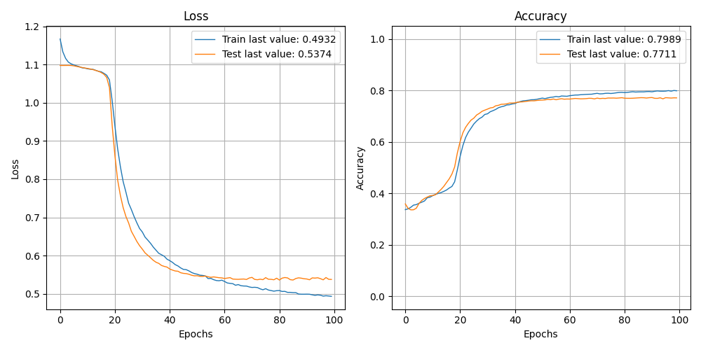

The size of this dataset is 100000.0

              precision    recall  f1-score   support

    Negative       0.59      0.62      0.60      5374
    Positive       0.85      0.80      0.83      6439
     Neutral       0.84      0.85      0.84      8187

    accuracy                           0.77     20000
   macro avg       0.76      0.76      0.76     20000
weighted avg       0.77      0.77      0.77     20000

> 77.115

Showing results for tfidf and bilstm Model using articles
Training Accuarcy: 0.771
Test Accuracy 0.771
Confidence for each prediction: [[0.40802228 0.04469033 0.5472874 ]
 [0.3729026  0.5944601  0.03263722]
 [0.22782297 0.02274172 0.7494353 ]
 ...
 [0.7262624  0.12334986 0.1503878 ]
 [0.23716035 0.02147252 0.74136716]
 [0.44601622 0.04927249 0.5047113 ]]
[INFO] predicting...
aba decides against community broadcasting licence
[0.79161566 0.10467713 0.10370719]
[[0.79161566 0.10467713 0.10370719]
 [0.7910305  0.08369942 0.12527005]
 [0.79161566 0.10467713 0.10370719]
 [0.8350483  0.08258501 0.08236668]
 [0.7923576  0.09345279 0.11418956]
 [0.8004556  0.10042614 0.09911832]
 [0.77365476 0.11157759 0.11476766]
 [0.798852   0.09639253 0.10475541]
 [0.7923576  0.09345279 0.11418956]
 [0.8004556  0.10042614 0.09911832]
 [0.7813392  0.10664653 0.1120142 ]
 [0.8350483  0.08258501 0.08236668]
 [0.79161566 0.10467713 0.10370719]
 [0.78952557 0.09501909 0.11545533]
 [0.79161566 0.10467713 0.10370719]
 [0.798852   0.09639253 0.10475541]
 [0.79551244 0.09894288 0.10554463]
 [0.7813392  0.10664653 0.1120142 ]
 [0.7945677  0.12613946 0.07929279]
 [0.8350483  0.08258501 0.08236668]
 [0.77365476 0.11157759 0.11476766]
 [0.79291147 0.10283054 0.10425796]
 [0.8151603  0.09218153 0.09265819]
 [0.8151603  0.09218153 0.09265819]
 [0.8235809  0.09152474 0.08489433]
 [0.79551244 0.09894288 0.10554463]
 [0.798852   0.09639253 0.10475541]
 [0.7945677  0.12613946 0.07929279]
 [0.7956021  0.10048363 0.10391422]
 [0.8350483  0.08258501 0.08236668]
 [0.7910305  0.08369942 0.12527005]
 [0.7882308  0.10230752 0.10946167]
 [0.79291147 0.10283054 0.10425796]
 [0.79161566 0.10467713 0.10370719]
 [0.7923576  0.09345279 0.11418956]
 [0.77365476 0.11157759 0.11476766]
 [0.79161566 0.10467713 0.10370719]
 [0.7813392  0.10664653 0.1120142 ]
 [0.7945677  0.12613946 0.07929279]
 [0.798852   0.09639253 0.10475541]
 [0.79551244 0.09894288 0.10554463]
 [0.78952557 0.09501909 0.11545533]
 [0.8350483  0.08258501 0.08236668]
 [0.81096774 0.09169503 0.09733719]
 [0.798852   0.09639253 0.10475541]
 [0.77365476 0.11157759 0.11476766]
 [0.8004556  0.10042614 0.09911832]
 [0.79551244 0.09894288 0.10554463]
 [0.77365476 0.11157759 0.11476766]
 [0.8004556  0.10042614 0.09911832]]
0
Negative
act fire witnesses must be aware of defamation
[0.79161566 0.10467713 0.10370719]
[[0.79161566 0.10467713 0.10370719]
 [0.77365476 0.11157759 0.11476766]
 [0.7945677  0.12613946 0.07929279]
 [0.8350483  0.08258501 0.08236668]
 [0.77858025 0.09122782 0.13019194]
 [0.798852   0.09639253 0.10475541]
 [0.7882308  0.10230752 0.10946167]
 [0.8004556  0.10042614 0.09911832]
 [0.8350483  0.08258501 0.08236668]
 [0.7818793  0.08995742 0.12816326]
 [0.798852   0.09639253 0.10475541]
 [0.7945677  0.12613946 0.07929279]
 [0.79551244 0.09894288 0.10554463]
 [0.8004556  0.10042614 0.09911832]
 [0.7813392  0.10664653 0.1120142 ]
 [0.7813392  0.10664653 0.1120142 ]
 [0.8004556  0.10042614 0.09911832]
 [0.7813392  0.10664653 0.1120142 ]
 [0.8350483  0.08258501 0.08236668]
 [0.8151603  0.09218153 0.09265819]
 [0.8235809  0.09152474 0.08489433]
 [0.7813392  0.10664653 0.1120142 ]
 [0.7945677  0.12613946 0.07929279]
 [0.8350483  0.08258501 0.08236668]
 [0.7910305  0.08369942 0.12527005]
 [0.8004556  0.10042614 0.09911832]
 [0.8350483  0.08258501 0.08236668]
 [0.79161566 0.10467713 0.10370719]
 [0.7818793  0.08995742 0.12816326]
 [0.79161566 0.10467713 0.10370719]
 [0.7882308  0.10230752 0.10946167]
 [0.8004556  0.10042614 0.09911832]
 [0.8350483  0.08258501 0.08236669]
 [0.79291147 0.10283056 0.10425798]
 [0.77858025 0.09122784 0.13019197]
 [0.8350483  0.08258501 0.08236669]
 [0.7923576  0.0934528  0.11418956]
 [0.8004556  0.10042614 0.09911829]
 [0.77858025 0.09122784 0.13019197]
 [0.79161566 0.10467717 0.10370719]
 [0.8151603  0.09218153 0.09265819]
 [0.79161566 0.10467717 0.10370719]
 [0.79456776 0.12613945 0.07929277]
 [0.798852   0.09639253 0.10475541]
 [0.79291147 0.10283056 0.10425798]
 [0.79551244 0.09894292 0.10554466]]
0
Negative
a g calls for infrastructure protection summit
[0.79161566 0.10467713 0.10370719]
[[0.79161566 0.10467713 0.10370719]
 [0.8350483  0.08258501 0.08236668]
 [0.78952557 0.09501909 0.11545533]
 [0.8350483  0.08258501 0.08236668]
 [0.77365476 0.11157759 0.11476766]
 [0.79161566 0.10467713 0.10370719]
 [0.81096774 0.09169503 0.09733719]
 [0.81096774 0.09169503 0.09733719]
 [0.7813392  0.10664653 0.1120142 ]
 [0.8350483  0.08258501 0.08236668]
 [0.77858025 0.09122782 0.13019194]
 [0.79291147 0.10283054 0.10425796]
 [0.7882308  0.10230752 0.10946167]
 [0.8350483  0.08258501 0.08236668]
 [0.798852   0.09639253 0.10475541]
 [0.79551244 0.09894288 0.10554463]
 [0.77858025 0.09122782 0.13019194]
 [0.7882308  0.10230752 0.10946167]
 [0.79161566 0.10467713 0.10370719]
 [0.7813392  0.10664653 0.1120142 ]
 [0.7945677  0.12613946 0.07929279]
 [0.7882308  0.10230752 0.10946167]
 [0.8235809  0.09152474 0.08489433]
 [0.77365476 0.11157759 0.11476766]
 [0.7945677  0.12613946 0.07929279]
 [0.8235809  0.09152474 0.08489433]
 [0.7882308  0.10230752 0.10946167]
 [0.8004556  0.10042614 0.09911832]
 [0.8350483  0.08258501 0.08236668]
 [0.8055621  0.09983723 0.09460071]
 [0.7882308  0.10230752 0.10946167]
 [0.79291147 0.10283054 0.10425796]
 [0.79456776 0.12613945 0.07929277]
 [0.8004556  0.10042614 0.09911829]
 [0.77365476 0.11157761 0.11476766]
 [0.79456776 0.12613945 0.07929277]
 [0.798852   0.09639253 0.10475541]
 [0.79291147 0.10283056 0.10425798]
 [0.79551244 0.09894292 0.10554466]
 [0.8350483  0.08258501 0.08236669]
 [0.7813392  0.10664653 0.11201422]
 [0.8235809  0.09152474 0.08489433]
 [0.8151603  0.09218153 0.09265819]
 [0.8151603  0.09218153 0.09265819]
 [0.798852   0.09639253 0.10475541]
 [0.79456776 0.12613945 0.07929277]]
0
Negative
air nz staff in aust strike for pay rise
[0.79161566 0.10467713 0.10370719]
[[0.79161566 0.10467713 0.10370719]
 [0.798852   0.09639253 0.10475541]
 [0.7882308  0.10230752 0.10946167]
 [0.8350483  0.08258501 0.08236668]
 [0.79551244 0.09894288 0.10554463]
 [0.7770724  0.10642331 0.11650424]
 [0.8350483  0.08258501 0.08236668]
 [0.7813392  0.10664653 0.1120142 ]
 [0.7945677  0.12613946 0.07929279]
 [0.79161566 0.10467713 0.10370719]
 [0.77858025 0.09122782 0.13019194]
 [0.77858025 0.09122782 0.13019194]
 [0.8350483  0.08258501 0.08236668]
 [0.798852   0.09639253 0.10475541]
 [0.79551244 0.09894288 0.10554463]
 [0.8350483  0.08258501 0.08236668]
 [0.79161566 0.10467713 0.10370719]
 [0.8235809  0.09152474 0.08489433]
 [0.7813392  0.10664653 0.1120142 ]
 [0.7945677  0.12613946 0.07929279]
 [0.8350483  0.08258501 0.08236668]
 [0.7813392  0.10664653 0.1120142 ]
 [0.7945677  0.12613946 0.07929279]
 [0.7882308  0.10230752 0.10946167]
 [0.798852   0.09639253 0.10475541]
 [0.7723904  0.10190907 0.12570052]
 [0.8004556  0.10042614 0.09911832]
 [0.8350483  0.08258501 0.08236668]
 [0.77858025 0.09122782 0.13019194]
 [0.79291147 0.10283054 0.10425796]
 [0.7882308  0.10230752 0.10946167]
 [0.8350483  0.08258501 0.08236668]
 [0.805562   0.09983724 0.09460075]
 [0.79161566 0.10467717 0.10370719]
 [0.7956021  0.10048363 0.10391422]
 [0.8350483  0.08258501 0.08236669]
 [0.7882308  0.10230754 0.10946168]
 [0.798852   0.09639253 0.10475541]
 [0.7813392  0.10664653 0.11201422]
 [0.8004556  0.10042614 0.09911829]]
0
Negative
air nz strike to affect australian travellers
[0.79161566 0.10467713 0.10370719]
[[0.79161566 0.10467713 0.10370719]
 [0.798852   0.09639253 0.10475541]
 [0.7882308  0.10230752 0.10946167]
 [0.8350483  0.08258501 0.08236668]
 [0.79551244 0.09894288 0.10554463]
 [0.7770724  0.10642331 0.11650424]
 [0.8350483  0.08258501 0.08236668]
 [0.7813392  0.10664653 0.1120142 ]
 [0.7945677  0.12613946 0.07929279]
 [0.7882308  0.10230752 0.10946167]
 [0.798852   0.09639253 0.10475541]
 [0.7723904  0.10190907 0.12570052]
 [0.8004556  0.10042614 0.09911832]
 [0.8350483  0.08258501 0.08236668]
 [0.7945677  0.12613946 0.07929279]
 [0.79291147 0.10283054 0.10425796]
 [0.8350483  0.08258501 0.08236668]
 [0.79161566 0.10467713 0.10370719]
 [0.77858025 0.09122782 0.13019194]
 [0.77858025 0.09122782 0.13019194]
 [0.8004556  0.10042614 0.09911832]
 [0.77365476 0.11157759 0.11476766]
 [0.7945677  0.12613946 0.07929279]
 [0.8350483  0.08258501 0.08236668]
 [0.79161566 0.10467713 0.10370719]
 [0.8235809  0.09152474 0.08489433]
 [0.7813392  0.10664653 0.1120142 ]
 [0.7945677  0.12613946 0.07929279]
 [0.7882308  0.10230752 0.10946167]
 [0.79161566 0.10467713 0.10370719]
 [0.81096774 0.09169503 0.09733719]
 [0.798852   0.09639253 0.10475541]
 [0.79161566 0.10467717 0.10370719]
 [0.79551244 0.09894292 0.10554466]
 [0.8350483  0.08258501 0.08236669]
 [0.79456776 0.12613945 0.07929277]
 [0.7882308  0.10230754 0.10946168]
 [0.79161566 0.10467717 0.10370719]
 [0.78940827 0.10433566 0.1062561 ]
 [0.8004556  0.10042614 0.09911829]
 [0.81096774 0.09169503 0.09733717]
 [0.81096774 0.09169503 0.09733717]
 [0.8004556  0.10042614 0.09911829]
 [0.7882308  0.10230754 0.10946168]
 [0.7813392  0.10664653 0.11201422]]
0
Negative
ambitious olsson wins triple jump
[0.79161566 0.10467713 0.10370719]
[[0.79161566 0.10467713 0.10370719]
 [0.8151603  0.09218153 0.09265819]
 [0.7910305  0.08369942 0.12527005]
 [0.798852   0.09639253 0.10475541]
 [0.7945677  0.12613946 0.07929279]
 [0.798852   0.09639253 0.10475541]
 [0.79291147 0.10283054 0.10425796]
 [0.8235809  0.09152474 0.08489433]
 [0.7813392  0.10664653 0.1120142 ]
 [0.8350483  0.08258501 0.08236668]
 [0.79291147 0.10283054 0.10425796]
 [0.81096774 0.09169503 0.09733719]
 [0.7813392  0.10664653 0.1120142 ]
 [0.7813392  0.10664653 0.1120142 ]
 [0.79291147 0.10283054 0.10425796]
 [0.79551244 0.09894288 0.10554463]
 [0.8350483  0.08258501 0.08236668]
 [0.7818793  0.08995742 0.12816326]
 [0.798852   0.09639253 0.10475541]
 [0.79551244 0.09894288 0.10554463]
 [0.7813392  0.10664653 0.1120142 ]
 [0.8350483  0.08258501 0.08236668]
 [0.7945677  0.12613946 0.07929279]
 [0.7882308  0.10230752 0.10946167]
 [0.798852   0.09639253 0.10475541]
 [0.8055621  0.09983723 0.09460071]
 [0.81096774 0.09169503 0.09733719]
 [0.8004556  0.10042614 0.09911832]
 [0.8350483  0.08258501 0.08236668]
 [0.80990267 0.10028028 0.08981712]
 [0.8235809  0.09152474 0.08489433]
 [0.8151603  0.09218153 0.09265819]
 [0.80556196 0.09983726 0.09460072]]
0
Negative
antic delighted with record breaking barca
[0.79161566 0.10467713 0.10370719]
[[0.79161566 0.10467713 0.10370719]
 [0.79551244 0.09894288 0.10554463]
 [0.7945677  0.12613946 0.07929279]
 [0.798852   0.09639253 0.10475541]
 [0.77365476 0.11157759 0.11476766]
 [0.8350483  0.08258501 0.08236668]
 [0.7923576  0.09345279 0.11418956]
 [0.8004556  0.10042614 0.09911832]
 [0.81096774 0.09169503 0.09733719]
 [0.798852   0.09639253 0.10475541]
 [0.78952557 0.09501909 0.11545533]
 [0.7726703  0.09655473 0.13077489]
 [0.7945677  0.12613946 0.07929279]
 [0.8004556  0.10042614 0.09911832]
 [0.7923576  0.09345279 0.11418956]
 [0.8350483  0.08258501 0.08236668]
 [0.7818793  0.08995742 0.12816326]
 [0.798852   0.09639253 0.10475541]
 [0.7945677  0.12613946 0.07929279]
 [0.7726703  0.09655473 0.13077489]
 [0.8350483  0.08258501 0.08236668]
 [0.7882308  0.10230752 0.10946167]
 [0.8004556  0.10042614 0.09911832]
 [0.77365476 0.11157759 0.11476766]
 [0.79291147 0.10283054 0.10425796]
 [0.7882308  0.10230752 0.10946167]
 [0.7923576  0.09345279 0.11418956]
 [0.8350483  0.08258501 0.08236668]
 [0.7910305  0.08369942 0.12527005]
 [0.7882308  0.10230752 0.10946167]
 [0.8004556  0.10042614 0.09911832]
 [0.79161566 0.10467713 0.10370719]
 [0.7723904  0.10190909 0.12570052]
 [0.798852   0.09639253 0.10475541]
 [0.79551244 0.09894292 0.10554466]
 [0.78952557 0.09501913 0.11545537]
 [0.8350483  0.08258501 0.08236669]
 [0.7910305  0.08369942 0.12527005]
 [0.79161566 0.10467717 0.10370719]
 [0.7882308  0.10230754 0.10946168]
 [0.77365476 0.11157761 0.11476766]
 [0.79161566 0.10467717 0.10370719]]
0
Negative
aussie qualifier stosur wastes four memphis match
[0.79161566 0.10467713 0.10370719]
[[0.79161566 0.10467713 0.10370719]
 [0.8235809  0.09152474 0.08489433]
 [0.7813392  0.10664653 0.1120142 ]
 [0.7813392  0.10664653 0.1120142 ]
 [0.798852   0.09639253 0.10475541]
 [0.8004556  0.10042614 0.09911832]
 [0.8350483  0.08258501 0.08236668]
 [0.7997332  0.1055536  0.09471316]
 [0.8235809  0.09152474 0.08489433]
 [0.79161566 0.10467713 0.10370719]
 [0.81096774 0.09169503 0.09733719]
 [0.798852   0.09639253 0.10475541]
 [0.77858025 0.09122782 0.13019194]
 [0.798852   0.09639253 0.10475541]
 [0.8004556  0.10042614 0.09911832]
 [0.7882308  0.10230752 0.10946167]
 [0.8350483  0.08258501 0.08236668]
 [0.7813392  0.10664653 0.1120142 ]
 [0.7945677  0.12613946 0.07929279]
 [0.79291147 0.10283054 0.10425796]
 [0.7813392  0.10664653 0.1120142 ]
 [0.8235809  0.09152474 0.08489433]
 [0.7882308  0.10230752 0.10946167]
 [0.8350483  0.08258501 0.08236668]
 [0.7818793  0.08995742 0.12816326]
 [0.79161566 0.10467713 0.10370719]
 [0.7813392  0.10664653 0.1120142 ]
 [0.7945677  0.12613946 0.07929279]
 [0.8004556  0.10042614 0.09911832]
 [0.7813392  0.10664653 0.1120142 ]
 [0.8350483  0.08258501 0.08236668]
 [0.77858025 0.09122782 0.13019194]
 [0.79291147 0.10283054 0.10425796]
 [0.8235809  0.09152474 0.08489433]
 [0.7882308  0.10230752 0.10946167]
 [0.8350483  0.08258501 0.08236668]
 [0.8151603  0.09218153 0.09265819]
 [0.8004556  0.10042614 0.09911832]
 [0.8151603  0.09218153 0.09265819]
 [0.8055621  0.09983723 0.09460071]
 [0.7726703  0.09655473 0.13077489]
 [0.798852   0.09639253 0.10475541]
 [0.7813392  0.10664653 0.1120142 ]
 [0.8350483  0.08258501 0.08236668]
 [0.8151603  0.09218153 0.09265819]
 [0.79161566 0.10467713 0.10370719]
 [0.7945677  0.12613946 0.07929279]
 [0.77365476 0.11157759 0.11476766]
 [0.7726703  0.09655473 0.13077489]]
0
Negative
aust addresses un security council over iraq
[0.79161566 0.10467713 0.10370719]
[[0.79161566 0.10467713 0.10370719]
 [0.8235809  0.09152474 0.08489433]
 [0.7813392  0.10664653 0.1120142 ]
 [0.7945677  0.12613946 0.07929279]
 [0.8350483  0.08258501 0.08236668]
 [0.79161566 0.10467713 0.10370719]
 [0.7923576  0.09345279 0.11418956]
 [0.7923576  0.09345279 0.11418956]
 [0.7882308  0.10230752 0.10946167]
 [0.8004556  0.10042614 0.09911832]
 [0.7813392  0.10664653 0.1120142 ]
 [0.7813392  0.10664653 0.1120142 ]
 [0.8004556  0.10042614 0.09911832]
 [0.7813392  0.10664653 0.1120142 ]
 [0.8350483  0.08258501 0.08236668]
 [0.8235809  0.09152474 0.08489433]
 [0.79551244 0.09894288 0.10554463]
 [0.8350483  0.08258501 0.08236668]
 [0.7813392  0.10664653 0.1120142 ]
 [0.8004556  0.10042614 0.09911832]
 [0.77365476 0.11157759 0.11476766]
 [0.8235809  0.09152474 0.08489433]
 [0.7882308  0.10230752 0.10946167]
 [0.798852   0.09639253 0.10475541]
 [0.7945677  0.12613946 0.07929279]
 [0.7956021  0.10048363 0.10391422]
 [0.8350483  0.08258501 0.08236668]
 [0.77365476 0.11157759 0.11476766]
 [0.79291147 0.10283054 0.10425796]
 [0.8235809  0.09152474 0.08489433]
 [0.79551244 0.09894288 0.10554463]
 [0.77365476 0.11157759 0.11476766]
 [0.798852   0.09639253 0.10475541]
 [0.81096774 0.09169503 0.09733717]
 [0.8350483  0.08258501 0.08236669]
 [0.79291147 0.10283056 0.10425798]
 [0.78940827 0.10433566 0.1062561 ]
 [0.8004556  0.10042614 0.09911829]
 [0.7882308  0.10230754 0.10946168]
 [0.8350483  0.08258501 0.08236669]
 [0.798852   0.09639253 0.10475541]
 [0.7882308  0.10230754 0.10946168]
 [0.79161566 0.10467717 0.10370719]
 [0.7997332  0.1055536  0.09471316]]
0
Negative
australia is locked into war timetable opp
[0.79161566 0.10467713 0.10370719]
[[0.79161566 0.10467713 0.10370719]
 [0.8235809  0.09152474 0.08489433]
 [0.7813392  0.10664653 0.1120142 ]
 [0.7945677  0.12613946 0.07929279]
 [0.7882308  0.10230752 0.10946167]
 [0.79161566 0.10467713 0.10370719]
 [0.81096774 0.09169503 0.09733719]
 [0.798852   0.09639253 0.10475541]
 [0.79161566 0.10467713 0.10370719]
 [0.8350483  0.08258501 0.08236668]
 [0.798852   0.09639253 0.10475541]
 [0.7813392  0.10664653 0.1120142 ]
 [0.8350483  0.08258501 0.08236668]
 [0.81096774 0.09169503 0.09733719]
 [0.79291147 0.10283054 0.10425796]
 [0.77365476 0.11157759 0.11476766]
 [0.7723904  0.10190907 0.12570052]
 [0.8004556  0.10042614 0.09911832]
 [0.7923576  0.09345279 0.11418956]
 [0.8350483  0.08258501 0.08236668]
 [0.798852   0.09639253 0.10475541]
 [0.79551244 0.09894288 0.10554463]
 [0.7945677  0.12613946 0.07929279]
 [0.79291147 0.10283054 0.10425796]
 [0.8350483  0.08258501 0.08236668]
 [0.7818793  0.08995742 0.12816326]
 [0.79161566 0.10467713 0.10370719]
 [0.7882308  0.10230752 0.10946167]
 [0.8350483  0.08258501 0.08236668]
 [0.7945677  0.12613946 0.07929279]
 [0.798852   0.09639253 0.10475541]
 [0.8151603  0.09218153 0.09265819]
 [0.8004556  0.10042614 0.09911829]
 [0.79456776 0.12613945 0.07929277]
 [0.79161566 0.10467717 0.10370719]
 [0.7910305  0.08369942 0.12527005]
 [0.81096774 0.09169503 0.09733717]
 [0.8004556  0.10042614 0.09911829]
 [0.8350483  0.08258501 0.08236669]
 [0.79291147 0.10283056 0.10425798]
 [0.805562   0.09983724 0.09460075]
 [0.805562   0.09983724 0.09460075]]
0
Negative
australia to contribute 10 million in aid to iraq
[0.79161566 0.10467713 0.10370719]
[[0.79161566 0.10467713 0.10370719]
 [0.8235809  0.09152474 0.08489433]
 [0.7813392  0.10664653 0.1120142 ]
 [0.7945677  0.12613946 0.07929279]
 [0.7882308  0.10230752 0.10946167]
 [0.79161566 0.10467713 0.10370719]
 [0.81096774 0.09169503 0.09733719]
 [0.798852   0.09639253 0.10475541]
 [0.79161566 0.10467713 0.10370719]
 [0.8350483  0.08258501 0.08236668]
 [0.7945677  0.12613946 0.07929279]
 [0.79291147 0.10283054 0.10425796]
 [0.8350483  0.08258501 0.08236668]
 [0.77365476 0.11157759 0.11476766]
 [0.79291147 0.10283054 0.10425796]
 [0.79551244 0.09894288 0.10554463]
 [0.7945677  0.12613946 0.07929279]
 [0.7882308  0.10230752 0.10946167]
 [0.798852   0.09639253 0.10475541]
 [0.7910305  0.08369942 0.12527005]
 [0.8235809  0.09152474 0.08489433]
 [0.7945677  0.12613946 0.07929279]
 [0.8004556  0.10042614 0.09911832]
 [0.8350483  0.08258501 0.08236668]
 [0.76497465 0.087512   0.14751334]
 [0.75670815 0.18039337 0.06289846]
 [0.8350483  0.08258501 0.08236668]
 [0.8151603  0.09218153 0.09265819]
 [0.798852   0.09639253 0.10475541]
 [0.81096774 0.09169503 0.09733719]
 [0.81096774 0.09169503 0.09733719]
 [0.798852   0.09639253 0.10475541]
 [0.79291147 0.10283054 0.10425796]
 [0.79551244 0.09894288 0.10554463]
 [0.8350483  0.08258501 0.08236668]
 [0.798852   0.09639253 0.10475541]
 [0.79551244 0.09894288 0.10554463]
 [0.8350483  0.08258501 0.08236668]
 [0.79161566 0.10467713 0.10370719]
 [0.798852   0.09639253 0.10475541]
 [0.7923576  0.09345279 0.11418956]
 [0.8350483  0.08258501 0.08236668]
 [0.7945677  0.12613946 0.07929279]
 [0.79291147 0.10283054 0.10425796]
 [0.8350483  0.08258501 0.08236668]
 [0.798852   0.09639253 0.10475541]
 [0.7882308  0.10230752 0.10946167]
 [0.79161566 0.10467713 0.10370719]
 [0.7997332  0.1055536  0.09471316]]
0
Negative
barca take record as robson celebrates birthday in
[0.7910305  0.08369942 0.12527005]
[[0.7910305  0.08369942 0.12527005]
 [0.79161566 0.10467713 0.10370719]
 [0.7882308  0.10230752 0.10946167]
 [0.77365476 0.11157759 0.11476766]
 [0.79161566 0.10467713 0.10370719]
 [0.8350483  0.08258501 0.08236668]
 [0.7945677  0.12613946 0.07929279]
 [0.79161566 0.10467713 0.10370719]
 [0.7723904  0.10190907 0.12570052]
 [0.8004556  0.10042614 0.09911832]
 [0.8350483  0.08258501 0.08236668]
 [0.7882308  0.10230752 0.10946167]
 [0.8004556  0.10042614 0.09911832]
 [0.77365476 0.11157759 0.11476766]
 [0.79291147 0.10283054 0.10425796]
 [0.7882308  0.10230752 0.10946167]
 [0.7923576  0.09345279 0.11418956]
 [0.8350483  0.08258501 0.08236668]
 [0.79161566 0.10467713 0.10370719]
 [0.7813392  0.10664653 0.1120142 ]
 [0.8350483  0.08258501 0.08236668]
 [0.7882308  0.10230752 0.10946167]
 [0.79291147 0.10283054 0.10425796]
 [0.7910305  0.08369942 0.12527005]
 [0.7813392  0.10664653 0.1120142 ]
 [0.79291147 0.10283054 0.10425796]
 [0.79551244 0.09894288 0.10554463]
 [0.8350483  0.08258501 0.08236668]
 [0.77365476 0.11157759 0.11476766]
 [0.8004556  0.10042614 0.09911832]
 [0.81096774 0.09169503 0.09733719]
 [0.8004556  0.10042614 0.09911832]
 [0.7910305  0.08369942 0.12527005]
 [0.7882308  0.10230752 0.10946167]
 [0.79161566 0.10467713 0.10370719]
 [0.7945677  0.12613946 0.07929279]
 [0.8004556  0.10042614 0.09911832]
 [0.7813392  0.10664653 0.1120142 ]
 [0.8350483  0.08258501 0.08236668]
 [0.7910305  0.08369942 0.12527005]
 [0.798852   0.09639253 0.10475541]
 [0.7882308  0.10230752 0.10946167]
 [0.7945677  0.12613946 0.07929279]
 [0.7726703  0.09655473 0.13077489]
 [0.7923576  0.09345279 0.11418956]
 [0.79161566 0.10467713 0.10370719]
 [0.7956021  0.10048363 0.10391422]
 [0.8350483  0.08258501 0.08236668]
 [0.798852   0.09639253 0.10475541]
 [0.79551244 0.09894288 0.10554463]]
0
Negative
bathhouse plans move ahead
[0.7910305  0.08369942 0.12527005]
[[0.7910305  0.08369942 0.12527005]
 [0.79161566 0.10467713 0.10370719]
 [0.7945677  0.12613946 0.07929279]
 [0.7726703  0.09655473 0.13077489]
 [0.7726703  0.09655473 0.13077489]
 [0.79291147 0.10283054 0.10425796]
 [0.8235809  0.09152474 0.08489433]
 [0.7813392  0.10664653 0.1120142 ]
 [0.8004556  0.10042614 0.09911832]
 [0.8350483  0.08258501 0.08236668]
 [0.8055621  0.09983723 0.09460071]
 [0.81096774 0.09169503 0.09733719]
 [0.79161566 0.10467713 0.10370719]
 [0.79551244 0.09894288 0.10554463]
 [0.7813392  0.10664653 0.1120142 ]
 [0.8350483  0.08258501 0.08236668]
 [0.8151603  0.09218153 0.09265819]
 [0.79291147 0.10283054 0.10425796]
 [0.78940815 0.10433567 0.10625611]
 [0.8004556  0.10042614 0.09911832]
 [0.8350483  0.08258501 0.08236668]
 [0.79161566 0.10467713 0.10370719]
 [0.7726703  0.09655473 0.13077489]
 [0.8004556  0.10042614 0.09911832]
 [0.79161566 0.10467713 0.10370719]
 [0.7923576  0.09345279 0.11418956]]
0
Negative
big hopes for launceston cycling championship
[0.7910305  0.08369942 0.12527005]
[[0.7910305  0.08369942 0.12527005]
 [0.798852   0.09639253 0.10475541]
 [0.78952557 0.09501909 0.11545533]
 [0.8350483  0.08258501 0.08236668]
 [0.7726703  0.09655473 0.13077489]
 [0.79291147 0.10283054 0.10425796]
 [0.8055621  0.09983723 0.09460071]
 [0.8004556  0.10042614 0.09911832]
 [0.7813392  0.10664653 0.1120142 ]
 [0.8350483  0.08258501 0.08236668]
 [0.77858025 0.09122782 0.13019194]
 [0.79291147 0.10283054 0.10425796]
 [0.7882308  0.10230752 0.10946167]
 [0.8350483  0.08258501 0.08236668]
 [0.81096774 0.09169503 0.09733719]
 [0.79161566 0.10467713 0.10370719]
 [0.8235809  0.09152474 0.08489433]
 [0.79551244 0.09894288 0.10554463]
 [0.77365476 0.11157759 0.11476766]
 [0.8004556  0.10042614 0.09911832]
 [0.7813392  0.10664653 0.1120142 ]
 [0.7945677  0.12613946 0.07929279]
 [0.79291147 0.10283054 0.10425796]
 [0.79551244 0.09894288 0.10554463]
 [0.8350483  0.08258501 0.08236668]
 [0.77365476 0.11157759 0.11476766]
 [0.7956021  0.10048363 0.10391422]
 [0.77365476 0.11157759 0.11476766]
 [0.81096774 0.09169503 0.09733719]
 [0.798852   0.09639253 0.10475541]
 [0.79551244 0.09894288 0.10554463]
 [0.78952557 0.09501909 0.11545533]
 [0.8350483  0.08258501 0.08236669]
 [0.77365476 0.11157761 0.11476766]
 [0.7726703  0.09655476 0.13077489]
 [0.79161566 0.10467717 0.10370719]
 [0.8151603  0.09218153 0.09265819]
 [0.805562   0.09983724 0.09460075]
 [0.798852   0.09639253 0.10475541]
 [0.79291147 0.10283056 0.10425798]
 [0.79551244 0.09894292 0.10554466]
 [0.7813392  0.10664653 0.11201422]
 [0.7726703  0.09655476 0.13077489]
 [0.798852   0.09639253 0.10475541]
 [0.805562   0.09983724 0.09460075]]
0
Negative
big plan to boost paroo water supplies
[0.7910305  0.08369942 0.12527005]
[[0.7910305  0.08369942 0.12527005]
 [0.798852   0.09639253 0.10475541]
 [0.78952557 0.09501909 0.11545533]
 [0.8350483  0.08258501 0.08236668]
 [0.8055621  0.09983723 0.09460071]
 [0.81096774 0.09169503 0.09733719]
 [0.79161566 0.10467713 0.10370719]
 [0.79551244 0.09894288 0.10554463]
 [0.8350483  0.08258501 0.08236668]
 [0.7945677  0.12613946 0.07929279]
 [0.79291147 0.10283054 0.10425796]
 [0.8350483  0.08258501 0.08236668]
 [0.7910305  0.08369942 0.12527005]
 [0.79291147 0.10283054 0.10425796]
 [0.79291147 0.10283054 0.10425796]
 [0.7813392  0.10664653 0.1120142 ]
 [0.7945677  0.12613946 0.07929279]
 [0.8350483  0.08258501 0.08236668]
 [0.8055621  0.09983723 0.09460071]
 [0.79161566 0.10467713 0.10370719]
 [0.7882308  0.10230752 0.10946167]
 [0.79291147 0.10283054 0.10425796]
 [0.79291147 0.10283054 0.10425796]
 [0.8350483  0.08258501 0.08236668]
 [0.7818793  0.08995742 0.12816326]
 [0.79161566 0.10467713 0.10370719]
 [0.7945677  0.12613946 0.07929279]
 [0.8004556  0.10042614 0.09911832]
 [0.7882308  0.10230752 0.10946167]
 [0.8350483  0.08258501 0.08236668]
 [0.7813392  0.10664653 0.1120142 ]
 [0.8235809  0.09152474 0.08489433]
 [0.805562   0.09983724 0.09460075]
 [0.805562   0.09983724 0.09460075]
 [0.81096774 0.09169503 0.09733717]
 [0.798852   0.09639253 0.10475541]
 [0.8004556  0.10042614 0.09911829]
 [0.7813392  0.10664653 0.11201422]]
0
Negative
blizzard buries united states in bills
[0.7910305  0.08369942 0.12527005]
[[0.7910305  0.08369942 0.12527005]
 [0.81096774 0.09169503 0.09733719]
 [0.798852   0.09639253 0.10475541]
 [0.7770724  0.10642331 0.11650424]
 [0.7770724  0.10642331 0.11650424]
 [0.79161566 0.10467713 0.10370719]
 [0.7882308  0.10230752 0.10946167]
 [0.7923576  0.09345279 0.11418956]
 [0.8350483  0.08258501 0.08236668]
 [0.7910305  0.08369942 0.12527005]
 [0.8235809  0.09152474 0.08489433]
 [0.7882308  0.10230752 0.10946167]
 [0.798852   0.09639253 0.10475541]
 [0.8004556  0.10042614 0.09911832]
 [0.7813392  0.10664653 0.1120142 ]
 [0.8350483  0.08258501 0.08236668]
 [0.8235809  0.09152474 0.08489433]
 [0.79551244 0.09894288 0.10554463]
 [0.798852   0.09639253 0.10475541]
 [0.7945677  0.12613946 0.07929279]
 [0.8004556  0.10042614 0.09911832]
 [0.7923576  0.09345279 0.11418956]
 [0.8350483  0.08258501 0.08236668]
 [0.7813392  0.10664653 0.1120142 ]
 [0.7945677  0.12613946 0.07929279]
 [0.79161566 0.10467713 0.10370719]
 [0.7945677  0.12613946 0.07929279]
 [0.8004556  0.10042614 0.09911832]
 [0.7813392  0.10664653 0.1120142 ]
 [0.8350483  0.08258501 0.08236668]
 [0.798852   0.09639253 0.10475541]
 [0.79551244 0.09894288 0.10554463]
 [0.8350483  0.08258501 0.08236669]
 [0.7910305  0.08369942 0.12527005]
 [0.798852   0.09639253 0.10475541]
 [0.81096774 0.09169503 0.09733717]
 [0.81096774 0.09169503 0.09733717]
 [0.7813392  0.10664653 0.11201422]]
0
Negative
brigadier dismisses reports troops harassed in
[0.7910305  0.08369942 0.12527005]
[[0.7910305  0.08369942 0.12527005]
 [0.7882308  0.10230752 0.10946167]
 [0.798852   0.09639253 0.10475541]
 [0.78952557 0.09501909 0.11545533]
 [0.79161566 0.10467713 0.10370719]
 [0.7923576  0.09345279 0.11418956]
 [0.798852   0.09639253 0.10475541]
 [0.8004556  0.10042614 0.09911832]
 [0.7882308  0.10230752 0.10946167]
 [0.8350483  0.08258501 0.08236668]
 [0.7923576  0.09345279 0.11418956]
 [0.798852   0.09639253 0.10475541]
 [0.7813392  0.10664653 0.1120142 ]
 [0.8151603  0.09218153 0.09265819]
 [0.798852   0.09639253 0.10475541]
 [0.7813392  0.10664653 0.1120142 ]
 [0.7813392  0.10664653 0.1120142 ]
 [0.8004556  0.10042614 0.09911832]
 [0.7813392  0.10664653 0.1120142 ]
 [0.8350483  0.08258501 0.08236668]
 [0.7882308  0.10230752 0.10946167]
 [0.8004556  0.10042614 0.09911832]
 [0.8055621  0.09983723 0.09460071]
 [0.79291147 0.10283054 0.10425796]
 [0.7882308  0.10230752 0.10946167]
 [0.7945677  0.12613946 0.07929279]
 [0.7813392  0.10664653 0.1120142 ]
 [0.8350483  0.08258501 0.08236668]
 [0.7945677  0.12613946 0.07929279]
 [0.7882308  0.10230752 0.10946167]
 [0.79291147 0.10283054 0.10425796]
 [0.79291147 0.10283054 0.10425796]
 [0.805562   0.09983724 0.09460075]
 [0.7813392  0.10664653 0.11201422]
 [0.8350483  0.08258501 0.08236669]
 [0.7726703  0.09655476 0.13077489]
 [0.79161566 0.10467717 0.10370719]
 [0.7882308  0.10230754 0.10946168]
 [0.79161566 0.10467717 0.10370719]
 [0.7813392  0.10664653 0.11201422]
 [0.7813392  0.10664653 0.11201422]
 [0.8004556  0.10042614 0.09911829]
 [0.7923576  0.0934528  0.11418956]
 [0.8350483  0.08258501 0.08236669]
 [0.798852   0.09639253 0.10475541]
 [0.79551244 0.09894292 0.10554466]]
0
Negative
british combat troops arriving daily in kuwait
[0.7910305  0.08369942 0.12527005]
[[0.7910305  0.08369942 0.12527005]
 [0.7882308  0.10230752 0.10946167]
 [0.798852   0.09639253 0.10475541]
 [0.7945677  0.12613946 0.07929279]
 [0.798852   0.09639253 0.10475541]
 [0.7813392  0.10664653 0.1120142 ]
 [0.7726703  0.09655473 0.13077489]
 [0.8350483  0.08258501 0.08236668]
 [0.77365476 0.11157759 0.11476766]
 [0.79291147 0.10283054 0.10425796]
 [0.8151603  0.09218153 0.09265819]
 [0.7910305  0.08369942 0.12527005]
 [0.79161566 0.10467713 0.10370719]
 [0.7945677  0.12613946 0.07929279]
 [0.8350483  0.08258501 0.08236668]
 [0.7945677  0.12613946 0.07929279]
 [0.7882308  0.10230752 0.10946167]
 [0.79291147 0.10283054 0.10425796]
 [0.79291147 0.10283054 0.10425796]
 [0.8055621  0.09983723 0.09460071]
 [0.7813392  0.10664653 0.1120142 ]
 [0.8350483  0.08258501 0.08236668]
 [0.79161566 0.10467713 0.10370719]
 [0.7882308  0.10230752 0.10946167]
 [0.7882308  0.10230752 0.10946167]
 [0.798852   0.09639253 0.10475541]
 [0.78940815 0.10433567 0.10625611]
 [0.798852   0.09639253 0.10475541]
 [0.79551244 0.09894288 0.10554463]
 [0.78952557 0.09501909 0.11545533]
 [0.8350483  0.08258501 0.08236668]
 [0.7923576  0.09345279 0.11418956]
 [0.79161566 0.10467717 0.10370719]
 [0.798852   0.09639253 0.10475541]
 [0.81096774 0.09169503 0.09733717]
 [0.7956021  0.10048363 0.10391422]
 [0.8350483  0.08258501 0.08236669]
 [0.798852   0.09639253 0.10475541]
 [0.79551244 0.09894292 0.10554466]
 [0.8350483  0.08258501 0.08236669]
 [0.7723904  0.10190909 0.12570052]
 [0.8235809  0.09152474 0.08489433]
 [0.7818793  0.08995742 0.12816326]
 [0.79161566 0.10467717 0.10370719]
 [0.798852   0.09639253 0.10475541]
 [0.79456776 0.12613945 0.07929277]]
0
Negative
bryant leads lakers to double overtime win
[0.7910305  0.08369942 0.12527005]
[[0.7910305  0.08369942 0.12527005]
 [0.7882308  0.10230752 0.10946167]
 [0.7956021  0.10048363 0.10391422]
 [0.79161566 0.10467713 0.10370719]
 [0.79551244 0.09894288 0.10554463]
 [0.7945677  0.12613946 0.07929279]
 [0.8350483  0.08258501 0.08236668]
 [0.81096774 0.09169503 0.09733719]
 [0.8004556  0.10042614 0.09911832]
 [0.79161566 0.10467713 0.10370719]
 [0.7923576  0.09345279 0.11418956]
 [0.7813392  0.10664653 0.1120142 ]
 [0.8350483  0.08258501 0.08236668]
 [0.81096774 0.09169503 0.09733719]
 [0.79161566 0.10467713 0.10370719]
 [0.7723904  0.10190907 0.12570052]
 [0.8004556  0.10042614 0.09911832]
 [0.7882308  0.10230752 0.10946167]
 [0.7813392  0.10664653 0.1120142 ]
 [0.8350483  0.08258501 0.08236668]
 [0.7945677  0.12613946 0.07929279]
 [0.79291147 0.10283054 0.10425796]
 [0.8350483  0.08258501 0.08236668]
 [0.7923576  0.09345279 0.11418956]
 [0.79291147 0.10283054 0.10425796]
 [0.8235809  0.09152474 0.08489433]
 [0.7910305  0.08369942 0.12527005]
 [0.81096774 0.09169503 0.09733719]
 [0.8004556  0.10042614 0.09911832]
 [0.8350483  0.08258501 0.08236668]
 [0.79291147 0.10283054 0.10425796]
 [0.78940815 0.10433567 0.10625611]
 [0.8004556  0.10042614 0.09911829]
 [0.7882308  0.10230754 0.10946168]
 [0.79456776 0.12613945 0.07929277]
 [0.798852   0.09639253 0.10475541]
 [0.8151603  0.09218153 0.09265819]
 [0.8004556  0.10042614 0.09911829]
 [0.8350483  0.08258501 0.08236669]
 [0.7818793  0.08995742 0.12816326]
 [0.798852   0.09639253 0.10475541]
 [0.79551244 0.09894292 0.10554466]]
0
Negative
bushfire victims urged to see centrelink
[0.7910305  0.08369942 0.12527005]
[[0.7910305  0.08369942 0.12527005]
 [0.8235809  0.09152474 0.08489433]
 [0.7813392  0.10664653 0.1120142 ]
 [0.7726703  0.09655473 0.13077489]
 [0.77858025 0.09122782 0.13019194]
 [0.798852   0.09639253 0.10475541]
 [0.7882308  0.10230752 0.10946167]
 [0.8004556  0.10042614 0.09911832]
 [0.8350483  0.08258501 0.08236668]
 [0.78940815 0.10433567 0.10625611]
 [0.798852   0.09639253 0.10475541]
 [0.77365476 0.11157759 0.11476766]
 [0.7945677  0.12613946 0.07929279]
 [0.798852   0.09639253 0.10475541]
 [0.8151603  0.09218153 0.09265819]
 [0.7813392  0.10664653 0.1120142 ]
 [0.8350483  0.08258501 0.08236668]
 [0.8235809  0.09152474 0.08489433]
 [0.7882308  0.10230752 0.10946167]
 [0.78952557 0.09501909 0.11545533]
 [0.8004556  0.10042614 0.09911832]
 [0.7923576  0.09345279 0.11418956]
 [0.8350483  0.08258501 0.08236668]
 [0.7945677  0.12613946 0.07929279]
 [0.79291147 0.10283054 0.10425796]
 [0.8350483  0.08258501 0.08236668]
 [0.7813392  0.10664653 0.1120142 ]
 [0.8004556  0.10042614 0.09911832]
 [0.8004556  0.10042614 0.09911832]
 [0.8350483  0.08258501 0.08236668]
 [0.77365476 0.11157759 0.11476766]
 [0.8004556  0.10042614 0.09911832]
 [0.79551244 0.09894292 0.10554466]
 [0.79456776 0.12613945 0.07929277]
 [0.7882308  0.10230754 0.10946168]
 [0.8004556  0.10042614 0.09911829]
 [0.81096774 0.09169503 0.09733717]
 [0.798852   0.09639253 0.10475541]
 [0.79551244 0.09894292 0.10554466]
 [0.7723904  0.10190909 0.12570052]]
0
Negative
businesses should prepare for terrorist attacks
[0.7910305  0.08369942 0.12527005]
[[0.7910305  0.08369942 0.12527005]
 [0.8235809  0.09152474 0.08489433]
 [0.7813392  0.10664653 0.1120142 ]
 [0.798852   0.09639253 0.10475541]
 [0.79551244 0.09894288 0.10554463]
 [0.8004556  0.10042614 0.09911832]
 [0.7813392  0.10664653 0.1120142 ]
 [0.7813392  0.10664653 0.1120142 ]
 [0.8004556  0.10042614 0.09911832]
 [0.7813392  0.10664653 0.1120142 ]
 [0.8350483  0.08258501 0.08236668]
 [0.7813392  0.10664653 0.1120142 ]
 [0.7726703  0.09655473 0.13077489]
 [0.79291147 0.10283054 0.10425796]
 [0.8235809  0.09152474 0.08489433]
 [0.81096774 0.09169503 0.09733719]
 [0.7923576  0.09345279 0.11418956]
 [0.8350483  0.08258501 0.08236668]
 [0.8055621  0.09983723 0.09460071]
 [0.7882308  0.10230752 0.10946167]
 [0.8004556  0.10042614 0.09911832]
 [0.8055621  0.09983723 0.09460071]
 [0.79161566 0.10467713 0.10370719]
 [0.7882308  0.10230752 0.10946167]
 [0.8004556  0.10042614 0.09911832]
 [0.8350483  0.08258501 0.08236668]
 [0.77858025 0.09122782 0.13019194]
 [0.79291147 0.10283054 0.10425796]
 [0.7882308  0.10230752 0.10946167]
 [0.8350483  0.08258501 0.08236668]
 [0.7945677  0.12613946 0.07929279]
 [0.8004556  0.10042614 0.09911832]
 [0.7882308  0.10230754 0.10946168]
 [0.7882308  0.10230754 0.10946168]
 [0.79291147 0.10283056 0.10425798]
 [0.7882308  0.10230754 0.10946168]
 [0.798852   0.09639253 0.10475541]
 [0.7813392  0.10664653 0.11201422]
 [0.79456776 0.12613945 0.07929277]
 [0.8350483  0.08258501 0.08236669]
 [0.79161566 0.10467717 0.10370719]
 [0.79456776 0.12613945 0.07929277]
 [0.79456776 0.12613945 0.07929277]
 [0.79161566 0.10467717 0.10370719]
 [0.77365476 0.11157761 0.11476766]
 [0.7723904  0.10190909 0.12570052]
 [0.7813392  0.10664653 0.11201422]]
0
Negative
calleri avenges final defeat to eliminate massu
[0.77365476 0.11157759 0.11476766]
[[0.77365476 0.11157759 0.11476766]
 [0.79161566 0.10467713 0.10370719]
 [0.81096774 0.09169503 0.09733719]
 [0.81096774 0.09169503 0.09733719]
 [0.8004556  0.10042614 0.09911832]
 [0.7882308  0.10230752 0.10946167]
 [0.798852   0.09639253 0.10475541]
 [0.8350483  0.08258501 0.08236668]
 [0.79161566 0.10467713 0.10370719]
 [0.78940815 0.10433567 0.10625611]
 [0.8004556  0.10042614 0.09911832]
 [0.79551244 0.09894288 0.10554463]
 [0.78952557 0.09501909 0.11545533]
 [0.8004556  0.10042614 0.09911832]
 [0.7813392  0.10664653 0.1120142 ]
 [0.8350483  0.08258501 0.08236668]
 [0.77858025 0.09122782 0.13019194]
 [0.798852   0.09639253 0.10475541]
 [0.79551244 0.09894288 0.10554463]
 [0.79161566 0.10467713 0.10370719]
 [0.81096774 0.09169503 0.09733719]
 [0.8350483  0.08258501 0.08236668]
 [0.7923576  0.09345279 0.11418956]
 [0.8004556  0.10042614 0.09911832]
 [0.77858025 0.09122782 0.13019194]
 [0.8004556  0.10042614 0.09911832]
 [0.79161566 0.10467713 0.10370719]
 [0.7945677  0.12613946 0.07929279]
 [0.8350483  0.08258501 0.08236668]
 [0.7945677  0.12613946 0.07929279]
 [0.79291147 0.10283054 0.10425796]
 [0.8350483  0.08258501 0.08236668]
 [0.8004556  0.10042614 0.09911829]
 [0.81096774 0.09169503 0.09733717]
 [0.798852   0.09639253 0.10475541]
 [0.8151603  0.09218153 0.09265819]
 [0.798852   0.09639253 0.10475541]
 [0.79551244 0.09894292 0.10554466]
 [0.79161566 0.10467717 0.10370719]
 [0.79456776 0.12613945 0.07929277]
 [0.8004556  0.10042614 0.09911829]
 [0.8350483  0.08258501 0.08236669]
 [0.8151603  0.09218153 0.09265819]
 [0.79161566 0.10467717 0.10370719]
 [0.7813392  0.10664653 0.11201422]
 [0.7813392  0.10664653 0.11201422]
 [0.8235809  0.09152474 0.08489433]]
0
Negative
call for ethanol blend fuel to go ahead
[0.77365476 0.11157759 0.11476766]
[[0.77365476 0.11157759 0.11476766]
 [0.79161566 0.10467713 0.10370719]
 [0.81096774 0.09169503 0.09733719]
 [0.81096774 0.09169503 0.09733719]
 [0.8350483  0.08258501 0.08236668]
 [0.77858025 0.09122782 0.13019194]
 [0.79291147 0.10283054 0.10425796]
 [0.7882308  0.10230752 0.10946167]
 [0.8350483  0.08258501 0.08236668]
 [0.8004556  0.10042614 0.09911832]
 [0.7945677  0.12613946 0.07929279]
 [0.7726703  0.09655473 0.13077489]
 [0.79161566 0.10467713 0.10370719]
 [0.79551244 0.09894288 0.10554463]
 [0.79291147 0.10283054 0.10425796]
 [0.81096774 0.09169503 0.09733719]
 [0.8350483  0.08258501 0.08236668]
 [0.7910305  0.08369942 0.12527005]
 [0.81096774 0.09169503 0.09733719]
 [0.8004556  0.10042614 0.09911832]
 [0.79551244 0.09894288 0.10554463]
 [0.7923576  0.09345279 0.11418956]
 [0.8350483  0.08258501 0.08236668]
 [0.77858025 0.09122782 0.13019194]
 [0.8235809  0.09152474 0.08489433]
 [0.8004556  0.10042614 0.09911832]
 [0.81096774 0.09169503 0.09733719]
 [0.8350483  0.08258501 0.08236668]
 [0.7945677  0.12613946 0.07929279]
 [0.79291147 0.10283054 0.10425796]
 [0.8350483  0.08258501 0.08236668]
 [0.78952557 0.09501909 0.11545533]
 [0.79291147 0.10283056 0.10425798]
 [0.8350483  0.08258501 0.08236669]
 [0.79161566 0.10467717 0.10370719]
 [0.7726703  0.09655476 0.13077489]
 [0.8004556  0.10042614 0.09911829]
 [0.79161566 0.10467717 0.10370719]
 [0.7923576  0.0934528  0.11418956]]
0
Negative
carews freak goal leaves roma in ruins
[0.77365476 0.11157759 0.11476766]
[[0.77365476 0.11157759 0.11476766]
 [0.79161566 0.10467713 0.10370719]
 [0.7882308  0.10230752 0.10946167]
 [0.8004556  0.10042614 0.09911832]
 [0.7818793  0.08995742 0.12816326]
 [0.7813392  0.10664653 0.1120142 ]
 [0.8350483  0.08258501 0.08236668]
 [0.77858025 0.09122782 0.13019194]
 [0.7882308  0.10230752 0.10946167]
 [0.8004556  0.10042614 0.09911832]
 [0.79161566 0.10467713 0.10370719]
 [0.7723904  0.10190907 0.12570052]
 [0.8350483  0.08258501 0.08236668]
 [0.78952557 0.09501909 0.11545533]
 [0.79291147 0.10283054 0.10425796]
 [0.79161566 0.10467713 0.10370719]
 [0.81096774 0.09169503 0.09733719]
 [0.8350483  0.08258501 0.08236668]
 [0.81096774 0.09169503 0.09733719]
 [0.8004556  0.10042614 0.09911832]
 [0.79161566 0.10467713 0.10370719]
 [0.78940815 0.10433567 0.10625611]
 [0.8004556  0.10042614 0.09911832]
 [0.7813392  0.10664653 0.1120142 ]
 [0.8350483  0.08258501 0.08236668]
 [0.7882308  0.10230752 0.10946167]
 [0.79291147 0.10283054 0.10425796]
 [0.8151603  0.09218153 0.09265819]
 [0.79161566 0.10467713 0.10370719]
 [0.8350483  0.08258501 0.08236668]
 [0.798852   0.09639253 0.10475541]
 [0.79551244 0.09894288 0.10554463]
 [0.8350483  0.08258501 0.08236669]
 [0.7882308  0.10230754 0.10946168]
 [0.8235809  0.09152474 0.08489433]
 [0.798852   0.09639253 0.10475541]
 [0.79551244 0.09894292 0.10554466]
 [0.7813392  0.10664653 0.11201422]]
0
Negative
cemeteries miss out on funds
[0.77365476 0.11157759 0.11476766]
[[0.77365476 0.11157759 0.11476766]
 [0.8004556  0.10042614 0.09911832]
 [0.8151603  0.09218153 0.09265819]
 [0.8004556  0.10042614 0.09911832]
 [0.7945677  0.12613946 0.07929279]
 [0.8004556  0.10042614 0.09911832]
 [0.7882308  0.10230752 0.10946167]
 [0.798852   0.09639253 0.10475541]
 [0.8004556  0.10042614 0.09911832]
 [0.7813392  0.10664653 0.1120142 ]
 [0.8350483  0.08258501 0.08236668]
 [0.8151603  0.09218153 0.09265819]
 [0.798852   0.09639253 0.10475541]
 [0.7813392  0.10664653 0.1120142 ]
 [0.7813392  0.10664653 0.1120142 ]
 [0.8350483  0.08258501 0.08236668]
 [0.79291147 0.10283054 0.10425796]
 [0.8235809  0.09152474 0.08489433]
 [0.7945677  0.12613946 0.07929279]
 [0.8350483  0.08258501 0.08236668]
 [0.79291147 0.10283054 0.10425796]
 [0.79551244 0.09894288 0.10554463]
 [0.8350483  0.08258501 0.08236668]
 [0.77858025 0.09122782 0.13019194]
 [0.8235809  0.09152474 0.08489433]
 [0.79551244 0.09894288 0.10554463]
 [0.7923576  0.09345279 0.11418956]
 [0.7813392  0.10664653 0.1120142 ]]
0
Negative
code of conduct toughens organ donation regulations
[0.77365476 0.11157759 0.11476766]
[[0.77365476 0.11157759 0.11476766]
 [0.79291147 0.10283054 0.10425796]
 [0.7923576  0.09345279 0.11418956]
 [0.8004556  0.10042614 0.09911832]
 [0.8350483  0.08258501 0.08236668]
 [0.79291147 0.10283054 0.10425796]
 [0.77858025 0.09122782 0.13019194]
 [0.8350483  0.08258501 0.08236668]
 [0.77365476 0.11157759 0.11476766]
 [0.79291147 0.10283054 0.10425796]
 [0.79551244 0.09894288 0.10554463]
 [0.7923576  0.09345279 0.11418956]
 [0.8235809  0.09152474 0.08489433]
 [0.77365476 0.11157759 0.11476766]
 [0.7945677  0.12613946 0.07929279]
 [0.8350483  0.08258501 0.08236668]
 [0.7945677  0.12613946 0.07929279]
 [0.79291147 0.10283054 0.10425796]
 [0.8235809  0.09152474 0.08489433]
 [0.78952557 0.09501909 0.11545533]
 [0.7726703  0.09655473 0.13077489]
 [0.8004556  0.10042614 0.09911832]
 [0.79551244 0.09894288 0.10554463]
 [0.7813392  0.10664653 0.1120142 ]
 [0.8350483  0.08258501 0.08236668]
 [0.79291147 0.10283054 0.10425796]
 [0.7882308  0.10230752 0.10946167]
 [0.78952557 0.09501909 0.11545533]
 [0.79161566 0.10467713 0.10370719]
 [0.79551244 0.09894288 0.10554463]
 [0.8350483  0.08258501 0.08236668]
 [0.7923576  0.09345279 0.11418956]
 [0.79291147 0.10283054 0.10425796]
 [0.79551244 0.09894288 0.10554463]
 [0.79161566 0.10467713 0.10370719]
 [0.7945677  0.12613946 0.07929279]
 [0.798852   0.09639253 0.10475541]
 [0.79291147 0.10283054 0.10425796]
 [0.79551244 0.09894288 0.10554463]
 [0.8350483  0.08258501 0.08236668]
 [0.7882308  0.10230752 0.10946167]
 [0.8004556  0.10042614 0.09911832]
 [0.78952557 0.09501909 0.11545533]
 [0.8235809  0.09152474 0.08489433]
 [0.81096774 0.09169503 0.09733719]
 [0.79161566 0.10467713 0.10370719]
 [0.7945677  0.12613946 0.07929279]
 [0.798852   0.09639253 0.10475541]
 [0.79291147 0.10283054 0.10425796]
 [0.79551244 0.09894288 0.10554463]
 [0.7813392  0.10664653 0.1120142 ]]
0
Negative
commonwealth bank cuts fixed home loan rates
[0.77365476 0.11157759 0.11476766]
[[0.77365476 0.11157759 0.11476766]
 [0.79291147 0.10283054 0.10425796]
 [0.8151603  0.09218153 0.09265819]
 [0.8151603  0.09218153 0.09265819]
 [0.79291147 0.10283054 0.10425796]
 [0.79551244 0.09894288 0.10554463]
 [0.7818793  0.08995742 0.12816326]
 [0.8004556  0.10042614 0.09911832]
 [0.79161566 0.10467713 0.10370719]
 [0.81096774 0.09169503 0.09733719]
 [0.7945677  0.12613946 0.07929279]
 [0.7726703  0.09655473 0.13077489]
 [0.8350483  0.08258501 0.08236668]
 [0.7910305  0.08369942 0.12527005]
 [0.79161566 0.10467713 0.10370719]
 [0.79551244 0.09894288 0.10554463]
 [0.7723904  0.10190907 0.12570052]
 [0.8350483  0.08258501 0.08236668]
 [0.77365476 0.11157759 0.11476766]
 [0.8235809  0.09152474 0.08489433]
 [0.7945677  0.12613946 0.07929279]
 [0.7813392  0.10664653 0.1120142 ]
 [0.8350483  0.08258501 0.08236668]
 [0.77858025 0.09122782 0.13019194]
 [0.798852   0.09639253 0.10475541]
 [0.7744935  0.09889073 0.1266158 ]
 [0.8004556  0.10042614 0.09911832]
 [0.7923576  0.09345279 0.11418956]
 [0.8350483  0.08258501 0.08236668]
 [0.7726703  0.09655473 0.13077489]
 [0.79291147 0.10283054 0.10425796]
 [0.8151603  0.09218153 0.09265819]
 [0.8004556  0.10042614 0.09911829]
 [0.8350483  0.08258501 0.08236669]
 [0.81096774 0.09169503 0.09733717]
 [0.79291147 0.10283056 0.10425798]
 [0.79161566 0.10467717 0.10370719]
 [0.79551244 0.09894292 0.10554466]
 [0.8350483  0.08258501 0.08236669]
 [0.7882308  0.10230754 0.10946168]
 [0.79161566 0.10467717 0.10370719]
 [0.79456776 0.12613945 0.07929277]
 [0.8004556  0.10042614 0.09911829]
 [0.7813392  0.10664653 0.11201422]]
0
Negative
community urged to help homeless youth
[0.77365476 0.11157759 0.11476766]
[[0.77365476 0.11157759 0.11476766]
 [0.79291147 0.10283054 0.10425796]
 [0.8151603  0.09218153 0.09265819]
 [0.8151603  0.09218153 0.09265819]
 [0.8235809  0.09152474 0.08489433]
 [0.79551244 0.09894288 0.10554463]
 [0.798852   0.09639253 0.10475541]
 [0.7945677  0.12613946 0.07929279]
 [0.7956021  0.10048363 0.10391422]
 [0.8350483  0.08258501 0.08236668]
 [0.8235809  0.09152474 0.08489433]
 [0.7882308  0.10230752 0.10946167]
 [0.78952557 0.09501909 0.11545533]
 [0.8004556  0.10042614 0.09911832]
 [0.7923576  0.09345279 0.11418956]
 [0.8350483  0.08258501 0.08236668]
 [0.7945677  0.12613946 0.07929279]
 [0.79291147 0.10283054 0.10425796]
 [0.8350483  0.08258501 0.08236668]
 [0.7726703  0.09655473 0.13077489]
 [0.8004556  0.10042614 0.09911832]
 [0.81096774 0.09169503 0.09733719]
 [0.8055621  0.09983723 0.09460071]
 [0.8350483  0.08258501 0.08236668]
 [0.7726703  0.09655473 0.13077489]
 [0.79291147 0.10283054 0.10425796]
 [0.8151603  0.09218153 0.09265819]
 [0.8004556  0.10042614 0.09911832]
 [0.81096774 0.09169503 0.09733719]
 [0.8004556  0.10042614 0.09911832]
 [0.7813392  0.10664653 0.1120142 ]
 [0.7813392  0.10664653 0.1120142 ]
 [0.8350483  0.08258501 0.08236669]
 [0.7956021  0.10048363 0.10391422]
 [0.79291147 0.10283056 0.10425798]
 [0.8235809  0.09152474 0.08489433]
 [0.79456776 0.12613945 0.07929277]
 [0.7726703  0.09655476 0.13077489]]
0
Negative
council chief executive fails to secure position
[0.77365476 0.11157759 0.11476766]
[[0.77365476 0.11157759 0.11476766]
 [0.79291147 0.10283054 0.10425796]
 [0.8235809  0.09152474 0.08489433]
 [0.79551244 0.09894288 0.10554463]
 [0.77365476 0.11157759 0.11476766]
 [0.798852   0.09639253 0.10475541]
 [0.81096774 0.09169503 0.09733719]
 [0.8350483  0.08258501 0.08236668]
 [0.77365476 0.11157759 0.11476766]
 [0.7726703  0.09655473 0.13077489]
 [0.798852   0.09639253 0.10475541]
 [0.8004556  0.10042614 0.09911832]
 [0.77858025 0.09122782 0.13019194]
 [0.8350483  0.08258501 0.08236668]
 [0.8004556  0.10042614 0.09911832]
 [0.7744935  0.09889073 0.1266158 ]
 [0.8004556  0.10042614 0.09911832]
 [0.77365476 0.11157759 0.11476766]
 [0.8235809  0.09152474 0.08489433]
 [0.7945677  0.12613946 0.07929279]
 [0.798852   0.09639253 0.10475541]
 [0.78940815 0.10433567 0.10625611]
 [0.8004556  0.10042614 0.09911832]
 [0.8350483  0.08258501 0.08236668]
 [0.77858025 0.09122782 0.13019194]
 [0.79161566 0.10467713 0.10370719]
 [0.798852   0.09639253 0.10475541]
 [0.81096774 0.09169503 0.09733719]
 [0.7813392  0.10664653 0.1120142 ]
 [0.8350483  0.08258501 0.08236668]
 [0.7945677  0.12613946 0.07929279]
 [0.79291147 0.10283054 0.10425796]
 [0.8350483  0.08258501 0.08236669]
 [0.7813392  0.10664653 0.11201422]
 [0.8004556  0.10042614 0.09911829]
 [0.77365476 0.11157761 0.11476766]
 [0.8235809  0.09152474 0.08489433]
 [0.7882308  0.10230754 0.10946168]
 [0.8004556  0.10042614 0.09911829]
 [0.8350483  0.08258501 0.08236669]
 [0.805562   0.09983724 0.09460075]
 [0.79291147 0.10283056 0.10425798]
 [0.7813392  0.10664653 0.11201422]
 [0.798852   0.09639253 0.10475541]
 [0.79456776 0.12613945 0.07929277]
 [0.798852   0.09639253 0.10475541]
 [0.79291147 0.10283056 0.10425798]
 [0.79551244 0.09894292 0.10554466]]
0
Negative
councillor to contest wollongong as independent
[0.77365476 0.11157759 0.11476766]
[[0.77365476 0.11157759 0.11476766]
 [0.79291147 0.10283054 0.10425796]
 [0.8235809  0.09152474 0.08489433]
 [0.79551244 0.09894288 0.10554463]
 [0.77365476 0.11157759 0.11476766]
 [0.798852   0.09639253 0.10475541]
 [0.81096774 0.09169503 0.09733719]
 [0.81096774 0.09169503 0.09733719]
 [0.79291147 0.10283054 0.10425796]
 [0.7882308  0.10230752 0.10946167]
 [0.8350483  0.08258501 0.08236668]
 [0.7945677  0.12613946 0.07929279]
 [0.79291147 0.10283054 0.10425796]
 [0.8350483  0.08258501 0.08236668]
 [0.77365476 0.11157759 0.11476766]
 [0.79291147 0.10283054 0.10425796]
 [0.79551244 0.09894288 0.10554463]
 [0.7945677  0.12613946 0.07929279]
 [0.8004556  0.10042614 0.09911832]
 [0.7813392  0.10664653 0.1120142 ]
 [0.7945677  0.12613946 0.07929279]
 [0.8350483  0.08258501 0.08236668]
 [0.7818793  0.08995742 0.12816326]
 [0.79291147 0.10283054 0.10425796]
 [0.81096774 0.09169503 0.09733719]
 [0.81096774 0.09169503 0.09733719]
 [0.79291147 0.10283054 0.10425796]
 [0.79551244 0.09894288 0.10554463]
 [0.78952557 0.09501909 0.11545533]
 [0.79291147 0.10283054 0.10425796]
 [0.79551244 0.09894288 0.10554463]
 [0.78952557 0.09501909 0.11545533]
 [0.8350483  0.08258501 0.08236669]
 [0.79161566 0.10467717 0.10370719]
 [0.7813392  0.10664653 0.11201422]
 [0.8350483  0.08258501 0.08236669]
 [0.798852   0.09639253 0.10475541]
 [0.79551244 0.09894292 0.10554466]
 [0.7923576  0.0934528  0.11418956]
 [0.8004556  0.10042614 0.09911829]
 [0.805562   0.09983724 0.09460075]
 [0.8004556  0.10042614 0.09911829]
 [0.79551244 0.09894292 0.10554466]
 [0.7923576  0.0934528  0.11418956]
 [0.8004556  0.10042614 0.09911829]
 [0.79551244 0.09894292 0.10554466]
 [0.79456776 0.12613945 0.07929277]]
0
Negative
council moves to protect tas heritage garden
[0.77365476 0.11157759 0.11476766]
[[0.77365476 0.11157759 0.11476766]
 [0.79291147 0.10283054 0.10425796]
 [0.8235809  0.09152474 0.08489433]
 [0.79551244 0.09894288 0.10554463]
 [0.77365476 0.11157759 0.11476766]
 [0.798852   0.09639253 0.10475541]
 [0.81096774 0.09169503 0.09733719]
 [0.8350483  0.08258501 0.08236668]
 [0.8151603  0.09218153 0.09265819]
 [0.79291147 0.10283054 0.10425796]
 [0.78940815 0.10433567 0.10625611]
 [0.8004556  0.10042614 0.09911832]
 [0.7813392  0.10664653 0.1120142 ]
 [0.8350483  0.08258501 0.08236668]
 [0.7945677  0.12613946 0.07929279]
 [0.79291147 0.10283054 0.10425796]
 [0.8350483  0.08258501 0.08236668]
 [0.8055621  0.09983723 0.09460071]
 [0.7882308  0.10230752 0.10946167]
 [0.79291147 0.10283054 0.10425796]
 [0.7945677  0.12613946 0.07929279]
 [0.8004556  0.10042614 0.09911832]
 [0.77365476 0.11157759 0.11476766]
 [0.7945677  0.12613946 0.07929279]
 [0.8350483  0.08258501 0.08236668]
 [0.7945677  0.12613946 0.07929279]
 [0.79161566 0.10467713 0.10370719]
 [0.7813392  0.10664653 0.1120142 ]
 [0.8350483  0.08258501 0.08236668]
 [0.7726703  0.09655473 0.13077489]
 [0.8004556  0.10042614 0.09911832]
 [0.7882308  0.10230752 0.10946167]
 [0.798852   0.09639253 0.10475541]
 [0.79456776 0.12613945 0.07929277]
 [0.79161566 0.10467717 0.10370719]
 [0.78952557 0.09501913 0.11545537]
 [0.8004556  0.10042614 0.09911829]
 [0.8350483  0.08258501 0.08236669]
 [0.78952557 0.09501913 0.11545537]
 [0.79161566 0.10467717 0.10370719]
 [0.7882308  0.10230754 0.10946168]
 [0.7923576  0.0934528  0.11418956]
 [0.8004556  0.10042614 0.09911829]
 [0.79551244 0.09894292 0.10554466]]
0
Negative
council welcomes ambulance levy decision
[0.77365476 0.11157759 0.11476766]
[[0.77365476 0.11157759 0.11476766]
 [0.79291147 0.10283054 0.10425796]
 [0.8235809  0.09152474 0.08489433]
 [0.79551244 0.09894288 0.10554463]
 [0.77365476 0.11157759 0.11476766]
 [0.798852   0.09639253 0.10475541]
 [0.81096774 0.09169503 0.09733719]
 [0.8350483  0.08258501 0.08236668]
 [0.7818793  0.08995742 0.12816326]
 [0.8004556  0.10042614 0.09911832]
 [0.81096774 0.09169503 0.09733719]
 [0.77365476 0.11157759 0.11476766]
 [0.79291147 0.10283054 0.10425796]
 [0.8151603  0.09218153 0.09265819]
 [0.8004556  0.10042614 0.09911832]
 [0.7813392  0.10664653 0.1120142 ]
 [0.8350483  0.08258501 0.08236668]
 [0.79161566 0.10467713 0.10370719]
 [0.8151603  0.09218153 0.09265819]
 [0.7910305  0.08369942 0.12527005]
 [0.8235809  0.09152474 0.08489433]
 [0.81096774 0.09169503 0.09733719]
 [0.79161566 0.10467713 0.10370719]
 [0.79551244 0.09894288 0.10554463]
 [0.77365476 0.11157759 0.11476766]
 [0.8004556  0.10042614 0.09911832]
 [0.8350483  0.08258501 0.08236668]
 [0.81096774 0.09169503 0.09733719]
 [0.8004556  0.10042614 0.09911832]
 [0.78940815 0.10433567 0.10625611]
 [0.7956021  0.10048363 0.10391422]
 [0.8350483  0.08258501 0.08236668]
 [0.7923576  0.0934528  0.11418956]
 [0.8004556  0.10042614 0.09911829]
 [0.77365476 0.11157761 0.11476766]
 [0.798852   0.09639253 0.10475541]
 [0.7813392  0.10664653 0.11201422]
 [0.798852   0.09639253 0.10475541]
 [0.79291147 0.10283056 0.10425798]
 [0.79551244 0.09894292 0.10554466]]
0
Negative
council welcomes insurance breakthrough
[0.77365476 0.11157759 0.11476766]
[[0.77365476 0.11157759 0.11476766]
 [0.79291147 0.10283054 0.10425796]
 [0.8235809  0.09152474 0.08489433]
 [0.79551244 0.09894288 0.10554463]
 [0.77365476 0.11157759 0.11476766]
 [0.798852   0.09639253 0.10475541]
 [0.81096774 0.09169503 0.09733719]
 [0.8350483  0.08258501 0.08236668]
 [0.7818793  0.08995742 0.12816326]
 [0.8004556  0.10042614 0.09911832]
 [0.81096774 0.09169503 0.09733719]
 [0.77365476 0.11157759 0.11476766]
 [0.79291147 0.10283054 0.10425796]
 [0.8151603  0.09218153 0.09265819]
 [0.8004556  0.10042614 0.09911832]
 [0.7813392  0.10664653 0.1120142 ]
 [0.8350483  0.08258501 0.08236668]
 [0.798852   0.09639253 0.10475541]
 [0.79551244 0.09894288 0.10554463]
 [0.7813392  0.10664653 0.1120142 ]
 [0.8235809  0.09152474 0.08489433]
 [0.7882308  0.10230752 0.10946167]
 [0.79161566 0.10467713 0.10370719]
 [0.79551244 0.09894288 0.10554463]
 [0.77365476 0.11157759 0.11476766]
 [0.8004556  0.10042614 0.09911832]
 [0.8350483  0.08258501 0.08236668]
 [0.7910305  0.08369942 0.12527005]
 [0.7882308  0.10230752 0.10946167]
 [0.8004556  0.10042614 0.09911832]
 [0.79161566 0.10467713 0.10370719]
 [0.7723904  0.10190907 0.12570052]
 [0.79456776 0.12613945 0.07929277]
 [0.7726703  0.09655476 0.13077489]
 [0.7882308  0.10230754 0.10946168]
 [0.79291147 0.10283056 0.10425798]
 [0.8235809  0.09152474 0.08489433]
 [0.78952557 0.09501913 0.11545537]
 [0.7726703  0.09655476 0.13077489]]
0
Negative
crean tells alp leadership critics to shut up
[0.77365476 0.11157759 0.11476766]
[[0.77365476 0.11157759 0.11476766]
 [0.7882308  0.10230752 0.10946167]
 [0.8004556  0.10042614 0.09911832]
 [0.79161566 0.10467713 0.10370719]
 [0.79551244 0.09894288 0.10554463]
 [0.8350483  0.08258501 0.08236668]
 [0.7945677  0.12613946 0.07929279]
 [0.8004556  0.10042614 0.09911832]
 [0.81096774 0.09169503 0.09733719]
 [0.81096774 0.09169503 0.09733719]
 [0.7813392  0.10664653 0.1120142 ]
 [0.8350483  0.08258501 0.08236668]
 [0.79161566 0.10467713 0.10370719]
 [0.81096774 0.09169503 0.09733719]
 [0.8055621  0.09983723 0.09460071]
 [0.8350483  0.08258501 0.08236668]
 [0.81096774 0.09169503 0.09733719]
 [0.8004556  0.10042614 0.09911832]
 [0.79161566 0.10467713 0.10370719]
 [0.7923576  0.09345279 0.11418956]
 [0.8004556  0.10042614 0.09911832]
 [0.7882308  0.10230752 0.10946167]
 [0.7813392  0.10664653 0.1120142 ]
 [0.7726703  0.09655473 0.13077489]
 [0.798852   0.09639253 0.10475541]
 [0.8055621  0.09983723 0.09460071]
 [0.8350483  0.08258501 0.08236668]
 [0.77365476 0.11157759 0.11476766]
 [0.7882308  0.10230752 0.10946167]
 [0.798852   0.09639253 0.10475541]
 [0.7945677  0.12613946 0.07929279]
 [0.798852   0.09639253 0.10475541]
 [0.77365476 0.11157761 0.11476766]
 [0.7813392  0.10664653 0.11201422]
 [0.8350483  0.08258501 0.08236669]
 [0.79456776 0.12613945 0.07929277]
 [0.79291147 0.10283056 0.10425798]
 [0.8350483  0.08258501 0.08236669]
 [0.7813392  0.10664653 0.11201422]
 [0.7726703  0.09655476 0.13077489]
 [0.8235809  0.09152474 0.08489433]
 [0.79456776 0.12613945 0.07929277]
 [0.8350483  0.08258501 0.08236669]
 [0.8235809  0.09152474 0.08489433]
 [0.805562   0.09983724 0.09460075]]
0
Negative
dargo fire threat expected to rise
[0.7923576  0.09345279 0.11418956]
[[0.7923576  0.09345279 0.11418956]
 [0.79161566 0.10467713 0.10370719]
 [0.7882308  0.10230752 0.10946167]
 [0.78952557 0.09501909 0.11545533]
 [0.79291147 0.10283054 0.10425796]
 [0.8350483  0.08258501 0.08236668]
 [0.77858025 0.09122782 0.13019194]
 [0.798852   0.09639253 0.10475541]
 [0.7882308  0.10230752 0.10946167]
 [0.8004556  0.10042614 0.09911832]
 [0.8350483  0.08258501 0.08236668]
 [0.7945677  0.12613946 0.07929279]
 [0.7726703  0.09655473 0.13077489]
 [0.7882308  0.10230752 0.10946167]
 [0.8004556  0.10042614 0.09911832]
 [0.79161566 0.10467713 0.10370719]
 [0.7945677  0.12613946 0.07929279]
 [0.8350483  0.08258501 0.08236668]
 [0.8004556  0.10042614 0.09911832]
 [0.7744935  0.09889073 0.1266158 ]
 [0.8055621  0.09983723 0.09460071]
 [0.8004556  0.10042614 0.09911832]
 [0.77365476 0.11157759 0.11476766]
 [0.7945677  0.12613946 0.07929279]
 [0.8004556  0.10042614 0.09911832]
 [0.7923576  0.09345279 0.11418956]
 [0.8350483  0.08258501 0.08236668]
 [0.7945677  0.12613946 0.07929279]
 [0.79291147 0.10283054 0.10425796]
 [0.8350483  0.08258501 0.08236668]
 [0.7882308  0.10230752 0.10946167]
 [0.798852   0.09639253 0.10475541]
 [0.7813392  0.10664655 0.11201424]
 [0.8004556  0.1004261  0.09911829]]
0
Negative
death toll continues to climb in south korean subway
[0.7923576  0.09345279 0.11418956]
[[0.7923576  0.09345279 0.11418956]
 [0.8004556  0.10042614 0.09911832]
 [0.79161566 0.10467713 0.10370719]
 [0.7945677  0.12613946 0.07929279]
 [0.7726703  0.09655473 0.13077489]
 [0.8350483  0.08258501 0.08236668]
 [0.7945677  0.12613946 0.07929279]
 [0.79291147 0.10283054 0.10425796]
 [0.81096774 0.09169503 0.09733719]
 [0.81096774 0.09169503 0.09733719]
 [0.8350483  0.08258501 0.08236668]
 [0.77365476 0.11157759 0.11476766]
 [0.79291147 0.10283054 0.10425796]
 [0.79551244 0.09894288 0.10554463]
 [0.7945677  0.12613946 0.07929279]
 [0.798852   0.09639253 0.10475541]
 [0.79551244 0.09894288 0.10554463]
 [0.8235809  0.09152474 0.08489433]
 [0.8004556  0.10042614 0.09911832]
 [0.7813392  0.10664653 0.1120142 ]
 [0.8350483  0.08258501 0.08236668]
 [0.7945677  0.12613946 0.07929279]
 [0.79291147 0.10283054 0.10425796]
 [0.8350483  0.08258501 0.08236668]
 [0.77365476 0.11157759 0.11476766]
 [0.81096774 0.09169503 0.09733719]
 [0.798852   0.09639253 0.10475541]
 [0.8151603  0.09218153 0.09265819]
 [0.7910305  0.08369942 0.12527005]
 [0.8350483  0.08258501 0.08236668]
 [0.798852   0.09639253 0.10475541]
 [0.79551244 0.09894288 0.10554463]
 [0.8350483  0.08258501 0.08236668]
 [0.7813392  0.10664653 0.1120142 ]
 [0.79291147 0.10283054 0.10425796]
 [0.8235809  0.09152474 0.08489433]
 [0.7945677  0.12613946 0.07929279]
 [0.7726703  0.09655473 0.13077489]
 [0.8350483  0.08258501 0.08236668]
 [0.7723904  0.10190907 0.12570052]
 [0.79291147 0.10283054 0.10425796]
 [0.7882308  0.10230752 0.10946167]
 [0.8004556  0.10042614 0.09911832]
 [0.79161566 0.10467713 0.10370719]
 [0.79551244 0.09894288 0.10554463]
 [0.8350483  0.08258501 0.08236668]
 [0.7813392  0.10664653 0.1120142 ]
 [0.8235809  0.09152474 0.08489433]
 [0.7910305  0.08369942 0.12527005]
 [0.7818793  0.08995742 0.12816326]
 [0.79161566 0.10467713 0.10370719]
 [0.7956021  0.10048363 0.10391422]]
0
Negative
dems hold plebiscite over iraqi conflict
[0.7923576  0.09345279 0.11418956]
[[0.7923576  0.09345279 0.11418956]
 [0.8004556  0.10042614 0.09911832]
 [0.8151603  0.09218153 0.09265819]
 [0.7813392  0.10664653 0.1120142 ]
 [0.8350483  0.08258501 0.08236668]
 [0.7726703  0.09655473 0.13077489]
 [0.79291147 0.10283054 0.10425796]
 [0.81096774 0.09169503 0.09733719]
 [0.7923576  0.09345279 0.11418956]
 [0.8350483  0.08258501 0.08236668]
 [0.8055621  0.09983723 0.09460071]
 [0.81096774 0.09169503 0.09733719]
 [0.8004556  0.10042614 0.09911832]
 [0.7910305  0.08369942 0.12527005]
 [0.798852   0.09639253 0.10475541]
 [0.7813392  0.10664653 0.1120142 ]
 [0.77365476 0.11157759 0.11476766]
 [0.798852   0.09639253 0.10475541]
 [0.7945677  0.12613946 0.07929279]
 [0.8004556  0.10042614 0.09911832]
 [0.8350483  0.08258501 0.08236668]
 [0.79291147 0.10283054 0.10425796]
 [0.78940815 0.10433567 0.10625611]
 [0.8004556  0.10042614 0.09911832]
 [0.7882308  0.10230752 0.10946167]
 [0.8350483  0.08258501 0.08236668]
 [0.798852   0.09639253 0.10475541]
 [0.7882308  0.10230752 0.10946167]
 [0.79161566 0.10467713 0.10370719]
 [0.7997332  0.1055536  0.09471316]
 [0.798852   0.09639253 0.10475541]
 [0.8350483  0.08258501 0.08236668]
 [0.77365476 0.11157761 0.11476766]
 [0.79291147 0.10283056 0.10425798]
 [0.79551244 0.09894292 0.10554466]
 [0.77858025 0.09122784 0.13019197]
 [0.81096774 0.09169503 0.09733717]
 [0.798852   0.09639253 0.10475541]
 [0.77365476 0.11157761 0.11476766]
 [0.79456776 0.12613945 0.07929277]]
0
Negative
dent downs philippoussis in tie break thriller
[0.7923576  0.09345279 0.11418956]
[[0.7923576  0.09345279 0.11418956]
 [0.8004556  0.10042614 0.09911832]
 [0.79551244 0.09894288 0.10554463]
 [0.7945677  0.12613946 0.07929279]
 [0.8350483  0.08258501 0.08236668]
 [0.7923576  0.09345279 0.11418956]
 [0.79291147 0.10283054 0.10425796]
 [0.7818793  0.08995742 0.12816326]
 [0.79551244 0.09894288 0.10554463]
 [0.7813392  0.10664653 0.1120142 ]
 [0.8350483  0.08258501 0.08236668]
 [0.8055621  0.09983723 0.09460071]
 [0.7726703  0.09655473 0.13077489]
 [0.798852   0.09639253 0.10475541]
 [0.81096774 0.09169503 0.09733719]
 [0.798852   0.09639253 0.10475541]
 [0.8055621  0.09983723 0.09460071]
 [0.8055621  0.09983723 0.09460071]
 [0.79291147 0.10283054 0.10425796]
 [0.8235809  0.09152474 0.08489433]
 [0.7813392  0.10664653 0.1120142 ]
 [0.7813392  0.10664653 0.1120142 ]
 [0.798852   0.09639253 0.10475541]
 [0.7813392  0.10664653 0.1120142 ]
 [0.8350483  0.08258501 0.08236668]
 [0.798852   0.09639253 0.10475541]
 [0.79551244 0.09894288 0.10554463]
 [0.8350483  0.08258501 0.08236668]
 [0.7945677  0.12613946 0.07929279]
 [0.798852   0.09639253 0.10475541]
 [0.8004556  0.10042614 0.09911832]
 [0.8350483  0.08258501 0.08236668]
 [0.7910305  0.08369942 0.12527005]
 [0.7882308  0.10230754 0.10946168]
 [0.8004556  0.10042614 0.09911829]
 [0.79161566 0.10467717 0.10370719]
 [0.7723904  0.10190909 0.12570052]
 [0.8350483  0.08258501 0.08236669]
 [0.79456776 0.12613945 0.07929277]
 [0.7726703  0.09655476 0.13077489]
 [0.7882308  0.10230754 0.10946168]
 [0.798852   0.09639253 0.10475541]
 [0.81096774 0.09169503 0.09733717]
 [0.81096774 0.09169503 0.09733717]
 [0.8004556  0.10042614 0.09911829]
 [0.7882308  0.10230754 0.10946168]]
0
Negative
de villiers to learn fate on march 5
[0.7923576  0.09345279 0.11418956]
[[0.7923576  0.09345279 0.11418956]
 [0.8004556  0.10042614 0.09911832]
 [0.8350483  0.08258501 0.08236668]
 [0.78940815 0.10433567 0.10625611]
 [0.798852   0.09639253 0.10475541]
 [0.81096774 0.09169503 0.09733719]
 [0.81096774 0.09169503 0.09733719]
 [0.798852   0.09639253 0.10475541]
 [0.8004556  0.10042614 0.09911832]
 [0.7882308  0.10230752 0.10946167]
 [0.7813392  0.10664653 0.1120142 ]
 [0.8350483  0.08258501 0.08236668]
 [0.7945677  0.12613946 0.07929279]
 [0.79291147 0.10283054 0.10425796]
 [0.8350483  0.08258501 0.08236668]
 [0.81096774 0.09169503 0.09733719]
 [0.8004556  0.10042614 0.09911832]
 [0.79161566 0.10467713 0.10370719]
 [0.7882308  0.10230752 0.10946167]
 [0.79551244 0.09894288 0.10554463]
 [0.8350483  0.08258501 0.08236668]
 [0.77858025 0.09122782 0.13019194]
 [0.79161566 0.10467713 0.10370719]
 [0.7945677  0.12613946 0.07929279]
 [0.8004556  0.10042614 0.09911832]
 [0.8350483  0.08258501 0.08236668]
 [0.79291147 0.10283054 0.10425796]
 [0.79551244 0.09894288 0.10554463]
 [0.8350483  0.08258501 0.08236668]
 [0.8151603  0.09218153 0.09265819]
 [0.79161566 0.10467713 0.10370719]
 [0.7882308  0.10230752 0.10946167]
 [0.77365476 0.11157761 0.11476766]
 [0.7726703  0.09655478 0.1307749 ]
 [0.8350484  0.082585   0.08236668]
 [0.7713035  0.11314895 0.11554758]]
0
Negative
digital tv will become commonplace summit
[0.7923576  0.09345279 0.11418956]
[[0.7923576  0.09345279 0.11418956]
 [0.798852   0.09639253 0.10475541]
 [0.78952557 0.09501909 0.11545533]
 [0.798852   0.09639253 0.10475541]
 [0.7945677  0.12613946 0.07929279]
 [0.79161566 0.10467713 0.10370719]
 [0.81096774 0.09169503 0.09733719]
 [0.8350483  0.08258501 0.08236668]
 [0.7945677  0.12613946 0.07929279]
 [0.78940815 0.10433567 0.10625611]
 [0.8350483  0.08258501 0.08236668]
 [0.7818793  0.08995742 0.12816326]
 [0.798852   0.09639253 0.10475541]
 [0.81096774 0.09169503 0.09733719]
 [0.81096774 0.09169503 0.09733719]
 [0.8350483  0.08258501 0.08236668]
 [0.7910305  0.08369942 0.12527005]
 [0.8004556  0.10042614 0.09911832]
 [0.77365476 0.11157759 0.11476766]
 [0.79291147 0.10283054 0.10425796]
 [0.8151603  0.09218153 0.09265819]
 [0.8004556  0.10042614 0.09911832]
 [0.8350483  0.08258501 0.08236668]
 [0.77365476 0.11157759 0.11476766]
 [0.79291147 0.10283054 0.10425796]
 [0.8151603  0.09218153 0.09265819]
 [0.8151603  0.09218153 0.09265819]
 [0.79291147 0.10283054 0.10425796]
 [0.79551244 0.09894288 0.10554463]
 [0.8055621  0.09983723 0.09460071]
 [0.81096774 0.09169503 0.09733719]
 [0.79161566 0.10467713 0.10370719]
 [0.77365476 0.11157761 0.11476766]
 [0.8004556  0.10042614 0.09911829]
 [0.8350483  0.08258501 0.08236669]
 [0.7813392  0.10664653 0.11201422]
 [0.8235809  0.09152474 0.08489433]
 [0.8151603  0.09218153 0.09265819]
 [0.8151603  0.09218153 0.09265819]
 [0.798852   0.09639253 0.10475541]
 [0.79456776 0.12613945 0.07929277]]
0
Negative
direct anger at govt not soldiers crean urges
[0.7923576  0.09345279 0.11418956]
[[0.7923576  0.09345279 0.11418956]
 [0.798852   0.09639253 0.10475541]
 [0.7882308  0.10230752 0.10946167]
 [0.8004556  0.10042614 0.09911832]
 [0.77365476 0.11157759 0.11476766]
 [0.7945677  0.12613946 0.07929279]
 [0.8350483  0.08258501 0.08236668]
 [0.79161566 0.10467713 0.10370719]
 [0.79551244 0.09894288 0.10554463]
 [0.78952557 0.09501909 0.11545533]
 [0.8004556  0.10042614 0.09911832]
 [0.7882308  0.10230752 0.10946167]
 [0.8350483  0.08258501 0.08236668]
 [0.79161566 0.10467713 0.10370719]
 [0.7945677  0.12613946 0.07929279]
 [0.8350483  0.08258501 0.08236668]
 [0.78952557 0.09501909 0.11545533]
 [0.79291147 0.10283054 0.10425796]
 [0.78940815 0.10433567 0.10625611]
 [0.7945677  0.12613946 0.07929279]
 [0.8350483  0.08258501 0.08236668]
 [0.79551244 0.09894288 0.10554463]
 [0.79291147 0.10283054 0.10425796]
 [0.7945677  0.12613946 0.07929279]
 [0.8350483  0.08258501 0.08236668]
 [0.7813392  0.10664653 0.1120142 ]
 [0.79291147 0.10283054 0.10425796]
 [0.81096774 0.09169503 0.09733719]
 [0.7923576  0.09345279 0.11418956]
 [0.798852   0.09639253 0.10475541]
 [0.8004556  0.10042614 0.09911832]
 [0.7882308  0.10230752 0.10946167]
 [0.7813392  0.10664653 0.11201422]
 [0.8350483  0.08258501 0.08236669]
 [0.77365476 0.11157761 0.11476766]
 [0.7882308  0.10230754 0.10946168]
 [0.8004556  0.10042614 0.09911829]
 [0.79161566 0.10467717 0.10370719]
 [0.79551244 0.09894292 0.10554466]
 [0.8350483  0.08258501 0.08236669]
 [0.8235809  0.09152474 0.08489433]
 [0.7882308  0.10230754 0.10946168]
 [0.78952557 0.09501913 0.11545537]
 [0.8004556  0.10042614 0.09911829]
 [0.7813392  0.10664653 0.11201422]]
0
Negative
dispute over at smithton vegetable processing plant
[0.7923576  0.09345279 0.11418956]
[[0.7923576  0.09345279 0.11418956]
 [0.798852   0.09639253 0.10475541]
 [0.7813392  0.10664653 0.1120142 ]
 [0.8055621  0.09983723 0.09460071]
 [0.8235809  0.09152474 0.08489433]
 [0.7945677  0.12613946 0.07929279]
 [0.8004556  0.10042614 0.09911832]
 [0.8350483  0.08258501 0.08236668]
 [0.79291147 0.10283054 0.10425796]
 [0.78940815 0.10433567 0.10625611]
 [0.8004556  0.10042614 0.09911832]
 [0.7882308  0.10230752 0.10946167]
 [0.8350483  0.08258501 0.08236668]
 [0.79161566 0.10467713 0.10370719]
 [0.7945677  0.12613946 0.07929279]
 [0.8350483  0.08258501 0.08236668]
 [0.7813392  0.10664653 0.1120142 ]
 [0.8151603  0.09218153 0.09265819]
 [0.798852   0.09639253 0.10475541]
 [0.7945677  0.12613946 0.07929279]
 [0.7726703  0.09655473 0.13077489]
 [0.7945677  0.12613946 0.07929279]
 [0.79291147 0.10283054 0.10425796]
 [0.79551244 0.09894288 0.10554463]
 [0.8350483  0.08258501 0.08236668]
 [0.78940815 0.10433567 0.10625611]
 [0.8004556  0.10042614 0.09911832]
 [0.78952557 0.09501909 0.11545533]
 [0.8004556  0.10042614 0.09911832]
 [0.7945677  0.12613946 0.07929279]
 [0.79161566 0.10467713 0.10370719]
 [0.7910305  0.08369942 0.12527005]
 [0.81096774 0.09169503 0.09733719]
 [0.8004556  0.10042614 0.09911832]
 [0.8350483  0.08258501 0.08236668]
 [0.8055621  0.09983723 0.09460071]
 [0.7882308  0.10230752 0.10946167]
 [0.79291147 0.10283054 0.10425796]
 [0.77365476 0.11157759 0.11476766]
 [0.8004556  0.10042614 0.09911832]
 [0.7813392  0.10664653 0.1120142 ]
 [0.7813392  0.10664653 0.1120142 ]
 [0.798852   0.09639253 0.10475541]
 [0.79551244 0.09894288 0.10554463]
 [0.78952557 0.09501909 0.11545533]
 [0.8350483  0.08258501 0.08236668]
 [0.8055621  0.09983723 0.09460071]
 [0.81096774 0.09169503 0.09733719]
 [0.79161566 0.10467713 0.10370719]
 [0.79551244 0.09894288 0.10554463]
 [0.7945677  0.12613946 0.07929279]]
0
Negative
dog mauls 18 month old toddler in nsw
[0.7923576  0.09345279 0.11418956]
[[0.7923576  0.09345279 0.11418956]
 [0.79291147 0.10283054 0.10425796]
 [0.78952557 0.09501909 0.11545533]
 [0.8350483  0.08258501 0.08236668]
 [0.8151603  0.09218153 0.09265819]
 [0.79161566 0.10467713 0.10370719]
 [0.8235809  0.09152474 0.08489433]
 [0.81096774 0.09169503 0.09733719]
 [0.7813392  0.10664653 0.1120142 ]
 [0.8350483  0.08258501 0.08236668]
 [0.76497465 0.087512   0.14751334]
 [0.78080773 0.10028569 0.11890656]
 [0.8350483  0.08258501 0.08236668]
 [0.8151603  0.09218153 0.09265819]
 [0.79291147 0.10283054 0.10425796]
 [0.79551244 0.09894288 0.10554463]
 [0.7945677  0.12613946 0.07929279]
 [0.7726703  0.09655473 0.13077489]
 [0.8350483  0.08258501 0.08236668]
 [0.79291147 0.10283054 0.10425796]
 [0.81096774 0.09169503 0.09733719]
 [0.7923576  0.09345279 0.11418956]
 [0.8350483  0.08258501 0.08236668]
 [0.7945677  0.12613946 0.07929279]
 [0.79291147 0.10283054 0.10425796]
 [0.7923576  0.09345279 0.11418956]
 [0.7923576  0.09345279 0.11418956]
 [0.81096774 0.09169503 0.09733719]
 [0.8004556  0.10042614 0.09911832]
 [0.7882308  0.10230752 0.10946167]
 [0.8350483  0.08258501 0.08236668]
 [0.798852   0.09639253 0.10475541]
 [0.79551244 0.09894292 0.10554466]
 [0.8350483  0.08258501 0.08236669]
 [0.79551244 0.09894292 0.10554466]
 [0.7813392  0.10664653 0.11201422]
 [0.7818793  0.08995742 0.12816326]]
0
Negative
dying korean subway passengers phoned for help
[0.7923576  0.09345279 0.11418956]
[[0.7923576  0.09345279 0.11418956]
 [0.7956021  0.10048363 0.10391422]
 [0.798852   0.09639253 0.10475541]
 [0.79551244 0.09894288 0.10554463]
 [0.78952557 0.09501909 0.11545533]
 [0.8350483  0.08258501 0.08236668]
 [0.7723904  0.10190907 0.12570052]
 [0.79291147 0.10283054 0.10425796]
 [0.7882308  0.10230752 0.10946167]
 [0.8004556  0.10042614 0.09911832]
 [0.79161566 0.10467713 0.10370719]
 [0.79551244 0.09894288 0.10554463]
 [0.8350483  0.08258501 0.08236668]
 [0.7813392  0.10664653 0.1120142 ]
 [0.8235809  0.09152474 0.08489433]
 [0.7910305  0.08369942 0.12527005]
 [0.7818793  0.08995742 0.12816326]
 [0.79161566 0.10467713 0.10370719]
 [0.7956021  0.10048363 0.10391422]
 [0.8350483  0.08258501 0.08236668]
 [0.8055621  0.09983723 0.09460071]
 [0.79161566 0.10467713 0.10370719]
 [0.7813392  0.10664653 0.1120142 ]
 [0.7813392  0.10664653 0.1120142 ]
 [0.8004556  0.10042614 0.09911832]
 [0.79551244 0.09894288 0.10554463]
 [0.78952557 0.09501909 0.11545533]
 [0.8004556  0.10042614 0.09911832]
 [0.7882308  0.10230752 0.10946167]
 [0.7813392  0.10664653 0.1120142 ]
 [0.8350483  0.08258501 0.08236668]
 [0.8055621  0.09983723 0.09460071]
 [0.7726703  0.09655476 0.13077489]
 [0.79291147 0.10283056 0.10425798]
 [0.79551244 0.09894292 0.10554466]
 [0.8004556  0.10042614 0.09911829]
 [0.7923576  0.0934528  0.11418956]
 [0.8350483  0.08258501 0.08236669]
 [0.77858025 0.09122784 0.13019197]
 [0.79291147 0.10283056 0.10425798]
 [0.7882308  0.10230754 0.10946168]
 [0.8350483  0.08258501 0.08236669]
 [0.7726703  0.09655476 0.13077489]
 [0.8004556  0.10042614 0.09911829]
 [0.81096774 0.09169503 0.09733717]
 [0.805562   0.09983724 0.09460075]]
0
Negative
england change three for wales match
[0.8004556  0.10042614 0.09911832]
[[0.8004556  0.10042614 0.09911832]
 [0.79551244 0.09894288 0.10554463]
 [0.78952557 0.09501909 0.11545533]
 [0.81096774 0.09169503 0.09733719]
 [0.79161566 0.10467713 0.10370719]
 [0.79551244 0.09894288 0.10554463]
 [0.7923576  0.09345279 0.11418956]
 [0.8350483  0.08258501 0.08236668]
 [0.77365476 0.11157759 0.11476766]
 [0.7726703  0.09655473 0.13077489]
 [0.79161566 0.10467713 0.10370719]
 [0.79551244 0.09894288 0.10554463]
 [0.78952557 0.09501909 0.11545533]
 [0.8004556  0.10042614 0.09911832]
 [0.8350483  0.08258501 0.08236668]
 [0.7945677  0.12613946 0.07929279]
 [0.7726703  0.09655473 0.13077489]
 [0.7882308  0.10230752 0.10946167]
 [0.8004556  0.10042614 0.09911832]
 [0.8004556  0.10042614 0.09911832]
 [0.8350483  0.08258501 0.08236668]
 [0.77858025 0.09122782 0.13019194]
 [0.79291147 0.10283054 0.10425796]
 [0.7882308  0.10230752 0.10946167]
 [0.8350483  0.08258501 0.08236668]
 [0.7818793  0.08995742 0.12816326]
 [0.79161566 0.10467713 0.10370719]
 [0.81096774 0.09169503 0.09733719]
 [0.8004556  0.10042614 0.09911832]
 [0.7813392  0.10664653 0.1120142 ]
 [0.8350483  0.08258501 0.08236668]
 [0.8151603  0.09218153 0.09265819]
 [0.7916156  0.10467716 0.10370719]
 [0.79456776 0.12613946 0.07929277]
 [0.77365476 0.11157761 0.11476766]
 [0.7726703  0.09655478 0.1307749 ]]
0
Negative
epa still trying to recover chemical clean up costs
[0.8004556  0.10042614 0.09911832]
[[0.8004556  0.10042614 0.09911832]
 [0.8055621  0.09983723 0.09460071]
 [0.79161566 0.10467713 0.10370719]
 [0.8350483  0.08258501 0.08236668]
 [0.7813392  0.10664653 0.1120142 ]
 [0.7945677  0.12613946 0.07929279]
 [0.798852   0.09639253 0.10475541]
 [0.81096774 0.09169503 0.09733719]
 [0.81096774 0.09169503 0.09733719]
 [0.8350483  0.08258501 0.08236668]
 [0.7945677  0.12613946 0.07929279]
 [0.7882308  0.10230752 0.10946167]
 [0.7956021  0.10048363 0.10391422]
 [0.798852   0.09639253 0.10475541]
 [0.79551244 0.09894288 0.10554463]
 [0.78952557 0.09501909 0.11545533]
 [0.8350483  0.08258501 0.08236668]
 [0.7945677  0.12613946 0.07929279]
 [0.79291147 0.10283054 0.10425796]
 [0.8350483  0.08258501 0.08236668]
 [0.7882308  0.10230752 0.10946167]
 [0.8004556  0.10042614 0.09911832]
 [0.77365476 0.11157759 0.11476766]
 [0.79291147 0.10283054 0.10425796]
 [0.78940815 0.10433567 0.10625611]
 [0.8004556  0.10042614 0.09911832]
 [0.7882308  0.10230752 0.10946167]
 [0.8350483  0.08258501 0.08236668]
 [0.77365476 0.11157759 0.11476766]
 [0.7726703  0.09655473 0.13077489]
 [0.8004556  0.10042614 0.09911832]
 [0.8151603  0.09218153 0.09265819]
 [0.798852   0.09639253 0.10475541]
 [0.77365476 0.11157759 0.11476766]
 [0.79161566 0.10467713 0.10370719]
 [0.81096774 0.09169503 0.09733719]
 [0.8350483  0.08258501 0.08236668]
 [0.77365476 0.11157759 0.11476766]
 [0.81096774 0.09169503 0.09733719]
 [0.8004556  0.10042614 0.09911832]
 [0.79161566 0.10467713 0.10370719]
 [0.79551244 0.09894288 0.10554463]
 [0.8350483  0.08258501 0.08236668]
 [0.8235809  0.09152474 0.08489433]
 [0.8055621  0.09983723 0.09460071]
 [0.8350483  0.08258501 0.08236668]
 [0.77365476 0.11157759 0.11476766]
 [0.79291147 0.10283054 0.10425796]
 [0.7813392  0.10664653 0.1120142 ]
 [0.7945677  0.12613946 0.07929279]
 [0.7813392  0.10664653 0.1120142 ]]
0
Negative
expressions of interest sought to build livestock
[0.8004556  0.10042614 0.09911832]
[[0.8004556  0.10042614 0.09911832]
 [0.7744935  0.09889073 0.1266158 ]
 [0.8055621  0.09983723 0.09460071]
 [0.7882308  0.10230752 0.10946167]
 [0.8004556  0.10042614 0.09911832]
 [0.7813392  0.10664653 0.1120142 ]
 [0.7813392  0.10664653 0.1120142 ]
 [0.798852   0.09639253 0.10475541]
 [0.79291147 0.10283054 0.10425796]
 [0.79551244 0.09894288 0.10554463]
 [0.7813392  0.10664653 0.1120142 ]
 [0.8350483  0.08258501 0.08236668]
 [0.79291147 0.10283054 0.10425796]
 [0.77858025 0.09122782 0.13019194]
 [0.8350483  0.08258501 0.08236668]
 [0.798852   0.09639253 0.10475541]
 [0.79551244 0.09894288 0.10554463]
 [0.7945677  0.12613946 0.07929279]
 [0.8004556  0.10042614 0.09911832]
 [0.7882308  0.10230752 0.10946167]
 [0.8004556  0.10042614 0.09911832]
 [0.7813392  0.10664653 0.1120142 ]
 [0.7945677  0.12613946 0.07929279]
 [0.8350483  0.08258501 0.08236668]
 [0.7813392  0.10664653 0.1120142 ]
 [0.79291147 0.10283054 0.10425796]
 [0.8235809  0.09152474 0.08489433]
 [0.78952557 0.09501909 0.11545533]
 [0.7726703  0.09655473 0.13077489]
 [0.7945677  0.12613946 0.07929279]
 [0.8350483  0.08258501 0.08236668]
 [0.7945677  0.12613946 0.07929279]
 [0.79291147 0.10283054 0.10425796]
 [0.8350483  0.08258501 0.08236668]
 [0.7910305  0.08369942 0.12527005]
 [0.8235809  0.09152474 0.08489433]
 [0.798852   0.09639253 0.10475541]
 [0.81096774 0.09169503 0.09733719]
 [0.7923576  0.09345279 0.11418956]
 [0.8350483  0.08258501 0.08236668]
 [0.81096774 0.09169503 0.09733719]
 [0.798852   0.09639253 0.10475541]
 [0.78940815 0.10433567 0.10625611]
 [0.8004556  0.10042614 0.09911832]
 [0.7813392  0.10664653 0.1120142 ]
 [0.7945677  0.12613946 0.07929279]
 [0.79291147 0.10283054 0.10425796]
 [0.77365476 0.11157759 0.11476766]
 [0.7723904  0.10190907 0.12570052]]
0
Negative
fed opp to re introduce national insurance
[0.77858025 0.09122782 0.13019194]
[[0.77858025 0.09122782 0.13019194]
 [0.8004556  0.10042614 0.09911832]
 [0.7923576  0.09345279 0.11418956]
 [0.8350483  0.08258501 0.08236668]
 [0.79291147 0.10283054 0.10425796]
 [0.8055621  0.09983723 0.09460071]
 [0.8055621  0.09983723 0.09460071]
 [0.8350483  0.08258501 0.08236668]
 [0.7945677  0.12613946 0.07929279]
 [0.79291147 0.10283054 0.10425796]
 [0.8350483  0.08258501 0.08236668]
 [0.7882308  0.10230752 0.10946167]
 [0.8004556  0.10042614 0.09911832]
 [0.8350483  0.08258501 0.08236668]
 [0.798852   0.09639253 0.10475541]
 [0.79551244 0.09894288 0.10554463]
 [0.7945677  0.12613946 0.07929279]
 [0.7882308  0.10230752 0.10946167]
 [0.79291147 0.10283054 0.10425796]
 [0.7923576  0.09345279 0.11418956]
 [0.8235809  0.09152474 0.08489433]
 [0.77365476 0.11157759 0.11476766]
 [0.8004556  0.10042614 0.09911832]
 [0.8350483  0.08258501 0.08236668]
 [0.79551244 0.09894288 0.10554463]
 [0.79161566 0.10467713 0.10370719]
 [0.7945677  0.12613946 0.07929279]
 [0.798852   0.09639253 0.10475541]
 [0.79291147 0.10283054 0.10425796]
 [0.79551244 0.09894288 0.10554463]
 [0.79161566 0.10467713 0.10370719]
 [0.81096774 0.09169503 0.09733719]
 [0.8350483  0.08258501 0.08236669]
 [0.798852   0.09639253 0.10475541]
 [0.79551244 0.09894292 0.10554466]
 [0.7813392  0.10664653 0.11201422]
 [0.8235809  0.09152474 0.08489433]
 [0.7882308  0.10230754 0.10946168]
 [0.79161566 0.10467717 0.10370719]
 [0.79551244 0.09894292 0.10554466]
 [0.77365476 0.11157761 0.11476766]
 [0.8004556  0.10042614 0.09911829]]
0
Negative
firefighters contain acid spill
[0.77858025 0.09122782 0.13019194]
[[0.77858025 0.09122782 0.13019194]
 [0.798852   0.09639253 0.10475541]
 [0.7882308  0.10230752 0.10946167]
 [0.8004556  0.10042614 0.09911832]
 [0.77858025 0.09122782 0.13019194]
 [0.798852   0.09639253 0.10475541]
 [0.78952557 0.09501909 0.11545533]
 [0.7726703  0.09655473 0.13077489]
 [0.7945677  0.12613946 0.07929279]
 [0.8004556  0.10042614 0.09911832]
 [0.7882308  0.10230752 0.10946167]
 [0.7813392  0.10664653 0.1120142 ]
 [0.8350483  0.08258501 0.08236668]
 [0.77365476 0.11157759 0.11476766]
 [0.79291147 0.10283054 0.10425796]
 [0.79551244 0.09894288 0.10554463]
 [0.7945677  0.12613946 0.07929279]
 [0.79161566 0.10467713 0.10370719]
 [0.798852   0.09639253 0.10475541]
 [0.79551244 0.09894288 0.10554463]
 [0.8350483  0.08258501 0.08236668]
 [0.79161566 0.10467713 0.10370719]
 [0.77365476 0.11157759 0.11476766]
 [0.798852   0.09639253 0.10475541]
 [0.7923576  0.09345279 0.11418956]
 [0.8350483  0.08258501 0.08236668]
 [0.7813392  0.10664653 0.1120142 ]
 [0.8055621  0.09983723 0.09460071]
 [0.798852   0.09639253 0.10475541]
 [0.81096774 0.09169503 0.09733719]
 [0.81096774 0.09169503 0.09733719]]
0
Negative
four injured in head on highway crash
[0.77858025 0.09122782 0.13019194]
[[0.77858025 0.09122782 0.13019194]
 [0.79291147 0.10283054 0.10425796]
 [0.8235809  0.09152474 0.08489433]
 [0.7882308  0.10230752 0.10946167]
 [0.8350483  0.08258501 0.08236668]
 [0.798852   0.09639253 0.10475541]
 [0.79551244 0.09894288 0.10554463]
 [0.80990267 0.10028028 0.08981712]
 [0.8235809  0.09152474 0.08489433]
 [0.7882308  0.10230752 0.10946167]
 [0.8004556  0.10042614 0.09911832]
 [0.7923576  0.09345279 0.11418956]
 [0.8350483  0.08258501 0.08236668]
 [0.798852   0.09639253 0.10475541]
 [0.79551244 0.09894288 0.10554463]
 [0.8350483  0.08258501 0.08236668]
 [0.7726703  0.09655473 0.13077489]
 [0.8004556  0.10042614 0.09911832]
 [0.79161566 0.10467713 0.10370719]
 [0.7923576  0.09345279 0.11418956]
 [0.8350483  0.08258501 0.08236668]
 [0.79291147 0.10283054 0.10425796]
 [0.79551244 0.09894288 0.10554463]
 [0.8350483  0.08258501 0.08236668]
 [0.7726703  0.09655473 0.13077489]
 [0.798852   0.09639253 0.10475541]
 [0.78952557 0.09501909 0.11545533]
 [0.7726703  0.09655473 0.13077489]
 [0.7818793  0.08995742 0.12816326]
 [0.79161566 0.10467713 0.10370719]
 [0.7956021  0.10048363 0.10391422]
 [0.8350483  0.08258501 0.08236668]
 [0.77365476 0.11157761 0.11476766]
 [0.7882308  0.10230754 0.10946168]
 [0.79161566 0.10467717 0.10370719]
 [0.7813392  0.10664653 0.11201422]
 [0.7726703  0.09655476 0.13077489]]
0
Negative
freedom records net profit for third successive
[0.77858025 0.09122782 0.13019194]
[[0.77858025 0.09122782 0.13019194]
 [0.7882308  0.10230752 0.10946167]
 [0.8004556  0.10042614 0.09911832]
 [0.8004556  0.10042614 0.09911832]
 [0.7923576  0.09345279 0.11418956]
 [0.79291147 0.10283054 0.10425796]
 [0.8151603  0.09218153 0.09265819]
 [0.8350483  0.08258501 0.08236668]
 [0.7882308  0.10230752 0.10946167]
 [0.8004556  0.10042614 0.09911832]
 [0.77365476 0.11157759 0.11476766]
 [0.79291147 0.10283054 0.10425796]
 [0.7882308  0.10230752 0.10946167]
 [0.7923576  0.09345279 0.11418956]
 [0.7813392  0.10664653 0.1120142 ]
 [0.8350483  0.08258501 0.08236668]
 [0.79551244 0.09894288 0.10554463]
 [0.8004556  0.10042614 0.09911832]
 [0.7945677  0.12613946 0.07929279]
 [0.8350483  0.08258501 0.08236668]
 [0.8055621  0.09983723 0.09460071]
 [0.7882308  0.10230752 0.10946167]
 [0.79291147 0.10283054 0.10425796]
 [0.77858025 0.09122782 0.13019194]
 [0.798852   0.09639253 0.10475541]
 [0.7945677  0.12613946 0.07929279]
 [0.8350483  0.08258501 0.08236668]
 [0.77858025 0.09122782 0.13019194]
 [0.79291147 0.10283054 0.10425796]
 [0.7882308  0.10230752 0.10946167]
 [0.8350483  0.08258501 0.08236668]
 [0.7945677  0.12613946 0.07929279]
 [0.7726703  0.09655476 0.13077489]
 [0.798852   0.09639253 0.10475541]
 [0.7882308  0.10230754 0.10946168]
 [0.7923576  0.0934528  0.11418956]
 [0.8350483  0.08258501 0.08236669]
 [0.7813392  0.10664653 0.11201422]
 [0.8235809  0.09152474 0.08489433]
 [0.77365476 0.11157761 0.11476766]
 [0.77365476 0.11157761 0.11476766]
 [0.8004556  0.10042614 0.09911829]
 [0.7813392  0.10664653 0.11201422]
 [0.7813392  0.10664653 0.11201422]
 [0.798852   0.09639253 0.10475541]
 [0.78940827 0.10433566 0.1062561 ]
 [0.8004556  0.10042614 0.09911829]]
0
Negative
funds allocated for domestic violence victims
[0.77858025 0.09122782 0.13019194]
[[0.77858025 0.09122782 0.13019194]
 [0.8235809  0.09152474 0.08489433]
 [0.79551244 0.09894288 0.10554463]
 [0.7923576  0.09345279 0.11418956]
 [0.7813392  0.10664653 0.1120142 ]
 [0.8350483  0.08258501 0.08236668]
 [0.79161566 0.10467713 0.10370719]
 [0.81096774 0.09169503 0.09733719]
 [0.81096774 0.09169503 0.09733719]
 [0.79291147 0.10283054 0.10425796]
 [0.77365476 0.11157759 0.11476766]
 [0.79161566 0.10467713 0.10370719]
 [0.7945677  0.12613946 0.07929279]
 [0.8004556  0.10042614 0.09911832]
 [0.7923576  0.09345279 0.11418956]
 [0.8350483  0.08258501 0.08236668]
 [0.77858025 0.09122782 0.13019194]
 [0.79291147 0.10283054 0.10425796]
 [0.7882308  0.10230752 0.10946167]
 [0.8350483  0.08258501 0.08236668]
 [0.7923576  0.09345279 0.11418956]
 [0.79291147 0.10283054 0.10425796]
 [0.8151603  0.09218153 0.09265819]
 [0.8004556  0.10042614 0.09911832]
 [0.7813392  0.10664653 0.1120142 ]
 [0.7945677  0.12613946 0.07929279]
 [0.798852   0.09639253 0.10475541]
 [0.77365476 0.11157759 0.11476766]
 [0.8350483  0.08258501 0.08236668]
 [0.78940815 0.10433567 0.10625611]
 [0.798852   0.09639253 0.10475541]
 [0.79291147 0.10283054 0.10425796]
 [0.81096774 0.09169503 0.09733717]
 [0.8004556  0.10042614 0.09911829]
 [0.79551244 0.09894292 0.10554466]
 [0.77365476 0.11157761 0.11476766]
 [0.8004556  0.10042614 0.09911829]
 [0.8350483  0.08258501 0.08236669]
 [0.78940827 0.10433566 0.1062561 ]
 [0.798852   0.09639253 0.10475541]
 [0.77365476 0.11157761 0.11476766]
 [0.79456776 0.12613945 0.07929277]
 [0.798852   0.09639253 0.10475541]
 [0.8151603  0.09218153 0.09265819]
 [0.7813392  0.10664653 0.11201422]]
0
Negative
funds allocated for youth at risk
[0.77858025 0.09122782 0.13019194]
[[0.77858025 0.09122782 0.13019194]
 [0.8235809  0.09152474 0.08489433]
 [0.79551244 0.09894288 0.10554463]
 [0.7923576  0.09345279 0.11418956]
 [0.7813392  0.10664653 0.1120142 ]
 [0.8350483  0.08258501 0.08236668]
 [0.79161566 0.10467713 0.10370719]
 [0.81096774 0.09169503 0.09733719]
 [0.81096774 0.09169503 0.09733719]
 [0.79291147 0.10283054 0.10425796]
 [0.77365476 0.11157759 0.11476766]
 [0.79161566 0.10467713 0.10370719]
 [0.7945677  0.12613946 0.07929279]
 [0.8004556  0.10042614 0.09911832]
 [0.7923576  0.09345279 0.11418956]
 [0.8350483  0.08258501 0.08236668]
 [0.77858025 0.09122782 0.13019194]
 [0.79291147 0.10283054 0.10425796]
 [0.7882308  0.10230752 0.10946167]
 [0.8350483  0.08258501 0.08236668]
 [0.7956021  0.10048363 0.10391422]
 [0.79291147 0.10283054 0.10425796]
 [0.8235809  0.09152474 0.08489433]
 [0.7945677  0.12613946 0.07929279]
 [0.7726703  0.09655473 0.13077489]
 [0.8350483  0.08258501 0.08236668]
 [0.79161566 0.10467713 0.10370719]
 [0.7945677  0.12613946 0.07929279]
 [0.8350483  0.08258501 0.08236668]
 [0.7882308  0.10230752 0.10946167]
 [0.798852   0.09639253 0.10475541]
 [0.7813392  0.10664653 0.1120142 ]
 [0.7723904  0.10190907 0.12570052]]
0
Negative
funds announced for bridge work
[0.77858025 0.09122782 0.13019194]
[[0.77858025 0.09122782 0.13019194]
 [0.8235809  0.09152474 0.08489433]
 [0.79551244 0.09894288 0.10554463]
 [0.7923576  0.09345279 0.11418956]
 [0.7813392  0.10664653 0.1120142 ]
 [0.8350483  0.08258501 0.08236668]
 [0.79161566 0.10467713 0.10370719]
 [0.79551244 0.09894288 0.10554463]
 [0.79551244 0.09894288 0.10554463]
 [0.79291147 0.10283054 0.10425796]
 [0.8235809  0.09152474 0.08489433]
 [0.79551244 0.09894288 0.10554463]
 [0.77365476 0.11157759 0.11476766]
 [0.8004556  0.10042614 0.09911832]
 [0.7923576  0.09345279 0.11418956]
 [0.8350483  0.08258501 0.08236668]
 [0.77858025 0.09122782 0.13019194]
 [0.79291147 0.10283054 0.10425796]
 [0.7882308  0.10230752 0.10946167]
 [0.8350483  0.08258501 0.08236668]
 [0.7910305  0.08369942 0.12527005]
 [0.7882308  0.10230752 0.10946167]
 [0.798852   0.09639253 0.10475541]
 [0.7923576  0.09345279 0.11418956]
 [0.78952557 0.09501909 0.11545533]
 [0.8004556  0.10042614 0.09911832]
 [0.8350483  0.08258501 0.08236668]
 [0.7818793  0.08995742 0.12816326]
 [0.79291147 0.10283054 0.10425796]
 [0.7882308  0.10230752 0.10946167]
 [0.7723904  0.10190907 0.12570052]]
0
Negative
funds to go to cadell upgrade
[0.77858025 0.09122782 0.13019194]
[[0.77858025 0.09122782 0.13019194]
 [0.8235809  0.09152474 0.08489433]
 [0.79551244 0.09894288 0.10554463]
 [0.7923576  0.09345279 0.11418956]
 [0.7813392  0.10664653 0.1120142 ]
 [0.8350483  0.08258501 0.08236668]
 [0.7945677  0.12613946 0.07929279]
 [0.79291147 0.10283054 0.10425796]
 [0.8350483  0.08258501 0.08236668]
 [0.78952557 0.09501909 0.11545533]
 [0.79291147 0.10283054 0.10425796]
 [0.8350483  0.08258501 0.08236668]
 [0.7945677  0.12613946 0.07929279]
 [0.79291147 0.10283054 0.10425796]
 [0.8350483  0.08258501 0.08236668]
 [0.77365476 0.11157759 0.11476766]
 [0.79161566 0.10467713 0.10370719]
 [0.7923576  0.09345279 0.11418956]
 [0.8004556  0.10042614 0.09911832]
 [0.81096774 0.09169503 0.09733719]
 [0.81096774 0.09169503 0.09733719]
 [0.8350483  0.08258501 0.08236668]
 [0.8235809  0.09152474 0.08489433]
 [0.8055621  0.09983723 0.09460071]
 [0.78952557 0.09501909 0.11545533]
 [0.7882308  0.10230752 0.10946167]
 [0.79161566 0.10467713 0.10370719]
 [0.7923576  0.09345279 0.11418956]
 [0.8004556  0.10042614 0.09911832]]
0
Negative
funds to help restore cossack
[0.77858025 0.09122782 0.13019194]
[[0.77858025 0.09122782 0.13019194]
 [0.8235809  0.09152474 0.08489433]
 [0.79551244 0.09894288 0.10554463]
 [0.7923576  0.09345279 0.11418956]
 [0.7813392  0.10664653 0.1120142 ]
 [0.8350483  0.08258501 0.08236668]
 [0.7945677  0.12613946 0.07929279]
 [0.79291147 0.10283054 0.10425796]
 [0.8350483  0.08258501 0.08236668]
 [0.7726703  0.09655473 0.13077489]
 [0.8004556  0.10042614 0.09911832]
 [0.81096774 0.09169503 0.09733719]
 [0.8055621  0.09983723 0.09460071]
 [0.8350483  0.08258501 0.08236668]
 [0.7882308  0.10230752 0.10946167]
 [0.8004556  0.10042614 0.09911832]
 [0.7813392  0.10664653 0.1120142 ]
 [0.7945677  0.12613946 0.07929279]
 [0.79291147 0.10283054 0.10425796]
 [0.7882308  0.10230752 0.10946167]
 [0.8004556  0.10042614 0.09911832]
 [0.8350483  0.08258501 0.08236668]
 [0.77365476 0.11157759 0.11476766]
 [0.79291147 0.10283054 0.10425796]
 [0.7813392  0.10664653 0.1120142 ]
 [0.7813392  0.10664653 0.1120142 ]
 [0.79161566 0.10467713 0.10370719]
 [0.77365476 0.11157759 0.11476766]
 [0.7723904  0.10190907 0.12570052]]
0
Negative
german court to give verdict on sept 11 accused
[0.78952557 0.09501909 0.11545533]
[[0.78952557 0.09501909 0.11545533]
 [0.8004556  0.10042614 0.09911832]
 [0.7882308  0.10230752 0.10946167]
 [0.8151603  0.09218153 0.09265819]
 [0.79161566 0.10467713 0.10370719]
 [0.79551244 0.09894288 0.10554463]
 [0.8350483  0.08258501 0.08236668]
 [0.77365476 0.11157759 0.11476766]
 [0.79291147 0.10283054 0.10425796]
 [0.8235809  0.09152474 0.08489433]
 [0.7882308  0.10230752 0.10946167]
 [0.7945677  0.12613946 0.07929279]
 [0.8350483  0.08258501 0.08236668]
 [0.7945677  0.12613946 0.07929279]
 [0.79291147 0.10283054 0.10425796]
 [0.8350483  0.08258501 0.08236668]
 [0.78952557 0.09501909 0.11545533]
 [0.798852   0.09639253 0.10475541]
 [0.78940815 0.10433567 0.10625611]
 [0.8004556  0.10042614 0.09911832]
 [0.8350483  0.08258501 0.08236668]
 [0.78940815 0.10433567 0.10625611]
 [0.8004556  0.10042614 0.09911832]
 [0.7882308  0.10230752 0.10946167]
 [0.7923576  0.09345279 0.11418956]
 [0.798852   0.09639253 0.10475541]
 [0.77365476 0.11157759 0.11476766]
 [0.7945677  0.12613946 0.07929279]
 [0.8350483  0.08258501 0.08236668]
 [0.79291147 0.10283054 0.10425796]
 [0.79551244 0.09894288 0.10554463]
 [0.8350483  0.08258501 0.08236668]
 [0.7813392  0.10664653 0.11201422]
 [0.8004556  0.10042614 0.09911829]
 [0.805562   0.09983724 0.09460075]
 [0.79456776 0.12613945 0.07929277]
 [0.8350483  0.08258501 0.08236669]
 [0.76497465 0.087512   0.14751336]
 [0.76497465 0.087512   0.14751336]
 [0.8350483  0.08258501 0.08236669]
 [0.79161566 0.10467717 0.10370719]
 [0.77365476 0.11157761 0.11476766]
 [0.77365476 0.11157761 0.11476766]
 [0.8235809  0.09152474 0.08489433]
 [0.7813392  0.10664653 0.11201422]
 [0.8004556  0.10042614 0.09911829]
 [0.7923576  0.0934528  0.11418956]]
0
Negative
gilchrist backs rest policy
[0.78952557 0.09501909 0.11545533]
[[0.78952557 0.09501909 0.11545533]
 [0.798852   0.09639253 0.10475541]
 [0.81096774 0.09169503 0.09733719]
 [0.77365476 0.11157759 0.11476766]
 [0.7726703  0.09655473 0.13077489]
 [0.7882308  0.10230752 0.10946167]
 [0.798852   0.09639253 0.10475541]
 [0.7813392  0.10664653 0.1120142 ]
 [0.7945677  0.12613946 0.07929279]
 [0.8350483  0.08258501 0.08236668]
 [0.7910305  0.08369942 0.12527005]
 [0.79161566 0.10467713 0.10370719]
 [0.77365476 0.11157759 0.11476766]
 [0.7723904  0.10190907 0.12570052]
 [0.7813392  0.10664653 0.1120142 ]
 [0.8350483  0.08258501 0.08236668]
 [0.7882308  0.10230752 0.10946167]
 [0.8004556  0.10042614 0.09911832]
 [0.7813392  0.10664653 0.1120142 ]
 [0.7945677  0.12613946 0.07929279]
 [0.8350483  0.08258501 0.08236668]
 [0.8055621  0.09983723 0.09460071]
 [0.79291147 0.10283054 0.10425796]
 [0.81096774 0.09169503 0.09733719]
 [0.798852   0.09639253 0.10475541]
 [0.77365476 0.11157759 0.11476766]
 [0.7956021  0.10048363 0.10391422]]
0
Negative
girl injured in head on highway crash
[0.78952557 0.09501909 0.11545533]
[[0.78952557 0.09501909 0.11545533]
 [0.798852   0.09639253 0.10475541]
 [0.7882308  0.10230752 0.10946167]
 [0.81096774 0.09169503 0.09733719]
 [0.8350483  0.08258501 0.08236668]
 [0.798852   0.09639253 0.10475541]
 [0.79551244 0.09894288 0.10554463]
 [0.80990267 0.10028028 0.08981712]
 [0.8235809  0.09152474 0.08489433]
 [0.7882308  0.10230752 0.10946167]
 [0.8004556  0.10042614 0.09911832]
 [0.7923576  0.09345279 0.11418956]
 [0.8350483  0.08258501 0.08236668]
 [0.798852   0.09639253 0.10475541]
 [0.79551244 0.09894288 0.10554463]
 [0.8350483  0.08258501 0.08236668]
 [0.7726703  0.09655473 0.13077489]
 [0.8004556  0.10042614 0.09911832]
 [0.79161566 0.10467713 0.10370719]
 [0.7923576  0.09345279 0.11418956]
 [0.8350483  0.08258501 0.08236668]
 [0.79291147 0.10283054 0.10425796]
 [0.79551244 0.09894288 0.10554463]
 [0.8350483  0.08258501 0.08236668]
 [0.7726703  0.09655473 0.13077489]
 [0.798852   0.09639253 0.10475541]
 [0.78952557 0.09501909 0.11545533]
 [0.7726703  0.09655473 0.13077489]
 [0.7818793  0.08995742 0.12816326]
 [0.79161566 0.10467713 0.10370719]
 [0.7956021  0.10048363 0.10391422]
 [0.8350483  0.08258501 0.08236668]
 [0.77365476 0.11157761 0.11476766]
 [0.7882308  0.10230754 0.10946168]
 [0.79161566 0.10467717 0.10370719]
 [0.7813392  0.10664653 0.11201422]
 [0.7726703  0.09655476 0.13077489]]
0
Negative
gold coast to hear about bilby project
[0.78952557 0.09501909 0.11545533]
[[0.78952557 0.09501909 0.11545533]
 [0.79291147 0.10283054 0.10425796]
 [0.81096774 0.09169503 0.09733719]
 [0.7923576  0.09345279 0.11418956]
 [0.8350483  0.08258501 0.08236668]
 [0.77365476 0.11157759 0.11476766]
 [0.79291147 0.10283054 0.10425796]
 [0.79161566 0.10467713 0.10370719]
 [0.7813392  0.10664653 0.1120142 ]
 [0.7945677  0.12613946 0.07929279]
 [0.8350483  0.08258501 0.08236668]
 [0.7945677  0.12613946 0.07929279]
 [0.79291147 0.10283054 0.10425796]
 [0.8350483  0.08258501 0.08236668]
 [0.7726703  0.09655473 0.13077489]
 [0.8004556  0.10042614 0.09911832]
 [0.79161566 0.10467713 0.10370719]
 [0.7882308  0.10230752 0.10946167]
 [0.8350483  0.08258501 0.08236668]
 [0.79161566 0.10467713 0.10370719]
 [0.7910305  0.08369942 0.12527005]
 [0.79291147 0.10283054 0.10425796]
 [0.8235809  0.09152474 0.08489433]
 [0.7945677  0.12613946 0.07929279]
 [0.8350483  0.08258501 0.08236668]
 [0.7910305  0.08369942 0.12527005]
 [0.798852   0.09639253 0.10475541]
 [0.81096774 0.09169503 0.09733719]
 [0.7910305  0.08369942 0.12527005]
 [0.7956021  0.10048363 0.10391422]
 [0.8350483  0.08258501 0.08236668]
 [0.8055621  0.09983723 0.09460071]
 [0.7882308  0.10230754 0.10946168]
 [0.79291147 0.10283056 0.10425798]
 [0.80990267 0.10028026 0.08981712]
 [0.8004556  0.10042614 0.09911829]
 [0.77365476 0.11157761 0.11476766]
 [0.79456776 0.12613945 0.07929277]]
0
Negative
golf club feeling smoking ban impact
[0.78952557 0.09501909 0.11545533]
[[0.78952557 0.09501909 0.11545533]
 [0.79291147 0.10283054 0.10425796]
 [0.81096774 0.09169503 0.09733719]
 [0.77858025 0.09122782 0.13019194]
 [0.8350483  0.08258501 0.08236668]
 [0.77365476 0.11157759 0.11476766]
 [0.81096774 0.09169503 0.09733719]
 [0.8235809  0.09152474 0.08489433]
 [0.7910305  0.08369942 0.12527005]
 [0.8350483  0.08258501 0.08236668]
 [0.77858025 0.09122782 0.13019194]
 [0.8004556  0.10042614 0.09911832]
 [0.8004556  0.10042614 0.09911832]
 [0.81096774 0.09169503 0.09733719]
 [0.798852   0.09639253 0.10475541]
 [0.79551244 0.09894288 0.10554463]
 [0.78952557 0.09501909 0.11545533]
 [0.8350483  0.08258501 0.08236668]
 [0.7813392  0.10664653 0.1120142 ]
 [0.8151603  0.09218153 0.09265819]
 [0.79291147 0.10283054 0.10425796]
 [0.7723904  0.10190907 0.12570052]
 [0.798852   0.09639253 0.10475541]
 [0.79551244 0.09894288 0.10554463]
 [0.78952557 0.09501909 0.11545533]
 [0.8350483  0.08258501 0.08236668]
 [0.7910305  0.08369942 0.12527005]
 [0.79161566 0.10467713 0.10370719]
 [0.79551244 0.09894288 0.10554463]
 [0.8350483  0.08258501 0.08236668]
 [0.798852   0.09639253 0.10475541]
 [0.8151603  0.09218153 0.09265819]
 [0.805562   0.09983724 0.09460075]
 [0.7916156  0.10467716 0.10370719]
 [0.77365476 0.11157761 0.11476766]
 [0.79456776 0.12613946 0.07929277]]
0
Negative
govt is to blame for ethanols unpopularity opp
[0.78952557 0.09501909 0.11545533]
[[0.78952557 0.09501909 0.11545533]
 [0.79291147 0.10283054 0.10425796]
 [0.78940815 0.10433567 0.10625611]
 [0.7945677  0.12613946 0.07929279]
 [0.8350483  0.08258501 0.08236668]
 [0.798852   0.09639253 0.10475541]
 [0.7813392  0.10664653 0.1120142 ]
 [0.8350483  0.08258501 0.08236668]
 [0.7945677  0.12613946 0.07929279]
 [0.79291147 0.10283054 0.10425796]
 [0.8350483  0.08258501 0.08236668]
 [0.7910305  0.08369942 0.12527005]
 [0.81096774 0.09169503 0.09733719]
 [0.79161566 0.10467713 0.10370719]
 [0.8151603  0.09218153 0.09265819]
 [0.8004556  0.10042614 0.09911832]
 [0.8350483  0.08258501 0.08236668]
 [0.77858025 0.09122782 0.13019194]
 [0.79291147 0.10283054 0.10425796]
 [0.7882308  0.10230752 0.10946167]
 [0.8350483  0.08258501 0.08236668]
 [0.8004556  0.10042614 0.09911832]
 [0.7945677  0.12613946 0.07929279]
 [0.7726703  0.09655473 0.13077489]
 [0.79161566 0.10467713 0.10370719]
 [0.79551244 0.09894288 0.10554463]
 [0.79291147 0.10283054 0.10425796]
 [0.81096774 0.09169503 0.09733719]
 [0.7813392  0.10664653 0.1120142 ]
 [0.8350483  0.08258501 0.08236668]
 [0.8235809  0.09152474 0.08489433]
 [0.79551244 0.09894288 0.10554463]
 [0.805562   0.09983724 0.09460075]
 [0.79291147 0.10283056 0.10425798]
 [0.805562   0.09983724 0.09460075]
 [0.8235809  0.09152474 0.08489433]
 [0.81096774 0.09169503 0.09733717]
 [0.79161566 0.10467717 0.10370719]
 [0.7882308  0.10230754 0.10946168]
 [0.798852   0.09639253 0.10475541]
 [0.79456776 0.12613945 0.07929277]
 [0.7956021  0.10048363 0.10391422]
 [0.8350483  0.08258501 0.08236669]
 [0.79291147 0.10283056 0.10425798]
 [0.805562   0.09983724 0.09460075]
 [0.805562   0.09983724 0.09460075]]
0
Negative
greens offer police station alternative
[0.78952557 0.09501909 0.11545533]
[[0.78952557 0.09501909 0.11545533]
 [0.7882308  0.10230752 0.10946167]
 [0.8004556  0.10042614 0.09911832]
 [0.8004556  0.10042614 0.09911832]
 [0.79551244 0.09894288 0.10554463]
 [0.7813392  0.10664653 0.1120142 ]
 [0.8350483  0.08258501 0.08236668]
 [0.79291147 0.10283054 0.10425796]
 [0.77858025 0.09122782 0.13019194]
 [0.77858025 0.09122782 0.13019194]
 [0.8004556  0.10042614 0.09911832]
 [0.7882308  0.10230752 0.10946167]
 [0.8350483  0.08258501 0.08236668]
 [0.8055621  0.09983723 0.09460071]
 [0.79291147 0.10283054 0.10425796]
 [0.81096774 0.09169503 0.09733719]
 [0.798852   0.09639253 0.10475541]
 [0.77365476 0.11157759 0.11476766]
 [0.8004556  0.10042614 0.09911832]
 [0.8350483  0.08258501 0.08236668]
 [0.7813392  0.10664653 0.1120142 ]
 [0.7945677  0.12613946 0.07929279]
 [0.79161566 0.10467713 0.10370719]
 [0.7945677  0.12613946 0.07929279]
 [0.798852   0.09639253 0.10475541]
 [0.79291147 0.10283054 0.10425796]
 [0.79551244 0.09894288 0.10554463]
 [0.8350483  0.08258501 0.08236668]
 [0.79161566 0.10467713 0.10370719]
 [0.81096774 0.09169503 0.09733719]
 [0.7945677  0.12613946 0.07929279]
 [0.8004556  0.10042614 0.09911832]
 [0.7882308  0.10230754 0.10946168]
 [0.79551244 0.09894292 0.10554466]
 [0.79161566 0.10467717 0.10370719]
 [0.79456776 0.12613945 0.07929277]
 [0.798852   0.09639253 0.10475541]
 [0.78940827 0.10433566 0.1062561 ]
 [0.8004556  0.10042614 0.09911829]]
0
Negative
griffiths under fire over project knock back
[0.78952557 0.09501909 0.11545533]
[[0.78952557 0.09501909 0.11545533]
 [0.7882308  0.10230752 0.10946167]
 [0.798852   0.09639253 0.10475541]
 [0.77858025 0.09122782 0.13019194]
 [0.77858025 0.09122782 0.13019194]
 [0.798852   0.09639253 0.10475541]
 [0.7945677  0.12613946 0.07929279]
 [0.7726703  0.09655473 0.13077489]
 [0.7813392  0.10664653 0.1120142 ]
 [0.8350483  0.08258501 0.08236668]
 [0.8235809  0.09152474 0.08489433]
 [0.79551244 0.09894288 0.10554463]
 [0.7923576  0.09345279 0.11418956]
 [0.8004556  0.10042614 0.09911832]
 [0.7882308  0.10230752 0.10946167]
 [0.8350483  0.08258501 0.08236668]
 [0.77858025 0.09122782 0.13019194]
 [0.798852   0.09639253 0.10475541]
 [0.7882308  0.10230752 0.10946167]
 [0.8004556  0.10042614 0.09911832]
 [0.8350483  0.08258501 0.08236668]
 [0.79291147 0.10283054 0.10425796]
 [0.78940815 0.10433567 0.10625611]
 [0.8004556  0.10042614 0.09911832]
 [0.7882308  0.10230752 0.10946167]
 [0.8350483  0.08258501 0.08236668]
 [0.8055621  0.09983723 0.09460071]
 [0.7882308  0.10230752 0.10946167]
 [0.79291147 0.10283054 0.10425796]
 [0.80990267 0.10028028 0.08981712]
 [0.8004556  0.10042614 0.09911832]
 [0.77365476 0.11157759 0.11476766]
 [0.79456776 0.12613945 0.07929277]
 [0.8350483  0.08258501 0.08236669]
 [0.7723904  0.10190909 0.12570052]
 [0.79551244 0.09894292 0.10554466]
 [0.79291147 0.10283056 0.10425798]
 [0.77365476 0.11157761 0.11476766]
 [0.7723904  0.10190909 0.12570052]
 [0.8350483  0.08258501 0.08236669]
 [0.7910305  0.08369942 0.12527005]
 [0.79161566 0.10467717 0.10370719]
 [0.77365476 0.11157761 0.11476766]
 [0.7723904  0.10190909 0.12570052]]
0
Negative
group to meet in north west wa over rock art
[0.78952557 0.09501909 0.11545533]
[[0.78952557 0.09501909 0.11545533]
 [0.7882308  0.10230752 0.10946167]
 [0.79291147 0.10283054 0.10425796]
 [0.8235809  0.09152474 0.08489433]
 [0.8055621  0.09983723 0.09460071]
 [0.8350483  0.08258501 0.08236668]
 [0.7945677  0.12613946 0.07929279]
 [0.79291147 0.10283054 0.10425796]
 [0.8350483  0.08258501 0.08236668]
 [0.8151603  0.09218153 0.09265819]
 [0.8004556  0.10042614 0.09911832]
 [0.8004556  0.10042614 0.09911832]
 [0.7945677  0.12613946 0.07929279]
 [0.8350483  0.08258501 0.08236668]
 [0.798852   0.09639253 0.10475541]
 [0.79551244 0.09894288 0.10554463]
 [0.8350483  0.08258501 0.08236668]
 [0.79551244 0.09894288 0.10554463]
 [0.79291147 0.10283054 0.10425796]
 [0.7882308  0.10230752 0.10946167]
 [0.7945677  0.12613946 0.07929279]
 [0.7726703  0.09655473 0.13077489]
 [0.8350483  0.08258501 0.08236668]
 [0.7818793  0.08995742 0.12816326]
 [0.8004556  0.10042614 0.09911832]
 [0.7813392  0.10664653 0.1120142 ]
 [0.7945677  0.12613946 0.07929279]
 [0.8350483  0.08258501 0.08236668]
 [0.7818793  0.08995742 0.12816326]
 [0.79161566 0.10467713 0.10370719]
 [0.8350483  0.08258501 0.08236668]
 [0.79291147 0.10283054 0.10425796]
 [0.78940827 0.10433566 0.1062561 ]
 [0.8004556  0.10042614 0.09911829]
 [0.7882308  0.10230754 0.10946168]
 [0.8350483  0.08258501 0.08236669]
 [0.7882308  0.10230754 0.10946168]
 [0.79291147 0.10283056 0.10425798]
 [0.77365476 0.11157761 0.11476766]
 [0.7723904  0.10190909 0.12570052]
 [0.8350483  0.08258501 0.08236669]
 [0.79161566 0.10467717 0.10370719]
 [0.7882308  0.10230754 0.10946168]
 [0.79456776 0.12613945 0.07929277]]
0
Negative
hacker gains access to eight million credit cards
[0.7726703  0.09655473 0.13077489]
[[0.7726703  0.09655473 0.13077489]
 [0.79161566 0.10467713 0.10370719]
 [0.77365476 0.11157759 0.11476766]
 [0.7723904  0.10190907 0.12570052]
 [0.8004556  0.10042614 0.09911832]
 [0.7882308  0.10230752 0.10946167]
 [0.8350483  0.08258501 0.08236668]
 [0.78952557 0.09501909 0.11545533]
 [0.79161566 0.10467713 0.10370719]
 [0.798852   0.09639253 0.10475541]
 [0.79551244 0.09894288 0.10554463]
 [0.7813392  0.10664653 0.1120142 ]
 [0.8350483  0.08258501 0.08236668]
 [0.79161566 0.10467713 0.10370719]
 [0.77365476 0.11157759 0.11476766]
 [0.77365476 0.11157759 0.11476766]
 [0.8004556  0.10042614 0.09911832]
 [0.7813392  0.10664653 0.1120142 ]
 [0.7813392  0.10664653 0.1120142 ]
 [0.8350483  0.08258501 0.08236668]
 [0.7945677  0.12613946 0.07929279]
 [0.79291147 0.10283054 0.10425796]
 [0.8350483  0.08258501 0.08236668]
 [0.8004556  0.10042614 0.09911832]
 [0.798852   0.09639253 0.10475541]
 [0.78952557 0.09501909 0.11545533]
 [0.7726703  0.09655473 0.13077489]
 [0.7945677  0.12613946 0.07929279]
 [0.8350483  0.08258501 0.08236668]
 [0.8151603  0.09218153 0.09265819]
 [0.798852   0.09639253 0.10475541]
 [0.81096774 0.09169503 0.09733719]
 [0.81096774 0.09169503 0.09733719]
 [0.798852   0.09639253 0.10475541]
 [0.79291147 0.10283054 0.10425796]
 [0.79551244 0.09894288 0.10554463]
 [0.8350483  0.08258501 0.08236668]
 [0.77365476 0.11157759 0.11476766]
 [0.7882308  0.10230752 0.10946167]
 [0.8004556  0.10042614 0.09911832]
 [0.7923576  0.09345279 0.11418956]
 [0.798852   0.09639253 0.10475541]
 [0.7945677  0.12613946 0.07929279]
 [0.8350483  0.08258501 0.08236668]
 [0.77365476 0.11157759 0.11476766]
 [0.79161566 0.10467713 0.10370719]
 [0.7882308  0.10230752 0.10946167]
 [0.7923576  0.09345279 0.11418956]
 [0.7813392  0.10664653 0.1120142 ]]
0
Negative
hanson is grossly naive over nsw issues costa
[0.7726703  0.09655473 0.13077489]
[[0.7726703  0.09655473 0.13077489]
 [0.79161566 0.10467713 0.10370719]
 [0.79551244 0.09894288 0.10554463]
 [0.7813392  0.10664653 0.1120142 ]
 [0.79291147 0.10283054 0.10425796]
 [0.79551244 0.09894288 0.10554463]
 [0.8350483  0.08258501 0.08236668]
 [0.798852   0.09639253 0.10475541]
 [0.7813392  0.10664653 0.1120142 ]
 [0.8350483  0.08258501 0.08236668]
 [0.78952557 0.09501909 0.11545533]
 [0.7882308  0.10230752 0.10946167]
 [0.79291147 0.10283054 0.10425796]
 [0.7813392  0.10664653 0.1120142 ]
 [0.7813392  0.10664653 0.1120142 ]
 [0.81096774 0.09169503 0.09733719]
 [0.7956021  0.10048363 0.10391422]
 [0.8350483  0.08258501 0.08236668]
 [0.79551244 0.09894288 0.10554463]
 [0.79161566 0.10467713 0.10370719]
 [0.798852   0.09639253 0.10475541]
 [0.78940815 0.10433567 0.10625611]
 [0.8004556  0.10042614 0.09911832]
 [0.8350483  0.08258501 0.08236668]
 [0.79291147 0.10283054 0.10425796]
 [0.78940815 0.10433567 0.10625611]
 [0.8004556  0.10042614 0.09911832]
 [0.7882308  0.10230752 0.10946167]
 [0.8350483  0.08258501 0.08236668]
 [0.79551244 0.09894288 0.10554463]
 [0.7813392  0.10664653 0.1120142 ]
 [0.7818793  0.08995742 0.12816326]
 [0.8350483  0.08258501 0.08236669]
 [0.798852   0.09639253 0.10475541]
 [0.7813392  0.10664653 0.11201422]
 [0.7813392  0.10664653 0.11201422]
 [0.8235809  0.09152474 0.08489433]
 [0.8004556  0.10042614 0.09911829]
 [0.7813392  0.10664653 0.11201422]
 [0.8350483  0.08258501 0.08236669]
 [0.77365476 0.11157761 0.11476766]
 [0.79291147 0.10283056 0.10425798]
 [0.7813392  0.10664653 0.11201422]
 [0.79456776 0.12613945 0.07929277]
 [0.79161566 0.10467717 0.10370719]]
0
Negative
hanson should go back where she came from nsw mp
[0.7726703  0.09655473 0.13077489]
[[0.7726703  0.09655473 0.13077489]
 [0.79161566 0.10467713 0.10370719]
 [0.79551244 0.09894288 0.10554463]
 [0.7813392  0.10664653 0.1120142 ]
 [0.79291147 0.10283054 0.10425796]
 [0.79551244 0.09894288 0.10554463]
 [0.8350483  0.08258501 0.08236668]
 [0.7813392  0.10664653 0.1120142 ]
 [0.7726703  0.09655473 0.13077489]
 [0.79291147 0.10283054 0.10425796]
 [0.8235809  0.09152474 0.08489433]
 [0.81096774 0.09169503 0.09733719]
 [0.7923576  0.09345279 0.11418956]
 [0.8350483  0.08258501 0.08236668]
 [0.78952557 0.09501909 0.11545533]
 [0.79291147 0.10283054 0.10425796]
 [0.8350483  0.08258501 0.08236668]
 [0.7910305  0.08369942 0.12527005]
 [0.79161566 0.10467713 0.10370719]
 [0.77365476 0.11157759 0.11476766]
 [0.7723904  0.10190907 0.12570052]
 [0.8350483  0.08258501 0.08236668]
 [0.7818793  0.08995742 0.12816326]
 [0.7726703  0.09655473 0.13077489]
 [0.8004556  0.10042614 0.09911832]
 [0.7882308  0.10230752 0.10946167]
 [0.8004556  0.10042614 0.09911832]
 [0.8350483  0.08258501 0.08236668]
 [0.7813392  0.10664653 0.1120142 ]
 [0.7726703  0.09655473 0.13077489]
 [0.8004556  0.10042614 0.09911832]
 [0.8350483  0.08258501 0.08236668]
 [0.77365476 0.11157761 0.11476766]
 [0.79161566 0.10467717 0.10370719]
 [0.8151603  0.09218153 0.09265819]
 [0.8004556  0.10042614 0.09911829]
 [0.8350483  0.08258501 0.08236669]
 [0.77858025 0.09122784 0.13019197]
 [0.7882308  0.10230754 0.10946168]
 [0.79291147 0.10283056 0.10425798]
 [0.8151603  0.09218153 0.09265819]
 [0.8350483  0.08258501 0.08236669]
 [0.79551244 0.09894292 0.10554466]
 [0.7813392  0.10664653 0.11201422]
 [0.7818793  0.08995742 0.12816326]
 [0.8350483  0.08258501 0.08236669]
 [0.8151603  0.09218153 0.09265819]
 [0.805562   0.09983724 0.09460075]]
0
Negative
harrington raring to go after break
[0.7726703  0.09655473 0.13077489]
[[0.7726703  0.09655473 0.13077489]
 [0.79161566 0.10467713 0.10370719]
 [0.7882308  0.10230752 0.10946167]
 [0.7882308  0.10230752 0.10946167]
 [0.798852   0.09639253 0.10475541]
 [0.79551244 0.09894288 0.10554463]
 [0.78952557 0.09501909 0.11545533]
 [0.7945677  0.12613946 0.07929279]
 [0.79291147 0.10283054 0.10425796]
 [0.79551244 0.09894288 0.10554463]
 [0.8350483  0.08258501 0.08236668]
 [0.7882308  0.10230752 0.10946167]
 [0.79161566 0.10467713 0.10370719]
 [0.7882308  0.10230752 0.10946167]
 [0.798852   0.09639253 0.10475541]
 [0.79551244 0.09894288 0.10554463]
 [0.78952557 0.09501909 0.11545533]
 [0.8350483  0.08258501 0.08236668]
 [0.7945677  0.12613946 0.07929279]
 [0.79291147 0.10283054 0.10425796]
 [0.8350483  0.08258501 0.08236668]
 [0.78952557 0.09501909 0.11545533]
 [0.79291147 0.10283054 0.10425796]
 [0.8350483  0.08258501 0.08236668]
 [0.79161566 0.10467713 0.10370719]
 [0.77858025 0.09122782 0.13019194]
 [0.7945677  0.12613946 0.07929279]
 [0.8004556  0.10042614 0.09911832]
 [0.7882308  0.10230752 0.10946167]
 [0.8350483  0.08258501 0.08236668]
 [0.7910305  0.08369942 0.12527005]
 [0.7882308  0.10230752 0.10946167]
 [0.8004556  0.1004261  0.09911829]
 [0.7916156  0.10467716 0.10370719]
 [0.7723904  0.10190909 0.12570052]]
0
Negative
health minister backs organ and tissue storage
[0.7726703  0.09655473 0.13077489]
[[0.7726703  0.09655473 0.13077489]
 [0.8004556  0.10042614 0.09911832]
 [0.79161566 0.10467713 0.10370719]
 [0.81096774 0.09169503 0.09733719]
 [0.7945677  0.12613946 0.07929279]
 [0.7726703  0.09655473 0.13077489]
 [0.8350483  0.08258501 0.08236668]
 [0.8151603  0.09218153 0.09265819]
 [0.798852   0.09639253 0.10475541]
 [0.79551244 0.09894288 0.10554463]
 [0.798852   0.09639253 0.10475541]
 [0.7813392  0.10664653 0.1120142 ]
 [0.7945677  0.12613946 0.07929279]
 [0.8004556  0.10042614 0.09911832]
 [0.7882308  0.10230752 0.10946167]
 [0.8350483  0.08258501 0.08236668]
 [0.7910305  0.08369942 0.12527005]
 [0.79161566 0.10467713 0.10370719]
 [0.77365476 0.11157759 0.11476766]
 [0.7723904  0.10190907 0.12570052]
 [0.7813392  0.10664653 0.1120142 ]
 [0.8350483  0.08258501 0.08236668]
 [0.79291147 0.10283054 0.10425796]
 [0.7882308  0.10230752 0.10946167]
 [0.78952557 0.09501909 0.11545533]
 [0.79161566 0.10467713 0.10370719]
 [0.79551244 0.09894288 0.10554463]
 [0.8350483  0.08258501 0.08236668]
 [0.79161566 0.10467713 0.10370719]
 [0.79551244 0.09894288 0.10554463]
 [0.7923576  0.09345279 0.11418956]
 [0.8350483  0.08258501 0.08236668]
 [0.79456776 0.12613945 0.07929277]
 [0.798852   0.09639253 0.10475541]
 [0.7813392  0.10664653 0.11201422]
 [0.7813392  0.10664653 0.11201422]
 [0.8235809  0.09152474 0.08489433]
 [0.8004556  0.10042614 0.09911829]
 [0.8350483  0.08258501 0.08236669]
 [0.7813392  0.10664653 0.11201422]
 [0.79456776 0.12613945 0.07929277]
 [0.79291147 0.10283056 0.10425798]
 [0.7882308  0.10230754 0.10946168]
 [0.79161566 0.10467717 0.10370719]
 [0.78952557 0.09501913 0.11545537]
 [0.8004556  0.10042614 0.09911829]]
0
Negative
heavy metal deposits survey nearing end
[0.7726703  0.09655473 0.13077489]
[[0.7726703  0.09655473 0.13077489]
 [0.8004556  0.10042614 0.09911832]
 [0.79161566 0.10467713 0.10370719]
 [0.78940815 0.10433567 0.10625611]
 [0.7956021  0.10048363 0.10391422]
 [0.8350483  0.08258501 0.08236668]
 [0.8151603  0.09218153 0.09265819]
 [0.8004556  0.10042614 0.09911832]
 [0.7945677  0.12613946 0.07929279]
 [0.79161566 0.10467713 0.10370719]
 [0.81096774 0.09169503 0.09733719]
 [0.8350483  0.08258501 0.08236668]
 [0.7923576  0.09345279 0.11418956]
 [0.8004556  0.10042614 0.09911832]
 [0.8055621  0.09983723 0.09460071]
 [0.79291147 0.10283054 0.10425796]
 [0.7813392  0.10664653 0.1120142 ]
 [0.798852   0.09639253 0.10475541]
 [0.7945677  0.12613946 0.07929279]
 [0.7813392  0.10664653 0.1120142 ]
 [0.8350483  0.08258501 0.08236668]
 [0.7813392  0.10664653 0.1120142 ]
 [0.8235809  0.09152474 0.08489433]
 [0.7882308  0.10230752 0.10946167]
 [0.78940815 0.10433567 0.10625611]
 [0.8004556  0.10042614 0.09911832]
 [0.7956021  0.10048363 0.10391422]
 [0.8350483  0.08258501 0.08236668]
 [0.79551244 0.09894288 0.10554463]
 [0.8004556  0.10042614 0.09911832]
 [0.79161566 0.10467713 0.10370719]
 [0.7882308  0.10230752 0.10946167]
 [0.798852   0.09639253 0.10475541]
 [0.79551244 0.09894292 0.10554466]
 [0.78952557 0.09501913 0.11545537]
 [0.8350483  0.08258501 0.08236669]
 [0.8004556  0.10042614 0.09911829]
 [0.79551244 0.09894292 0.10554466]
 [0.7923576  0.0934528  0.11418956]]
0
Negative
injured rios pulls out of buenos aires open
[0.798852   0.09639253 0.10475541]
[[0.798852   0.09639253 0.10475541]
 [0.79551244 0.09894288 0.10554463]
 [0.80990267 0.10028028 0.08981712]
 [0.8235809  0.09152474 0.08489433]
 [0.7882308  0.10230752 0.10946167]
 [0.8004556  0.10042614 0.09911832]
 [0.7923576  0.09345279 0.11418956]
 [0.8350483  0.08258501 0.08236668]
 [0.7882308  0.10230752 0.10946167]
 [0.798852   0.09639253 0.10475541]
 [0.79291147 0.10283054 0.10425796]
 [0.7813392  0.10664653 0.1120142 ]
 [0.8350483  0.08258501 0.08236668]
 [0.8055621  0.09983723 0.09460071]
 [0.8235809  0.09152474 0.08489433]
 [0.81096774 0.09169503 0.09733719]
 [0.81096774 0.09169503 0.09733719]
 [0.7813392  0.10664653 0.1120142 ]
 [0.8350483  0.08258501 0.08236668]
 [0.79291147 0.10283054 0.10425796]
 [0.8235809  0.09152474 0.08489433]
 [0.7945677  0.12613946 0.07929279]
 [0.8350483  0.08258501 0.08236668]
 [0.79291147 0.10283054 0.10425796]
 [0.77858025 0.09122782 0.13019194]
 [0.8350483  0.08258501 0.08236668]
 [0.7910305  0.08369942 0.12527005]
 [0.8235809  0.09152474 0.08489433]
 [0.8004556  0.10042614 0.09911832]
 [0.79551244 0.09894288 0.10554463]
 [0.79291147 0.10283054 0.10425796]
 [0.7813392  0.10664653 0.1120142 ]
 [0.8350483  0.08258501 0.08236669]
 [0.79161566 0.10467717 0.10370719]
 [0.798852   0.09639253 0.10475541]
 [0.7882308  0.10230754 0.10946168]
 [0.8004556  0.10042614 0.09911829]
 [0.7813392  0.10664653 0.11201422]
 [0.8350483  0.08258501 0.08236669]
 [0.79291147 0.10283056 0.10425798]
 [0.805562   0.09983724 0.09460075]
 [0.8004556  0.10042614 0.09911829]
 [0.79551244 0.09894292 0.10554466]]
0
Negative
inquest finds mans death accidental
[0.798852   0.09639253 0.10475541]
[[0.798852   0.09639253 0.10475541]
 [0.79551244 0.09894288 0.10554463]
 [0.7997332  0.1055536  0.09471316]
 [0.8235809  0.09152474 0.08489433]
 [0.8004556  0.10042614 0.09911832]
 [0.7813392  0.10664653 0.1120142 ]
 [0.7945677  0.12613946 0.07929279]
 [0.8350483  0.08258501 0.08236668]
 [0.77858025 0.09122782 0.13019194]
 [0.798852   0.09639253 0.10475541]
 [0.79551244 0.09894288 0.10554463]
 [0.7923576  0.09345279 0.11418956]
 [0.7813392  0.10664653 0.1120142 ]
 [0.8350483  0.08258501 0.08236668]
 [0.8151603  0.09218153 0.09265819]
 [0.79161566 0.10467713 0.10370719]
 [0.79551244 0.09894288 0.10554463]
 [0.7813392  0.10664653 0.1120142 ]
 [0.8350483  0.08258501 0.08236668]
 [0.7923576  0.09345279 0.11418956]
 [0.8004556  0.10042614 0.09911832]
 [0.79161566 0.10467713 0.10370719]
 [0.7945677  0.12613946 0.07929279]
 [0.7726703  0.09655473 0.13077489]
 [0.8350483  0.08258501 0.08236668]
 [0.79161566 0.10467713 0.10370719]
 [0.77365476 0.11157759 0.11476766]
 [0.77365476 0.11157759 0.11476766]
 [0.798852   0.09639253 0.10475541]
 [0.7923576  0.09345279 0.11418956]
 [0.8004556  0.10042614 0.09911832]
 [0.79551244 0.09894288 0.10554463]
 [0.79456776 0.12613946 0.07929277]
 [0.7916156  0.10467716 0.10370719]
 [0.81096774 0.09169503 0.09733719]]
0
Negative
investigations underway into death toll of korean
[0.798852   0.09639253 0.10475541]
[[0.798852   0.09639253 0.10475541]
 [0.79551244 0.09894288 0.10554463]
 [0.78940815 0.10433567 0.10625611]
 [0.8004556  0.10042614 0.09911832]
 [0.7813392  0.10664653 0.1120142 ]
 [0.7945677  0.12613946 0.07929279]
 [0.798852   0.09639253 0.10475541]
 [0.78952557 0.09501909 0.11545533]
 [0.79161566 0.10467713 0.10370719]
 [0.7945677  0.12613946 0.07929279]
 [0.798852   0.09639253 0.10475541]
 [0.79291147 0.10283054 0.10425796]
 [0.79551244 0.09894288 0.10554463]
 [0.7813392  0.10664653 0.1120142 ]
 [0.8350483  0.08258501 0.08236668]
 [0.8235809  0.09152474 0.08489433]
 [0.79551244 0.09894288 0.10554463]
 [0.7923576  0.09345279 0.11418956]
 [0.8004556  0.10042614 0.09911832]
 [0.7882308  0.10230752 0.10946167]
 [0.7818793  0.08995742 0.12816326]
 [0.79161566 0.10467713 0.10370719]
 [0.7956021  0.10048363 0.10391422]
 [0.8350483  0.08258501 0.08236668]
 [0.798852   0.09639253 0.10475541]
 [0.79551244 0.09894288 0.10554463]
 [0.7945677  0.12613946 0.07929279]
 [0.79291147 0.10283054 0.10425796]
 [0.8350483  0.08258501 0.08236668]
 [0.7923576  0.09345279 0.11418956]
 [0.8004556  0.10042614 0.09911832]
 [0.79161566 0.10467713 0.10370719]
 [0.7945677  0.12613946 0.07929279]
 [0.7726703  0.09655473 0.13077489]
 [0.8350483  0.08258501 0.08236668]
 [0.7945677  0.12613946 0.07929279]
 [0.79291147 0.10283054 0.10425796]
 [0.81096774 0.09169503 0.09733719]
 [0.81096774 0.09169503 0.09733719]
 [0.8350483  0.08258501 0.08236668]
 [0.79291147 0.10283054 0.10425796]
 [0.77858025 0.09122782 0.13019194]
 [0.8350483  0.08258501 0.08236668]
 [0.7723904  0.10190907 0.12570052]
 [0.79291147 0.10283054 0.10425796]
 [0.7882308  0.10230752 0.10946167]
 [0.8004556  0.10042614 0.09911832]
 [0.79161566 0.10467713 0.10370719]
 [0.79551244 0.09894288 0.10554463]]
0
Negative
investigation underway into elster creek spill
[0.798852   0.09639253 0.10475541]
[[0.798852   0.09639253 0.10475541]
 [0.79551244 0.09894288 0.10554463]
 [0.78940815 0.10433567 0.10625611]
 [0.8004556  0.10042614 0.09911832]
 [0.7813392  0.10664653 0.1120142 ]
 [0.7945677  0.12613946 0.07929279]
 [0.798852   0.09639253 0.10475541]
 [0.78952557 0.09501909 0.11545533]
 [0.79161566 0.10467713 0.10370719]
 [0.7945677  0.12613946 0.07929279]
 [0.798852   0.09639253 0.10475541]
 [0.79291147 0.10283054 0.10425796]
 [0.79551244 0.09894288 0.10554463]
 [0.8350483  0.08258501 0.08236668]
 [0.8235809  0.09152474 0.08489433]
 [0.79551244 0.09894288 0.10554463]
 [0.7923576  0.09345279 0.11418956]
 [0.8004556  0.10042614 0.09911832]
 [0.7882308  0.10230752 0.10946167]
 [0.7818793  0.08995742 0.12816326]
 [0.79161566 0.10467713 0.10370719]
 [0.7956021  0.10048363 0.10391422]
 [0.8350483  0.08258501 0.08236668]
 [0.798852   0.09639253 0.10475541]
 [0.79551244 0.09894288 0.10554463]
 [0.7945677  0.12613946 0.07929279]
 [0.79291147 0.10283054 0.10425796]
 [0.8350483  0.08258501 0.08236668]
 [0.8004556  0.10042614 0.09911832]
 [0.81096774 0.09169503 0.09733719]
 [0.7813392  0.10664653 0.1120142 ]
 [0.7945677  0.12613946 0.07929279]
 [0.8004556  0.10042614 0.09911829]
 [0.7882308  0.10230754 0.10946168]
 [0.8350483  0.08258501 0.08236669]
 [0.77365476 0.11157761 0.11476766]
 [0.7882308  0.10230754 0.10946168]
 [0.8004556  0.10042614 0.09911829]
 [0.8004556  0.10042614 0.09911829]
 [0.7723904  0.10190909 0.12570052]
 [0.8350483  0.08258501 0.08236669]
 [0.7813392  0.10664653 0.11201422]
 [0.805562   0.09983724 0.09460075]
 [0.798852   0.09639253 0.10475541]
 [0.81096774 0.09169503 0.09733717]
 [0.81096774 0.09169503 0.09733717]]
0
Negative
iraqs neighbours plead for continued un inspections
[0.798852   0.09639253 0.10475541]
[[0.798852   0.09639253 0.10475541]
 [0.7882308  0.10230752 0.10946167]
 [0.79161566 0.10467713 0.10370719]
 [0.7997332  0.1055536  0.09471316]
 [0.7813392  0.10664653 0.1120142 ]
 [0.8350483  0.08258501 0.08236668]
 [0.79551244 0.09894288 0.10554463]
 [0.8004556  0.10042614 0.09911832]
 [0.798852   0.09639253 0.10475541]
 [0.78952557 0.09501909 0.11545533]
 [0.7726703  0.09655473 0.13077489]
 [0.7910305  0.08369942 0.12527005]
 [0.79291147 0.10283054 0.10425796]
 [0.8235809  0.09152474 0.08489433]
 [0.7882308  0.10230752 0.10946167]
 [0.7813392  0.10664653 0.1120142 ]
 [0.8350483  0.08258501 0.08236668]
 [0.8055621  0.09983723 0.09460071]
 [0.81096774 0.09169503 0.09733719]
 [0.8004556  0.10042614 0.09911832]
 [0.79161566 0.10467713 0.10370719]
 [0.7923576  0.09345279 0.11418956]
 [0.8350483  0.08258501 0.08236668]
 [0.77858025 0.09122782 0.13019194]
 [0.79291147 0.10283054 0.10425796]
 [0.7882308  0.10230752 0.10946167]
 [0.8350483  0.08258501 0.08236668]
 [0.77365476 0.11157759 0.11476766]
 [0.79291147 0.10283054 0.10425796]
 [0.79551244 0.09894288 0.10554463]
 [0.7945677  0.12613946 0.07929279]
 [0.798852   0.09639253 0.10475541]
 [0.79551244 0.09894288 0.10554463]
 [0.8235809  0.09152474 0.08489433]
 [0.8004556  0.10042614 0.09911832]
 [0.7923576  0.09345279 0.11418956]
 [0.8350483  0.08258501 0.08236668]
 [0.8235809  0.09152474 0.08489433]
 [0.79551244 0.09894288 0.10554463]
 [0.8350483  0.08258501 0.08236668]
 [0.798852   0.09639253 0.10475541]
 [0.79551244 0.09894288 0.10554463]
 [0.7813392  0.10664653 0.1120142 ]
 [0.8055621  0.09983723 0.09460071]
 [0.8004556  0.10042614 0.09911832]
 [0.77365476 0.11157759 0.11476766]
 [0.7945677  0.12613946 0.07929279]
 [0.798852   0.09639253 0.10475541]
 [0.79291147 0.10283054 0.10425796]
 [0.79551244 0.09894288 0.10554463]
 [0.7813392  0.10664653 0.1120142 ]]
0
Negative
iraq to pay for own rebuilding white house
[0.798852   0.09639253 0.10475541]
[[0.798852   0.09639253 0.10475541]
 [0.7882308  0.10230752 0.10946167]
 [0.79161566 0.10467713 0.10370719]
 [0.7997332  0.1055536  0.09471316]
 [0.8350483  0.08258501 0.08236668]
 [0.7945677  0.12613946 0.07929279]
 [0.79291147 0.10283054 0.10425796]
 [0.8350483  0.08258501 0.08236668]
 [0.8055621  0.09983723 0.09460071]
 [0.79161566 0.10467713 0.10370719]
 [0.7956021  0.10048363 0.10391422]
 [0.8350483  0.08258501 0.08236668]
 [0.77858025 0.09122782 0.13019194]
 [0.79291147 0.10283054 0.10425796]
 [0.7882308  0.10230752 0.10946167]
 [0.8350483  0.08258501 0.08236668]
 [0.79291147 0.10283054 0.10425796]
 [0.7818793  0.08995742 0.12816326]
 [0.79551244 0.09894288 0.10554463]
 [0.8350483  0.08258501 0.08236668]
 [0.7882308  0.10230752 0.10946167]
 [0.8004556  0.10042614 0.09911832]
 [0.7910305  0.08369942 0.12527005]
 [0.8235809  0.09152474 0.08489433]
 [0.798852   0.09639253 0.10475541]
 [0.81096774 0.09169503 0.09733719]
 [0.7923576  0.09345279 0.11418956]
 [0.798852   0.09639253 0.10475541]
 [0.79551244 0.09894288 0.10554463]
 [0.78952557 0.09501909 0.11545533]
 [0.8350483  0.08258501 0.08236668]
 [0.7818793  0.08995742 0.12816326]
 [0.7726703  0.09655476 0.13077489]
 [0.798852   0.09639253 0.10475541]
 [0.79456776 0.12613945 0.07929277]
 [0.8004556  0.10042614 0.09911829]
 [0.8350483  0.08258501 0.08236669]
 [0.7726703  0.09655476 0.13077489]
 [0.79291147 0.10283056 0.10425798]
 [0.8235809  0.09152474 0.08489433]
 [0.7813392  0.10664653 0.11201422]
 [0.8004556  0.10042614 0.09911829]]
0
Negative
irish man arrested over omagh bombing
[0.798852   0.09639253 0.10475541]
[[0.798852   0.09639253 0.10475541]
 [0.7882308  0.10230752 0.10946167]
 [0.798852   0.09639253 0.10475541]
 [0.7813392  0.10664653 0.1120142 ]
 [0.7726703  0.09655473 0.13077489]
 [0.8350483  0.08258501 0.08236668]
 [0.8151603  0.09218153 0.09265819]
 [0.79161566 0.10467713 0.10370719]
 [0.79551244 0.09894288 0.10554463]
 [0.8350483  0.08258501 0.08236668]
 [0.79161566 0.10467713 0.10370719]
 [0.7882308  0.10230752 0.10946167]
 [0.7882308  0.10230752 0.10946167]
 [0.8004556  0.10042614 0.09911832]
 [0.7813392  0.10664653 0.1120142 ]
 [0.7945677  0.12613946 0.07929279]
 [0.8004556  0.10042614 0.09911832]
 [0.7923576  0.09345279 0.11418956]
 [0.8350483  0.08258501 0.08236668]
 [0.79291147 0.10283054 0.10425796]
 [0.78940815 0.10433567 0.10625611]
 [0.8004556  0.10042614 0.09911832]
 [0.7882308  0.10230752 0.10946167]
 [0.8350483  0.08258501 0.08236668]
 [0.79291147 0.10283054 0.10425796]
 [0.8151603  0.09218153 0.09265819]
 [0.79161566 0.10467713 0.10370719]
 [0.78952557 0.09501909 0.11545533]
 [0.7726703  0.09655473 0.13077489]
 [0.8350483  0.08258501 0.08236668]
 [0.7910305  0.08369942 0.12527005]
 [0.79291147 0.10283054 0.10425796]
 [0.8151603  0.09218153 0.09265819]
 [0.7910305  0.08369942 0.12527005]
 [0.798852   0.09639253 0.10475541]
 [0.79551244 0.09894292 0.10554466]
 [0.78952557 0.09501913 0.11545537]]
0
Negative
irrigators vote over river management
[0.798852   0.09639253 0.10475541]
[[0.798852   0.09639253 0.10475541]
 [0.7882308  0.10230752 0.10946167]
 [0.7882308  0.10230752 0.10946167]
 [0.798852   0.09639253 0.10475541]
 [0.78952557 0.09501909 0.11545533]
 [0.79161566 0.10467713 0.10370719]
 [0.7945677  0.12613946 0.07929279]
 [0.79291147 0.10283054 0.10425796]
 [0.7882308  0.10230752 0.10946167]
 [0.7813392  0.10664653 0.1120142 ]
 [0.8350483  0.08258501 0.08236668]
 [0.78940815 0.10433567 0.10625611]
 [0.79291147 0.10283054 0.10425796]
 [0.7945677  0.12613946 0.07929279]
 [0.8004556  0.10042614 0.09911832]
 [0.8350483  0.08258501 0.08236668]
 [0.79291147 0.10283054 0.10425796]
 [0.78940815 0.10433567 0.10625611]
 [0.8004556  0.10042614 0.09911832]
 [0.7882308  0.10230752 0.10946167]
 [0.8350483  0.08258501 0.08236668]
 [0.7882308  0.10230752 0.10946167]
 [0.798852   0.09639253 0.10475541]
 [0.78940815 0.10433567 0.10625611]
 [0.8004556  0.10042614 0.09911832]
 [0.7882308  0.10230752 0.10946167]
 [0.8350483  0.08258501 0.08236668]
 [0.8151603  0.09218153 0.09265819]
 [0.79161566 0.10467713 0.10370719]
 [0.79551244 0.09894288 0.10554463]
 [0.79161566 0.10467713 0.10370719]
 [0.78952557 0.09501909 0.11545533]
 [0.8004556  0.10042614 0.09911829]
 [0.8151603  0.09218153 0.09265819]
 [0.8004556  0.10042614 0.09911829]
 [0.79551244 0.09894292 0.10554466]
 [0.79456776 0.12613945 0.07929277]]
0
Negative
israeli forces push into gaza strip
[0.798852   0.09639253 0.10475541]
[[0.798852   0.09639253 0.10475541]
 [0.7813392  0.10664653 0.1120142 ]
 [0.7882308  0.10230752 0.10946167]
 [0.79161566 0.10467713 0.10370719]
 [0.8004556  0.10042614 0.09911832]
 [0.81096774 0.09169503 0.09733719]
 [0.798852   0.09639253 0.10475541]
 [0.8350483  0.08258501 0.08236668]
 [0.77858025 0.09122782 0.13019194]
 [0.79291147 0.10283054 0.10425796]
 [0.7882308  0.10230752 0.10946167]
 [0.77365476 0.11157759 0.11476766]
 [0.8004556  0.10042614 0.09911832]
 [0.7813392  0.10664653 0.1120142 ]
 [0.8350483  0.08258501 0.08236668]
 [0.8055621  0.09983723 0.09460071]
 [0.8235809  0.09152474 0.08489433]
 [0.7813392  0.10664653 0.1120142 ]
 [0.7726703  0.09655473 0.13077489]
 [0.8350483  0.08258501 0.08236668]
 [0.798852   0.09639253 0.10475541]
 [0.79551244 0.09894288 0.10554463]
 [0.7945677  0.12613946 0.07929279]
 [0.79291147 0.10283054 0.10425796]
 [0.8350483  0.08258501 0.08236668]
 [0.78952557 0.09501909 0.11545533]
 [0.79161566 0.10467713 0.10370719]
 [0.7770724  0.10642331 0.11650424]
 [0.79161566 0.10467713 0.10370719]
 [0.8350483  0.08258501 0.08236668]
 [0.7813392  0.10664653 0.1120142 ]
 [0.7945677  0.12613946 0.07929279]
 [0.7882308  0.10230754 0.10946168]
 [0.798852   0.09639253 0.10475541]
 [0.805562   0.09983724 0.09460075]]
0
Negative
jury to consider verdict in murder case
[0.80990267 0.10028028 0.08981712]
[[0.80990267 0.10028028 0.08981712]
 [0.8235809  0.09152474 0.08489433]
 [0.7882308  0.10230752 0.10946167]
 [0.7956021  0.10048363 0.10391422]
 [0.8350483  0.08258501 0.08236668]
 [0.7945677  0.12613946 0.07929279]
 [0.79291147 0.10283054 0.10425796]
 [0.8350483  0.08258501 0.08236668]
 [0.77365476 0.11157759 0.11476766]
 [0.79291147 0.10283054 0.10425796]
 [0.79551244 0.09894288 0.10554463]
 [0.7813392  0.10664653 0.1120142 ]
 [0.798852   0.09639253 0.10475541]
 [0.7923576  0.09345279 0.11418956]
 [0.8004556  0.10042614 0.09911832]
 [0.7882308  0.10230752 0.10946167]
 [0.8350483  0.08258501 0.08236668]
 [0.78940815 0.10433567 0.10625611]
 [0.8004556  0.10042614 0.09911832]
 [0.7882308  0.10230752 0.10946167]
 [0.7923576  0.09345279 0.11418956]
 [0.798852   0.09639253 0.10475541]
 [0.77365476 0.11157759 0.11476766]
 [0.7945677  0.12613946 0.07929279]
 [0.8350483  0.08258501 0.08236668]
 [0.798852   0.09639253 0.10475541]
 [0.79551244 0.09894288 0.10554463]
 [0.8350483  0.08258501 0.08236668]
 [0.8151603  0.09218153 0.09265819]
 [0.8235809  0.09152474 0.08489433]
 [0.7882308  0.10230752 0.10946167]
 [0.7923576  0.09345279 0.11418956]
 [0.8004556  0.10042614 0.09911829]
 [0.7882308  0.10230754 0.10946168]
 [0.8350483  0.08258501 0.08236669]
 [0.77365476 0.11157761 0.11476766]
 [0.79161566 0.10467717 0.10370719]
 [0.7813392  0.10664653 0.11201422]
 [0.8004556  0.10042614 0.09911829]]
0
Negative
juvenile sex offenders unlikely to reoffend as
[0.80990267 0.10028028 0.08981712]
[[0.80990267 0.10028028 0.08981712]
 [0.8235809  0.09152474 0.08489433]
 [0.78940815 0.10433567 0.10625611]
 [0.8004556  0.10042614 0.09911832]
 [0.79551244 0.09894288 0.10554463]
 [0.798852   0.09639253 0.10475541]
 [0.81096774 0.09169503 0.09733719]
 [0.8004556  0.10042614 0.09911832]
 [0.8350483  0.08258501 0.08236668]
 [0.7813392  0.10664653 0.1120142 ]
 [0.8004556  0.10042614 0.09911832]
 [0.7744935  0.09889073 0.1266158 ]
 [0.8350483  0.08258501 0.08236668]
 [0.79291147 0.10283054 0.10425796]
 [0.77858025 0.09122782 0.13019194]
 [0.77858025 0.09122782 0.13019194]
 [0.8004556  0.10042614 0.09911832]
 [0.79551244 0.09894288 0.10554463]
 [0.7923576  0.09345279 0.11418956]
 [0.8004556  0.10042614 0.09911832]
 [0.7882308  0.10230752 0.10946167]
 [0.7813392  0.10664653 0.1120142 ]
 [0.8350483  0.08258501 0.08236668]
 [0.8235809  0.09152474 0.08489433]
 [0.79551244 0.09894288 0.10554463]
 [0.81096774 0.09169503 0.09733719]
 [0.798852   0.09639253 0.10475541]
 [0.7723904  0.10190907 0.12570052]
 [0.8004556  0.10042614 0.09911832]
 [0.81096774 0.09169503 0.09733719]
 [0.7956021  0.10048363 0.10391422]
 [0.8350483  0.08258501 0.08236668]
 [0.79456776 0.12613945 0.07929277]
 [0.79291147 0.10283056 0.10425798]
 [0.8350483  0.08258501 0.08236669]
 [0.7882308  0.10230754 0.10946168]
 [0.8004556  0.10042614 0.09911829]
 [0.79291147 0.10283056 0.10425798]
 [0.77858025 0.09122784 0.13019197]
 [0.77858025 0.09122784 0.13019197]
 [0.8004556  0.10042614 0.09911829]
 [0.79551244 0.09894292 0.10554466]
 [0.7923576  0.0934528  0.11418956]
 [0.8350483  0.08258501 0.08236669]
 [0.79161566 0.10467717 0.10370719]
 [0.7813392  0.10664653 0.11201422]]
0
Negative
kelly disgusted at alleged bp ethanol scare
[0.7723904  0.10190907 0.12570052]
[[0.7723904  0.10190907 0.12570052]
 [0.8004556  0.10042614 0.09911832]
 [0.81096774 0.09169503 0.09733719]
 [0.81096774 0.09169503 0.09733719]
 [0.7956021  0.10048363 0.10391422]
 [0.8350483  0.08258501 0.08236668]
 [0.7923576  0.09345279 0.11418956]
 [0.798852   0.09639253 0.10475541]
 [0.7813392  0.10664653 0.1120142 ]
 [0.78952557 0.09501909 0.11545533]
 [0.8235809  0.09152474 0.08489433]
 [0.7813392  0.10664653 0.1120142 ]
 [0.7945677  0.12613946 0.07929279]
 [0.8004556  0.10042614 0.09911832]
 [0.7923576  0.09345279 0.11418956]
 [0.8350483  0.08258501 0.08236668]
 [0.79161566 0.10467713 0.10370719]
 [0.7945677  0.12613946 0.07929279]
 [0.8350483  0.08258501 0.08236668]
 [0.79161566 0.10467713 0.10370719]
 [0.81096774 0.09169503 0.09733719]
 [0.81096774 0.09169503 0.09733719]
 [0.8004556  0.10042614 0.09911832]
 [0.78952557 0.09501909 0.11545533]
 [0.8004556  0.10042614 0.09911832]
 [0.7923576  0.09345279 0.11418956]
 [0.8350483  0.08258501 0.08236668]
 [0.7910305  0.08369942 0.12527005]
 [0.8055621  0.09983723 0.09460071]
 [0.8350483  0.08258501 0.08236668]
 [0.8004556  0.10042614 0.09911832]
 [0.7945677  0.12613946 0.07929279]
 [0.7726703  0.09655476 0.13077489]
 [0.79161566 0.10467717 0.10370719]
 [0.79551244 0.09894292 0.10554466]
 [0.79291147 0.10283056 0.10425798]
 [0.81096774 0.09169503 0.09733717]
 [0.8350483  0.08258501 0.08236669]
 [0.7813392  0.10664653 0.11201422]
 [0.77365476 0.11157761 0.11476766]
 [0.79161566 0.10467717 0.10370719]
 [0.7882308  0.10230754 0.10946168]
 [0.8004556  0.10042614 0.09911829]]
0
Negative
kelly not surprised ethanol confidence low
[0.7723904  0.10190907 0.12570052]
[[0.7723904  0.10190907 0.12570052]
 [0.8004556  0.10042614 0.09911832]
 [0.81096774 0.09169503 0.09733719]
 [0.81096774 0.09169503 0.09733719]
 [0.7956021  0.10048363 0.10391422]
 [0.8350483  0.08258501 0.08236668]
 [0.79551244 0.09894288 0.10554463]
 [0.79291147 0.10283054 0.10425796]
 [0.7945677  0.12613946 0.07929279]
 [0.8350483  0.08258501 0.08236668]
 [0.7813392  0.10664653 0.1120142 ]
 [0.8235809  0.09152474 0.08489433]
 [0.7882308  0.10230752 0.10946167]
 [0.8055621  0.09983723 0.09460071]
 [0.7882308  0.10230752 0.10946167]
 [0.798852   0.09639253 0.10475541]
 [0.7813392  0.10664653 0.1120142 ]
 [0.8004556  0.10042614 0.09911832]
 [0.7923576  0.09345279 0.11418956]
 [0.8350483  0.08258501 0.08236668]
 [0.8004556  0.10042614 0.09911832]
 [0.7945677  0.12613946 0.07929279]
 [0.7726703  0.09655473 0.13077489]
 [0.79161566 0.10467713 0.10370719]
 [0.79551244 0.09894288 0.10554463]
 [0.79291147 0.10283054 0.10425796]
 [0.81096774 0.09169503 0.09733719]
 [0.8350483  0.08258501 0.08236668]
 [0.77365476 0.11157759 0.11476766]
 [0.79291147 0.10283054 0.10425796]
 [0.79551244 0.09894288 0.10554463]
 [0.77858025 0.09122782 0.13019194]
 [0.798852   0.09639253 0.10475541]
 [0.7923576  0.0934528  0.11418956]
 [0.8004556  0.10042614 0.09911829]
 [0.79551244 0.09894292 0.10554466]
 [0.77365476 0.11157761 0.11476766]
 [0.8004556  0.10042614 0.09911829]
 [0.8350483  0.08258501 0.08236669]
 [0.81096774 0.09169503 0.09733717]
 [0.79291147 0.10283056 0.10425798]
 [0.7818793  0.08995742 0.12816326]]
0
Negative
korean subway fire 314 still missing
[0.7723904  0.10190907 0.12570052]
[[0.7723904  0.10190907 0.12570052]
 [0.79291147 0.10283054 0.10425796]
 [0.7882308  0.10230752 0.10946167]
 [0.8004556  0.10042614 0.09911832]
 [0.79161566 0.10467713 0.10370719]
 [0.79551244 0.09894288 0.10554463]
 [0.8350483  0.08258501 0.08236668]
 [0.7813392  0.10664653 0.1120142 ]
 [0.8235809  0.09152474 0.08489433]
 [0.7910305  0.08369942 0.12527005]
 [0.7818793  0.08995742 0.12816326]
 [0.79161566 0.10467713 0.10370719]
 [0.7956021  0.10048363 0.10391422]
 [0.8350483  0.08258501 0.08236668]
 [0.77858025 0.09122782 0.13019194]
 [0.798852   0.09639253 0.10475541]
 [0.7882308  0.10230752 0.10946167]
 [0.8004556  0.10042614 0.09911832]
 [0.8350483  0.08258501 0.08236668]
 [0.78427976 0.08780259 0.12791759]
 [0.76497465 0.087512   0.14751334]
 [0.7997904  0.10507959 0.09512999]
 [0.8350483  0.08258501 0.08236668]
 [0.7813392  0.10664653 0.1120142 ]
 [0.7945677  0.12613946 0.07929279]
 [0.798852   0.09639253 0.10475541]
 [0.81096774 0.09169503 0.09733719]
 [0.81096774 0.09169503 0.09733719]
 [0.8350483  0.08258501 0.08236668]
 [0.8151603  0.09218153 0.09265819]
 [0.798852   0.09639253 0.10475541]
 [0.7813392  0.10664653 0.1120142 ]
 [0.7813392  0.10664655 0.11201424]
 [0.798852   0.09639253 0.10475541]
 [0.79551244 0.0989429  0.10554466]
 [0.7895255  0.0950191  0.11545537]]
0
Negative
last minute call hands alinghi big lead
[0.81096774 0.09169503 0.09733719]
[[0.81096774 0.09169503 0.09733719]
 [0.79161566 0.10467713 0.10370719]
 [0.7813392  0.10664653 0.1120142 ]
 [0.7945677  0.12613946 0.07929279]
 [0.8350483  0.08258501 0.08236668]
 [0.8151603  0.09218153 0.09265819]
 [0.798852   0.09639253 0.10475541]
 [0.79551244 0.09894288 0.10554463]
 [0.8235809  0.09152474 0.08489433]
 [0.7945677  0.12613946 0.07929279]
 [0.8004556  0.10042614 0.09911832]
 [0.8350483  0.08258501 0.08236668]
 [0.77365476 0.11157759 0.11476766]
 [0.79161566 0.10467713 0.10370719]
 [0.81096774 0.09169503 0.09733719]
 [0.81096774 0.09169503 0.09733719]
 [0.8350483  0.08258501 0.08236668]
 [0.7726703  0.09655473 0.13077489]
 [0.79161566 0.10467713 0.10370719]
 [0.79551244 0.09894288 0.10554463]
 [0.7923576  0.09345279 0.11418956]
 [0.7813392  0.10664653 0.1120142 ]
 [0.8350483  0.08258501 0.08236668]
 [0.79161566 0.10467713 0.10370719]
 [0.81096774 0.09169503 0.09733719]
 [0.798852   0.09639253 0.10475541]
 [0.79551244 0.09894288 0.10554463]
 [0.78952557 0.09501909 0.11545533]
 [0.7726703  0.09655473 0.13077489]
 [0.798852   0.09639253 0.10475541]
 [0.8350483  0.08258501 0.08236668]
 [0.7910305  0.08369942 0.12527005]
 [0.798852   0.09639253 0.10475541]
 [0.78952557 0.09501913 0.11545537]
 [0.8350483  0.08258501 0.08236669]
 [0.81096774 0.09169503 0.09733717]
 [0.8004556  0.10042614 0.09911829]
 [0.79161566 0.10467717 0.10370719]
 [0.7923576  0.0934528  0.11418956]]
0
Negative
low demand forces air service cuts
[0.81096774 0.09169503 0.09733719]
[[0.81096774 0.09169503 0.09733719]
 [0.79291147 0.10283054 0.10425796]
 [0.7818793  0.08995742 0.12816326]
 [0.8350483  0.08258501 0.08236668]
 [0.7923576  0.09345279 0.11418956]
 [0.8004556  0.10042614 0.09911832]
 [0.8151603  0.09218153 0.09265819]
 [0.79161566 0.10467713 0.10370719]
 [0.79551244 0.09894288 0.10554463]
 [0.7923576  0.09345279 0.11418956]
 [0.8350483  0.08258501 0.08236668]
 [0.77858025 0.09122782 0.13019194]
 [0.79291147 0.10283054 0.10425796]
 [0.7882308  0.10230752 0.10946167]
 [0.77365476 0.11157759 0.11476766]
 [0.8004556  0.10042614 0.09911832]
 [0.7813392  0.10664653 0.1120142 ]
 [0.8350483  0.08258501 0.08236668]
 [0.79161566 0.10467713 0.10370719]
 [0.798852   0.09639253 0.10475541]
 [0.7882308  0.10230752 0.10946167]
 [0.8350483  0.08258501 0.08236668]
 [0.7813392  0.10664653 0.1120142 ]
 [0.8004556  0.10042614 0.09911832]
 [0.7882308  0.10230752 0.10946167]
 [0.78940815 0.10433567 0.10625611]
 [0.798852   0.09639253 0.10475541]
 [0.77365476 0.11157759 0.11476766]
 [0.8004556  0.10042614 0.09911832]
 [0.8350483  0.08258501 0.08236668]
 [0.77365476 0.11157759 0.11476766]
 [0.8235809  0.09152474 0.08489433]
 [0.79456776 0.12613946 0.07929277]
 [0.7813392  0.10664655 0.11201424]]
0
Negative
man arrested after central qld hijack attempt
[0.8151603  0.09218153 0.09265819]
[[0.8151603  0.09218153 0.09265819]
 [0.79161566 0.10467713 0.10370719]
 [0.79551244 0.09894288 0.10554463]
 [0.8350483  0.08258501 0.08236668]
 [0.79161566 0.10467713 0.10370719]
 [0.7882308  0.10230752 0.10946167]
 [0.7882308  0.10230752 0.10946167]
 [0.8004556  0.10042614 0.09911832]
 [0.7813392  0.10664653 0.1120142 ]
 [0.7945677  0.12613946 0.07929279]
 [0.8004556  0.10042614 0.09911832]
 [0.7923576  0.09345279 0.11418956]
 [0.8350483  0.08258501 0.08236668]
 [0.79161566 0.10467713 0.10370719]
 [0.77858025 0.09122782 0.13019194]
 [0.7945677  0.12613946 0.07929279]
 [0.8004556  0.10042614 0.09911832]
 [0.7882308  0.10230752 0.10946167]
 [0.8350483  0.08258501 0.08236668]
 [0.77365476 0.11157759 0.11476766]
 [0.8004556  0.10042614 0.09911832]
 [0.79551244 0.09894288 0.10554463]
 [0.7945677  0.12613946 0.07929279]
 [0.7882308  0.10230752 0.10946167]
 [0.79161566 0.10467713 0.10370719]
 [0.81096774 0.09169503 0.09733719]
 [0.8350483  0.08258501 0.08236668]
 [0.7997332  0.1055536  0.09471316]
 [0.81096774 0.09169503 0.09733719]
 [0.7923576  0.09345279 0.11418956]
 [0.8350483  0.08258501 0.08236668]
 [0.7726703  0.09655473 0.13077489]
 [0.798852   0.09639253 0.10475541]
 [0.80990267 0.10028026 0.08981712]
 [0.79161566 0.10467717 0.10370719]
 [0.77365476 0.11157761 0.11476766]
 [0.7723904  0.10190909 0.12570052]
 [0.8350483  0.08258501 0.08236669]
 [0.79161566 0.10467717 0.10370719]
 [0.79456776 0.12613945 0.07929277]
 [0.79456776 0.12613945 0.07929277]
 [0.8004556  0.10042614 0.09911829]
 [0.8151603  0.09218153 0.09265819]
 [0.805562   0.09983724 0.09460075]
 [0.79456776 0.12613945 0.07929277]]
0
Negative
man charged over cooma murder
[0.8151603  0.09218153 0.09265819]
[[0.8151603  0.09218153 0.09265819]
 [0.79161566 0.10467713 0.10370719]
 [0.79551244 0.09894288 0.10554463]
 [0.8350483  0.08258501 0.08236668]
 [0.77365476 0.11157759 0.11476766]
 [0.7726703  0.09655473 0.13077489]
 [0.79161566 0.10467713 0.10370719]
 [0.7882308  0.10230752 0.10946167]
 [0.78952557 0.09501909 0.11545533]
 [0.8004556  0.10042614 0.09911832]
 [0.7923576  0.09345279 0.11418956]
 [0.8350483  0.08258501 0.08236668]
 [0.79291147 0.10283054 0.10425796]
 [0.78940815 0.10433567 0.10625611]
 [0.8004556  0.10042614 0.09911832]
 [0.7882308  0.10230752 0.10946167]
 [0.8350483  0.08258501 0.08236668]
 [0.77365476 0.11157759 0.11476766]
 [0.79291147 0.10283054 0.10425796]
 [0.79291147 0.10283054 0.10425796]
 [0.8151603  0.09218153 0.09265819]
 [0.79161566 0.10467713 0.10370719]
 [0.8350483  0.08258501 0.08236668]
 [0.8151603  0.09218153 0.09265819]
 [0.8235809  0.09152474 0.08489433]
 [0.7882308  0.10230752 0.10946167]
 [0.7923576  0.09345279 0.11418956]
 [0.8004556  0.10042614 0.09911832]
 [0.7882308  0.10230752 0.10946167]]
0
Negative
man fined after aboriginal tent embassy raid
[0.8151603  0.09218153 0.09265819]
[[0.8151603  0.09218153 0.09265819]
 [0.79161566 0.10467713 0.10370719]
 [0.79551244 0.09894288 0.10554463]
 [0.8350483  0.08258501 0.08236668]
 [0.77858025 0.09122782 0.13019194]
 [0.798852   0.09639253 0.10475541]
 [0.79551244 0.09894288 0.10554463]
 [0.8004556  0.10042614 0.09911832]
 [0.7923576  0.09345279 0.11418956]
 [0.8350483  0.08258501 0.08236668]
 [0.79161566 0.10467713 0.10370719]
 [0.77858025 0.09122782 0.13019194]
 [0.7945677  0.12613946 0.07929279]
 [0.8004556  0.10042614 0.09911832]
 [0.7882308  0.10230752 0.10946167]
 [0.8350483  0.08258501 0.08236668]
 [0.79161566 0.10467713 0.10370719]
 [0.7910305  0.08369942 0.12527005]
 [0.79291147 0.10283054 0.10425796]
 [0.7882308  0.10230752 0.10946167]
 [0.798852   0.09639253 0.10475541]
 [0.78952557 0.09501909 0.11545533]
 [0.798852   0.09639253 0.10475541]
 [0.79551244 0.09894288 0.10554463]
 [0.79161566 0.10467713 0.10370719]
 [0.81096774 0.09169503 0.09733719]
 [0.8350483  0.08258501 0.08236668]
 [0.7945677  0.12613946 0.07929279]
 [0.8004556  0.10042614 0.09911832]
 [0.79551244 0.09894288 0.10554463]
 [0.7945677  0.12613946 0.07929279]
 [0.8350483  0.08258501 0.08236668]
 [0.8004556  0.10042614 0.09911829]
 [0.8151603  0.09218153 0.09265819]
 [0.7910305  0.08369942 0.12527005]
 [0.79161566 0.10467717 0.10370719]
 [0.7813392  0.10664653 0.11201422]
 [0.7813392  0.10664653 0.11201422]
 [0.7956021  0.10048363 0.10391422]
 [0.8350483  0.08258501 0.08236669]
 [0.7882308  0.10230754 0.10946168]
 [0.79161566 0.10467717 0.10370719]
 [0.798852   0.09639253 0.10475541]
 [0.7923576  0.0934528  0.11418956]]
0
Negative
man jailed over keno fraud
[0.8151603  0.09218153 0.09265819]
[[0.8151603  0.09218153 0.09265819]
 [0.79161566 0.10467713 0.10370719]
 [0.79551244 0.09894288 0.10554463]
 [0.8350483  0.08258501 0.08236668]
 [0.80990267 0.10028028 0.08981712]
 [0.79161566 0.10467713 0.10370719]
 [0.798852   0.09639253 0.10475541]
 [0.81096774 0.09169503 0.09733719]
 [0.8004556  0.10042614 0.09911832]
 [0.7923576  0.09345279 0.11418956]
 [0.8350483  0.08258501 0.08236668]
 [0.79291147 0.10283054 0.10425796]
 [0.78940815 0.10433567 0.10625611]
 [0.8004556  0.10042614 0.09911832]
 [0.7882308  0.10230752 0.10946167]
 [0.8350483  0.08258501 0.08236668]
 [0.7723904  0.10190907 0.12570052]
 [0.8004556  0.10042614 0.09911832]
 [0.79551244 0.09894288 0.10554463]
 [0.79291147 0.10283054 0.10425796]
 [0.8350483  0.08258501 0.08236668]
 [0.77858025 0.09122782 0.13019194]
 [0.7882308  0.10230752 0.10946167]
 [0.79161566 0.10467713 0.10370719]
 [0.8235809  0.09152474 0.08489433]
 [0.7923576  0.09345279 0.11418956]]
0
Negative
man with knife hijacks light plane
[0.8151603  0.09218153 0.09265819]
[[0.8151603  0.09218153 0.09265819]
 [0.79161566 0.10467713 0.10370719]
 [0.79551244 0.09894288 0.10554463]
 [0.8350483  0.08258501 0.08236668]
 [0.7818793  0.08995742 0.12816326]
 [0.798852   0.09639253 0.10475541]
 [0.7945677  0.12613946 0.07929279]
 [0.7726703  0.09655473 0.13077489]
 [0.8350483  0.08258501 0.08236668]
 [0.7723904  0.10190907 0.12570052]
 [0.79551244 0.09894288 0.10554463]
 [0.798852   0.09639253 0.10475541]
 [0.77858025 0.09122782 0.13019194]
 [0.8004556  0.10042614 0.09911832]
 [0.8350483  0.08258501 0.08236668]
 [0.7726703  0.09655473 0.13077489]
 [0.798852   0.09639253 0.10475541]
 [0.80990267 0.10028028 0.08981712]
 [0.79161566 0.10467713 0.10370719]
 [0.77365476 0.11157759 0.11476766]
 [0.7723904  0.10190907 0.12570052]
 [0.7813392  0.10664653 0.1120142 ]
 [0.8350483  0.08258501 0.08236668]
 [0.81096774 0.09169503 0.09733719]
 [0.798852   0.09639253 0.10475541]
 [0.78952557 0.09501909 0.11545533]
 [0.7726703  0.09655473 0.13077489]
 [0.7945677  0.12613946 0.07929279]
 [0.8350483  0.08258501 0.08236668]
 [0.8055621  0.09983723 0.09460071]
 [0.81096774 0.09169503 0.09733719]
 [0.79161566 0.10467713 0.10370719]
 [0.79551244 0.0989429  0.10554466]
 [0.8004556  0.1004261  0.09911829]]
0
Negative
martin to lobby against losing nt seat in fed
[0.8151603  0.09218153 0.09265819]
[[0.8151603  0.09218153 0.09265819]
 [0.79161566 0.10467713 0.10370719]
 [0.7882308  0.10230752 0.10946167]
 [0.7945677  0.12613946 0.07929279]
 [0.798852   0.09639253 0.10475541]
 [0.79551244 0.09894288 0.10554463]
 [0.8350483  0.08258501 0.08236668]
 [0.7945677  0.12613946 0.07929279]
 [0.79291147 0.10283054 0.10425796]
 [0.8350483  0.08258501 0.08236668]
 [0.81096774 0.09169503 0.09733719]
 [0.79291147 0.10283054 0.10425796]
 [0.7910305  0.08369942 0.12527005]
 [0.7910305  0.08369942 0.12527005]
 [0.7956021  0.10048363 0.10391422]
 [0.8350483  0.08258501 0.08236668]
 [0.79161566 0.10467713 0.10370719]
 [0.78952557 0.09501909 0.11545533]
 [0.79161566 0.10467713 0.10370719]
 [0.798852   0.09639253 0.10475541]
 [0.79551244 0.09894288 0.10554463]
 [0.7813392  0.10664653 0.1120142 ]
 [0.7945677  0.12613946 0.07929279]
 [0.8350483  0.08258501 0.08236668]
 [0.81096774 0.09169503 0.09733719]
 [0.79291147 0.10283054 0.10425796]
 [0.7813392  0.10664653 0.1120142 ]
 [0.798852   0.09639253 0.10475541]
 [0.79551244 0.09894288 0.10554463]
 [0.78952557 0.09501909 0.11545533]
 [0.8350483  0.08258501 0.08236668]
 [0.79551244 0.09894288 0.10554463]
 [0.79456776 0.12613945 0.07929277]
 [0.8350483  0.08258501 0.08236669]
 [0.7813392  0.10664653 0.11201422]
 [0.8004556  0.10042614 0.09911829]
 [0.79161566 0.10467717 0.10370719]
 [0.79456776 0.12613945 0.07929277]
 [0.8350483  0.08258501 0.08236669]
 [0.798852   0.09639253 0.10475541]
 [0.79551244 0.09894292 0.10554466]
 [0.8350483  0.08258501 0.08236669]
 [0.77858025 0.09122784 0.13019197]
 [0.8004556  0.10042614 0.09911829]
 [0.7923576  0.0934528  0.11418956]]
0
Negative
massive drug crop discovered in western nsw
[0.8151603  0.09218153 0.09265819]
[[0.8151603  0.09218153 0.09265819]
 [0.79161566 0.10467713 0.10370719]
 [0.7813392  0.10664653 0.1120142 ]
 [0.7813392  0.10664653 0.1120142 ]
 [0.798852   0.09639253 0.10475541]
 [0.78940815 0.10433567 0.10625611]
 [0.8004556  0.10042614 0.09911832]
 [0.8350483  0.08258501 0.08236668]
 [0.7923576  0.09345279 0.11418956]
 [0.7882308  0.10230752 0.10946167]
 [0.8235809  0.09152474 0.08489433]
 [0.78952557 0.09501909 0.11545533]
 [0.8350483  0.08258501 0.08236668]
 [0.77365476 0.11157759 0.11476766]
 [0.7882308  0.10230752 0.10946167]
 [0.79291147 0.10283054 0.10425796]
 [0.8055621  0.09983723 0.09460071]
 [0.8350483  0.08258501 0.08236668]
 [0.7923576  0.09345279 0.11418956]
 [0.798852   0.09639253 0.10475541]
 [0.7813392  0.10664653 0.1120142 ]
 [0.77365476 0.11157759 0.11476766]
 [0.79291147 0.10283054 0.10425796]
 [0.78940815 0.10433567 0.10625611]
 [0.8004556  0.10042614 0.09911832]
 [0.7882308  0.10230752 0.10946167]
 [0.8004556  0.10042614 0.09911832]
 [0.7923576  0.09345279 0.11418956]
 [0.8350483  0.08258501 0.08236668]
 [0.798852   0.09639253 0.10475541]
 [0.79551244 0.09894288 0.10554463]
 [0.8350483  0.08258501 0.08236668]
 [0.7818793  0.08995742 0.12816326]
 [0.8004556  0.10042614 0.09911829]
 [0.7813392  0.10664653 0.11201422]
 [0.79456776 0.12613945 0.07929277]
 [0.8004556  0.10042614 0.09911829]
 [0.7882308  0.10230754 0.10946168]
 [0.79551244 0.09894292 0.10554466]
 [0.8350483  0.08258501 0.08236669]
 [0.79551244 0.09894292 0.10554466]
 [0.7813392  0.10664653 0.11201422]
 [0.7818793  0.08995742 0.12816326]]
0
Negative
mayor warns landfill protesters
[0.8151603  0.09218153 0.09265819]
[[0.8151603  0.09218153 0.09265819]
 [0.79161566 0.10467713 0.10370719]
 [0.7956021  0.10048363 0.10391422]
 [0.79291147 0.10283054 0.10425796]
 [0.7882308  0.10230752 0.10946167]
 [0.8350483  0.08258501 0.08236668]
 [0.7818793  0.08995742 0.12816326]
 [0.79161566 0.10467713 0.10370719]
 [0.7882308  0.10230752 0.10946167]
 [0.79551244 0.09894288 0.10554463]
 [0.7813392  0.10664653 0.1120142 ]
 [0.8350483  0.08258501 0.08236668]
 [0.81096774 0.09169503 0.09733719]
 [0.79161566 0.10467713 0.10370719]
 [0.79551244 0.09894288 0.10554463]
 [0.7923576  0.09345279 0.11418956]
 [0.77858025 0.09122782 0.13019194]
 [0.798852   0.09639253 0.10475541]
 [0.81096774 0.09169503 0.09733719]
 [0.81096774 0.09169503 0.09733719]
 [0.8350483  0.08258501 0.08236668]
 [0.8055621  0.09983723 0.09460071]
 [0.7882308  0.10230752 0.10946167]
 [0.79291147 0.10283054 0.10425796]
 [0.7945677  0.12613946 0.07929279]
 [0.8004556  0.10042614 0.09911832]
 [0.7813392  0.10664653 0.1120142 ]
 [0.7945677  0.12613946 0.07929279]
 [0.8004556  0.10042614 0.09911832]
 [0.7882308  0.10230752 0.10946167]
 [0.7813392  0.10664653 0.1120142 ]]
0
Negative
meeting to consider tick clearance costs
[0.8151603  0.09218153 0.09265819]
[[0.8151603  0.09218153 0.09265819]
 [0.8004556  0.10042614 0.09911832]
 [0.8004556  0.10042614 0.09911832]
 [0.7945677  0.12613946 0.07929279]
 [0.798852   0.09639253 0.10475541]
 [0.79551244 0.09894288 0.10554463]
 [0.78952557 0.09501909 0.11545533]
 [0.8350483  0.08258501 0.08236668]
 [0.7945677  0.12613946 0.07929279]
 [0.79291147 0.10283054 0.10425796]
 [0.8350483  0.08258501 0.08236668]
 [0.77365476 0.11157759 0.11476766]
 [0.79291147 0.10283054 0.10425796]
 [0.79551244 0.09894288 0.10554463]
 [0.7813392  0.10664653 0.1120142 ]
 [0.798852   0.09639253 0.10475541]
 [0.7923576  0.09345279 0.11418956]
 [0.8004556  0.10042614 0.09911832]
 [0.7882308  0.10230752 0.10946167]
 [0.8350483  0.08258501 0.08236668]
 [0.7945677  0.12613946 0.07929279]
 [0.798852   0.09639253 0.10475541]
 [0.77365476 0.11157759 0.11476766]
 [0.7723904  0.10190907 0.12570052]
 [0.8350483  0.08258501 0.08236668]
 [0.77365476 0.11157759 0.11476766]
 [0.81096774 0.09169503 0.09733719]
 [0.8004556  0.10042614 0.09911832]
 [0.79161566 0.10467713 0.10370719]
 [0.7882308  0.10230752 0.10946167]
 [0.79161566 0.10467713 0.10370719]
 [0.79551244 0.09894288 0.10554463]
 [0.77365476 0.11157761 0.11476766]
 [0.8004556  0.10042614 0.09911829]
 [0.8350483  0.08258501 0.08236669]
 [0.77365476 0.11157761 0.11476766]
 [0.79291147 0.10283056 0.10425798]
 [0.7813392  0.10664653 0.11201422]
 [0.79456776 0.12613945 0.07929277]
 [0.7813392  0.10664653 0.11201422]]
0
Negative
meeting to focus on broken hill water woes
[0.8151603  0.09218153 0.09265819]
[[0.8151603  0.09218153 0.09265819]
 [0.8004556  0.10042614 0.09911832]
 [0.8004556  0.10042614 0.09911832]
 [0.7945677  0.12613946 0.07929279]
 [0.798852   0.09639253 0.10475541]
 [0.79551244 0.09894288 0.10554463]
 [0.78952557 0.09501909 0.11545533]
 [0.8350483  0.08258501 0.08236668]
 [0.7945677  0.12613946 0.07929279]
 [0.79291147 0.10283054 0.10425796]
 [0.8350483  0.08258501 0.08236668]
 [0.77858025 0.09122782 0.13019194]
 [0.79291147 0.10283054 0.10425796]
 [0.77365476 0.11157759 0.11476766]
 [0.8235809  0.09152474 0.08489433]
 [0.7813392  0.10664653 0.1120142 ]
 [0.8350483  0.08258501 0.08236668]
 [0.79291147 0.10283054 0.10425796]
 [0.79551244 0.09894288 0.10554463]
 [0.8350483  0.08258501 0.08236668]
 [0.7910305  0.08369942 0.12527005]
 [0.7882308  0.10230752 0.10946167]
 [0.79291147 0.10283054 0.10425796]
 [0.7723904  0.10190907 0.12570052]
 [0.8004556  0.10042614 0.09911832]
 [0.79551244 0.09894288 0.10554463]
 [0.8350483  0.08258501 0.08236668]
 [0.7726703  0.09655473 0.13077489]
 [0.798852   0.09639253 0.10475541]
 [0.81096774 0.09169503 0.09733719]
 [0.81096774 0.09169503 0.09733719]
 [0.8350483  0.08258501 0.08236668]
 [0.7818793  0.08995742 0.12816326]
 [0.79161566 0.10467717 0.10370719]
 [0.79456776 0.12613945 0.07929277]
 [0.8004556  0.10042614 0.09911829]
 [0.7882308  0.10230754 0.10946168]
 [0.8350483  0.08258501 0.08236669]
 [0.7818793  0.08995742 0.12816326]
 [0.79291147 0.10283056 0.10425798]
 [0.8004556  0.10042614 0.09911829]
 [0.7813392  0.10664653 0.11201422]]
0
Negative
moderate lift in wages growth
[0.8151603  0.09218153 0.09265819]
[[0.8151603  0.09218153 0.09265819]
 [0.79291147 0.10283054 0.10425796]
 [0.7923576  0.09345279 0.11418956]
 [0.8004556  0.10042614 0.09911832]
 [0.7882308  0.10230752 0.10946167]
 [0.79161566 0.10467713 0.10370719]
 [0.7945677  0.12613946 0.07929279]
 [0.8004556  0.10042614 0.09911832]
 [0.8350483  0.08258501 0.08236668]
 [0.81096774 0.09169503 0.09733719]
 [0.798852   0.09639253 0.10475541]
 [0.77858025 0.09122782 0.13019194]
 [0.7945677  0.12613946 0.07929279]
 [0.8350483  0.08258501 0.08236668]
 [0.798852   0.09639253 0.10475541]
 [0.79551244 0.09894288 0.10554463]
 [0.8350483  0.08258501 0.08236668]
 [0.7818793  0.08995742 0.12816326]
 [0.79161566 0.10467713 0.10370719]
 [0.78952557 0.09501909 0.11545533]
 [0.8004556  0.10042614 0.09911832]
 [0.7813392  0.10664653 0.1120142 ]
 [0.8350483  0.08258501 0.08236668]
 [0.78952557 0.09501909 0.11545533]
 [0.7882308  0.10230752 0.10946167]
 [0.79291147 0.10283054 0.10425796]
 [0.7818793  0.08995742 0.12816326]
 [0.7945677  0.12613946 0.07929279]
 [0.7726703  0.09655473 0.13077489]]
0
Negative
more than 40 pc of young men drink alcohol at
[0.8151603  0.09218153 0.09265819]
[[0.8151603  0.09218153 0.09265819]
 [0.79291147 0.10283054 0.10425796]
 [0.7882308  0.10230752 0.10946167]
 [0.8004556  0.10042614 0.09911832]
 [0.8350483  0.08258501 0.08236668]
 [0.7945677  0.12613946 0.07929279]
 [0.7726703  0.09655473 0.13077489]
 [0.79161566 0.10467713 0.10370719]
 [0.79551244 0.09894288 0.10554463]
 [0.8350483  0.08258501 0.08236668]
 [0.7997904  0.10507959 0.09512999]
 [0.75670815 0.18039337 0.06289846]
 [0.8350483  0.08258501 0.08236668]
 [0.8055621  0.09983723 0.09460071]
 [0.77365476 0.11157759 0.11476766]
 [0.8350483  0.08258501 0.08236668]
 [0.79291147 0.10283054 0.10425796]
 [0.77858025 0.09122782 0.13019194]
 [0.8350483  0.08258501 0.08236668]
 [0.7956021  0.10048363 0.10391422]
 [0.79291147 0.10283054 0.10425796]
 [0.8235809  0.09152474 0.08489433]
 [0.79551244 0.09894288 0.10554463]
 [0.78952557 0.09501909 0.11545533]
 [0.8350483  0.08258501 0.08236668]
 [0.8151603  0.09218153 0.09265819]
 [0.8004556  0.10042614 0.09911832]
 [0.79551244 0.09894288 0.10554463]
 [0.8350483  0.08258501 0.08236668]
 [0.7923576  0.09345279 0.11418956]
 [0.7882308  0.10230752 0.10946167]
 [0.798852   0.09639253 0.10475541]
 [0.79551244 0.09894292 0.10554466]
 [0.7723904  0.10190909 0.12570052]
 [0.8350483  0.08258501 0.08236669]
 [0.79161566 0.10467717 0.10370719]
 [0.81096774 0.09169503 0.09733717]
 [0.77365476 0.11157761 0.11476766]
 [0.79291147 0.10283056 0.10425798]
 [0.7726703  0.09655476 0.13077489]
 [0.79291147 0.10283056 0.10425798]
 [0.81096774 0.09169503 0.09733717]
 [0.8350483  0.08258501 0.08236669]
 [0.79161566 0.10467717 0.10370719]
 [0.79456776 0.12613945 0.07929277]]
0
Negative
more water restrictions predicted for northern tas
[0.8151603  0.09218153 0.09265819]
[[0.8151603  0.09218153 0.09265819]
 [0.79291147 0.10283054 0.10425796]
 [0.7882308  0.10230752 0.10946167]
 [0.8004556  0.10042614 0.09911832]
 [0.8350483  0.08258501 0.08236668]
 [0.7818793  0.08995742 0.12816326]
 [0.79161566 0.10467713 0.10370719]
 [0.7945677  0.12613946 0.07929279]
 [0.8004556  0.10042614 0.09911832]
 [0.7882308  0.10230752 0.10946167]
 [0.8350483  0.08258501 0.08236668]
 [0.7882308  0.10230752 0.10946167]
 [0.8004556  0.10042614 0.09911832]
 [0.7813392  0.10664653 0.1120142 ]
 [0.7945677  0.12613946 0.07929279]
 [0.7882308  0.10230752 0.10946167]
 [0.798852   0.09639253 0.10475541]
 [0.77365476 0.11157759 0.11476766]
 [0.7945677  0.12613946 0.07929279]
 [0.798852   0.09639253 0.10475541]
 [0.79291147 0.10283054 0.10425796]
 [0.79551244 0.09894288 0.10554463]
 [0.7813392  0.10664653 0.1120142 ]
 [0.8350483  0.08258501 0.08236668]
 [0.8055621  0.09983723 0.09460071]
 [0.7882308  0.10230752 0.10946167]
 [0.8004556  0.10042614 0.09911832]
 [0.7923576  0.09345279 0.11418956]
 [0.798852   0.09639253 0.10475541]
 [0.77365476 0.11157759 0.11476766]
 [0.7945677  0.12613946 0.07929279]
 [0.8004556  0.10042614 0.09911832]
 [0.7923576  0.09345279 0.11418956]
 [0.8350483  0.08258501 0.08236668]
 [0.77858025 0.09122782 0.13019194]
 [0.79291147 0.10283054 0.10425796]
 [0.7882308  0.10230752 0.10946167]
 [0.8350483  0.08258501 0.08236668]
 [0.79551244 0.09894288 0.10554463]
 [0.79291147 0.10283054 0.10425796]
 [0.7882308  0.10230752 0.10946167]
 [0.7945677  0.12613946 0.07929279]
 [0.7726703  0.09655473 0.13077489]
 [0.8004556  0.10042614 0.09911832]
 [0.7882308  0.10230752 0.10946167]
 [0.79551244 0.09894288 0.10554463]
 [0.8350483  0.08258501 0.08236668]
 [0.7945677  0.12613946 0.07929279]
 [0.79161566 0.10467713 0.10370719]
 [0.7813392  0.10664653 0.1120142 ]]
0
Negative
Number of negative predictions: 100
Number of positive predictions: 0
Number of neutral predictions: 0
Number of neutral predictions: 100
Model used: bilstm
